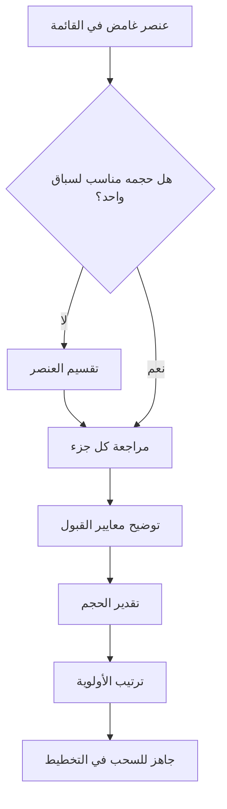

# تنقيح قائمة الأعمال (Backlog Refinement)
> [!info] تعريف مختصر
> تنقيح قائمة الأعمال هو نشاط مستمر يراجع فيه الفريق عناصر [[13 - Backlog]] (قائمة الأعمال) لتوضيحها وتقسيمها وترتيبها وتقدير حجمها، حتى تصبح جاهزة للسحب في تخطيط أي [[14 - Sprint]] قادم. يُعرف أيضًا باسم Grooming.

## الشرح العلمي والاحترافي
تنقيح قائمة الأعمال ليس اجتماعًا رسميًا واحدًا في إطار Scrum، بل نشاط متكرر يحدث عادةً مرة أو مرتين في منتصف كل سباق، بمشاركة [[05 - Product Owner]] والمطوّرين. الهدف هو:
- توضيح الغموض في القصص (Stories) قبل أن تدخل التخطيط.
- تقسيم العناصر الكبيرة مثل [[Epic]] إلى قصص أصغر قابلة للتنفيذ ضمن سباق واحد (انظر [[Task and Story Slicing]]).
- إعادة تقدير الحجم باستخدام تقنيات مثل [[Planning Poker]] أو [[Relative Estimation]].
- التأكد من أن العناصر ذات الأولوية العليا تحقق [[INVEST Criteria]] وتصل إلى حالة [[Definition of Ready]].
- إعادة ترتيب الأولويات بناءً على قيمة العمل ([[Outcome vs Output]]) والمستجدات في السوق.

بدون هذا النشاط، تتحول جلسات [[08 - Sprint Planning]] إلى جلسات نقاش طويلة ومرهقة لأن الفريق يكتشف الغموض في اللحظة الأخيرة، مما يقلل الإنتاجية ويزيد من عدم اليقين في التقديرات.

## أين ومتى يُستخدم
- في منهجية Scrum: يوصى بتخصيص ما لا يزيد عن 10% من سعة الفريق (انظر [[Capacity]]) لهذا النشاط كل سباق.
- في Kanban أو [[Scrum-ban]]: يحدث بشكل مستمر ضمن نظام [[Replenishment]] الذي يغذي قائمة "جاهز للسحب" (Ready Queue).
- يُستخدم في أي مشروع تطوير برمجيات تقريبًا بغض النظر عن حجم الفريق، لأنه يمنع تراكم الغموض في قائمة الأعمال.

## مثال وسيناريو تطبيقي
> [!example] فريق تطوير تطبيق توصيل طعام "توصيلة" يعمل بنظام Scrum بسباقات مدتها أسبوعان. في يوم الأربعاء من منتصف السباق، يجتمع الفريق مع مالكة المنتج سارة لمدة ساعة. تطرح سارة قصة "إضافة خيار الدفع عند الاستلام" وهي مكتوبة بجملة واحدة فقط. يطرح المطورون أسئلة: هل يشمل ذلك التحقق من الهوية؟ هل يعمل مع كل المدن؟ بعد النقاش تتقسم القصة إلى ثلاث قصص أصغر: "عرض خيار الدفع عند الاستلام في واجهة الدفع"، "التحقق من حد أقصى للمبلغ النقدي"، و"إشعار السائق بطريقة الدفع". يقدّر الفريق كل قصة بنقاط قصة (Story Points) عبر Planning Poker، وتصبح القصص الثلاث جاهزة لدخول السباق القادم.

## خطوات أو مخطّط
1. مراجعة أعلى العناصر أولوية في قائمة الأعمال مع مالك المنتج.
2. طرح الأسئلة التوضيحية وتوثيق معايير القبول (Acceptance Criteria).
3. تقسيم العناصر الكبيرة إلى قصص أصغر تناسب سباقًا واحدًا.
4. إعادة تقدير الحجم أو تأكيده.
5. إعادة ترتيب الأولوية حسب القيمة والمخاطر.
6. وسم العناصر التي استوفت [[Definition of Ready]] كجاهزة للتخطيط.

## ⚠️ مفاهيم خاطئة شائعة
> [!warning]
> - يظن البعض أن التنقيح اجتماع رسمي واحد إلزامي في Scrum، بينما هو في الواقع نشاط مستمر وغير رسمي بطبيعته ولا يوجد له حدث محدد في دليل Scrum.
> - يخلط البعض بينه وبين تخطيط السباق نفسه، بينما هدفه تحضير العناصر قبل التخطيط لا اتخاذ قرار الالتزام بها.
> - يعتقد بعض المبتدئين أن التقدير النهائي يحدث هنا فقط، مع أن التقدير قابل للتغيير لاحقًا مع ظهور معلومات جديدة.

## ❌ ممارسات خاطئة في المشاريع
> [!failure]
> - تخصيص وقت طويل جدًا للتنقيح (أكثر من 10% من السعة) مما يستهلك وقت التنفيذ الفعلي؛ الحل هو تحديد مدة ثابتة (Timebox) للجلسة.
> - تنقيح عناصر بعيدة جدًا في المستقبل لن تُنفذ قريبًا، مما يهدر جهد التوضيح لأن الأولويات قد تتغير؛ ركّز على أعلى 1-2 سباق قادمة فقط.
> - غياب مالك المنتج عن الجلسة، مما يجعل الفريق يخمّن معايير القبول بدل توضيحها فعليًا.

## 🔗 مصطلحات ومفاهيم ذات صلة
[[13 - Backlog]] | [[Definition of Ready]] | [[INVEST Criteria]] | [[Epic]] | [[Task and Story Slicing]] | [[Planning Poker]] | [[Relative Estimation]] | [[08 - Sprint Planning]] | [[Replenishment]] | [[05 - Product Owner]]
