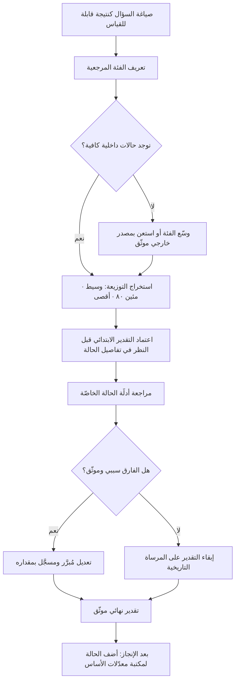

# معدّل الأساس (Base Rate)

> [!info] تعريف مختصر
> التكرار التاريخي لنتيجة ما ضمن فئة مرجعية مناسبة من الحالات المشابهة — مثل: «مشاريع الترحيل في مؤسّستنا تأخّرت في 8 من كل 10 حالات، وبمتوسّط تجاوز 40% من المدّة المخطّطة». معدّل الأساس هو **نقطة الانطلاق الصحيحة لأي تقدير أو توقّع**، تُعدَّل بعدها بأدلّة الحالة الخاصّة، لا العكس. وميل العقل إلى تجاهله والانطلاق من تفاصيل الحالة الحاضرة وحدها يُسمّى **إهمال معدّل الأساس (Base-Rate Neglect)**، وهو من أكثر أخطاء التقدير توثيقًا في أدبيات علم النفس المعرفي، وأشدّها كلفة في تخطيط المشاريع.

## الشرح العلمي والاحترافي
- **الجذر الرياضي**: معدّل الأساس هو الاحتمال القَبْلي (Prior) في منطق بايز. القاعدة البايزية تقول إن الاعتقاد الصحيح بعد ظهور دليل جديد يعتمد على أمرين معًا: قوّة الدليل، **و** مدى شيوع الحالة أصلًا. إهمال الطرف الثاني يقود إلى استنتاجات خاطئة بشكل صارخ حتى مع أدلّة قويّة — وهو ما يظهر جليًّا في اختبارات الكشف: اختبار دقّته 95% لمرض ينتشر في 1 من كل 1000 شخص يُنتج نتائج إيجابية أغلبها خاطئ، لأن عدد الأصحّاء الهائل يولّد إنذارات كاذبة تفوق الحالات الحقيقية. المنطق نفسه ينطبق على إنذارات المراقبة، وفرز العيوب، وتقييم فرص المبيعات.
- **النظرة الخارجية مقابل الداخلية**: في أدبيات التخطيط يُوصف الاعتماد على معدّل الأساس بـ«النظرة الخارجية» (Outside View): أن تنظر إلى مشروعك بوصفه حالة ضمن فئة، فتسأل «كيف انتهت المشاريع الشبيهة؟». ويقابلها «النظرة الداخلية» التي تبني التقدير من تفاصيل الخطة الحالية وسيناريو سيرها المثالي. النظرة الداخلية تُنتج خططًا متفائلة بانتظام لأنها تحسب ما تعرفه وتغفل ما لم يُذكر بعد؛ والعلاج ليس إلغاءها بل تثبيتها إلى مرساة خارجية.
- **جودة الفئة المرجعية هي كل شيء**: معدّل الأساس بلا فئة مرجعية دقيقة يصبح رقمًا مضلّلًا. الفئة الجيّدة قريبة بما يكفي لتكون ذات صلة، وواسعة بما يكفي لتحتوي عددًا معتبرًا من الحالات. «كل مشاريع تقنية المعلومات في العالم» فئة واسعة بلا معنى، و«مشاريعنا مع هذا العميل بالذات» فئة ضيّقة قد لا تتجاوز حالتين. الوسط الصالح غالبًا: نفس نوع العمل، ونفس نطاق الحجم، ونفس درجة الاعتماد على أطراف خارجية.
- **العلاقة بتباين التقدير**: معدّل الأساس ليس رقمًا واحدًا بل **توزيعة**. الاستعمال الناضج يستخرج منها المتوسّط والمئينات معًا، فيقال: «تاريخيًّا، 50% من مهامنا من هذا النوع أُنجزت خلال 6 أيام، و85% خلال 11 يومًا». هذا يربطه مباشرة بـ[[Estimation Variance]] وبـ[[Percentiles and Median vs Average]]، ويجعل الالتزام الخارجي يُبنى على مئين مرتفع لا على المتوسّط.
- **مصادر معدّلات الأساس داخل المؤسسة**: أغلب الفرق تملك بيانات أكثر ممّا تظن: زمن الدورة التاريخي ([[Cycle Time]])، والإنتاجية ([[Throughput]])، ونسبة إعادة العمل ([[Rework Percentage]])، ومعدّل العيوب المتسرّبة ([[Escaped Defect Rate]])، ونسبة الطلبات المرفوضة في المراجعة، ونسبة الميزات التي لم تُستخدم. جمع هذه في «مكتبة معدّلات أساس» داخلية أرخص وأدقّ من أي معيار خارجي مستورد.
- **متى يجوز الابتعاد عن معدّل الأساس**: يجوز — بل يجب — حين يوجد فارق **سببي** موثّق بين حالتك والفئة المرجعية، لا مجرّد شعور بالتميّز. «هذه المرّة أدواتنا مختلفة» ليست حجّة إلا إذا أمكن تحديد الآلية التي يقلّل بها اختلاف الأداة زمنًا محدّدًا. القاعدة العملية: ابدأ من معدّل الأساس، ثم اذكر صراحةً كل تعديل تجريه ومبرّره ومقداره، ووثّقه ليُراجع لاحقًا.
- **الاستخدام في تقييم الأفكار والفرص**: معدّلات الأساس تحمي من الحماسة كما تحمي من التشاؤم. معرفة أن نسبة ضئيلة من الميزات الجديدة تُحدث تحسّنًا معتبرًا في المؤشّر المستهدف تجعل الفريق يصمّم محفظة رهانات صغيرة قابلة للقياس، بدل رهان واحد كبير — وهو منطق يتقاطع مع [[Cost of Experimentation]] و[[Hypothesis]].
- **الوجه المقابل: الإفراط في معدّل الأساس**: كما يوجد إهمال، يوجد جمود. من يرفض كل دليل خاص بالحالة بحجّة «التاريخ يقول كذا» يتجاهل أن الظروف تتغيّر فعلًا (فريق جديد، أداة غيّرت خطوة كاملة، تنظيم مختلف). الصواب موقع وسط: **مرساة خارجية، وتعديل مبرَّر ومحدود بأدلّة الحالة**.

## أين ومتى يُستخدم
- **في التقدير والتخطيط الزمني** ([[Original Estimate]], [[Relative Estimation]], [[Planning Poker]]): كمرساة تُعرض قبل بدء التقدير لتقليل التفاؤل المنهجي.
- **في تحليل التدفّق والتنبّؤ** ([[Cycle Time]], [[Throughput]], [[Little's Law]], [[Monte Carlo Simulation]]): البيانات التاريخية هي المُدخل الذي تعمل عليه كل هذه الأدوات.
- **في تقدير الجودة والعيوب** ([[Expected Bug Rate]], [[Escaped Defect Rate]], [[Reopen]]): لبناء توقّع واقعي لحجم إعادة العمل بعد الإطلاق بدل افتراض الصفر.
- **في تقييم فرص المنتج وأثر الميزات** ([[Product Analytics]], [[KPI]], [[Business Case]]): لوضع أثر الميزة المقترحة في سياق ما حقّقته ميزات سابقة فعلًا.
- **في تحديد الاحتياطي** ([[Contingency Reserve]], [[Buffer]], [[Reality Factor]]): الاحتياطي المبرّر يُشتقّ من انحرافات تاريخية موثّقة لا من نسبة اعتباطية.
- **في تفسير الإنذارات ونتائج الفحص** ([[SLI]], [[Risk-Based Testing]]): لتقدير نسبة الإنذارات الكاذبة بشكل صحيح حين تكون الحوادث الحقيقية نادرة.

## مثال وسيناريو تطبيقي
> [!example] شركة برمجيات في الرياض تنفّذ ترحيل أنظمة موارد بشرية لعميل حكومي. قدّر الفريق المدّة بـ**14 أسبوعًا**، مستندًا إلى تفكيك تفصيلي من 62 مهمة، وبثقة عالية لأن «الفريق أقوى هذه المرّة، والأداة أحدث».
> طلب مدير المحفظة قبل الاعتماد بناء نظرة خارجية. سُحبت بيانات آخر 9 مشاريع ترحيل نفّذتها الشركة خلال 4 سنوات ضمن فئة مرجعية محدّدة: ترحيل بيانات لجهة حكومية بحجم بين 500 و3000 موظف مع تكامل مع نظامين خارجيين على الأقل.
> النتيجة: المدّة المخطّطة في تلك المشاريع تراوحت بين 12 و16 أسبوعًا، والمدّة الفعلية بين 17 و31 أسبوعًا. **نسبة التجاوز: 8 من 9 مشاريع تجاوزت الخطة، والوسيط 62% تجاوزًا**. وبتفكيك سبب التجاوز تبيّن أن 70% منه يعود إلى بندين متكرّرين: انتظار اكتمال البيانات من العميل، وجولات اعتماد قبول المستخدم ([[UAT]]) التي تكرّرت 3 مرّات في المتوسّط لا مرّة واحدة كما تفترض الخطط عادة.
> التعديل: بدل رفض التقدير أو قبوله، أعاد الفريق البناء من المرساة الخارجية. الوسيط التاريخي يعطي نحو 23 أسبوعًا. ثم أُجريت تعديلات مبرَّرة ومكتوبة: خصم أسبوعين لأن أداة الترحيل الجديدة تُلغي خطوة تحويل يدوية استغرقت تاريخيًّا 9 أيام (مبرّر سببي موثّق)؛ وإضافة أسبوع لأن العميل لديه نظامان قديمان لا ثالث لهما في السوابق. الالتزام الخارجي وُضع عند 24 أسبوعًا (قريب من المئين الثمانين) مع خطة داخلية عند 20 أسبوعًا.
> إضافةً إلى ذلك، حُوِّل السببان المتكرّران إلى إجراءات: شُرط اكتمال البيانات كمعيار [[Definition of Ready]] لبدء المرحلة، وخُطّط لثلاث جولات [[UAT]] في الجدول صراحةً بدل واحدة. أُنجز المشروع في الأسبوع 22 — لأول مرة داخل الالتزام المعلن.

## خطوات أو مخطّط
1. صُغ السؤال كنتيجة قابلة للقياس: «كم تستغرق؟» أو «ما احتمال أن…؟» بصياغة لا تحتمل التأويل.
2. عرّف الفئة المرجعية: نفس نوع العمل · نفس نطاق الحجم · نفس درجة الاعتماد الخارجي.
3. اجمع حالات الفئة من بيانات مؤسّستك أولًا؛ واستعن بمصادر خارجية فقط عند غياب البيانات الداخلية.
4. استخرج التوزيعة لا الرقم الواحد: الوسيط والمئين الثمانين والحد الأقصى المشاهد.
5. اجعل هذا هو تقديرك الابتدائي، **قبل** أن ينظر الفريق إلى تفاصيل الحالة الحاضرة.
6. اعرض تفاصيل الحالة، وسجّل كل تعديل صعودًا أو نزولًا مع مبرّره السببي ومقداره.
7. حدّ من مجموع التعديلات (ممارسة نافعة: ألّا يتجاوز الانحراف عن الوسيط التاريخي حدًّا متفقًا عليه بلا موافقة صريحة).
8. سجّل التقدير النهائي في [[Decision Log]]، وبعد الإنجاز أضِف الحالة إلى مكتبة معدّلات الأساس.

## ⚠️ مفاهيم خاطئة شائعة
> [!warning]
> - **الظنّ بأن معدّل الأساس ينفي خصوصية الحالة**: لا ينفيها، بل يحدّد نقطة البداية. الخصوصية تُدخل عبر تعديل مُبرَّر ومقيَّد، لا عبر إلغاء التاريخ كليًّا.
> - **اعتبار كل بيانات الماضي معدّل أساس صالحًا**: البيانات المسحوبة من فئة غير مناسبة أسوأ من غياب البيانات، لأنها تمنح ثقة بلا صلة. صحّة الفئة المرجعية تسبق حجم العيّنة في الأهمية.
> - **الخلط بينه وبين المتوسّط**: معدّل الأساس توزيعة، والاكتفاء بالمتوسّط يُخفي الذيل الطويل الذي يقع فيه أغلب الضرر — وهو ما يعالجه [[Percentiles and Median vs Average]].
> - **الاعتقاد بأن ندرة الحدث تعني إمكان تجاهله**: الأحداث النادرة عالية الأثر تُدار بمعدّلها لا بإهماله؛ وإهمال الندرة في الاتجاه المعاكس يُنتج إنذارات كاذبة كثيرة تُفقد الفريق ثقته بنظام المراقبة.
> - **افتراض أن تحسين الفريق يُبطل التاريخ فورًا**: التحسّن حقيقي لكنه تدريجي وقابل للقياس. الادّعاء بأن معدّل الأساس «لم يعد ينطبق» يحتاج بيانًا كميًّا من دورتين أو ثلاث على الأقل، لا نيّة حسنة.
> - **الظنّ أنه أداة تشاؤم**: معدّل الأساس محايد؛ فهو يرفع التقدير أحيانًا ويخفضه أحيانًا. وظيفته إزالة الانحياز في الاتجاهين، لا إضافة هامش أمان أعمى.

## ❌ ممارسات خاطئة في المشاريع
> [!failure]
> - **بدء جلسة التقدير من تفاصيل المهمّة مباشرة**: يترسّخ رقم متفائل مبكرًا فيصير مرساة يصعب تحريكها. الحل: اعرض معدّل الأساس التاريخي في أول دقيقة من الجلسة، قبل أي نقاش تفصيلي.
> - **عدم حفظ بيانات المشاريع المنتهية**: فتُعاد الأخطاء نفسها لأن لا أحد يذكر كم استغرق مشروع مشابه فعلًا. الحل: اجعل تسجيل «المخطّط مقابل الفعلي» بندًا إلزاميًّا في إغلاق كل مشروع ضمن [[Organizational Process Assets]].
> - **تبرير الانحراف عن التاريخ بجمل عامة**: «هذه المرّة مختلفة» و«الفريق أقوى» بلا آلية محدّدة. الحل: اشترط لكل تعديل ذكر الخطوة المتأثّرة ومقدار الأثر بالأيام، وسجّل التبرير ليُراجع عند الإغلاق.
> - **قراءة الإنذارات ونتائج الفحص بمعزل عن ندرة الحدث**: يُنفق الفريق ساعات على إنذارات أغلبها كاذب، فيتبلّد ثم يتجاهل الإنذار الحقيقي. الحل: احسب نسبة الإنذارات الكاذبة المتوقّعة من معدّل الحدوث الفعلي، واضبط عتبات المراقبة على أساسها.
> - **اشتقاق الاحتياطي من نسبة اعتيادية جاهزة (10% دائمًا)**: رقم لا صلة له بانحرافات مؤسّستك الحقيقية. الحل: اشتقّ [[Contingency Reserve]] من توزيعة الانحرافات التاريخية للفئة المرجعية نفسها.
> - **تعميم معدّل أساس من فريق على فريق آخر مختلف كليًّا**: يُنتج التزامات ظالمة أو متساهلة. الحل: احتفظ بمعدّلات أساس مجزّأة حسب نوع العمل والفريق، وصرّح بحدود انطباقها.
> - **استخدام معدّل الأساس لمعاقبة الفرق**: حين يصبح التاريخ أداة محاسبة، يتوقّف الناس عن تسجيل البيانات الصادقة. الحل: افصل بيانات التقدير عن تقييم الأداء الفردي، واستعملها للتنبّؤ لا للّوم — وهو شرط مباشر لبقاء [[Psychological Safety]].

## 🔗 مصطلحات ومفاهيم ذات صلة
[[Estimation Variance]] | [[Calibration]] | [[Knightian Uncertainty]] | [[First Principles Thinking]] | [[Reversible vs Irreversible Decisions]] | [[Data Informed vs Data Driven]] | [[Percentiles and Median vs Average]] | [[Monte Carlo Simulation]] | [[Reality Factor]] | [[Original Estimate]] | [[Confirmation Bias]]
