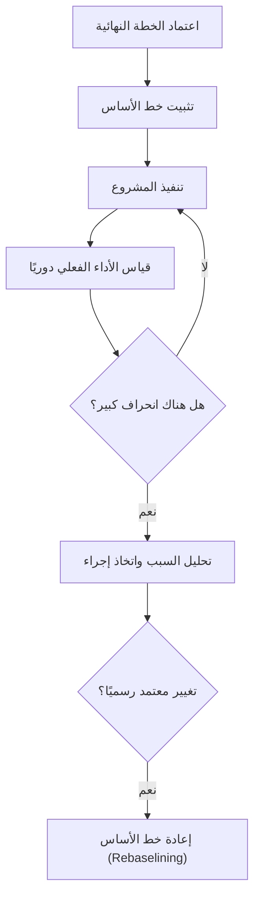

# خط الأساس (Baseline)

> [!info] تعريف مختصر
> خط الأساس هو النسخة المعتمدة والمثبَّتة من خطة المشروع (النطاق، الجدول الزمني، أو التكلفة) في لحظة زمنية محددة، وتُستخدم كمرجع ثابت للمقارنة مع الأداء الفعلي أثناء التنفيذ.

## الشرح العلمي والاحترافي
- بمجرد اعتماد خطة المشروع رسميًا، تُجمَّد نسخة منها كـ"خط أساس"، ولا تتغير هذه النسخة حتى لو تغيّرت الخطة الفعلية لاحقًا بسبب طلبات تغيير ([[Change Request]]).
- توجد ثلاثة أنواع رئيسية من خطوط الأساس: خط أساس النطاق (Scope Baseline)، خط أساس الجدول الزمني (Schedule Baseline)، وخط أساس التكلفة (Cost Baseline). ومجموع الثلاثة يُسمى خط أساس قياس الأداء ([[Performance Measurement Baseline]]).
- الهدف الأساسي من خط الأساس هو الإجابة عن سؤال: "هل نحن متقدمون أم متأخرون عن الخطة الأصلية؟" وليس فقط "هل نحن نتقدم؟".
- يُستخدم خط الأساس كمدخل رئيسي لحساب مؤشرات مثل مؤشرا أداء التكلفة والجدول ([[CPI and SPI]]) وإدارة القيمة المكتسبة ([[EVM]]).
- عند حدوث تغيير كبير معتمد رسميًا (مثل توسيع نطاق المشروع)، يمكن "إعادة خط الأساس" (Rebaselining)، لكن هذا يجب أن يكون استثناءً موثقًا وليس ممارسة متكررة، وإلا فقد خط الأساس قيمته كأداة رقابة.
- في المشاريع الرشيقة، مفهوم خط الأساس أقل صرامة نظرًا للتغير المستمر في النطاق، لكنه لا يزال يُستخدم لقياس الالتزام بميزانية أو تاريخ إطلاق عام محدد.

## أين ومتى يُستخدم
- يُثبَّت خط الأساس عادة في نهاية مرحلة التخطيط، بعد الموافقة على وثيقة النطاق ([[Scope Statement]]) والجدول الزمني والميزانية.
- شائع جدًا في منهجية الشلال ([[04 - Waterfall]]) والمشاريع ذات العقود الثابتة، حيث يكون الالتزام بخط الأساس شرطًا تعاقديًا.
- يُستخدم أثناء التنفيذ في تقارير الحالة الدورية لمقارنة الأداء الفعلي بالمخطط، وفي اجتماعات مراجعة الحوكمة (Governance Reviews).
- يُستخدم أيضًا عند إدارة عقود بمدفوعات مرتبطة بمعالم ([[Milestone-based Payment]])، للتحقق من الالتزام بالتواريخ المتفق عليها.

## مثال وسيناريو تطبيقي
> [!example] في مشروع بناء نظام إدارة مستشفيات لصالح "مجموعة الشفاء الطبية"، اعتمد الطرفان خط أساس بميزانية 500,000 دولار ومدة 10 أشهر، بدءًا من 1 يناير. بعد 4 أشهر، أظهرت التقارير أن التكلفة الفعلية المصروفة بلغت 220,000 دولار بينما كانت الخطة (خط الأساس) تتوقع صرف 180,000 دولار فقط عند هذه المرحلة، أي انحراف سلبي قدره 40,000 دولار. بمقارنة الأداء الفعلي بخط الأساس، اكتشف مدير المشروع أن فريق التطوير الخلفي يستهلك موارد أكثر من المخطط بسبب تعقيد غير متوقع في تكامل الأنظمة الطبية القديمة (Legacy Systems)، فرفع تقريرًا عاجلًا لصاحب المصلحة يطلب إما زيادة الميزانية أو تقليص النطاق، بدلًا من اكتشاف التجاوز عند نهاية المشروع فقط.

## خطوات أو مخطّط
1. إنهاء التخطيط التفصيلي للنطاق والجدول والتكلفة.
2. الحصول على موافقة رسمية من صاحب المصلحة الرئيسي.
3. تجميد النسخة المعتمدة كخط أساس (توثيقها بتاريخ ونسخة محددة).
4. قياس الأداء الفعلي دوريًا ومقارنته بخط الأساس.
5. توثيق أي انحراف وتحليل أسبابه.
6. عند الحاجة لتغيير جوهري معتمد، تحديث خط الأساس رسميًا (Rebaselining) مع توثيق السبب.

## ⚠️ مفاهيم خاطئة شائعة
> [!warning]
> - الاعتقاد أن خط الأساس هو نفسه الخطة الحالية للمشروع؛ في الحقيقة خط الأساس ثابت لا يتغير، بينما الخطة الفعلية قد تتحدث باستمرار.
> - الظن بأن تحديث خط الأساس أمر عادي يمكن فعله كلما تأخر المشروع لإخفاء الانحراف؛ هذا يُفقد خط الأساس وظيفته الرقابية الأساسية.
> - الخلط بين خط الأساس والتقدير الأولي غير المعتمد؛ خط الأساس يتطلب موافقة رسمية موثقة، وليس مجرد تقدير مبدئي.

## ❌ ممارسات خاطئة في المشاريع
> [!failure]
> - تثبيت خط الأساس قبل اكتمال التخطيط التفصيلي، فيصبح غير واقعي منذ اليوم الأول. **الحل:** التأكد من نضج تقديرات النطاق والتكلفة والجدول قبل التثبيت.
> - إعادة خط الأساس بشكل متكرر دون توثيق أو تبرير، لإخفاء التأخير الحقيقي عن الإدارة العليا. **الحل:** وضع سياسة صريحة ([[Explicit Policies]]) تحدد متى يُسمح بإعادة خط الأساس وبموافقة من.
> - عدم مقارنة الأداء الفعلي بخط الأساس بانتظام، فيُكتشف الانحراف الكبير فقط في نهاية المشروع. **الحل:** دمج المقارنة الدورية ضمن تقرير الحالة الأسبوعي أو الشهري.

## 🔗 مصطلحات ومفاهيم ذات صلة
[[Performance Measurement Baseline]] | [[CPI and SPI]] | [[EVM]] | [[Change Request]] | [[Scope Statement]] | [[Milestone]] | [[Gantt Chart]] | [[Critical Path]]
