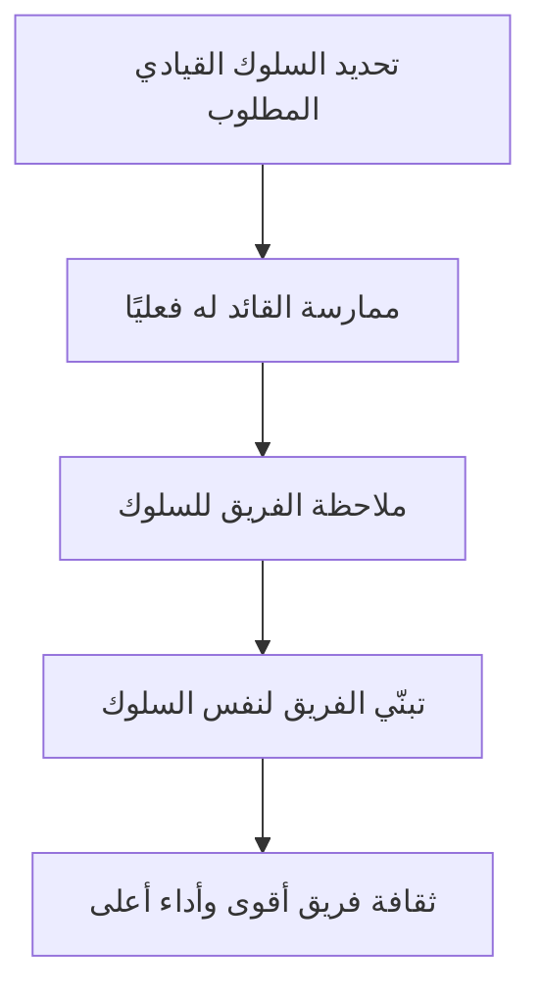

# القيادة السلوكية (Behavioral Leadership)
> [!info] تعريف مختصر
> القيادة السلوكية (Behavioral Leadership) نظرية قيادة تقول إن القائد الجيد يُصنع بسلوكه اليومي وأفعاله الملموسة، وليس بمنصبه أو صفاته الشخصية الفطرية. القائد يقود بالقدوة (Leading by Example) وبتصرفات مُتكرّرة يمكن ملاحظتها وتعلّمها.

## الشرح العلمي والاحترافي
تقليديًا كانت نظريات القيادة تركّز على "سمات القائد" (Trait Theory): هل هو كاريزمي؟ هل يمتلك ذكاءً استثنائيًا؟ جاءت نظرية القيادة السلوكية (نتيجة أبحاث جامعتَي أوهايو وميشيغان في الخمسينيات) لتقول: المهم ليس مَن يكون القائد، بل ماذا يفعل.
- تُصنَّف السلوكيات القيادية عادة إلى بُعدين رئيسيين: التركيز على المهمة (Task-Oriented — تنظيم العمل، توضيح الأهداف، متابعة الجودة) والتركيز على الأفراد (People-Oriented — الاهتمام بالفريق، بناء الثقة، الاستماع).
- في سياق إدارة المشاريع البرمجية، يعني هذا أن مدير المشروع أو Scrum Master يبني مصداقيته من خلال سلوكيات متسقة: الوصول في الوقت، الالتزام بالوعود، الشفافية في مشاركة المعلومات، التعامل الهادئ مع الأزمات.
- الفكرة الجوهرية: السلوك القيادي يمكن تعلّمه وتدريبه، بعكس "الكاريزما" التي تُعتبر صفة فطرية. هذا يجعل النظرية عملية جدًا في بيئات الشركات لأنها تفتح الباب لتطوير قادة جدد عبر التدريب والممارسة.
- يرتبط هذا المفهوم بشدة بـ [[Servant Leadership]] و[[Leadership at Every Level]]، فكلاهما يؤكد أن القيادة سلوك يُمارَس يوميًا وليس لقبًا وظيفيًا.

## أين ومتى يُستخدم
- في تقييم أداء القادة (Scrum Master، Team Lead، مدير مشروع) عبر ملاحظة سلوكياتهم الفعلية بدل الاعتماد على انطباعات عامة.
- في برامج تطوير القيادة (Leadership Development Programs) داخل الشركات التقنية، حيث يُدرَّب الموظفون على سلوكيات قيادية محددة قبل ترقيتهم.
- عند بناء ثقافة فريق جديدة (مثلًا فريق Agile حديث التكوين)، حيث يحتاج القائد أن يُظهر بالفعل — لا بالقول فقط — الالتزام بالشفافية والتعاون.
- في أثناء [[10 - Sprint Retrospective]] حين يُناقَش سلوك القيادة كعامل مؤثر في أداء الفريق.

## مثال وسيناريو تطبيقي
> [!example] في شركة "نُظم رقمية" تُدير سارة فريقًا من 7 مطورين يعملون على تطبيق توصيل طلبات. بدل أن تعلن "أنا أؤمن بالشفافية" فقط، تُطبّق ذلك سلوكيًا: تشارك تقرير أخطاء الإنتاج (Production Bugs) أسبوعيًا مع الفريق كاملًا بلا حجب، وتعترف علنًا أمام الفريق حين يتأخر تسليم ميزة بسبب قرار اتخذته هي شخصيًا. بعد 3 أشهر، لاحظت أن المطورين أصبحوا يبلّغون عن الأخطاء بسرعة أكبر دون خوف من اللوم، لأنهم رأوا سلوكها بالممارسة لا بالخطاب. هذا مثال مباشر على "القيادة بالقدوة".

## خطوات أو مخطّط
1. حدّد السلوكيات المطلوبة بوضوح (مثال: الشفافية، الاستماع الفعّال، الالتزام بالمواعيد).
2. مارس هذه السلوكيات بنفسك أولًا وباستمرار قبل أن تطلبها من الآخرين.
3. اجعل السلوك مرئيًا وملموسًا (مثلًا: شارك بياناتك الخاصة، اعترف بأخطائك علنًا).
4. راقب أثر هذه السلوكيات على الفريق (الثقة، الالتزام، جودة العمل).
5. عدّل السلوك بناءً على الملاحظات — القيادة السلوكية عملية تحسين مستمر.

## ⚠️ مفاهيم خاطئة شائعة
> [!warning]
> - الاعتقاد بأن القيادة صفة فطرية لا تُكتسب: نظرية السلوك تثبت أن القيادة مهارات وسلوكيات يمكن تعلّمها بالتدريب والممارسة.
> - الخلط بين "التحدث عن القيم" و"ممارستها": قول "أنا أدعم فريقي" لا يكفي؛ القائد السلوكي يُظهر الدعم بأفعال ملموسة ومتكررة.
> - افتراض أن سلوكًا واحدًا (مثل الحزم) يناسب كل المواقف؛ القيادة الفعالة توازن بين التركيز على المهمة والتركيز على الأفراد حسب السياق.

## ❌ ممارسات خاطئة في المشاريع
> [!failure]
> - قائد يعلن سياسة "الباب المفتوح" لكنه لا يستجيب فعليًا لرسائل فريقه — الحل: تخصيص وقت ثابت أسبوعيًا للقاءات فردية (1:1) والالتزام به فعليًا.
> - مدير مشروع يطلب من الفريق الالتزام بالمواعيد بينما هو نفسه يتأخر في تسليم القرارات — الحل: القائد يبدأ بنفسه، فالسلوك القيادي يُقاس بالفعل لا بالخطاب.
> - الاعتماد الكامل على تدريب نظري واحد ("ورشة قيادة" لمرة واحدة) دون متابعة تطبيق السلوك على أرض الواقع — الحل: تحويل السلوكيات المطلوبة إلى عادات يومية تُراجَع دوريًا.

## 🔗 مصطلحات ومفاهيم ذات صلة
- [[Servant Leadership]]
- [[Leadership at Every Level]]
- [[Emotional Intelligence]]
- [[Empowerment]]
- [[Psychological Safety]]
- [[06 - Scrum Master]]
- [[10 - Sprint Retrospective]]
