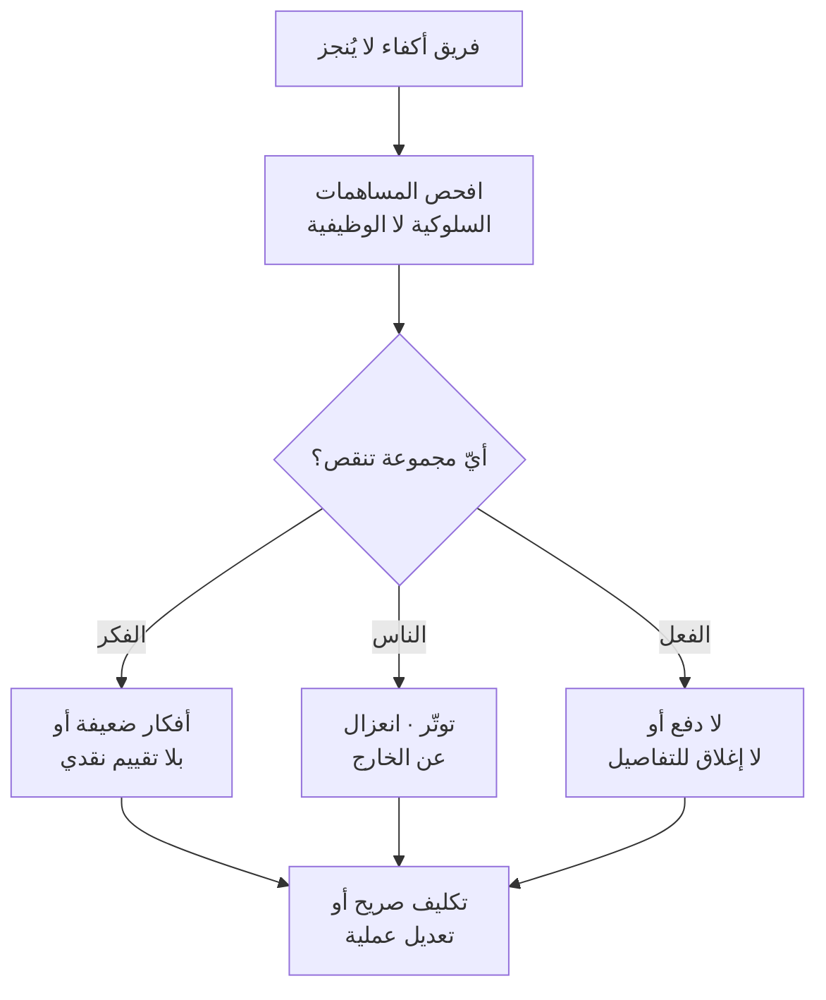

# أدوار بلبن للفريق (Belbin Team Roles)
> [!info] تعريف مختصر
> نموذج يقول إنّ فاعلية الفريق تتطلّب توزيع **أدوار سلوكية** لا **أدوار وظيفية** فحسب: كما تحتاج واجهة خلفية وأمامية واختبارًا، تحتاج أيضًا من يُولّد الأفكار، ومن يُدقّق فيها، ومن يهتمّ بالعلاقات، ومن يُنهي التفاصيل.

## الشرح العلمي والاحترافي
طوّره **مريديث بلبن (Meredith Belbin)** في *Management Teams: Why They Succeed or Fail* (1981) بعد سنوات من ملاحظة فرق إدارية في كلّية هينلي. وتسعة أدوار في ثلاث مجموعات:

| المجموعة | الأدوار | مساهمتها |
|---|---|---|
| **موجَّهة نحو الفكر** | النبتة (`Plant`) · المُقيّم (`Monitor Evaluator`) · المتخصّص (`Specialist`) | توليد الأفكار · تقييمها بحياد · العمق التقني |
| **موجَّهة نحو الناس** | المنسّق (`Coordinator`) · باحث الموارد (`Resource Investigator`) · صانع الفريق (`Teamworker`) | التوجيه · الشبكات الخارجية · تماسك العلاقات |
| **موجَّهة نحو الفعل** | المُشكِّل (`Shaper`) · المُنفِّذ (`Implementer`) · المُكمِّل (`Completer Finisher`) | الدفع · التحويل إلى خطط · إنهاء التفاصيل |

**والأطروحة المركزية أنّ الفريق المكوَّن من نمط واحد يفشل** — خمسة «مُشكِّلين» يتصارعون، وخمسة «نبتات» يُولّدون أفكارًا بلا تنفيذ. **ولكلّ دور «ضعف مسموح»**: النبتة كثيرة الشرود، والمُكمِّل يميل إلى القلق على التفاصيل — وهي أضعاف مقبولة ما دامت مقرونة بقوّة الدور.

**ويُستدعى النموذج عادةً مع [[Tuckman's Stages of Group Development|تاكمان]]** لنقض اعتقاد شائع: **أنّ أيّ مجموعة أفراد أكفاء تُوضَع معًا ستُنجز المشروع.** فالفريق يحتاج قيادة سلوكية وتوزيعًا للأدوار ليصل إلى أداء عالٍ.

> [!warning] حدّ منهجي لا بدّ من ذكره
> **أداة بلبن التقييمية موضع نقد منهجي معتبر**: ثبات متوسّط عند إعادة الاختبار، وبنية عاملية مختلَف عليها. **لكنّ المبدأ العامّ — أنّ فاعلية الفريق تتطلّب تنوّعًا في المساهمات السلوكية — مدعوم بأدبيات أوسع من الأداة نفسها.** فاستخدمه **إطارًا للانتباه إلى الفجوات**، لا اختبارًا لتصنيف الناس ولا معيارًا للتوظيف.

## أين ومتى يُستخدم
- تشكيل فريق جديد أو إعادة تشكيل فريق متعثّر.
- تشخيص فريق «كلّ أعضائه أكفاء» ومع ذلك لا يُنجز.
- في الاجتماع الاستعادي: أيّ مساهمة سلوكية تنقصنا؟
- في التخطيط لتوزيع أدوار داخل مبادرة كبيرة.

## مثال وسيناريو تطبيقي
> [!example] فريق من ستّة مطوّرين أقوياء تقنيًّا، والتسليمات تتأخّر دائمًا في آخر 10%. المراجعة تكشف: أفكار كثيرة في التخطيط، وحماسة عالية في البداية، **ولا أحد يهتمّ بإغلاق التفاصيل الأخيرة** — لا «مُكمِّل» في الفريق. والحلّ لم يكن توظيفًا جديدًا: أحد الأعضاء كان يميل طبيعيًّا إلى الدقّة ويُحبَط لأنّ أحدًا لا يهتمّ بما يرصده، **فأُسنِد إليه صراحةً دور مراجعة تعريف الإنجاز قبل كلّ تسليم** — وتغيّرت النتيجة خلال سبرنتين. **والنموذج لم يُنتج توظيفًا بل أنتج انتباهًا إلى فجوة.**

## خطوات أو مخطّط
1. اسأل عن كلّ مساهمة سلوكية: **من يُؤدّيها في هذا الفريق؟**
2. سجّل الفجوات — لا التصنيفات.
3. غطِّ الفجوة بأحد ثلاثة: تكليف صريح · تعديل عملية · انضمام عضو.
4. **صرّح بالدور** — كثير من الفجوات سببها أنّ من يميل إلى الدور لا يعلم أنّه مطلوب منه.
5. راجع بعد سبرنتين: هل أُغلقت الفجوة أم انتقلت؟

## ⚠️ مفاهيم خاطئة شائعة
> [!warning]
> - **ليس اختبار شخصية ولا أداة توظيف.** يصف تفضيلات سلوكية في سياق فريق، لا سمات ثابتة؛ وقد يتغيّر دور الشخص بتغيّر الفريق.
> - **لا أحد يُؤدّي دورًا واحدًا.** لكلّ فرد أدوار مفضّلة وأخرى يستطيعها عند الحاجة.
> - **ليس بديلًا عن الكفاءة.** التنوّع السلوكي يُضاعف أثر الكفاءة ولا يُعوّض غيابها.

## ❌ ممارسات خاطئة في المشاريع
> [!failure]
> - **تصنيف الأشخاص علنًا بالأدوار** («فلان نبتة») — يُنتج تنميطًا يُقيّد التطوّر ويُستخدَم عذرًا («لستُ مُكمِّلًا»).
> - **بناء فريق من نمط واحد** — خمسة دافعين يتصارعون، وخمسة مُدقّقين يُعطّلون كلّ قرار.
> - **افتراض أنّ الفريق سيُنظّم نفسه سلوكيًّا** بمجرّد تجميع أكفاء — وهو الاعتقاد الذي وُضع النموذج لنقضه.
> - **استخدام الأداة التقييمية بوصفها قياسًا صلبًا** رغم حدودها المنهجية.

## 🔗 مصطلحات ومفاهيم ذات صلة
[[Tuckman's Stages of Group Development]] | [[Cross-functional Team]] | [[Self-Organizing Team]] | [[Behavioral Leadership]] | [[Task vs Relationship Conflict]] | [[Psychological Safety]] | [[Team Working Agreement]]

> [!tip] 💡 إثراء عملي — كورس لعبة العقل
> استدعاء تاكمان وبلبن في مسألة «من مسؤول عن نضج الفريق؟»: [[07 - إدارة الصراع - الطبقات الأربع والصراعات الخمسة]].
