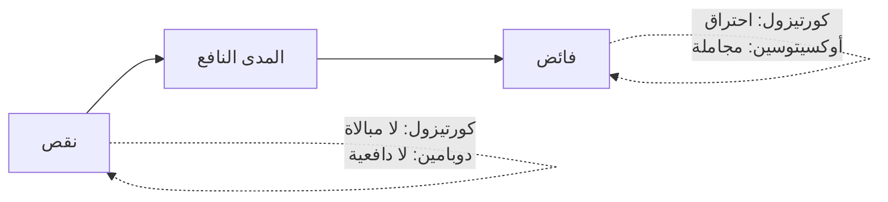

# القيادة البيولوجية والهرمونات الستّة (Biological Leadership)
> [!info] تعريف مختصر
> إطار عملي يقرأ حالة الفريق بلغة **ستّة هرمونات** — الكورتيزول · الأدرينالين · السيروتونين · الأوكسيتوسين · الإندورفين · الدوبامين — ويختار التدخّل بناءً على ما ينقص الغرفة أو يفيض فيها. **ومبدؤه الحاكم: كلّ هرمون في زيادته سُمّ، وفي نقصه سُمّ.**

## الشرح العلمي والاحترافي

| الهرمون | يُربَط بـ | كيف تُثيره | **زيادته سُمّ** | **نقصه سُمّ** |
|---|---|---|---|---|
| **الكورتيزول** | تهديد · نقد · غموض متطلّبات · ضغط زمني | *(الهدف خفضه)* | استقالة نفسية · احتراق | لا مبالاة؛ **لن يعمل أحد** |
| **الأدرينالين** | هجوم عالٍ | مواعيد حادّة | [[Burnout\|احتراق وظيفي]] | خمول في الأزمات |
| **السيروتونين** | الاعتراف بالمكانة | تقدير معلن · استشارة في تخصّصه | **تبرير غير منطقي** دفاعًا عن المكانة | استعلاء دفاعي |
| **الأوكسيتوسين** | الشعور بأنّه فُهِم | تسمية · إنصات · وفاء بوعد | **مجاملة على حساب العمل** | انعدام ثقة |
| **الإندورفين** | مجهود · **ضحك مشترك** | مزاح في موضعه | «عازفو الكمان على تيتانيك» | بيئة خانقة |
| **الدوبامين** | التوقّع والسعي والإنجاز | احتفال بإنجاز · مكسب سريع | **نرجسية · اعتماد على فرد واحد** | انعدام دافعية |

**والمبدأ الأنضج في هذا الإطار هو صفّا «الزيادة» و«النقص» معًا** — فهو ينقض التقسيم الشائع إلى هرمونات «جيّدة» وأخرى «سيّئة»: فريق مرتاح جدًّا يستدعي تدخّلًا كما يستدعيه فريق مضغوط.

> [!warning] حدّ علميّ لا بدّ من ذكره
> **هذا إطار تنظيمي مبسّط لا وصف كيميائي دقيق.** والأدبيات أعقد بكثير: **الأوكسيتوسين** ليس «هرمون الثقة» — يزيد التفضيل داخل المجموعة وقد يزيد التحيّز ضدّ خارجها (De Dreu et al., Science, 2011)، أي إنّه قد يُعزّز الشللية؛ و**الدوبامين** يرتبط أوثق بـ**التوقّع والسعي** لا بالمتعة؛ و**السيروتونين** لا يُختصَر في المكانة؛ **وقياس هذه الهرمونات في الدم لا يُطابق نشاطها في الدماغ**، والاستدلال من السلوك على المستوى الهرموني استدلال عكسي غير سليم. والتقسيم الرباعي الشائع عمّمه **سايمون سينك** في *Leaders Eat Last* (2014) ونُقد نقدًا واسعًا من متخصّصين.
> **فاستخدمه لغة مشتركة للحالات، لا تفسيرًا كيميائيًّا.** وقول «كورتيزوله مرتفع» مقبول اختصارًا لـ«هو في حالة تهديد»، ويصير خطأً إن استُخدم لادّعاء معرفة كيمياء دماغ أحد.

## أين ومتى يُستخدم
- تشخيص حالة اجتماع أو فريق قبل اختيار التدخّل.
- تصميم إيقاع الفريق عبر السبرنت: متى تُشدّد ومتى تحتفل.
- مراجعة أثرك أنت: أيّ فائض تُنتجه في فريقك بلا قصد؟

## مثال وسيناريو تطبيقي
> [!example] فريق عالي الأداء ومتعاون جدًّا وبيئته ودّية — **والعيوب تمرّ إلى الإنتاج، والمراجعات لا تُنتج ملاحظات.** التشخيص: **أوكسيتوسين فائض** — أو بمصفوفة إدموندسون: **منطقة الراحة** (أمان نفسي عالٍ + معايير أداء منخفضة). والعلامة الفارقة: فرّق بين فريق **لا يجد** ملاحظات وفريق **لا يقولها** — واسأل مطوّرًا على انفراد «ما الشيء الذي لو قيل في المراجعة لأزعج أحدًا؟». **والعلاج ليس خفض الأوكسيتوسين** — لا تُخرّب شيئًا نادرًا — بل **رفع المعايير داخل الأمان**: [[Definition of Done|تعريف إنجاز]] يجعل الملاحظة إجراءً لا حكمًا شخصيًّا · مراجعة مبنيّة على قائمة لا انطباع · ونمذجة من القائد بطلب أوّل ملاحظة على عمله هو.

## خطوات أو مخطّط
1. **اجلس صامتًا وراقب** قبل أن تتدخّل.
2. اسأل: **أيّ حالة تنقص الغرفة، وأيّها تفيض؟**
3. اختر التدخّل من الجدول أدناه.
4. تحقّق من الأثر بعد أسبوعين بمؤشّر مرئي لا بانطباع.

| ما تراه | التشخيص | التدخّل |
|---|---|---|
| مُهاجِم مُشتعل | كورتيزول مرتفع | [[Labeling\|تسمية]] · [[Mirroring\|مرآة]] · صمت |
| متكبّر متعالٍ | مكانة مهزوزة | تقدير معلن + [[Calibrated Questions\|أسئلة معايرة]] |
| فريق صامت مُحبَط | ثقة وأمان منخفضان | تسمية جماعية + قصص نجاح + مشاركة في القرار |
| فريق مرتاح متقاعس | كورتيزول منخفض جدًّا | معايير صريحة + عواقب مرئية |
| فريق يُجامل بعضه | أوكسيتوسين فائض | تعريف إنجاز + مقياس مرئي |
| فرد نرجسيّ | دوبامين فائض | أوقف الثناء الفردي العلني · وزّع الاعتماد |
| قبل نشر حرج | يحتاج إندورفين | مزاح في موضعه + احتفال بالصغائر |

## ⚠️ مفاهيم خاطئة شائعة
> [!warning]
> - **الهدف ليس أقصى راحة ممكنة.** فريق يشعر أنّ التأخير عاديّ وأنّ مرور عيب بلا إجراء طبيعيّ **لن يعمل**.
> - **الثناء المُفرِط ليس لطفًا بلا ثمن.** من يرفع مكانة شخص كثيرًا يصنع بنفسه صعوبة إعطائه تغذية راجعة لاحقًا — **فالتقدير المُفرِط يرفع تكلفة كلّ تصحيح قادم.**
> - **ليس بديلًا عن معالجة النظام.** جزء معتبر ممّا يبدو «حالة فريق» هو عَرَض حِمل يُشخَّص بالأرقام لا بالتدخّل الشعوري.

## ❌ ممارسات خاطئة في المشاريع
> [!failure]
> - **شكر فرد واحد أمام الفريق باستمرار** — يرفع دوبامينه ويخفض غيره، ويُنتج اعتمادًا عليه ونرجسية. الحل: شكر الفريق علنًا والفرد على انفراد.
> - **الاعتماد الدائم على شخص واحد** — انظر [[Black Box Syndrome]].
> - **جعل الكورتيزول أسلوب إدارة** — يُنتج فريقًا بلا إبداع يبحث عن مكان آخر.
> - **استخدام المفردات الهرمونية بديلًا عن التشخيص** — «كورتيزوله مرتفع» ليست تفسيرًا إن لم تُغيّر ما ستفعله. **المعيار: هل غيّر هذا التوصيف إجراءك؟** فإن لم يُغيّره فهو لغة لا معرفة.

## 🔗 مصطلحات ومفاهيم ذات صلة
[[Silent Leadership]] | [[Emotional Contagion]] | [[Amygdala Hijack]] | [[Psychological Safety]] | [[Burnout]] | [[SCARF Model]] | [[Emotional Intelligence]] | [[Behavioral Leadership]] | [[Sustainable Pace]]

> [!tip] 💡 إثراء عملي — كورس لعبة العقل
> الوصفة الكاملة، ومبدأ «كلّ زيادة سُمّ»، وحدود الشفافية في الأزمات: [[10 - كاريزما القائد الصامت والقيادة البيولوجية]].
