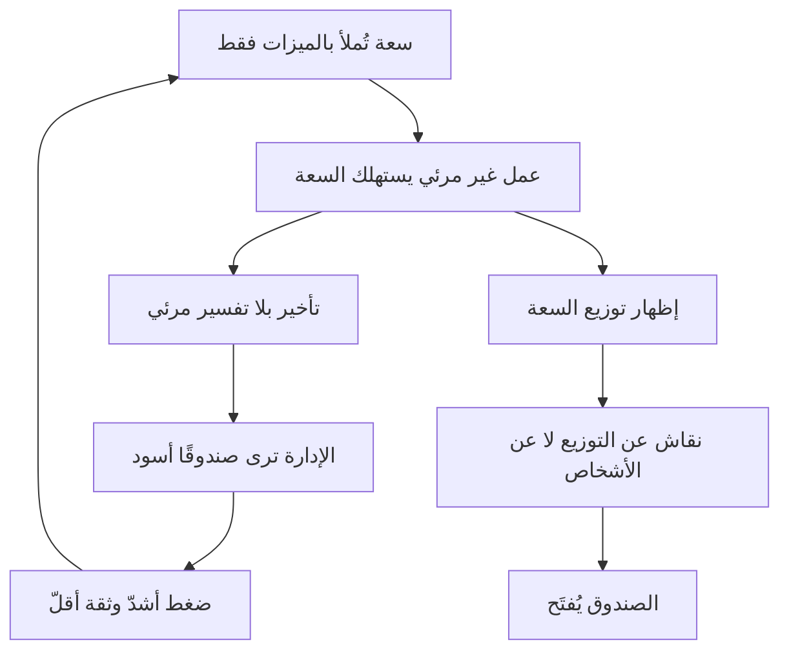

# متلازمة الصندوق الأسود (Black Box Syndrome)

> [!info] تعريف مختصر
> متلازمة الصندوق الأسود حالة تنظيمية تبدأ فيها الإدارة بالنظر إلى الفريق التقني بوصفه **صندوقًا يستهلك المال والوقت ويُنتج تأخيرًا غير مفهوم**، بينما يكون الفريق في الواقع غارقًا في عمل **غير مرئي** — [[Technical Debt|دَين تقني]] وعيوب ومخاطر لم تُسجَّل في أيّ نظام. وجوهرها **فجوة معلومات متبادلة**، لا سوء نيّة من أيّ طرف.

## الشرح العلمي والاحترافي
- **آلية النشوء**: تُملأ سعة الفريق بالميزات وحدها، فيُصرَف جزء متزايد منها على عمل غير معلن (إصلاح عيوب، التفاف على دَين، معالجة مخاطر). والنتيجة أنّ الميزة التي كانت تستغرق ساعتين صارت تستغرق أربعة أيّام — **بلا تفسير مرئي للإدارة**.
- **الرؤيتان المتقابلتان**:

| ما تراه الإدارة | ما يعيشه الفريق |
|---|---|
| تكلفة ثابتة مرتفعة | ضغط ثابت مرتفع |
| مخرجات متناقصة | عمل متزايد على صيانة خفيّة |
| وعود لا تتحقّق | تقديرات مبنيّة على معلومة غير موجودة |
| «لماذا الأمر البسيط صعب؟» | «لأنّ البسيط يمسّ سبعة أماكن» |
| صمت عند سؤال «ما المشكلة؟» | خوف من ثمن قول الحقيقة |

- **كلا الطرفين يملك معلومة صحيحة وناقصة**. والصندوق أسود لأنّ **لا أحد يملك الصورة المشتركة**.
- **العلاقة بالأمان النفسي**: حين ينخفض [[Psychological Safety|الأمان النفسي]] يتوقّف الفريق عن الإبلاغ بالمشكلات ويكتفي بالإيماء، فتزداد عتمة الصندوق. ولذلك تُعدّ المتلازمة **عَرَضًا مركّبًا**: نقص بيانات + خوف من قولها.
- **دورها في [[04 - دوّامة الموت والدَّين التقني|دوّامة الموت]]**: تُغذّي الحلقة — تراجع ثقة الإدارة يُنتج ضغطًا أشدّ، والضغط يُنتج دَينًا أعلى، والدَّين يُنتج بطئًا أوضح، فتزداد عتمة الصندوق.
- **ما يكسرها فعلًا**: ليس العروض التقديمية ولا اجتماعات الشرح، بل **إظهار [[08 - توزيع التدفّق ومراحل حياة المنتج|توزيع السعة]]**: جملة مثل «صرفنا هذا الربع 62% ميزات و24% عيوب إنتاج و9% دَينًا تقنيًّا و5% مخاطر» تُحدث تحوّلًا مزدوجًا — الفريق يكفّ عن كونه صندوقًا لأنّ طاقته صارت مرئية موزّعة، والنقاش ينتقل من الأشخاص إلى التوزيع، وهو سؤال قابل للإجابة.

## أين ومتى يُستخدم
- في **تشخيص علاقة متوتّرة** بين الإدارة والفريق التقني قبل أن تُفسَّر أخلاقيًّا («هم لا يفهمون»).
- عند **إعداد أوّل عرض بيانات** للإدارة: توزيع التدفّق هو المقياس الأوّل الموصى به لهذا الغرض تحديدًا.
- في **مراجعات ما بعد إخفاق تسليم**، للتمييز بين إخفاق أداء وإخفاق شفافية.
- عند **تقييم صحّة ثقافة الفريق**: غياب أيّ بند دَين تقني في الباك-لوغ مؤشّر مبكّر.

## مثال وسيناريو تطبيقي
> [!example] شركة تعتبر فريق التطوير «بالوعة تستنزف المال».
> **الشكوى الإدارية:** «طلبنا تعديلًا بسيطًا على شاشة الطلبات، فأخذ أسبوعين. الفريق لا يعمل.»
> **واقع الفريق:** وحدة الطلبات مشبعة بالدَّين التقني؛ أيّ تعديل يمسّ سبعة مواضع، ولا اختبارات تحمي التغيير، والفريق يقضي نصف وقته في تجنّب الانكسار — وكلّ ذلك **غير مكتوب في أيّ تذكرة**.
> **التدخّل:** جلسة جرد دَين تقني (ساعتان) أنتجت 22 بندًا، ثمّ حساب التوزيع الفعلي لآخر ثلاثة سبرنتات فتبيّن: 58% ميزات، 31% عيوب إنتاج، 8% التفاف على دَين، 3% مخاطر.
> **الأثر:** انتقل الحوار من «لماذا أنتم بطيئون؟» إلى «لماذا 31% عيوب؟ وكيف نخفّضها؟». ووافقت الإدارة على 20% دَينًا لربع واحد مقابل التزام بعرض أثر ذلك على زمن الميزة المتوسّطة.

## خطوات أو مخطّط
1. **أنشئ أنواع العناصر الأربعة** في أداة الإدارة: ميزة · عيب · دَين تقني · خطر.
2. **اجرد الدَّين والمخاطر** في جلسة جماعية قصيرة — الكتابة الجماعية تكسر تردّد الأفراد.
3. **احسب التوزيع الفعلي** لآخر ثلاث دورات من الصرف الحقيقي لا من الخطّة.
4. **اعرض الرقم للفريق أوّلًا** حتى يصدّقه قبل الإدارة.
5. **اعرضه للإدارة بلا طلبات** في المرّة الأولى — الهدف بناء أرضية مشتركة.
6. **اربطه بأثر مقيس** (انحدار زمن التسليم، ارتفاع العيوب) عند الطلب لاحقًا.
7. **كرّره دوريًّا** حتى يصير التوزيع لغة مشتركة لا حدثًا استثنائيًّا.

## ⚠️ مفاهيم خاطئة شائعة
> [!warning]
> - **تفسيرها أخلاقيًّا**: «الإدارة لا تفهم» أو «الفريق يبالغ» — كلاهما تشخيص خاطئ يمنع العلاج. المشكلة **فجوة معلومات** لها حلّ تقني بسيط.
> - **الظنّ بأنّ الشرح يكفي**: العروض التقديمية لا تكسرها؛ الأرقام الموزّعة تكسرها.
> - **الخلط بينها وبين ضعف الأداء**: الفريق في الصندوق الأسود يعمل عادةً **أكثر** من المعتاد، لا أقلّ.
> - **اعتبارها مشكلة تواصل فقط**: التواصل يخفّفها ولا يزيلها؛ إزالتها تحتاج **بيانات مصنَّفة**.

## ❌ ممارسات خاطئة في المشاريع
> [!failure]
> - **الردّ على العتمة بمزيد من التقارير الوصفية**: يزيد العبء ولا يزيل الغموض. الحلّ: رقم واحد مصنَّف (التوزيع) خير من تقرير من عشر صفحات.
> - **مطالبة الفريق بتبرير كلّ ساعة**: يُقرأ مراقبةً فيزيد الكتمان. الحلّ: القياس على مستوى النظام مع ضمانة مكتوبة بعدم الاستخدام الفردي.
> - **إخفاء الدَّين خشية اللوم**: يُبقي الصندوق مغلقًا ويُراكم الضرر. الحلّ: نصّ صريح في [[Team Working Agreement|اتفاق عمل الفريق]] بأنّ كتابة الدَّين لا تُقرأ اعترافًا بتقصير.
> - **عرض الأرقام على الإدارة قبل أن يصدّقها الفريق**: أوّل تشكيك داخلي يُسقط المنظومة كلّها. الحلّ: التحقّق الداخلي أوّلًا.

## 🔗 مصطلحات ومفاهيم ذات صلة
[[Technical Debt]] | [[Psychological Safety]] | [[Skip-Level Meeting]] | [[Feature Factory]] | [[Burnout]] | [[Project Health Report]] | [[RAG Status]] | [[04 - دوّامة الموت والدَّين التقني]] | [[08 - توزيع التدفّق ومراحل حياة المنتج]]
