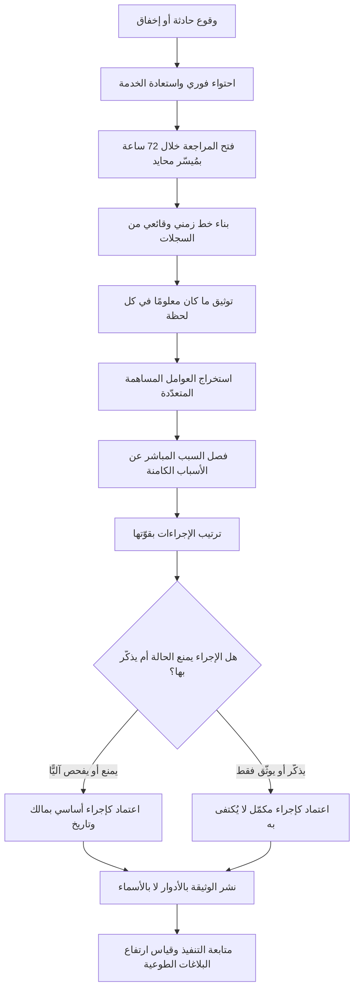

# المراجعة اللاحقة بلا لوم (Blameless Postmortem)

> [!info] تعريف مختصر
> مراجعة منظّمة تُجرى بعد حادثة أو فشل أو انحراف كبير، تنطلق من افتراض تأسيسي واحد: أن كل شخص تصرّف بما بدا له معقولًا في حينه بالنظر إلى المعلومات والأدوات والحوافز والضغوط المتاحة له في تلك اللحظة. وبناءً على هذا الافتراض تتوجّه المراجعة إلى **النظام** الذي جعل الخطأ ممكنًا وغير مكتشَف — لا إلى الشخص الذي وقع الخطأ عبر يديه. «بلا لوم» لا تعني «بلا مساءلة» ولا «بلا نتائج»؛ تعني أن المخرج المطلوب هو تغيير في الضوابط والأدوات والعمليات، لأن استبدال الشخص وحده يترك النظام على حاله جاهزًا لتكرار الحادثة مع الشخص التالي.

## الشرح العلمي والاحترافي
- **الجذر المفاهيمي: الخطأ عرَض لا سبب**: في أدبيات هندسة السلامة وعوامل السلوك البشري، يُنظر إلى الخطأ البشري كنقطة **بداية** للتحقيق لا نهايته. السؤال الصحيح ليس «من ضغط الزر الخطأ؟» بل «لماذا كان الزر الخطأ متاحًا وسهل الضغط وغير قابل للتراجع وغير مسبوق بتحذير؟». وهذا انتقال من ثقافة العقاب إلى ثقافة تصميم الحواجز.
- **مبدأ التعقّل في السياق (Local Rationality)**: من يقرأ الحادثة بعد وقوعها يرى الصورة كاملة، بينما من كان داخلها كان يرى شاشة واحدة وتنبيهًا غامضًا وساعة متأخّرة. الحكم على قرار الماضي بمعلومات الحاضر انحياز إدراكي معروف (انحياز الإدراك المتأخّر)، ومقاومته هي المهارة الأساسية في تيسير هذه المراجعات.
- **التمييز بين اللوم والمساءلة**: اللوم يسأل «من المسؤول عن هذا؟» وينتهي عند اسم. المساءلة تسأل «من يملك تنفيذ الإجراء التصحيحي؟ وبأي تاريخ؟» وتنتهي عند التزام. المراجعة بلا لوم تلغي الأول وتشدّد على الثاني؛ وكل وثيقة مراجعة تخرج بلا ملّاك ولا تواريخ هي وثيقة ناقصة مهما بلغ عمق تحليلها.
- **الأثر على جودة المعلومات — وهو المبرّر العملي الأقوى**: في البيئة العقابية يقلّ الإبلاغ عن الحوادث الصغيرة والأخطاء الوشيكة، وتُروى الوقائع مصقولة، ويتأخّر رفع المشكلة حتى تكبر. فتفقد المؤسسة أرخص مصادر التعلّم لديها. البيئة بلا لوم تشتري صراحة السرد، وهي شرط لأي تحليل صحيح للسبب الجذري.
- **علاقتها بالسلامة النفسية**: هذه الممارسة هي التطبيق الأوضح لـ[[Psychological Safety]] في اللحظة الأصعب. والمعيار العملي لقياسها بسيط: هل يستطيع أصغر عضو في الفريق أن يقول «أنا من نفّذ الأمر الذي أسقط الخدمة» في اجتماع فيه المدير التنفيذي، دون أن يخشى على وضعه؟ إن كان الجواب لا، فالمراجعة ستكون شكلية مهما سُمّيت.
- **منهجيًّا: أدوات التحليل تُستعمل داخلها لا بدلًا عنها**: المراجعة إطار اجتماعي ومنهجي، وتُستخدم داخلها أدوات [[Root Cause Analysis]] مثل «لماذا الخمسة» ومخطّط السبب والأثر. لكن يُنتبه إلى أن تسلسل «لماذا» في الأنظمة المعقّدة نادرًا ما ينتهي بسبب واحد؛ الحوادث الكبيرة عادةً حصيلة عدّة عوامل مساهمة تصادف اجتماعها، وحصرها في سبب واحد يُنتج علاجًا ناقصًا.
- **الأسباب الكامنة مقابل الأسباب المباشرة**: كل حادثة لها سبب مباشر ظاهر (أمر خاطئ، إعداد ناقص، ملف مفقود) وأسباب كامنة سبقته بأشهر (توثيق قديم، تنبيه مُهمَل من كثرة التنبيهات الكاذبة، دَين تقني مؤجَّل، اعتماد على شخص واحد). العلاج المقتصر على السبب المباشر يعيد إنتاج الحادثة بصورة أخرى، ولهذا يُنظر عادةً إلى [[Technical Debt]] كمولّد صامت للحوادث.
- **جودة الإجراءات التصحيحية هي المقياس النهائي**: الإجراءات من نوع «سنكون أكثر حذرًا» أو «سنذكّر الفريق» أو «سنضيف خطوة في الدليل» ضعيفة لأنها تعتمد على الذاكرة البشرية تحت الضغط. الإجراءات القوية تُغيّر النظام: فحص آلي يمنع الحالة، إعداد افتراضي آمن، تنبيه أبكر، خطوة يتعذّر تخطّيها. ترتيب الإجراءات بقوّتها جزء أصيل من المراجعة الجيدة.

## أين ومتى يُستخدم
- **بعد أي حادثة تشغيلية مؤثّرة**: انقطاع خدمة، خرق [[SLA]] أو [[SLO]]، أو زمن استرداد تجاوز المستهدف في [[MTTR]]، مع ربط النتائج بممارسات [[SRE]].
- **بعد إخفاق تسليم كبير**: تجاوز جوهري في الجدول أو الميزانية، أو رفض في [[UAT]]، أو ارتفاع مفاجئ في [[Escaped Defect Rate]] و[[Rework Percentage]].
- **بعد الأخطاء الوشيكة التي لم تقع (Near Misses)**: وهي أعلى المصادر عائدًا على التعلّم وأقلّها كلفة، لأنها تكشف هشاشة النظام دون أن تدفع الثمن.
- **عند تفعيل شرط إيقاف**: بعد تنفيذ [[Kill Criteria]] تُدار مراجعة لفهم ما تعلّمناه من التجربة قبل توزيع الموارد على البديل.
- **عند إغلاق مرحلة أو مشروع**: ضمن [[Closure vs Handover]]، لتوثيق الدروس في [[Organizational Process Assets]] بحيث تنتفع بها فرق أخرى.
- **بعد فشل عملية ترحيل أو تراجع عن إصدار**: لتقييم كفاية خطة [[Rollback]] وجاهزية [[Hypercare]] واختبارات [[Data Dry Run]].

## مثال وسيناريو تطبيقي
> [!example] منصّة دفع إلكتروني في دولة خليجية تعرّضت لتوقّف في بوّابة السداد استمر 3 ساعات و42 دقيقة في يوم رواتب، تعطّلت خلاله نحو 41 ألف عملية وارتفع حجم اتصالات الدعم إلى خمسة أضعاف المعدّل.
> السبب المباشر: مهندس عمليات نفّذ تعديلًا على إعدادات موازن الحمل الساعة 9:14 صباحًا، أدخل فيه قيمة مهلة (Timeout) خاطئة نُسخت من بيئة الاختبار.
> **الردّ العقابي المحتمل**: إنذار للمهندس ومنع التعديلات اليدوية على من هم دون مستوى معيّن. لو حدث هذا لكان الأثر الأرجح: انخفاض الإبلاغ الطوعي عن الأخطاء الصغيرة، وتباطؤ التدخّلات في الحوادث اللاحقة خوفًا من التبعة، وبقاء النظام هشًّا كما هو.
> **ما فعله الفريق فعلًا**: أدار المراجعة مُيسّر من فريق آخر غير متورّط، بحضور المهندس المنفّذ نفسه بوصفه شاهدًا رئيسيًّا لا متّهمًا. بُني خط زمني دقيقة بدقيقة من السجلات قبل أي نقاش تفسيري. فظهرت ستة عوامل مساهمة لم يكن أيّها معروفًا للإدارة:
> ① ملفّا الإعداد في بيئتَي الاختبار والإنتاج متطابقان في الشكل والاسم تمامًا، ولا مؤشّر بصري يميّز أيّهما مفتوح.
> ② لا يوجد فحص آلي يرفض قيم المهلة خارج نطاق مقبول قبل التطبيق.
> ③ لا نافذة تجميد للتغييرات في أيام صرف الرواتب، رغم أن الجميع يعرف أنها الأحرج.
> ④ التنبيه الصحيح صدر بعد 90 ثانية، لكنه كان مغمورًا وسط 340 تنبيهًا يوميًّا معظمها كاذب، فلم يلتفت إليه أحد 26 دقيقة.
> ⑤ إجراء التراجع موثّق في صفحة لم تُحدَّث منذ 14 شهرًا، وتشير إلى أمر لم يعد يعمل.
> ⑥ المهندس الوحيد الذي يعرف المسار الصحيح كان في إجازة، ولا بديل مُعلن.
> **الإجراءات المعتمدة** رُتّبت بقوّتها: فحص آلي يرفض القيم خارج النطاق (يمنع تكرار الحالة أصلًا)، تمييز بصري إلزامي لبيئة الإنتاج، تجميد تغييرات مُعلن في أيام الرواتب، وتنظيف قواعد التنبيه لخفض الضجيج بهدف مُقاس. أما تحديث الوثيقة والتذكير بالإجراء فصُنّفا إجراءين ضعيفين مكمّلين لا أساسيين.
> النتيجة التي تابعها الفريق بعد ستة أشهر: لم تتكرّر الحادثة من هذا النوع، والأهم أن عدد بلاغات «أوشكتُ أن أخطئ» التي يرفعها المهندسون طوعًا ارتفع بشكل ملموس — وهو المؤشّر الذي اعتبرته الإدارة الدليل الحقيقي على أن المراجعة كانت بلا لوم فعلًا لا اسمًا.

## خطوات أو مخطّط
1. **افتح المراجعة بسرعة**: خلال 24–72 ساعة من الحادثة، قبل أن تتآكل الذاكرة وتُعاد صياغة السرد ذهنيًّا ليصبح متماسكًا أكثر ممّا كان.
2. **عيّن مُيسّرًا محايدًا**: من خارج الفريق المتورّط، مهمّته حماية القاعدة لا الوصول إلى استنتاج مسبق.
3. **ابنِ خطًّا زمنيًّا وقائعيًّا أولًا**: من السجلات والرسائل والتنبيهات، بلا تفسير ولا حكم. الخلط بين الوقائع والتفسير في هذه المرحلة يُفسد التحليل كلّه.
4. **أضف ما كان معلومًا في كل لحظة**: بجوار كل واقعة، سجّل ما كان الشخص يراه ويعرفه حينها — لا ما نعرفه نحن الآن.
5. **استخرج العوامل المساهمة**: لا سببًا واحدًا. اسأل عن كل خطوة: ما الذي كان سيمنع هذا؟ ولماذا لم يكن موجودًا؟
6. **افصل السبب المباشر عن الأسباب الكامنة**: وسجّل الثانية صراحةً حتى لا تُهمَل لصالح العلاج السريع.
7. **صنّف الإجراءات المقترحة بقوّتها**: منع كامل، ثم فحص آلي، ثم تنبيه مبكّر، ثم إجراء وتوثيق، ثم تذكير وتدريب. واشترط ألّا تكون كل الإجراءات من الفئتين الأخيرتين.
8. **اختر عددًا محدودًا وحدّد الملّاك والتواريخ**: ثلاثة إلى خمسة إجراءات تُنفَّذ خير من خمسة عشر تُؤرشَف.
9. **انشر الوثيقة داخليًّا بلا أسماء أشخاص**: بالأدوار لا بالأسماء، ليعمّ الدرس ولا يعمّ الوصم.
10. **تابع التنفيذ في اجتماع دوري**: الإجراء غير المنفّذ خلال ربع سنة يُعاد فتحه أو يُغلق بقرار صريح ومعلَّل، لا يُترك معلّقًا.
11. **قِس صحّة الثقافة لا عدد المراجعات**: ارتفاع البلاغات الطوعية والأخطاء الوشيكة مؤشّر نضج؛ انخفاضها إلى الصفر مؤشّر خوف غالبًا، لا مؤشّر كمال.

## ⚠️ مفاهيم خاطئة شائعة
> [!warning]
> - **فهم «بلا لوم» على أنها «بلا مساءلة»**: المراجعة تلغي البحث عن مذنب، لا الالتزام بإجراءات لها ملّاك وتواريخ. المؤسسة التي تخرج من كل حادثة بوثيقة لطيفة بلا التزامات لم تطبّق المبدأ بل استعملت اسمه.
> - **الظنّ أنها تحمي من سوء النية أو الإهمال المتعمّد**: الإطار مصمَّم للخطأ الصادق داخل نظام معيب. أما تجاوز الضوابط عمدًا أو إخفاء المعلومات فمسار مختلف تمامًا (انضباطي)، وخلط المسارين يُفقد المبدأ مصداقيته لدى الإدارة ولدى الفريق معًا.
> - **اعتبارها اجتماعًا لاستعراض التفاصيل التقنية فقط**: أخطر العوامل المساهمة غالبًا تنظيمية — ضغط موعد، غياب بديل، حافز يكافئ السرعة، تنبيه أُهمل لأن 90% من التنبيهات كاذبة. الاقتصار على الطبقة التقنية يترك المولّد الحقيقي دون علاج.
> - **الاعتقاد بأن لكل حادثة سببًا جذريًّا واحدًا**: صيغة «السبب الجذري» المفردة مريحة إداريًّا ومضلّلة تحليليًّا في الأنظمة المعقّدة. الأدقّ الحديث عن عوامل مساهمة متعدّدة تصادف اجتماعها، وعلاج ما يمكن علاجه منها.
> - **الخلط بينها وبين تشريح الفشل المسبق**: [[Pre-mortem]] يسبق التنفيذ ويتعامل مع فشل متخيَّل لمنعه، وهذه تلي الواقعة وتتعامل مع فشل حدث فعلًا لاستخلاص الدرس. الأولى تنتج مخاطر وشروط إيقاف، والثانية تنتج إجراءات تصحيحية.
> - **افتراض أن غياب اللوم يعني غياب النقد**: النقد التقني الحادّ لقرار أو تصميم أو أولوية مطلوب وصحّي؛ الممنوع هو نسبة الفشل إلى صفة شخصية («كان مهملًا»، «لم يكن مركّزًا») لأنها تُنهي التحقيق قبل أن يبدأ.

## ❌ ممارسات خاطئة في المشاريع
> [!failure]
> - **الخطأ: إدارة المراجعة بحضور قيادي يبدأ بسؤال «من فعل هذا؟»**. لماذا يضرّ: تتحوّل الجلسة فورًا إلى دفاع، ويُخفي كل طرف ما قد يُستعمل ضدّه، فيخرج التحليل ناقصًا ومضلّلًا. الحل: اتّفق قبل الجلسة على قاعدة مكتوبة تُتلى في افتتاحها، وامنح المُيسّر صلاحية إيقاف أي سؤال يتّجه إلى الأشخاص.
> - **الخطأ: كتابة إجراءات تصحيحية كلها من نوع «التذكير والتدريب وتحديث الوثيقة»**. لماذا يضرّ: تعتمد على أن يتذكّر إنسان مرهق تحت ضغط ما قرأه قبل أشهر — وهذا احتمال ضعيف بنيويًّا. الحل: اشترط أن يكون إجراء واحد على الأقل من فئة «المنع أو الفحص الآلي»، وارفض إغلاق المراجعة بدونه.
> - **الخطأ: قصر المراجعة على الحوادث الكبيرة فقط**. لماذا يضرّ: تُهدر الأخطاء الوشيكة وهي أرخص مصدر تعلّم، وتُترك الهشاشة تتراكم حتى تنفجر في أسوأ توقيت. الحل: عرّف عتبة منخفضة تستوجب مراجعة مصغّرة (نصف ساعة، صفحة واحدة)، واحتفِ بمن يرفع البلاغ.
> - **الخطأ: نشر الوثيقة بأسماء الأشخاص**. لماذا يضرّ: يتحوّل التوثيق إلى سجلّ وصم دائم يقرأه من لم يحضر ولم يفهم السياق، فيمتنع الناس عن الصراحة في المرة القادمة. الحل: اكتب بالأدوار («مهندس المناوبة»، «مالك الخدمة») لا بالأسماء، واحتفظ بالتفاصيل الشخصية خارج الوثيقة المنشورة.
> - **الخطأ: إغلاق المراجعة دون متابعة تنفيذ الإجراءات**. لماذا يضرّ: تتراكم الوثائق بينما تتكرّر الحوادث نفسها، فيفقد الفريق ثقته بجدوى الجلسة ويعاملها لاحقًا كإجراء شكلي. الحل: أنشئ لوحة متابعة لإجراءات ما بعد الحوادث، واستعرضها في [[Project Health Report]] شهريًّا.
> - **الخطأ: عقدها متأخّرة بأسابيع**. لماذا يضرّ: يعيد الناس بناء الذاكرة بأثر رجعي فتصير الرواية أكثر تماسكًا وعقلانية ممّا كانت، وتضيع اللحظات الغامضة التي تحتوي على المعلومة الأهم. الحل: افتحها خلال 72 ساعة ولو كان التحليل ناقصًا، وأكملها لاحقًا.
> - **الخطأ: تحويل المراجعة إلى ساحة للمطالبات المؤجَّلة**. لماذا يضرّ: يستغلّ كل فريق الجلسة لطرح ما كان يطالب به أصلًا، فيتشتّت التحليل وتضيع صلة الإجراءات بالحادثة موضع البحث. الحل: احصر النقاش في العوامل التي ساهمت في هذه الحادثة تحديدًا، وحوّل ما عداها إلى [[Backlog Refinement]] أو [[RAID Log]].

## 🔗 مصطلحات ومفاهيم ذات صلة
[[Root Cause Analysis]] | [[Psychological Safety]] | [[Pre-mortem]] | [[Intelligent Failure]] | [[Kill Criteria]] | [[Intellectual Humility]] | [[MTTR]] | [[SRE]] | [[SLO]] | [[Rollback]] | [[Hypercare]] | [[Escaped Defect Rate]] | [[Technical Debt]] | [[Organizational Process Assets]] | [[Feedback Loop]] | [[Kaizen]]
