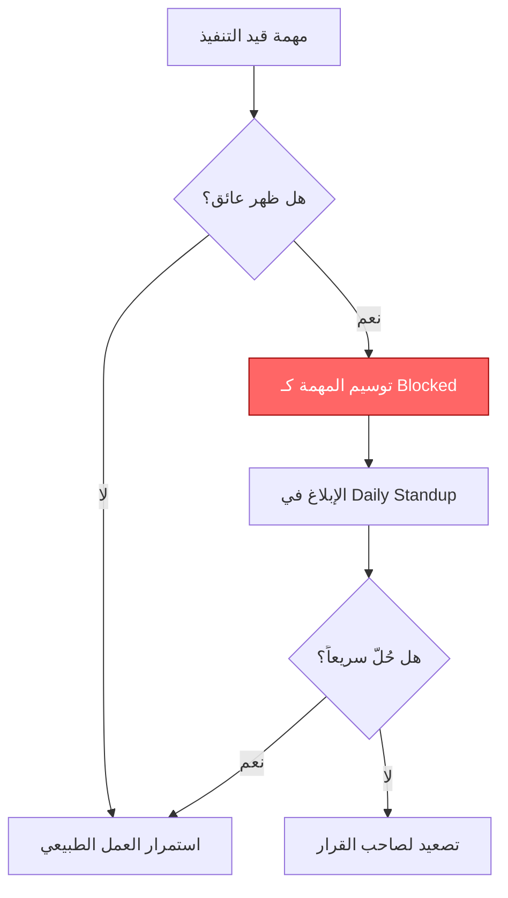

# العائق (Blocker)
> [!info] تعريف مختصر
> العائق (Blocker)، ويُسمى أيضاً "المعوّق" (Impediment)، هو أي مشكلة تمنع مهمة من التقدم إلى الأمام، وتتطلب تدخلاً خارجياً لحلها قبل أن يستطيع الفريق مواصلة العمل عليها.

## الشرح العلمي والاحترافي
- العائق يختلف عن مجرد "مهمة صعبة"؛ فهو يوقف التقدم كلياً حتى تتم إزالته، مثل انتظار موافقة إدارية، أو عطل في بيئة الاختبار، أو اعتمادية على فريق آخر لم يُنجز عمله بعد.
- في المصطلح المستخدم داخل سكرَم غالباً تُسمى هذه العوائق "Impediments"، ومن أدوار سكرَم ماستر ([[06 - Scrum Master]]) الأساسية إزالتها أو تصعيدها لمن يقدر على حلها.
- وجود عوائق كثيرة أو طويلة الأمد يرفع [[Cycle Time]] و[[Lead Time]] بشكل كبير، ويُخفي أحياناً اختناقاً هيكلياً حقيقياً ([[Bottleneck]]) يجب حله.
- من المهم التفريق بين العائق الحقيقي (Blocker) والمهمة المعلّقة مؤقتاً بانتظار قرار داخلي بسيط؛ العائق الحقيقي يستدعي تصعيداً وتتبعاً رسمياً لأنه يهدد الموعد النهائي.
- في لوحات كانبان يُشار للمهمة المعاقة عادة بعلامة حمراء أو بطاقة توقف (Flag) لتمييزها بصرياً عن باقي المهام الجارية.

## أين ومتى يُستخدم
- يُذكر يومياً في اجتماع الوقوف الصباحي ([[07 - Daily Standup]]) حين يسأل الفريق: "هل هناك عوائق تمنعك من التقدم؟"
- يُستخدم في كانبان و[[Scrum-ban]] لوسم المهام المعلّقة على اللوحة ومتابعتها بشكل منفصل عن سير العمل الطبيعي.
- يُسجَّل رسمياً في [[Issue Log]] أو [[RAID Log]] عندما يستمر العائق لفترة طويلة ويحتاج متابعة وتصعيداً منظّماً.
- يظهر أثناء تحليل جذر المشكلة ([[Root Cause Analysis]]) عند التحقيق في سبب تأخر مشروع بأكمله.

## مثال وسيناريو تطبيقي
> [!example] سيناريو
> مطوّرة تعمل على ميزة "الدفع الإلكتروني" في تطبيق توصيل طلبات، وتحتاج مفتاح API (API Key) من مزوّد خدمة دفع خارجي لإكمال الاختبار. طلبت المفتاح من قسم الأمن الداخلي يوم الاثنين، لكن الرد تأخر إلى يوم الخميس.
> خلال هذه الأيام الثلاثة، وضعت المطوّرة علامة "معاق" (Blocked) حمراء على بطاقة المهمة في لوحة كانبان، وذكرت العائق في اجتماع الوقوف الصباحي يومياً.
> سكرَم ماستر الفريق صعّد الأمر لمدير قسم الأمن مباشرة يوم الثلاثاء بعد يوم واحد من الانتظار دون رد، فتم الحصول على المفتاح بشكل أسرع من لو انتظر الفريق بصمت. هذا التصعيد المبكر منع تأخير السبرنت بأكمله.

## خطوات أو مخطّط
1. اكتشاف العائق: يلاحظ عضو الفريق أن المهمة لا يمكن أن تتقدم دون عامل خارجي.
2. توسيم المهمة: وضع علامة "معاق" على بطاقة المهمة في اللوحة فوراً، مع كتابة سبب التوقف بوضوح.
3. الإبلاغ: ذكر العائق في أقرب اجتماع وقوف صباحي أو فوراً إذا كان حرجاً.
4. التصعيد: إذا لم يُحل خلال مهلة معقولة، يتدخل سكرَم ماستر أو مدير المشروع لتصعيده لصاحب القرار المناسب.
5. الإزالة والتوثيق: بعد حل العائق، تُزال العلامة وتُوثَّق المدة والسبب لتحليلها لاحقاً ومنع تكرارها.

## ⚠️ مفاهيم خاطئة شائعة
> [!warning]
> - الاعتقاد أن كل مهمة صعبة أو بطيئة هي "عائق"؛ العائق الحقيقي هو توقف كامل عن التقدم يحتاج تدخلاً خارجياً، وليس مجرد صعوبة تقنية عادية يمكن للفريق حلها بنفسه.
> - الظن بأن ذكر العائق في اجتماع الوقوف الصباحي وحده كافٍ لحله؛ في الواقع يحتاج غالباً متابعة فعلية وتصعيداً من سكرَم ماستر أو مدير المشروع.
> - الخلط بين العائق والاعتماديات المخطط لها مسبقاً ([[Dependency]])؛ الاعتمادية معروفة ومجدولة سلفاً، بينما العائق غالباً غير متوقع ويوقف العمل فجأة.

## ❌ ممارسات خاطئة في المشاريع
> [!failure]
> - إخفاء العوائق أو عدم ذكرها خوفاً من الظهور بمظهر "غير منتج"، مما يؤخر الحل ويضخّم المشكلة لاحقاً. التجنب: بناء بيئة أمان نفسي ([[Psychological Safety]]) تشجّع على الإفصاح المبكر عن العوائق.
> - ترك المهمة المعاقة دون توسيم واضح على اللوحة، فيظن الفريق أنها "قيد التنفيذ" بينما هي متوقفة فعلياً. التجنب: الالتزام الصارم بوسم كل مهمة معاقة فوراً وبسبب واضح.
> - عدم تصعيد العائق لفترة طويلة أملاً في حله ذاتياً، مما يهدر أياماً ثمينة من الجدول الزمني. التجنب: وضع مهلة زمنية واضحة (مثلاً يوم عمل واحد) بعدها يُصعَّد العائق تلقائياً لصاحب القرار.

## 🔗 مصطلحات ومفاهيم ذات صلة
[[06 - Scrum Master]] | [[07 - Daily Standup]] | [[Dependency]] | [[Issue Log]] | [[RAID Log]] | [[Root Cause Analysis]] | [[Cycle Time]] | [[Bottleneck]] | [[Psychological Safety]] | [[03 - Kanban]]
