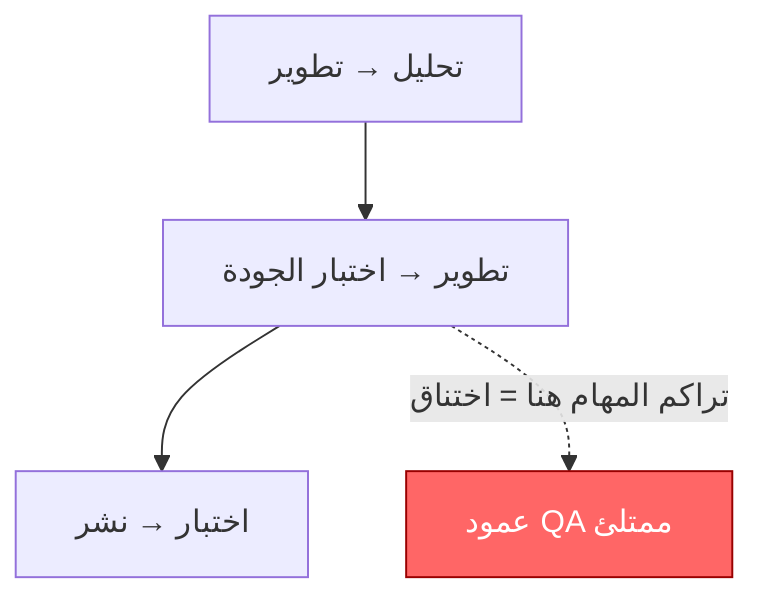

# الاختناق (Bottleneck)
> [!info] تعريف مختصر
> الاختناق (Bottleneck) هو أي مرحلة أو مورد في سير العمل تكون طاقته الاستيعابية أقل من باقي المراحل، فيتراكم أمامه العمل ويبطئ تدفق الفريق بأكمله.

## الشرح العلمي والاحترافي
- في أي سلسلة عمل (Workflow) تمر المهام بعدة مراحل متتابعة: مثلاً "تحليل → تطوير → اختبار → نشر". سرعة تسليم المنتج النهائي محكومة بأبطأ مرحلة فيها، تماماً كما أن سرعة تدفق الماء في أنبوب محكومة بأضيق نقطة فيه.
- هذا المفهوم أساسي في "نظرية القيود" ([[Theory of Constraints]])، التي تقول إن تحسين أي مرحلة غير الاختناق لا يزيد الإنتاجية الكلية؛ فقط تحسين الاختناق نفسه يفعل ذلك.
- الاختناق يظهر عادة كتراكم واضح للمهام أمام مرحلة معينة على لوحة كانبان ([[03 - Kanban]])، أو كارتفاع في [[Cycle Time]] و[[Lead Time]] لتلك المرحلة تحديداً.
- سببه قد يكون نقص الموارد البشرية (مثلاً مختبِر واحد فقط لفريق من عشرة مطورين)، أو اعتماديات خارجية بطيئة، أو عمليات موافقة يدوية معقدة.
- علاج الاختناق يمر بخطوات: تحديده (Identify) ← استغلاله لأقصى درجة دون هدر (Exploit) ← إخضاع باقي المراحل لوتيرته (Subordinate) ← رفع طاقته (Elevate) ← ثم البحث عن اختناق جديد يظهر مكانه (يُعرف هذا التسلسل بـ Five Focusing Steps).

## أين ومتى يُستخدم
- يُستخدم مفهوم الاختناق بشكل أساسي في منهجيات كانبان و[[Scrum-ban]] وإدارة التدفق (Flow Management)، وأيضاً في التصنيع (Lean/[[Toyota Production System]]).
- يُلجأ إليه عند تحليل [[Value Stream Mapping]] لمعرفة أين يضيع الوقت، أو عند مراجعة [[Control Chart]] و[[Cycle Time]] لملاحظة تباطؤ غير طبيعي في مرحلة معينة.
- يُدرَس أيضاً أثناء [[Gemba Walk]] عندما يذهب المسؤول إلى مكان العمل الفعلي لرؤية أين يتراكم العمل.

## مثال وسيناريو تطبيقي
> [!example] سيناريو
> فريق تطوير تطبيق جوّال لديه 8 مطورين وشخص واحد فقط مسؤول عن ضمان الجودة (QA). كل أسبوع يُنجز المطورون 20 ميزة جديدة جاهزة للاختبار، لكن مختبر الجودة الواحد لا يستطيع اختبار أكثر من 8 ميزات أسبوعياً.
> النتيجة: تتراكم 12 ميزة أسبوعياً في عمود "جاهز للاختبار" على لوحة كانبان، ويرتفع [[Lead Time]] الكلي من 5 أيام إلى 3 أسابيع رغم أن المطورين "سريعون جداً".
> الحل: يضع فريق العمل حد عمل قيد التنفيذ ([[WIP Limit]]) على عمود التطوير كي يتوقف المطورون عن إنتاج المزيد حتى يفرغ QA، ثم يستقدم الفريق مختبراً إضافياً أو يدرّب أحد المطورين على اختبارات القبول، فينخفض [[Lead Time]] تدريجياً.

## خطوات أو مخطّط
1. تحديد الاختناق: مراقبة اللوحة أو [[Control Chart]] لمعرفة أين تتراكم المهام أكثر.
2. استغلال الاختناق: التأكد أن المرحلة المختنقة لا تتوقف أبداً عن العمل (لا استراحات، لا مهام غير ضرورية).
3. إخضاع باقي المراحل: تعديل وتيرة عمل المراحل الأخرى (عبر [[WIP Limit]]) لتتوافق مع طاقة الاختناق فلا تتراكم المهام قبله.
4. رفع الطاقة: إضافة موارد (أشخاص، أتمتة) لزيادة طاقة الاختناق نفسه.
5. تكرار الدورة: بعد حل الاختناق سيظهر عادة اختناق جديد في مكان آخر، فتُعاد الخطوات.

## ⚠️ مفاهيم خاطئة شائعة
> [!warning]
> - الاعتقاد بأن تسريع كل مرحلة يحسّن الأداء الكلي؛ في الواقع تسريع مرحلة غير الاختناق لا يغيّر شيئاً لأن العمل سيتكدس عند الاختناق نفسه.
> - الخلط بين الاختناق والشخص "البطيء"؛ غالباً السبب هيكلي (نقص موارد أو عملية معقدة) وليس ضعف أداء فردي.
> - الظن أن الاختناق ثابت دائماً في نفس المكان؛ في الحقيقة بعد حل اختناق يظهر آخر مكانه، فالتحسين عملية مستمرة لا حدث لمرة واحدة.

## ❌ ممارسات خاطئة في المشاريع
> [!failure]
> - تجاهل الاختناق والاستمرار بالضغط على الفريق لإنتاج أسرع، مما يزيد التراكم فقط ويرفع [[Lead Time]] دون فائدة. التجنب: تحليل التدفق أولاً قبل طلب مزيد من السرعة.
> - إضافة أفراد إلى المرحلة الخطأ (مثلاً توظيف مطور جديد بينما الاختناق في الاختبار). التجنب: تأكيد موقع الاختناق فعلياً بالبيانات قبل تخصيص الموارد.
> - عدم وضع [[WIP Limit]] فيسمح للمراحل السابقة بإنتاج مهام أكثر من طاقة الاختناق، فتتضخم قائمة الانتظار. التجنب: تقييد العمل الجاري ليتناسب مع أضعف حلقة في السلسلة.

## 🔗 مصطلحات ومفاهيم ذات صلة
[[Theory of Constraints]] | [[WIP Limit]] | [[Cycle Time]] | [[Lead Time]] | [[Throughput]] | [[Control Chart]] | [[Value Stream Mapping]] | [[03 - Kanban]] | [[Little's Law]] | [[Pull System]]
