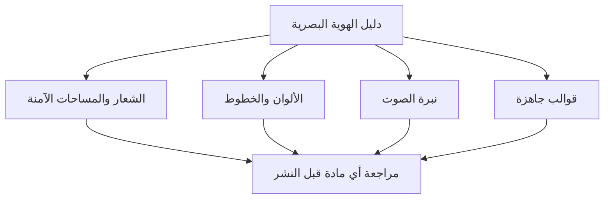

# دليل الهوية البصرية (Brand Guidelines)
> [!info] تعريف مختصر
> وثيقة مرجعية رسمية تحدّد قواعد استخدام هوية العلامة التجارية بصريًا ولفظيًا: الشعار، الألوان، الخطوط، نبرة الكتابة، والصور، لضمان اتساق ظهور العلامة في جميع المنتجات والقنوات.

## الشرح العلمي والاحترافي
- دليل الهوية البصرية يُعتبر "مصدر الحقيقة الوحيد" (Single Source of Truth) لكل ما يخص شكل العلامة التجارية ونبرتها، بحيث لا يضطر كل فريق لإعادة اختراع القواعد.
- يشمل عادة: الشعار وأحجامه ومساحاته الآمنة (Logo & Clear Space)، لوحة الألوان الأساسية والثانوية (Color Palette) مع أكواد الألوان (HEX/RGB)، الخطوط المعتمدة (Typography)، نبرة الصوت (Tone of Voice)، أمثلة الاستخدام الصحيح والخاطئ، وأحيانًا قوالب جاهزة للعروض التقديمية والمستندات.
- في إدارة المشاريع، هذا الدليل يُعتبر أحد أصول عمليات المؤسسة (Organizational Process Assets) التي يجب على أي فريق تصميم أو تسويق أو تطوير الرجوع إليها قبل إنتاج أي مادة تحمل اسم الشركة.
- غيابه أو عدم تحديثه يؤدي إلى تشتت الهوية البصرية بين المنتجات المختلفة، مما يضعف تعرّف العملاء على العلامة التجارية ويقلل الثقة المؤسسية.
- عادة ما يكون هذا الدليل مسؤولية فريق التسويق أو التصميم، لكنه يُستخدم من قبل جميع الفرق: المنتج، الهندسة (لواجهات المستخدم)، المبيعات، وخدمة العملاء.

## أين ومتى يُستخدم
- في مرحلة بدء أي مشروع تصميم جديد (موقع، تطبيق، حملة تسويقية، عرض تقديمي) للتأكد من الالتزام بالهوية.
- عند إشراك جهة خارجية (وكالة تصميم، مستقل، مورّد) لضمان تسليم مخرجات متسقة مع هوية الشركة.
- في مراجعات الجودة (Quality Review) قبل نشر أي مادة تسويقية أو منتج رقمي للجمهور.
- عند إعادة تسمية العلامة التجارية (Rebranding) أو توسّع الشركة لأسواق جديدة تتطلّب تكييف الهوية.

## مثال وسيناريو تطبيقي
> [!example] سيناريو ملموس
> شركة "نُقطة تِك" تتعاقد مع وكالة خارجية لتصميم موقع جديد خلال 6 أسابيع. في أول اجتماع انطلاق (Kick-off)، يسلّم مدير المشروع للوكالة ملف دليل الهوية البصرية الذي يحدد: اللون الأساسي #1A73E8، خط "Cairo" للعناوين العربية، ونبرة كتابة "ودّية ومباشرة بدون مصطلحات معقدة". بعد أسبوعين، تُقدّم الوكالة تصميمًا أوليًا يستخدم لونًا أزرق مختلفًا وخطًا آخر. يرفض مدير المشروع التصميم فورًا لأنه يخالف الدليل، ويطلب تعديلًا خلال 48 ساعة مع إرفاق الدليل مجددًا كمرجع إلزامي ضمن بنود العقد.

## خطوات أو مخطّط
1. تحديد عناصر الهوية الأساسية: الشعار، الألوان، الخطوط، نبرة الصوت.
2. توثيق قواعد الاستخدام الصحيح والخاطئ لكل عنصر بأمثلة بصرية.
3. نشر الدليل في مكان مركزي يسهل الوصول إليه لجميع الفرق (Single Source of Truth).
4. مشاركة الدليل مع أي طرف جديد (موظف، وكالة، مورّد) في بداية أي مشروع.
5. مراجعة الدليل وتحديثه دوريًا مع نمو العلامة التجارية أو تغيّر استراتيجيتها.

## ⚠️ مفاهيم خاطئة شائعة
> [!warning]
> - الاعتقاد بأن دليل الهوية البصرية هو مجرد ملف شعار وألوان؛ في الحقيقة يشمل أيضًا نبرة الكتابة وقواعد الاستخدام السياقية.
> - الظن بأنه وثيقة تُنشأ مرة واحدة ولا تحتاج تحديثًا؛ الهوية تتطوّر مع نمو الشركة ويجب مراجعتها دوريًا.
> - الخلط بين دليل الهوية البصرية (Brand Guidelines) ودليل أسلوب الكتابة التقني (Style Guide للتوثيق)؛ الأول يخص الهوية التسويقية والثاني يخص أسلوب المحتوى التقني وقد يتقاطعان جزئيًا فقط.

## ❌ ممارسات خاطئة في المشاريع
> [!failure]
> - إنشاء الدليل ثم تركه دون مشاركته فعليًا مع الفرق المنفّذة أو الموردين الخارجيين. الحل: جعل مشاركة الدليل خطوة إلزامية في اجتماع انطلاق أي مشروع (Kick-off Checklist).
> - السماح لكل فريق (تسويق، منتج، مبيعات) باستخدام نسخة مختلفة أو قديمة من الدليل. الحل: تخزين نسخة واحدة محدّثة في مكان مركزي معتمد (Single Source of Truth).
> - عدم تحديث الدليل بعد تغييرات جوهرية في الهوية (مثل تغيير الشعار)، مما يخلق تضاربًا بين المواد القديمة والجديدة. الحل: تحديد مالك رسمي للدليل ومراجعة سنوية منتظمة له.

## 🔗 مصطلحات ومفاهيم ذات صلة
[[Single Source of Truth]] | [[Organizational Process Assets]] | [[SOP]] | [[Docs as Code]] | [[Stakeholder Map]] | [[21 - Stakeholder Communication]]
