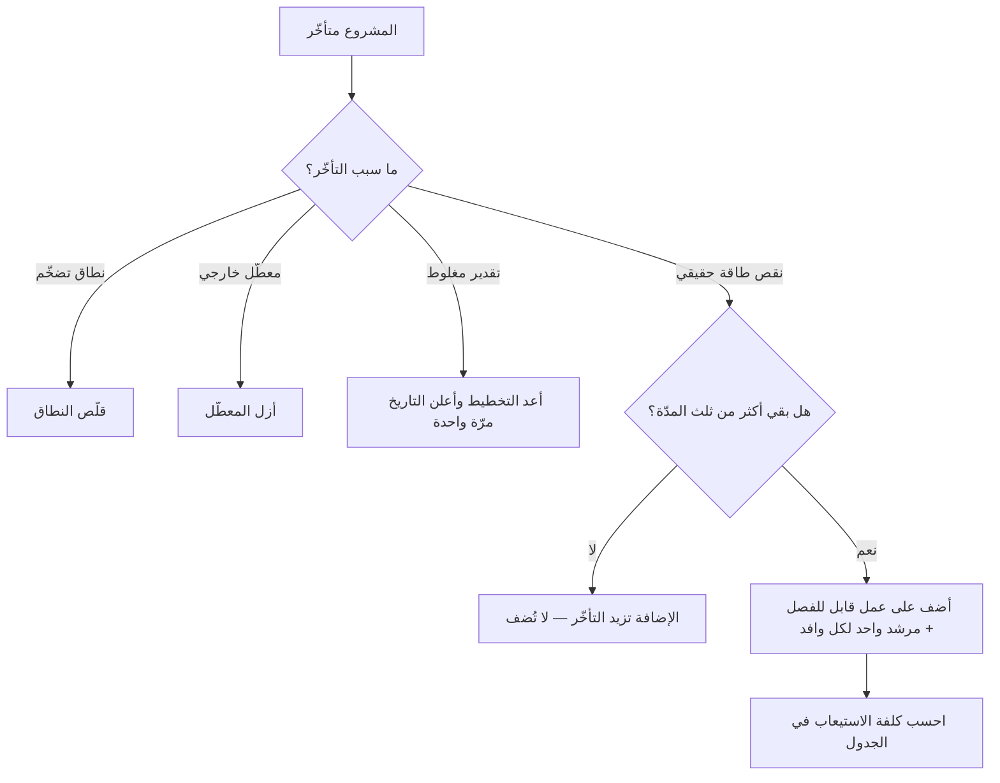

# قانون بروكس (Brooks's Law)

> [!info] تعريف مختصر
> **قانون بروكس** يقول: *«إضافة قوى عاملة إلى مشروع برمجي متأخّر تزيده تأخّرًا.»* صاغه فريدريك بروكس في كتابه *The Mythical Man-Month* (1975) بعد قيادته تطوير نظام تشغيل IBM System/360. وعلّته أمران يجتمعان: أن الوافد الجديد **يستهلك من وقت القدامى قبل أن ينتج**، وأن **عدد قنوات التواصل يتضاعف** بسرعة أكبر من عدد الأشخاص. وأصل الوهم الذي يصحّحه القانون هو تسمية الكتاب نفسها: أن **الرجال والأشهر ليسا قابلين للتبادل** إلا في العمل القابل للتجزئة تجزئةً تامّة بلا تواصل — وتطوير البرمجيات ليس منه.

## الشرح العلمي والاحترافي

### 1. الآليتان اللتان تُنتجان الأثر

1. **كلفة الاستيعاب.** الوافد إلى مشروع جارٍ لا ينتج من يومه: يحتاج إلى فهم النطاق، والمعمارية، والاصطلاحات، وأسباب القرارات السابقة. ومصدر هذا الفهم هو **الأعضاء الأكثر إنتاجية**، فينتقل جزء من طاقتهم إلى التدريب. والنتيجة أن إنتاجية الفريق **تنخفض** أوّلًا قبل أن ترتفع — وفي مشروع متأخّر، لا يوجد وقت للانتظار حتى ترتفع.
2. **الانفجار التواصلي.** عدد القنوات بين ‎n‎ شخصًا = ‎n(n−1) ÷ 2‎. فخمسة أشخاص بينهم عشر قنوات، وعشرة بينهم خمس وأربعون. **أي أن مضاعفة الفريق تضرب عبء التنسيق أربعة أضعاف تقريبًا.** ولهذا يتحوّل جزء متزايد من وقت الجميع إلى اجتماعات ومزامنة، لا إلى إنتاج.

### 2. الشرط الذي يجعل القانون صحيحًا — والذي يجعله غير منطبق

القانون ليس مطلقًا، وبروكس نفسه وصفه لاحقًا بأنه «تبسيط شديد». وشرطه أن يكون العمل **غير قابل للتجزئة بلا تواصل**:

- **العمل القابل للتجزئة التامّة** — كترجمة مئة مستند مستقلّ — يتسارع بإضافة الناس فعلًا، ولا ينطبق عليه القانون.
- **العمل ذو التبعيات المتشابكة** — كتغيير معماري في نظام قائم — تزيده الإضافة تأخّرًا يقينًا.
- وأكثر العمل البرمجي بين الحالين، فيقلّ أثر القانون أو يشتدّ بحسب **قابلية العمل للفصل** وبحسب **جودة التوثيق والبنية**.

### 3. ماذا يفعل المدير إذن حين يتأخّر المشروع؟

القانون يُغلق بابًا واحدًا ولا يترك المدير بلا خيار. والخيارات المتبقّية أربعة، وأصعبها أوّلها:

1. **قلّص النطاق.** وهو الخيار الوحيد الذي يعمل بيقين، وهو الذي يُقاوَم أشدّ المقاومة لأنه يعني الاعتراف بأن ما وُعد به لن يُسلَّم كاملًا.
2. **حرّك التاريخ مبكرًا لا متأخّرًا.** فأسوأ ما يقع أن يُعلَن التأخير على دفعات صغيرة متتابعة، فيفقد كل تاريخ مصداقيته.
3. **أزل المعطّلات بدل أن تضيف أشخاصًا.** فبيئة اختبار معطّلة، أو انتظار موافقة، قد تكون أكلف من نقص الأيدي — والفريق يعرفها ويُسأل عنها.
4. **إن كان لا بدّ من الإضافة، فأضف مبكرًا وفي عمل قابل للفصل.** الإضافة في أوّل ثلث المشروع تُستوعب، وفي آخر ثلثه لا تُستوعب.

### 4. ما زاد عليه اللاحقون

- **قانون كونواي** ([[Conway's Law]]) يفسّر جانبًا من الأثر: أن الفريق الذي كبر بلا تغيير في بنيته يُنتج تصميمًا يعكس فوضى تواصله.
- **أدبيات تصميم الفرق** — ومنها ما شاع باسم «فريق البيتزا الواحدة» — تعالج الأصل بحدّ حجم الفريق الواحد، ثم تقسيم العمل إلى نطاقات ذات حدود واضحة قليلة التبعية. **فالعلاج البنيوي ليس تقليل الناس، بل تقليل ما بينهم من قنوات.**
- وهذا هو الردّ العملي على من يقرأ القانون قراءة قدَرية: **المنظّمة تكبر فعلًا**، والقانون لا يمنع ذلك؛ إنما يمنع أن يُعالَج تأخّرٌ قائم بضخّ أشخاص في فريق قائم.

## أين ومتى يُستخدم

- عند اقتراح «تعزيز الفريق» ردًّا على تأخّر — وهو أشيع مواضعه، وأنفعها إن ذُكر قبل تنفيذ القرار لا بعده.
- في تخطيط التوسّع: متى يُقسَّم الفريق إلى فريقين بحدود واضحة بدل أن يكبر فريق واحد؟
- في تخطيط انضمام الأعضاء الجدد: كم من طاقة الفريق ستُصرف على الاستيعاب، ومتى يُتوقّع أن يعود الميزان؟
- عند التفاوض مع أصحاب المصلحة على خيارات التأخّر، لتوضيح أن «مزيد من الموارد» ليس خيارًا محايدًا بل خيار ذو كلفة فورية.
- في تقدير كلفة التوثيق ووضوح المعمارية: فكلاهما يخفّض كلفة الاستيعاب مباشرةً، وأثرهما يظهر في كل انضمام لاحق.

## مثال وسيناريو تطبيقي

> [!example] سيناريو ملموس
> فريق من أربعة مطوّرين يبني بوّابة خدمات، وتأخّر عن موعده ستّة أسابيع قبل الإطلاق بشهرين. فقرّرت الإدارة نقل **ثلاثة مطوّرين** من فريق آخر «لتعويض التأخير».
> في الأسبوعين الأوّلين انخفض إنتاج الفريق فعليًّا: أمضى اثنان من الأربعة أكثر وقتهما في الشرح ومراجعة الكود، وانتقل عدد قنوات التواصل من **6** إلى **21**، وتضاعفت مدّة الوقفة اليومية، وظهر تعارضان في تعديل الوحدة نفسها لأن حدود العمل لم تُعَد رسمها.
> وفي الأسبوع الخامس بدأ الوافدون ينتجون — وكان التأخير قد صار **تسعة أسابيع** لا ستّة.
> **والقرار الذي كان سينفع:** أن يُنظر في النطاق أوّلًا. فقد تبيّن عند المراجعة المتأخّرة أن ثلاث ميزات من إحدى عشرة كانت تستهلك نحو ثلث الجهد المتبقّي، وأنها كلّها تخدم حالة استخدام تمثّل نسبة ضئيلة من المستخدمين المتوقّعين. **وتأجيلها وحده كان يكفي لاستعادة الموعد بلا شخص واحد إضافي.**

## خطوات أو مخطّط

1. **قبل أن تفكّر في الإضافة، شخّص سبب التأخّر**: أهو نقص أيدٍ، أم معطّل خارجي، أم نطاق تضخّم، أم تقدير كان مغلوطًا من البداية؟ **فثلاثة من هذه الأربعة لا تُعالَج بالأشخاص.**
2. **إن كان النطاق هو السبب، فقلّصه صراحةً** واعرض على أصحاب المصلحة ما يُؤجَّل ومقابل ماذا.
3. **إن كانت الإضافة لازمة، فقدّرها بكلفتها**: كم أسبوعًا من إنتاج القدامى ستُصرف على الاستيعاب؟ واحسبها في الجدول لا خارجه.
4. **افصل عملًا قابلًا للفصل للوافدين**: وحدة مستقلّة، أو اختبارات، أو مسار له حدود واضحة — لا مهامّ في قلب العمل المتشابك.
5. **عيّن مرشدًا واحدًا لكل وافد** بدل أن يُستدعى الجميع للشرح، فتنحصر كلفة الاستيعاب في قناة واحدة معلومة.
6. **راقب عدد قنوات التواصل**: إن تجاوز الفريق حجمًا يُدار بمحادثة واحدة، فالمطلوب **تقسيمه** لا تكبيره.

## ⚠️ مفاهيم خاطئة شائعة

> [!warning]
> - **الظنّ أنه يعني أن الفرق الكبيرة لا تعمل**: القانون عن **الإضافة إلى مشروع متأخّر**، لا عن حجم الفريق ابتداءً. والمنظّمات الكبرى تعمل بفرق كثيرة صغيرة ذات حدود واضحة، وهذا وفاق للقانون لا خلاف عليه.
> - **قراءته قدَرًا يُبرّر الجمود**: القانون يُغلق بابًا ويفتح أربعة — تقليص النطاق، وإزالة المعطّلات، وإعادة الإعلان مبكرًا، والإضافة المبكرة القابلة للفصل. ومن استعمله ليقول «لا حيلة» فقد أساء استعماله.
> - **الظنّ أنه ينطبق على كل عمل**: لا ينطبق على العمل القابل للتجزئة التامّة بلا تواصل. **والشرط هو التشابك، لا كون العمل تقنيًّا.**
> - **الظنّ أن كلفة الاستيعاب أسابيع قليلة دائمًا**: تتفاوت تفاوتًا شديدًا بحسب جودة التوثيق ووضوح المعمارية وحدود الوحدات. **وهذا يجعل التوثيق استثمارًا في مرونة التوسّع لا ترفًا.**
> - **الخلط بينه وبين [[Context Switching Cost|كلفة تبديل السياق]]**: تلك عن الشخص الواحد يتنقّل بين مهام، وهذا عن الفريق يكبر فتكبر قنواته. والاثنان يجتمعان غالبًا فيضاعف أحدهما الآخر.

## ❌ ممارسات خاطئة في المشاريع

> [!failure]
> - **نقل أشخاص إلى مشروع متأخّر قبل الإطلاق بأسابيع**: أعلى صور القانون كلفةً، لأن كلفة الاستيعاب تُدفع كاملة ولا يُقبض عائدها. **التجنّب:** اجعل خيار تقليص النطاق مطروحًا صراحةً في كل مراجعة تأخّر.
> - **إضافة أشخاص بلا إعادة رسم حدود العمل**: يتنازع الجميع الملفات نفسها فيرتفع التعارض ومراجعات الكود. **التجنّب:** لا تُضف شخصًا قبل أن تحدّد نطاقًا مستقلًّا يعمل فيه.
> - **توزيع الشرح على كل الفريق**: يتحوّل كل قديم إلى مدرّب بدوام جزئي فتنهار الطاقة كلّها. **التجنّب:** مرشد واحد معلن لكل وافد، وتوثيق يُكتب مرّة ويُقرأ مرارًا.
> - **إعلان التأخير على دفعات**: أسبوعان، ثم أسبوعان، ثم شهر — فتفقد كل التواريخ مصداقيتها ويفقد أصحاب المصلحة الثقة في الفريق كلّه. **التجنّب:** أعد التخطيط مرّة واحدة بعمق، وأعلن تاريخًا واحدًا ذا احتمال مُعلَن ([[PERT]]).
> - **تكبير الفريق الواحد كلّما زاد العمل**: تنمو قنوات التواصل تربيعيًّا فيبتلع التنسيق الطاقة المضافة. **التجنّب:** قسّم إلى فرق ذات حدود ومسؤوليات واضحة، وانتبه إلى أثر ذلك في التصميم ([[Conway's Law]]).

## 🔗 مصطلحات ومفاهيم ذات صلة

[[Conway's Law]] | [[Two-Pizza Team]] | [[Dunbar's Number]] | [[Context Switching Cost]] | [[Cross-functional Team]] | [[Technical Debt]] | [[Handoff]] | [[Dependency]] | [[Scope Creep]] | [[PERT]] | [[Cost-of-Change Curve]] | [[02 - Scrum]]

> [!tip] 💡 إثراء عملي — كورس الإنتاجية
> كيف يُعرَض على مدير يقول «سبق أن أضفنا ناسًا ونجح الأمر»: [[11 - العملية المتمركزة حول العميل وقانون كونواي]].
