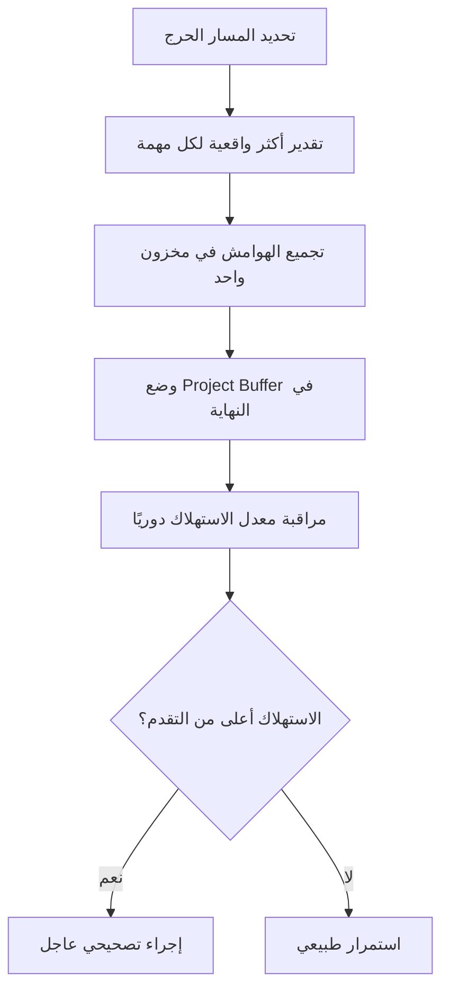

# المخزون المؤقّت (Buffer)
> [!info] تعريف مختصر
> المخزون المؤقّت (Buffer) هو هامش زمني أو موارد إضافية يُدرَج عمدًا في خطة المشروع لامتصاص التأخيرات والمخاطر غير المتوقعة، دون التأثير على الموعد النهائي أو الالتزامات الأخرى.

## الشرح العلمي والاحترافي
- يُستخدم مفهوم Buffer بشكل رسمي في منهجية سلسلة الحرجة (Critical Chain Project Management) التي طوّرها إلياهو غولدرات ضمن نظرية القيود (Theory of Constraints).
- بدلًا من إضافة هامش أمان لكل مهمة على حدة (وهو ما يؤدي غالبًا إلى تضخيم التقديرات وظاهرة "متلازمة الطالب" حيث يُؤجَّل العمل حتى اللحظة الأخيرة)، يُجمَّع الهامش الزمني في مخزون واحد يوضع في نهاية المسار الحرج (Critical Path) أو قبل نقاط الدمج.
- هناك أنواع رئيسية: مخزون المشروع (Project Buffer) في نهاية المسار الحرج، ومخزون التغذية (Feeding Buffer) قبل نقاط دمج المسارات غير الحرجة مع المسار الحرج، ومخزون الموارد (Resource Buffer) لضمان توفر مورد حرج في الوقت المناسب.
- يرتبط المفهوم أيضًا بـ الاحتياطي الاحترازي (Contingency Reserve) في إدارة المخاطر، لكن Buffer أكثر تحديدًا من حيث الموضع الزمني والغرض الإحصائي.
- مراقبة استهلاك المخزون المؤقّت (عبر مخطط استهلاك المخزون - Buffer Burn Rate) تعطي إشارة مبكرة عن صحة الجدول الزمني قبل أن يتحول التأخير إلى أزمة.

## أين ومتى يُستخدم
- في منهجية Critical Chain لحماية الموعد النهائي للمشروع دون تضخيم كل مهمة فرديًا.
- في التقديرات الثلاثية (متفائل، محتمل، متشائم) ضمن تحليل PERT، حيث يُشتق المخزون من التباين الإحصائي بين هذه التقديرات (انظر [[Estimation Variance]]).
- في إدارة سلسلة التوريد والمشاريع الإنشائية، حيث تُستخدم مخازين مادية أو زمنية لتفادي توقف الإنتاج بسبب تأخر مورد.
- في Kanban وأنظمة السحب (Pull System)، حيث تُستخدم مخازين صغيرة بين المراحل لامتصاص التذبذب في سرعة الإنتاج.

## مثال وسيناريو تطبيقي
> [!example] مشروع بناء منصة تجارة إلكترونية له مسار حرج يمر عبر: تصميم قاعدة البيانات (5 أيام) → تطوير API الدفع (10 أيام) → اختبار التكامل (5 أيام). بدلًا من إضافة يومين احتياط لكل مهمة (فيصبح المجموع 26 يومًا)، يحسب مدير المشروع مخزونًا واحدًا مجمّعًا في النهاية بمقدار 5 أيام بناءً على نصف مجموع الهوامش الفردية، فيصبح الجدول 20+5=25 يومًا فقط. عندما يتأخر تطوير API الدفع يومين بسبب تعقيد بوابة الدفع، يُستهلك جزء من المخزون المؤقّت بدلًا من تحريك الموعد النهائي، ويراقب المدير مخطط استهلاك المخزون أسبوعيًا للتأكد أن الاستهلاك لا يتجاوز نسبة تقدم المشروع.

## خطوات أو مخطّط
1. حدّد المسار الحرج (Critical Path) للمشروع.
2. اطرح هوامش الأمان الفردية من كل مهمة على المسار الحرج (تقدير أكثر واقعية/تفاؤلًا).
3. اجمع هذه الهوامش المطروحة وضع نصفها تقريبًا كـ Project Buffer في نهاية المسار الحرج.
4. أضف Feeding Buffer عند كل نقطة يلتقي فيها مسار فرعي غير حرج بالمسار الحرج.
5. راقب استهلاك المخزون دوريًا مقابل نسبة إنجاز المشروع.
6. إذا تجاوز الاستهلاك نسبة الإنجاز بشكل ملحوظ (منطقة حمراء)، اتخذ إجراءً تصحيحيًا فوريًا.

## ⚠️ مفاهيم خاطئة شائعة
> [!warning]
> - الخلط بين Buffer و[[Contingency Reserve]]: الأول هامش زمني موضعي على الجدول، والثاني احتياطي مالي أو موارد لمخاطر محددة في سجل المخاطر.
> - الاعتقاد بأن المخزون المؤقّت "وقت ضائع" يمكن حذفه لتسريع المشروع، بينما هو أداة حماية إحصائية مبنية على بيانات حقيقية.
> - افتراض أن استهلاك 50% من المخزون يعني مشكلة كبيرة بالضرورة، دون مقارنته بنسبة تقدم المشروع الفعلي.

## ❌ ممارسات خاطئة في المشاريع
> [!failure]
> - إضافة هامش أمان مخفي داخل كل تقدير مهمة فردية (تضخيم غير معلن) بدلًا من مخزون مركزي شفاف، مما يؤدي لظاهرة "متلازمة الطالب" وتأجيل العمل.
> - عدم مراقبة استهلاك المخزون المؤقّت حتى نفاده بالكامل قبل نهاية المشروع، فيتحول التأخير إلى أزمة مفاجئة.
> - استخدام نفس نسبة المخزون (مثلًا 20%) لكل المشاريع دون تحليل فعلي للمخاطر والتباين في كل مشروع.

## 🔗 مصطلحات ومفاهيم ذات صلة
[[Contingency Reserve]] | [[Critical Path]] | [[Estimation Variance]] | [[Theory of Constraints]] | [[Reserve Capacity]] | [[Cost of Delay]] | [[Risk Register]] | [[19 - Risk Management]]
