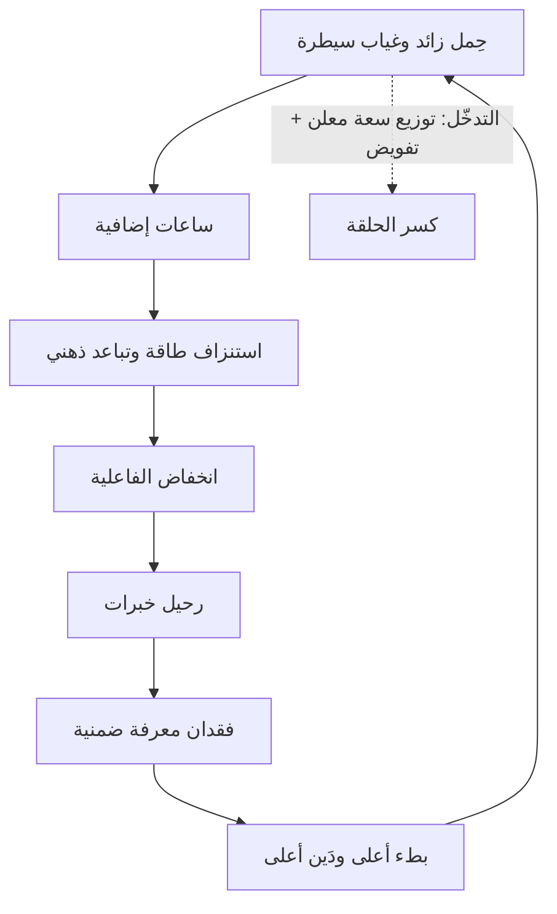

# الاحتراق الوظيفي (Burnout)

> [!info] تعريف مختصر
> الاحتراق الوظيفي متلازمة ناتجة عن **إجهاد مزمن في مكان العمل لم يُدَر بنجاح**، صنّفتها منظّمة الصحة العالمية في `ICD-11` **ظاهرة مهنية** لا حالة طبّية. وأبعادها ثلاثة: **استنزاف الطاقة**، و**تباعد ذهني وسلبية تجاه العمل**، و**انخفاض الفاعلية المهنية**. والنقطة الحاسمة إداريًّا: **مسبّباته تنظيمية لا فردية** — ولذلك لا يُعالَج ببرامج تقوية الفرد.

## الشرح العلمي والاحترافي
- **الأصل البحثي**: يقوم التعريف على عمل **كريستينا ماسلاش** ومقياسها `Maslach Burnout Inventory`، الذي فكّك الظاهرة إلى ثلاثة أبعاد قابلة للقياس بدل وصفها العامّي بـ«الإرهاق».
- **المسبّبات التنظيمية الستّة** عند ماسلاش — وكلّها خصائص **نظام** لا سمات أشخاص:

| المسبّب | كيف يظهر في فريق برمجيات | التدخّل المطابق |
|---|---|---|
| **الحِمل الزائد** | سعة مملوءة ميزات + عيوب غير مخطّطة | [[08 - توزيع التدفّق ومراحل حياة المنتج\|توزيع سعة معلن]] + [[Reserve Capacity\|احتياطي]] |
| **غياب السيطرة** | تُملى المواعيد والحلول التقنية | تفويض التصميم والتقدير للفريق |
| **نقص التقدير** | لا أحد يرى العمل غير المرئي | إظهار الدَّين والمخاطر في التقارير |
| **انهيار المجتمع** | صوامع وتبادل اتّهامات | [[Cross-functional Team\|فرق متعدّدة الوظائف]] بهدف مشترك |
| **غياب الإنصاف** | من يُنجز يُحمَّل أكثر | موازنة الحِمل بـ[[WIP Limit\|حدود العمل قيد التنفيذ]] |
| **تعارض القيم** | «نشحن ونحن نعلم أنّه معيب» | معايير جودة في [[Definition of Done]] لا تُخترَق |

- **الفرق بينه وبين التعب**: التعب يزول بالراحة؛ والاحتراق **لا يزول بإجازة** لأنّ سببه بنيوي ويعود بعودة الشخص إلى النظام نفسه. ولهذا يُعدّ منح إجازة استجابةً كافيةً خطأً تشخيصيًّا شائعًا.
- **علاقته بـ[[04 - دوّامة الموت والدَّين التقني|دوّامة الموت]]**: الاحتراق **مُخرَج** من الدوّامة و**مُدخَل** إليها في آن — إذ يؤدّي إلى رحيل الخبرات، والرحيل يرفع [[Technical Debt|الدَّين التقني]] بفقدان المعرفة الضمنية، فيزداد البطء ويزداد الضغط.
- **مؤشّرات مبكّرة قابلة للرصد** قبل ظهور الاستقالات: ارتفاع الساعات خارج الدوام، وانخفاض المشاركة في [[10 - Sprint Retrospective|الاستعادة]]، وتحوّل الحوار إلى تهكّم، وامتناع الفريق عن الاعتراض على تقديرات يعرف أنّها غير واقعية.
- **ملاحظة مهمّة على المقاييس**: [[06 - مقاييس التدفّق الستة|مقاييس التدفّق الستة]] **لا تقيس الاستدامة**. ويمكن بلوغها جميعًا بالعمل ستّين ساعة أسبوعيًّا. ولذلك يجب أن تُقرَن بمؤشّرات [[Sustainable Pace|الإيقاع المستدام]] — وإلّا صارت أداة ضغط لا أداة حماية.

## أين ومتى يُستخدم
- عند **تشخيص تسرّب متكرّر** في فريق دون تفسير واضح.
- في **تصميم توزيع السعة**: الحِمل الزائد أوّل المسبّبات الستّة وأسهلها علاجًا رقميًّا.
- عند **تقييم أثر فترة ضغط** للوصول إلى السوق، وتحديد **فترة السداد** الواجبة بعدها.
- في **بناء لوحة قياس**: إضافة مؤشّرات استدامة إلى جانب مقاييس التدفّق.
- عند **مراجعة سياسات المكافأة**: ثقافة تكافئ «الإنقاذ» تُنتج أزمات لتُنتج أبطالًا.

## مثال وسيناريو تطبيقي
> [!example] فريق بلغ كلّ مقاييس التدفّق نطاقاتها الصحّية — ثمّ استقال اثنان من خمسة خلال ربع.
> **الأرقام:** زمن تدفّق ممتاز، وقابلية تنبّؤ 90%، وتوزيع متوازن. ومع ذلك: ساعات إضافية متكرّرة، ونشر ليلي في نهايات الأسابيع، وتقدير يُقبَل رغم اعتراض داخلي.
> **التشخيص:** **الأرقام تُحقَّق والفريق يُستهلَك لتحقيقها.** ومن المسبّبات الستّة كان الحاضر بوضوح: الحِمل الزائد، وغياب السيطرة (المواعيد تُملى)، وتعارض القيم (شحن مع علم بالعيوب).
> **الاستجابة الخاطئة التي جُرِّبت أوّلًا:** اشتراك في تطبيق تأمّل ودورة إدارة ضغوط — فقُرِئت استخفافًا وزادت السلبية.
> **الاستجابة الصحيحة:** إضافة سؤال ثنائي إلى كلّ استعادة («هل كان الإيقاع مستدامًا؟»)، ورصد الساعات خارج الدوام مؤشّرًا معروضًا، وقاعدة مكتوبة بأنّ المقايضة تحت الضغط تكون في **عدد البنود** لا في **معايير الإنجاز**.

## خطوات أو مخطّط
1. **افحص المسبّبات الستّة** واحدًا واحدًا بدل السؤال العامّ «هل الفريق مرهق؟».
2. **ابدأ بالحِمل الزائد** لأنّه الأسهل قياسًا وعلاجًا: توزيع سعة معلن + احتياطي.
3. **أضِف مؤشّرات استدامة** إلى لوحة القياس: ساعات خارج الدوام · حالات الطوارئ · سؤال الاستعادة.
4. **راجع سياسة المكافأة**: هل يُكافأ من يمنع الأزمة أم من يُنقذ منها؟
5. **اربط كلّ فترة ضغط بفترة سداد** مكتوبة قبل الضغط لا بعده.
6. **لا تستبدل معالجة السبب ببرامج العافية** — يمكن أن تُضاف، ولا يصحّ أن تحلّ محلّ.

## ⚠️ مفاهيم خاطئة شائعة
> [!warning]
> - **اعتباره ضعفًا فرديًّا**: التصنيف الرسمي يجعله ظاهرة **مهنية** بمسبّبات تنظيمية.
> - **الخلط بينه وبين التعب**: التعب يزول بالراحة؛ والاحتراق يعود بعودة الشخص إلى النظام نفسه.
> - **الظنّ بأنّ العلاج فردي**: برامج العافية تعالج قدرة التحمّل لا الحِمل ولا السيطرة ولا الإنصاف.
> - **افتراض أنّ الأرقام الجيّدة تنفي وجوده**: مقاييس التدفّق لا تقيس الاستدامة إطلاقًا.
> - **انتظار الاستقالات مؤشّرًا**: الاستقالة مؤشّر **متأخّر**؛ والمؤشّرات المبكّرة سلوكية.

## ❌ ممارسات خاطئة في المشاريع
> [!failure]
> - **الضغط بوصفه أسلوب إدارة لا استثناءً**: يحوّل الحالة الاستثنائية إلى نمط تشغيل دائم فيتحقّق المسبّب الأوّل. الحلّ: قاعدة الدَّين المقابل — كلّ ضغط يُنشئ التزامًا بفترة سداد.
> - **مكافأة الإنقاذ الليلي**: يُعلّم النظام أن يُنتج أزمات. الحلّ: احتفِ بما **لم يحدث** (ربع بلا حادث إنتاج) لا بمن أنقذ.
> - **مطالبة الفريق بتقدير ثمّ إلزامه بموعد أقصر**: يُنتج تعارض قيم وغياب سيطرة معًا. الحلّ: المقايضة في النطاق لا في التقدير.
> - **إهمال العمل غير المرئي في التقارير**: يُنتج نقص تقدير مزمنًا. الحلّ: إظهار الدَّين والمخاطر في توزيع السعة المعروض.
> - **استخدام مقاييس التدفّق للضغط**: تنقلب الأداة من حماية إلى استنزاف. الحلّ: تُقرأ على مستوى النظام، ومقرونة بمؤشّرات استدامة.

## 🔗 مصطلحات ومفاهيم ذات صلة
[[Sustainable Pace]] | [[Psychological Safety]] | [[Technical Debt]] | [[Black Box Syndrome]] | [[Micromanagement]] | [[Empowerment]] | [[Toil]] | [[Reserve Capacity]] | [[04 - دوّامة الموت والدَّين التقني]]
