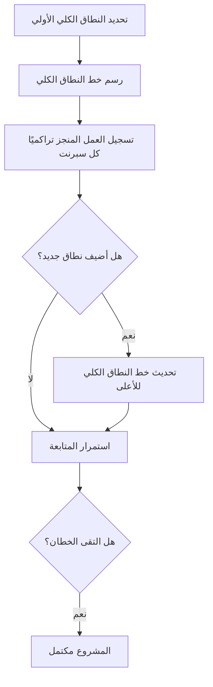

# مخطط النمو (Burnup Chart)

> [!info] تعريف مختصر
> مخطط النمو هو رسم بياني يُظهر خطين تصاعديين عبر الزمن: خط "العمل المُنجز" وخط "إجمالي نطاق العمل"، بحيث يمكن رؤية تقدّم الفريق ومعرفة أي تغيّر في حجم النطاق نفسه بشكل منفصل وواضح.

## الشرح العلمي والاحترافي
- يستخدم مخطط النمو محورين: المحور الأفقي للزمن (أيام أو سبرنتات)، والمحور الرأسي لكمية العمل (بنقاط القصة أو عدد المهام).
- الخط الأول (خط النطاق الكلي) يمثل إجمالي حجم العمل المخطط له، وهو خط قد يرتفع بمرور الوقت إذا أُضيف عمل جديد للمشروع.
- الخط الثاني (خط الإنجاز) يمثل مجموع العمل المكتمل تراكميًا، ويرتفع تدريجيًا كلما أنجز الفريق مزيدًا من العمل.
- عندما يلتقي الخطان، يكون المشروع قد اكتمل بالكامل وفق النطاق المتفق عليه في تلك اللحظة.
- الميزة الأساسية لمخطط النمو مقارنة بمخطط الاحتراق ([[17 - Burndown Chart]]) هي أنه يفصل بوضوح بين "بطء التقدم" و"زيادة النطاق" (Scope Creep)؛ فمخطط الاحتراق وحده قد يُظهر أن العمل المتبقي لم ينخفض، دون أن يوضّح إن كان السبب بطء الفريق أم إضافة عمل جديد.
- يُستخدم أيضًا لحساب معدل الإنتاجية (Velocity) بناءً على ميل خط الإنجاز، مما يساعد في التنبؤ بتاريخ الانتهاء المتوقع.

## أين ومتى يُستخدم
- يُستخدم بكثرة في إدارة المشاريع الرشيقة ([[01 - Agile]])، خصوصًا في سكرم ([[02 - Scrum]]) لمتابعة تقدّم الإصدار (Release) أو المشروع ككل، وليس فقط سبرنت واحد.
- مفيد جدًا في المشاريع التي يتوقع فيها تغيّر النطاق بشكل متكرر بسبب اكتشافات جديدة أو طلبات عميل إضافية.
- يُعرض عادة في اجتماعات مراجعة الإصدار (Release Review) أو التقارير الشهرية لأصحاب المصلحة لتوضيح مدى الاقتراب من الإطلاق.
- يُستخدم من قبل مدير المنتج ([[05 - Product Owner]]) لتبرير أي تمديد في الجدول الزمني ناتج عن نمو حقيقي في النطاق وليس تأخرًا في الأداء.

## مثال وسيناريو تطبيقي
> [!example] في مشروع تطوير تطبيق "توصيل سريع" لتوصيل الطلبات، بدأ الفريق بنطاق إجمالي قدره 200 نقطة قصة. بعد 3 أشهر، أنجز الفريق 140 نقطة (خط الإنجاز عند 140)، لكن خط النطاق الكلي ارتفع إلى 240 نقطة بسبب طلب العميل ميزة "تتبع الطلب المباشر على الخريطة" في منتصف المشروع. عند عرض مخطط النمو لصاحب المصلحة، اتضح بجلاء أن الفريق ينجز بمعدل ثابت (حوالي 15 نقطة أسبوعيًا)، وأن سبب اقتراب تاريخ الإطلاق هو زيادة النطاق نفسها، وليس تراجع أداء الفريق. بناءً على ذلك، وافق العميل إما على تأجيل الإطلاق أسبوعين إضافيين أو تأجيل ميزة التتبع المباشر لإصدار لاحق ([[Out of Scope]]).

## خطوات أو مخطّط
1. تحديد إجمالي حجم العمل المخطط له في بداية المشروع أو الإصدار.
2. رسم خط النطاق الكلي على المحور الرأسي.
3. تسجيل العمل المكتمل تراكميًا في نهاية كل سبرنت أو فترة زمنية.
4. تحديث خط النطاق الكلي كلما أُضيف عمل جديد معتمد.
5. مقارنة ميل خط الإنجاز بخط النطاق للتنبؤ بتاريخ الاكتمال.
6. مناقشة أي فجوة متزايدة بين الخطين مع صاحب المصلحة لاتخاذ قرار (تمديد الجدول أو تقليص النطاق).

## ⚠️ مفاهيم خاطئة شائعة
> [!warning]
> - الخلط بين مخطط النمو ومخطط الاحتراق ([[17 - Burndown Chart]])؛ الأول يعرض خطين (نطاق وإنجاز) ويوضّح تغيّر النطاق، بينما الثاني يعرض خطًا واحدًا (العمل المتبقي فقط).
> - الاعتقاد أن ارتفاع خط النطاق الكلي دائمًا مؤشر سلبي؛ في الواقع قد يكون نموًا طبيعيًا ومقبولًا إذا كان معتمدًا رسميًا ويضيف قيمة حقيقية.
> - الظن بأن ميل خط الإنجاز ثابت دائمًا؛ في الحقيقة يتأثر بالإجازات، تغيّر حجم الفريق، أو تعقيد المهام، ويجب مراجعته دوريًا.

## ❌ ممارسات خاطئة في المشاريع
> [!failure]
> - تحديث خط النطاق دون توثيق سبب الزيادة أو الحصول على موافقة، فيصعب لاحقًا تفسير سبب تغيّر الجدول الزمني. **الحل:** ربط كل تحديث للنطاق بطلب تغيير موثق ([[Change Request]]).
> - عرض مخطط النمو دون شرح واضح لصاحب المصلحة، فيُفسَّر ارتفاع خط النطاق كفشل من الفريق. **الحل:** مرافقة المخطط دائمًا بشرح مختصر لأسباب أي تغيّر في النطاق.
> - إهمال تحديث المخطط بانتظام، فيفقد قيمته كأداة تنبؤية دقيقة. **الحل:** تحديثه في نهاية كل سبرنت كجزء ثابت من طقوس المراجعة.

## 🔗 مصطلحات ومفاهيم ذات صلة
[[17 - Burndown Chart]] | [[Scope Creep]] | [[Out of Scope]] | [[Baseline]] | [[Cost of Delay]] | [[18 - Velocity]] | [[Change Request]] | [[Increment]]
