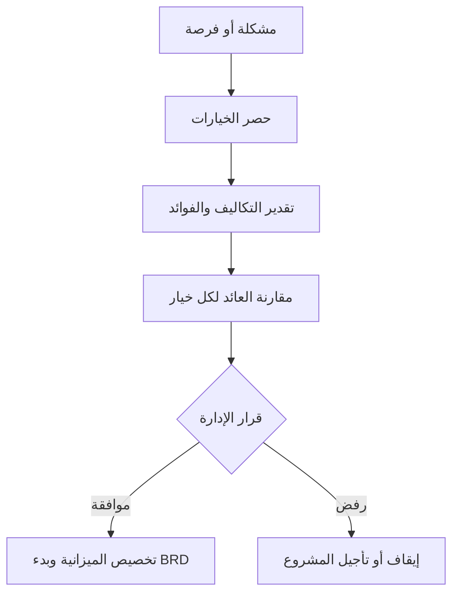

# مبرّر العمل (Business Case)

> [!info] تعريف مختصر
> مبرّر العمل (Business Case) هو وثيقة تشرح لماذا يستحق مشروع معيّن الاستثمار فيه، عبر مقارنة تكاليفه بفوائده المتوقعة (مالية وغير مالية)، لإقناع الإدارة بالموافقة عليه قبل تخصيص الموارد.

## الشرح العلمي والاحترافي
- مبرّر العمل يجيب على السؤال الأهم قبل أي مشروع: "هل يستحق هذا الاستثمار وقتنا ومالنا مقارنة بالبدائل الأخرى؟" وهو أول وثيقة رسمية تُكتب غالباً قبل حتى [[BRD]] التفصيلية.
- يتضمن عادة: وصف المشكلة أو الفرصة، الخيارات المتاحة (بما فيها خيار "عدم الفعل" Do Nothing)، التكاليف المتوقعة (بما يشمل [[CapEx vs OpEx]])، الفوائد المتوقعة (زيادة إيرادات، تقليل تكاليف، تحسين تجربة عملاء)، والمخاطر الرئيسية.
- يُستخدم فيه غالباً مؤشرات مالية لتقييم الجدوى، مثل العائد على الاستثمار (ROI)، فترة استرداد التكلفة (Payback Period)، أو التكلفة الإجمالية للملكية ([[TCO]])، لمقارنة الخيارات المطروحة بشكل موضوعي.
- يختلف عن BRD في أن مبرّر العمل يركّز على "هل نفعل هذا المشروع أصلاً؟" أما BRD فتفترض أن القرار اتُّخذ بالفعل وتركّز على "ماذا نحتاج بالتحديد؟".
- يُستخدم كأساس لاتخاذ قرار المضي أو التوقف ([[Go or No-Go Decision]]) عند بوابات المشروع الرئيسية، ويُراجَع أحياناً في منتصف المشروع للتأكد أن الفوائد المتوقعة ما زالت واقعية.

## أين ومتى يُستخدم
- يُستخدم في المرحلة الأولى من دورة حياة أي مشروع، قبل تخصيص الميزانية أو الفريق، بغض النظر عن المنهجية المتبعة (شلال أو أجايل).
- يُلجأ إليه بشكل خاص عند طلب استثمار كبير (مبنى، نظام جديد، منتج جديد)، أو عندما تتنافس عدة مبادرات على موارد محدودة وتحتاج الإدارة لمعيار مقارنة.
- يُراجَع عند بوابات القرار الكبرى في المشروع (بعد كل مرحلة رئيسية) للتأكد من استمرار جدواه، خصوصاً في المشاريع الطويلة.
- في أجايل، يظل مبرّر العمل حياً يُحدَّث دورياً بدلاً من كونه وثيقة تُكتب مرة واحدة وتُنسى، لأن الأولويات والفرص قد تتغيّر بسرعة.

## مثال وسيناريو تطبيقي
> [!example] سيناريو ملموس في مشروع برمجي حقيقي
> شركة تجارة إلكترونية تعاني من ارتفاع معدل التخلي عن سلة الشراء (Cart Abandonment) إلى 68%. يقترح فريق المنتج مشروعاً لبناء نظام دفع أسرع بخطوة واحدة (One-Click Checkout).
> يكتب مدير المنتج مبرر عمل يقارن ثلاثة خيارات: (1) عدم الفعل، وتكلفته الضمنية خسارة إيرادات مقدّرة بـ 2 مليون ريال سنوياً، (2) شراء حل جاهز من مزوّد خارجي بتكلفة 300 ألف ريال سنوياً كـ [[OpEx]]، (3) بناء الحل داخلياً بتكلفة 500 ألف ريال مرة واحدة كـ [[CapEx]] بالإضافة لصيانة سنوية 50 ألف ريال.
> بعد حساب فترة الاسترداد، يتضح أن الخيار الثالث يسترد تكلفته خلال 4 أشهر فقط بسبب زيادة التحويل المتوقعة بنسبة 15%. توافق الإدارة على الخيار الثالث وتخصص الميزانية، لينتقل المشروع بعدها إلى مرحلة كتابة [[BRD]] التفصيلية.

## خطوات أو مخطّط
1. تحديد المشكلة أو الفرصة بوضوح ودعمها بالبيانات.
2. حصر الخيارات الممكنة، بما فيها خيار عدم الفعل.
3. تقدير التكاليف لكل خيار، مع التمييز بين [[CapEx vs OpEx]].
4. تقدير الفوائد المتوقعة (مالية وغير مالية) ومقارنتها بالتكاليف.
5. عرض التوصية على الإدارة لاتخاذ قرار [[Go or No-Go Decision]].
6. مراجعة مبرر العمل دورياً أثناء المشروع للتأكد من استمرار جدواه.

## ⚠️ مفاهيم خاطئة شائعة
> [!warning]
> - الاعتقاد أن مبرّر العمل مجرد إجراء شكلي لإرضاء الإدارة؛ في الواقع هو أداة حقيقية لتجنّب استثمار الموارد في مشاريع غير مجدية.
> - الظن أن مبرّر العمل يُكتب مرة واحدة فقط في البداية ولا يُراجَع لاحقاً؛ الصحيح أنه يجب مراجعته عند بوابات القرار الكبرى للتأكد أن الافتراضات الأصلية ما زالت صحيحة.
> - الخلط بينه وبين [[BRD]]؛ فمبرّر العمل يجيب "هل نفعل هذا؟" بينما BRD تفترض الموافقة وتجيب "ماذا نحتاج بالتحديد؟".

## ❌ ممارسات خاطئة في المشاريع
> [!failure]
> - المبالغة في تقدير الفوائد وتقليل التكاليف لضمان الموافقة على المشروع، مما يؤدي لخيبة أمل لاحقة عند الإدارة. التجنب: استخدام تقديرات محافظة ومراجعتها من طرف مستقل قبل العرض.
> - عدم تضمين خيار "عدم الفعل" ضمن المقارنة، فتبدو كل الخيارات المطروحة جيدة دون معيار حقيقي للمقارنة. التجنب: تضمين تكلفة التقاعس دائماً كخيار أساسي في التحليل.
> - نسيان مبرر العمل بعد الموافقة الأولية وعدم مراجعته رغم تغيّر ظروف السوق. التجنب: ربط مراجعته بـ [[Milestone]] رئيسية في خطة المشروع.

## 🔗 مصطلحات ومفاهيم ذات صلة
[[BRD]] | [[Quad Chart]] | [[PRINCE2]] | [[CapEx vs OpEx]] | [[TCO]] | [[Go or No-Go Decision]] | [[Cost of Delay]] | [[Stakeholder Map]] | [[Risk Register]] | [[SMART Goals]]
