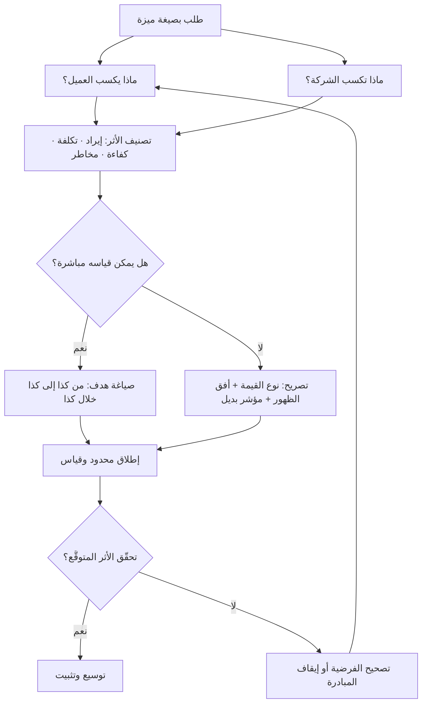

# الأثر على الأعمال (Business Impact)

> [!info] تعريف مختصر
> الأثر على الأعمال (Business Impact) هو المعيار الذي يفصل **قرار المنتج** عن **الرغبة**. كل مبادرة — ميزة، مشروع، إعادة بناء — يجب أن تجيب عن سؤالين بجواب قابل للقياس: **ماذا يكسب العميل؟** و**ماذا تكسب الشركة؟**. غياب أحد الجوابين علامة خطر: ميزة يكسب منها العميل ولا تكسب منها الشركة غير مستدامة، وميزة تكسب منها الشركة ولا يكسب منها العميل لن تُستخدم أصلًا. الأثر ليس النشاط ولا الناتج؛ هو **التغيير المُقاس في نتيجة العمل** بعد أن يُستخدم ما بُني.

## الشرح العلمي والاحترافي

- **السؤالان اللذان لا تكتمل مبادرة دونهما.** كل طلب يصل إلى الفريق يجب أن يمرّ بمصفاة ثنائية:
  - **ماذا يكسب العميل؟** أي مشكلة تُحلّ، وأي جهد أو وقت أو تكلفة يُوفَّر عليه، وأي بديل يستخدمه اليوم وسيتخلّى عنه. بلا مكسب واضح للعميل، لن يحدث تبنٍّ ([[Adoption]])، ومن دون تبنٍّ لا يوجد أثر مهما بلغت جودة البناء.
  - **ماذا تكسب الشركة؟** كيف يترجم مكسب العميل إلى إيراد أو تكلفة أقل أو كفاءة أعلى أو خطر أقل. هذه هي حلقة الوصل التي تجعل المنتج نشاطًا اقتصاديًّا لا مشروعًا خيريًّا.

- **المحاور الأربعة للأثر.** أي أثر أعمال حقيقي يقع في واحد من أربعة محاور (أو أكثر)، ولكل منها معادلة تقريبية تساعد على التقدير — لا على ادّعاء الدقة:
  1. **زيادة الإيراد (Revenue Growth)**: عبر رفع عدد العملاء، أو رفع متوسط الإيراد لكل عميل، أو رفع معدلات التحويل، أو تقليل التسرّب (Churn). المعادلة التقريبية: `الأثر ≈ عدد المستخدمين المتأثرين × التحسّن في معدل التحويل × القيمة المتوسطة للصفقة`.
  2. **خفض التكلفة (Cost Reduction)**: تقليل ساعات عمل يدوية، تقليل تذاكر الدعم، تقليل تكاليف بنية تحتية، تقليل الاعتماد على أدوات مدفوعة. المعادلة التقريبية: `الأثر ≈ عدد الحالات شهريًّا × الوقت الموفَّر لكل حالة × التكلفة بالساعة`.
  3. **رفع الكفاءة (Efficiency / Productivity)**: إنجاز الحجم نفسه بموارد أقل أو حجم أكبر بالموارد نفسها، وتقليل زمن الدورة (Cycle Time). المعادلة التقريبية: `الأثر ≈ (الزمن قبل − الزمن بعد) ÷ الزمن قبل × حجم العمليات`.
  4. **تقليل المخاطر (Risk Reduction)**: تفادي غرامات امتثال، تقليل احتمال انقطاع الخدمة، حماية البيانات، تقليل الاعتماد على شخص أو نظام واحد. المعادلة التقريبية: `الأثر ≈ احتمال وقوع الحدث × الخسارة المتوقّعة عند وقوعه`، والقيمة هي الفارق بين هذا الحاصل قبل المبادرة وبعدها.

  هذه المعادلات أدوات **تقدير للترتيب النسبي**، لا وعود تعاقدية. قيمتها في كشف الفروق الكبيرة بين المبادرات (مبادرة أثرها أكبر بعشرة أضعاف من أخرى)، لا في الدقة العشرية.

- **إعادة صياغة الطلب من لغة الميزة إلى لغة الأثر.** هذه أهم مهارة عملية في التعامل مع الجهات المعنية. الطلب يصل عادةً بصيغة حلّ ("أضف زرًّا للتصدير"، "نريد لوحة تحكّم")، وتحويله يتمّ بأسئلة متتابعة: ما الذي سيتغيّر لو وُجد هذا الزرّ؟ من الذي سيتغيّر سلوكه؟ كم مرة يحدث هذا اليوم؟ كم يكلّفنا الوضع الحالي؟ فتنقلب الصياغة من "أضف زرًّا" إلى **"ارفع نسبة إتمام التسجيل من كذا إلى كذا خلال المدة الفلانية"**. الفارق أن الصياغة الثانية:
  - تُبقي باب الحلول مفتوحًا (قد يكون الحل حذف خطوة لا إضافة زرّ)،
  - وتجعل النجاح قابلًا للتحقّق بعد الإطلاق،
  - وتحوّل النقاش مع الجهة الطالبة من تفاوض على الأولوية إلى اتفاق على النتيجة.

- **التمييز الحاسم: الأثر مقابل النشاط مقابل الناتج.** ثلاثة مستويات تُخلط باستمرار:
  - **النشاط (Activity)**: ما نفعله — عدد الإطلاقات، عدد التذاكر المغلقة، عدد الاجتماعات، عدد السباقات المكتملة. سهل القياس، ولا يدلّ بذاته على شيء.
  - **الناتج (Output)**: ما ننتجه — الميزة، التقرير، الوحدة المسلَّمة. راجع [[Outcome vs Output]].
  - **الأثر (Impact)**: ما يتغيّر في نتيجة العمل بسبب أن أحدًا استخدم الناتج فعلًا.
  والفرق بين **المُخرَج (Outcome)** و**الأثر (Impact)** فرق درجة لا نوع: المُخرَج تغيّر في سلوك المستخدم (ارتفعت نسبة إتمام التسجيل)، والأثر على الأعمال ترجمة ذلك السلوك إلى نتيجة اقتصادية (ارتفع عدد الحسابات المدفوعة، فارتفع الإيراد المتكرّر). التتابع المنطقي: نشاط ← ناتج ← مُخرَج ← أثر. وكل حلقة في هذه السلسلة يمكن أن تنكسر: يمكن أن تُنجز نشاطًا بلا ناتج، وناتجًا بلا مُخرَج، ومُخرَجًا بلا أثر تجاري.

- **التحذير الأمين: ليس كل ما يستحق البناء قابلًا للقياس المباشر فورًا.** هناك فئات عمل حقيقية القيمة يصعب ربطها برقم قريب:
  - **الأساس التقني (Platform / Foundation)**: بنية تُمكّن عشر مبادرات لاحقة؛ أثرها **مُمكِّن** لا مباشر.
  - **الامتثال والتنظيم (Compliance)**: قيمته تفادي خسارة أو منع من العمل، لا كسب ظاهر.
  - **الدين التقني ([[Technical Debt]])**: أثره في **سرعة التسليم المستقبلية** وانخفاض معدّل الأعطال، ويظهر تراكميًّا لا في أسبوع.
  - **الثقة والعلامة والتجربة طويلة الأمد**: أثرها بطيء وغير مباشر.

  والحلّ ليس **اختلاق رقم** يُضفي مظهر الموضوعية على تخمين، بل **التصريح بنوع القيمة وأفق ظهورها**: هل هي قيمة مباشرة أم مُمكِّنة أم وقائية؟ وهل تظهر خلال أسابيع أم أرباع؟ وما المؤشر البديل (Proxy) الذي سنراقبه في الأثناء — مثل زمن التسليم، أو معدّل الحوادث، أو عدد المبادرات التي أصبحت ممكنة؟ التصريح الصادق بعدم قابلية القياس الفوري أقوى مهنيًّا من رقم ملفّق، لأن الرقم الملفّق يُبنى عليه قرار ثم يفقد الفريق مصداقيته حين لا يتحقّق.

- **الأثر ومنظومة المؤشرات.** يُترجم الأثر عمليًّا إلى [[KPI]] تُتابَع دوريًّا، ويُصاغ هدفًا ضمن [[OKR]]، وقد يُربط بمؤشر جامع هو [[North Star Metric]]. وعند المفاضلة بين مبادرات ذات آثار متقاربة، يدخل عامل الزمن عبر [[Cost of Delay]]: ليس المهم حجم الأثر فقط، بل متى يبدأ وكم يكلّف تأجيله.

## أين ومتى يُستخدم

- **عند بناء [[Business Case]]** لأي مبادرة تتطلّب استثمارًا معتبرًا: الأثر هو جوهر الحجّة.
- **عند ترتيب أولويات الـ Backlog**: المفاضلة بين البنود تكون بالأثر المتوقّع وكلفة التأخير، لا بحجم الطلب أو رتبة صاحبه.
- **عند صياغة [[OKR]] والأهداف الربعية**: لضمان أن النتائج الرئيسية تصف أثرًا لا قائمة مهام.
- **عند التفاوض مع الجهات المعنية**: تحويل الطلب من ميزة إلى أثر يفكّ الاشتباك ويوحّد المعيار.
- **بعد كل إطلاق**، لمقارنة الأثر المُقاس بالأثر المتوقّع، وتصحيح نماذج التقدير نفسها بمرور الوقت.
- **عند اقتراح إيقاف مبادرة أو ميزة**: قياس الأثر الفعلي هو الحجّة الوحيدة القادرة على تفكيك ارتباط عاطفي بميزة قائمة.
- **في تقارير الحالة والمراجعات التنفيذية**: التقرير بلغة الأثر يغيّر موقع فريق المنتج من منفّذ إلى شريك في نتائج العمل.

## مثال وسيناريو تطبيقي

> [!example] فريق منتج في شركة خدمات مالية وصله طلب من مدير العمليات: **"نريد لوحة تحكّم جديدة لفريق خدمة العملاء"**. الطلب صيغة حلّ، بلا أثر ولا مقياس.
>
> **المرحلة الأولى — تفكيك الطلب**: سأل الفريق: ما الذي سيتغيّر لو وُجدت اللوحة؟ الجواب: "الموظّفون يفتحون خمسة أنظمة للإجابة عن سؤال واحد". ما تكرار ذلك؟ الجواب من بيانات مركز الاتصال: مئات الحالات أسبوعيًّا. كم من الوقت يضيع؟ قياس ميداني على عيّنة أظهر دقائق معتبرة لكل حالة تُستهلك في التنقّل بين الشاشات.
>
> **المرحلة الثانية — الصياغة بلغة الأثر**: أُعيدت صياغة الطلب إلى: **"خفض متوسط زمن معالجة الحالة (AHT) بنسبة محدّدة خلال ربع واحد، مع تثبيت أو تحسين مؤشر رضا العميل"**. لاحظ أمرين: تحديد المؤشر والمدة، وإضافة **مؤشر حارس (Guardrail)** يمنع تحقيق الهدف على حساب جودة الخدمة — وهو انضباط أساسي، إذ يمكن دائمًا خفض زمن المعالجة بإنهاء المكالمات مبكرًا.
>
> **المرحلة الثالثة — تصنيف الأثر**: وقع الأثر في محور **رفع الكفاءة** أساسًا (وقت موظّفين موفَّر يُترجم إلى قدرة استيعابية أعلى بالطاقم نفسه)، وفي محور **خفض التكلفة** جزئيًّا (تقليل الحاجة إلى توظيف إضافي مع نمو الحجم). قُدّرت القيمة بمعادلة الكفاءة: عدد الحالات × الوقت الموفَّر لكل حالة × التكلفة بالساعة — مع التصريح بأن التقدير **نطاق لا رقم**، وأن الافتراض الأخطر فيه هو أن الوقت الموفَّر سيُستثمر في حالات إضافية لا يتبدّد.
>
> **المرحلة الرابعة — ما لم يُقَس**: تضمّن العمل جزءًا في تجميع البيانات من الأنظمة الخمسة، وهو **أساس تقني** يخدم لاحقًا التطبيق الداخلي وتقارير الجودة. لم يخترع الفريق له رقمًا؛ صرّح في المستند بأنه **قيمة مُمكِّنة** أفقها ربعان، ومؤشرها البديل هو عدد المبادرات اللاحقة التي ستستخدم الطبقة نفسها بدل بناء تكاملات جديدة.
>
> **النتيجة**: تحوّل النقاش من "هل نبني اللوحة؟" إلى "أي جزء من اللوحة يحقّق أكبر خفض في زمن المعالجة؟" — فتبيّن أن دمج شاشتين فقط من الخمس يغطّي معظم الحالات، وأُطلق إصدار أوّلي على فريق واحد لقياس الأثر قبل التعميم.

## خطوات أو مخطّط

1. **استقبل الطلب كما هو**، ثم اسأل: ما الذي سيتغيّر لو نُفّذ؟ ولمن؟
2. **حدّد مكسب العميل ومكسب الشركة** صراحةً؛ إن غاب أحدهما، فالمبادرة تحتاج مراجعة لا جدولة.
3. **صنّف الأثر** في أحد المحاور الأربعة: إيراد، تكلفة، كفاءة، مخاطر.
4. **قدّر الحجم بمعادلة تقريبية** واذكره **نطاقًا** مع الافتراضات التي يقوم عليها.
5. **حدّد المؤشر الذي سيثبت الأثر** ومؤشرًا حارسًا يمنع تحقيقه على حساب شيء آخر.
6. **صُغ الهدف بلغة الأثر**: من كذا إلى كذا خلال كذا.
7. **إن تعذّر القياس المباشر**، صرّح بنوع القيمة (مُمكِّنة / وقائية) وأفق ظهورها ومؤشرها البديل — ولا تخترع رقمًا.
8. **أطلق على نطاق محدود وقِس** قبل التعميم.
9. **قارن الأثر المُقاس بالمتوقَّع**، وصحّح نموذج التقدير للمرات القادمة.

## ⚠️ مفاهيم خاطئة شائعة

> [!warning]
> - **الخلط بين الأثر والنشاط**: عدد الإطلاقات وعدد التذاكر المغلقة وعدد السباقات المكتملة مؤشرات انشغال لا مؤشرات قيمة؛ يمكن أن ترتفع كلها بينما لا تتحرّك نتيجة العمل قيد أنملة.
> - **الخلط بين الأثر والناتج**: تسليم الميزة ليس أثرًا؛ الأثر يبدأ بعد أن يستخدمها أحد ويتغيّر شيء بسببها.
> - **"لا نستطيع قياس هذا، إذن لا قيمة له"**: خطأ معاكس للمبالغة في القياس؛ الأساس التقني والامتثال والدين التقني قيمتها حقيقية وإن كان أفق ظهورها أبعد.
> - **"لا نستطيع قياسه، إذن نضع رقمًا تقديريًّا يبدو مقنعًا"**: هذا أسوأ من الاعتراف بعدم القياس، لأنه يُبنى عليه قرار ثم تنهار الثقة حين ينكشف.
> - **"الأثر مسؤولية الإدارة المالية لا فريق المنتج"**: فصل قرار البناء عن نتيجته يخلق فرقًا تنفّذ بلا معنى ويجعل ميزانيتها أول ما يُقتطع.
> - **"مؤشر واحد يكفي"**: تحسين مؤشر منفردًا يمكن أن يضرّ غيره (خفض زمن المعالجة على حساب الرضا)؛ ولذلك يلزم مؤشر حارس بجانب كل مؤشر هدف.
> - **"الأثر الكبير يعني الأولوية الأعلى دائمًا"**: يدخل الزمن في المعادلة عبر [[Cost of Delay]]؛ أثر متوسط يبدأ فورًا قد يفوق أثرًا كبيرًا يبدأ بعد سنة.

## ❌ ممارسات خاطئة في المشاريع

> [!failure]
> - **قبول الطلبات بصيغة ميزة دون ترجمتها إلى أثر**: يتحوّل الـ Backlog إلى قائمة رغبات، وتُرتَّب الأولويات برتبة الطالب لا بقيمة العمل. الحل: قاعدة إلزامية بأن كل بند يحمل جملة أثر واحدة على الأقل قبل دخوله الترتيب.
> - **اختلاق أرقام أثر لتبرير مبادرة محسومة سلفًا**: يفقد التقدير معناه وتتآكل الثقة في كل تقدير لاحق من الفريق. الحل: عرض التقدير نطاقًا مع افتراضاته المعلنة، والتصريح بمستوى الثقة، ومراجعته بعد الإطلاق علنًا.
> - **قياس النشاط والاحتفال به بوصفه إنجازًا**: تقارير مليئة بعدد الإطلاقات والقصص المكتملة بلا سطر واحد عن تغيّر نتيجة العمل. الحل: بنية تقرير ثابتة: ماذا سلّمنا (Output) — ماذا تغيّر في سلوك المستخدم (Outcome) — ماذا تغيّر في نتيجة العمل (Impact).
> - **إهمال الأعمال غير القابلة للقياس المباشر بالكامل**: يُؤجَّل الأساس التقني والدين التقني إلى ما لا نهاية حتى يشلّ التسليم كله. الحل: حصّة ثابتة معلنة من كل ربع لهذا النوع من العمل، مع مؤشرات بديلة تتابع أثره (زمن التسليم، معدّل الحوادث).
> - **عدم قياس أي شيء بعد الإطلاق**: يفترض الفريق النجاح بلا دليل، وتتراكم ميزات ميتة لا يجرؤ أحد على حذفها. الحل: تحديد المؤشر والحارس **قبل** الإطلاق، وجدولة مراجعة أثر بعد مدة محدّدة.
> - **إسناد كل التغيّر في المؤشر إلى المبادرة وحدها**: تجاهل الموسمية والحملات التسويقية والتغيّرات الخارجية يعطي نتائج مضلّلة تُبنى عليها قرارات خاطئة. الحل: استخدام مجموعة مقارنة أو إطلاق محدود، وتوثيق العوامل الخارجية في نافذة القياس.
> - **إغفال تكلفة الفرصة البديلة**: يُقيَّم الأثر بمعزل عمّا كان يمكن بناؤه بالجهد نفسه، فتُعتمد مبادرات موجبة القيمة لكنها الأضعف بين المتاح. الحل: المقارنة دائمًا مقابل البدائل الحقيقية، بما فيها بديل "لا نفعل شيئًا".

## 🔗 مصطلحات ومفاهيم ذات صلة
[[Outcome vs Output]] | [[KPI]] | [[OKR]] | [[Cost of Delay]] | [[Business Case]] | [[North Star Metric]] | [[Technical Debt]] | [[Value Stream]]
