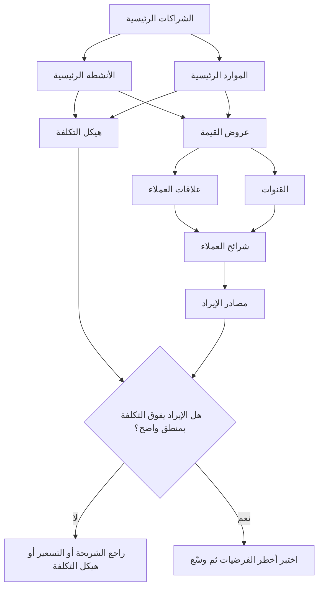

# لوحة نموذج العمل (Business Model Canvas)

> [!info] تعريف مختصر
> لوحة واحدة من **تسعة مربّعات** تصف كيف تخلق منظّمة قيمةً وتوصلها وتلتقط جزءًا منها نقدًا. تجمع اللوحة على صفحة واحدة: من نخدم، وبأي قيمة، وعبر أي قنوات، وبأي نوع علاقة، وكيف نكسب، وما الموارد والأنشطة والشراكات اللازمة، وبأي تكلفة. قيمتها الأساسية ليست في التوثيق بل في **كشف عدم الاتّساق**: حين تُرسم المربّعات التسعة معًا يظهر فورًا التناقض بين شريحة عميل تتطلّب بيعًا ميدانيًّا مكلفًا وهيكل تكلفة يفترض النمو الذاتي. وهي **وصف لفرضيات لا سجلّ حقائق** — كل مربّع فيها فرضية قابلة للاختبار حتى تُثبت.

## الشرح العلمي والاحترافي
- **الأصل**: اللوحة من عمل **ألكسندر أوسترفالدر (Alexander Osterwalder)** ضمن أطروحته للدكتوراه المنجَزة عام ٢٠٠٤ في جامعة لوزان بإشراف الأستاذ **إيف بينيور (Yves Pigneur)**، وكان موضوعها بناء «أنطولوجيا» — أي بنية مفاهيمية مضبوطة — لنموذج العمل. ثم صدرت في صيغتها الشائعة عبر كتاب *Business Model Generation* عام **٢٠١٠**، الذي أُنتج بأسلوب تشاركي أسهم فيه مئات الممارسين. وقد نُشرت اللوحة برخصة تتيح استعمالها وتعديلها بحرّية، وهذا سبب رئيسي في انتشارها.
- **المربّعات التسعة**:
  1. **شرائح العملاء (Customer Segments)**: من نخدم بالتحديد، ومن لا نخدم. الشريحة الحقيقية تُعرَّف بالحاجة والسلوك لا بالفئة الديموغرافية وحدها.
  2. **عروض القيمة (Value Propositions)**: ما المشكلة التي نحلّها والمكسب الذي نصنعه لكل شريحة، وبأي تمايز عن البديل القائم.
  3. **القنوات (Channels)**: كيف يكتشفنا العميل، ويقيّمنا، ويشتري، ويستلم، ويُخدَم بعد الشراء — خمس وظائف مستقلّة يخلط بينها كثيرون.
  4. **علاقات العملاء (Customer Relationships)**: نمط العلاقة — خدمة ذاتية، أو مساعدة شخصية، أو مجتمع، أو إنتاج مشترك — وكيف نكتسب ونحتفظ ونوسّع ([[Retention]] و[[Churn]]).
  5. **مصادر الإيراد (Revenue Streams)**: على ماذا يدفع العميل فعلًا، وبأي آلية تسعير (بيع، اشتراك، استخدام، ترخيص، عمولة، إعلان)، وبأي تكرار.
  6. **الموارد الرئيسية (Key Resources)**: الأصول التي لا يعمل النموذج بدونها — بشرية، وتقنية، وبيانات، ورخص، ورأس مال.
  7. **الأنشطة الرئيسية (Key Activities)**: الأعمال التي يجب أن تُتقَن بامتياز لأن النموذج يقوم عليها.
  8. **الشراكات الرئيسية (Key Partnerships)**: من نعتمد عليه من خارج المنظّمة، ولماذا لا نفعله بأنفسنا ([[Vendor Management]]).
  9. **هيكل التكلفة (Cost Structure)**: أين يذهب المال، وما الثابت وما المتغيّر، وأين وفورات الحجم أو النطاق.
- **منطق القراءة**: يقسم المؤلّفان اللوحة إلى شقّين — **الشقّ الأيمن** في التخطيط الأصلي (العملاء والقيمة والقنوات والعلاقات والإيراد) وهو شقّ **القيمة والسوق**؛ و**الشقّ الأيسر** (الموارد والأنشطة والشراكات والتكلفة) وهو شقّ **الكفاءة والتشغيل**. والاختبار الأول لأي لوحة أن يُنظر: هل يوجد في الشقّ التشغيلي ما يدعم فعلًا وعد الشقّ السوقي؟ وهل يفوق الإيراد التكلفة بمنطق واضح لا بالأمنية؟
- **علاقتها بـ[[Value Proposition Canvas]]**: لوحة عرض القيمة — التي طرحها الفريق نفسه لاحقًا في كتاب *Value Proposition Design* عام ٢٠١٤ — هي **تكبير لمربّعين فقط** من التسعة: «عروض القيمة» و«شرائح العملاء». تفكّك الشريحة إلى مهامّ العميل وآلامه ومكاسبه، وتفكّك العرض إلى منتجات وخدمات ومسكّنات آلام ومولّدات مكاسب، ثم تبحث عن **الملاءمة (Fit)** بينهما. العلاقة إذًا تكاملية بمستويي تكبير: لوحة نموذج العمل تجيب «هل يعمل العمل ككلّ؟»، ولوحة عرض القيمة تجيب «هل الوعد نفسه مقنع لهذه الشريحة؟». والترتيب العملي: ابدأ بلوحة القيمة حين تكون المشكلة والعميل غير محسومين، ثم وسّع إلى لوحة نموذج العمل حين يصير السؤال عن الاستدامة الاقتصادية.
- **متى تُغني عن خطّة عمل ومتى لا**: اللوحة **ليست خطّة عمل**، وهذا أهمّ تمييز عملي فيها.
  — **تُغني عنها** في الحالات التي يكون فيها النموذج نفسه غير مثبت: مشروع ناشئ، أو خط منتج جديد داخل شركة قائمة، أو استكشاف سوق. في هذه الحالات تكون خطّة العمل التقليدية بمئة صفحة وتوقّعات مالية لخمس سنوات **تمرينًا في الخيال المنظَّم**، لأن مدخلاتها كلها فرضيات غير مختبَرة. اللوحة أصدق لأنها تعترف بذلك وتوجّه الجهد إلى الاختبار ([[Lean Startup]] و[[MVP]]).
  — **لا تُغني عنها** حين يكون النموذج معروفًا والسؤال تنفيذيًّا وماليًّا: طلب تمويل بنكي أو استثماري متقدّم، أو تقديم عطاء حكومي، أو موافقة مجلس إدارة على استثمار رأسمالي كبير، أو أي سياق يتطلّب توقّعات نقدية مفصّلة وتحليل حساسية وخطّة تشغيل وهيكل حوكمة ومخاطر موثّقة. اللوحة لا تحتوي جدولًا زمنيًّا، ولا تدفّقًا نقديًّا، ولا [[Risk Register]]، ولا هيكلًا تنظيميًّا، ولا [[Governance]]. الصيغة المهنية الصحيحة: **اللوحة تسبق خطّة العمل وتُغذّيها، ولا تحلّ محلّها عند الالتزام المالي الكبير** — وغالبًا يكون [[Business Case]] هو الجسر بينهما.
- **الاشتقاقات الشائعة**: انتشرت متغيّرات معدّلة، أبرزها **Lean Canvas** التي طرحها **آش موريا (Ash Maurya)** عام ٢٠١٠ للمشاريع الناشئة المبكّرة، فاستبدلت أربعة مربّعات بأخرى أنسب لمرحلة عدم اليقين (المشكلة، والحل، والمقاييس الرئيسية، والميزة غير العادلة) لأن الشراكات والموارد أقل صلة قبل إثبات المشكلة أصلًا.
- **قيود اللوحة**: تنتقد الأدبيات في اللوحة أنها (١) **ساكنة** ولا تُظهر التغيّر مع الزمن ولا تسلسل التحرّكات — وهو ما تعالجه [[Wardley Mapping]]؛ (٢) **داخلية النظرة** ولا مربّع فيها للمنافسة أو التنظيم أو البيئة الكلّية، فتُستكمل بـ[[Porter's Five Forces]] و[[PESTEL]]؛ (٣) **قد تُقرأ كتوصيف** فيتحوّل ملؤها إلى تمرين توثيقي مُرضٍ بلا اختبار؛ (٤) **لا تفرّق بين المؤكّد والمفترض** ما لم يُضف الفريق تمييزًا صريحًا لمستوى اليقين في كل خانة ([[Assumption Mapping]]).

## أين ومتى يُستخدم
- **في تقييم فكرة جديدة قبل التمويل**: لكشف ما إذا كانت الفكرة منتجًا فقط أم عملًا قابلًا للاستدامة.
- **في فحص جدوى مخرجات الاكتشاف**: بعد [[Design Thinking]] و[[Product Discovery]]، لفحص البعد الاقتصادي الذي لا يعالجه البحث مع المستخدم.
- **في إعادة النظر في نموذج الدخل**: حين ينمو الاستخدام والإيراد لا ينمو، فتُقرأ اللوحة بحثًا عن انفصال بين مَن ينال القيمة ومَن يدفع.
- **في مواءمة الإدارات**: أن يرسم التسويق والمنتج والمالية اللوحة نفسها معًا يكشف اختلافات جوهرية في تعريف الشريحة والقيمة كانت مستترة خلف لغة مشتركة.
- **قبل التوسّع إلى سوق جديد**: مع [[Market Entry Modes]] و[[Go-to-Market]]، لأن أكثر ما يتغيّر عند التوسّع هو القنوات والشراكات وهيكل التكلفة لا المنتج.
- **في قرارات إنهاء منتج**: مع [[Sunset and Deprecation]]، لإظهار أن خط المنتج يستهلك موارد وأنشطة رئيسية دون مصدر إيراد يوازيها.

## مثال وسيناريو تطبيقي
> [!example] شركة ناشئة في الرياض تبني منصّة تدريب مهني للمحاسبين. بعد ١٤ شهرًا: ٢٦ ألف مستخدم مسجّل، ومعدّل نشاط شهري ٤٫٢ ألف، وإيراد سنوي ١٫٩ مليون ريال، وحرق نقدي شهري ٦٥٠ ألف ريال. الفريق يعتقد أن المشكلة «ضعف التسويق» ويطلب مضاعفة ميزانية الإعلانات.
> رُسمت لوحة نموذج العمل في جلسة واحدة، فظهر التناقض بلا حاجة إلى تحليل إضافي:
> — **شرائح العملاء**: المكتوب «المحاسبون في السعودية». وعند التفكيك ظهر أن ٨٣٪ من الإيراد يأتي من **شركات تشتري لموظّفيها**، لا من أفراد. أي أن الشريحة الدافعة غير الشريحة المستخدمة.
> — **عروض القيمة**: كانت مصوغة كلها لصالح المتعلّم الفرد («محتوى ممتاز، ومرونة، وشهادة»)، ولا شيء فيها موجّه لمن يدفع فعلًا: مدير الموارد البشرية الذي يريد **إثبات إتمام ساعات تدريب إلزامية وتقريرًا يقدّمه للإدارة**.
> — **القنوات**: كل الإنفاق التسويقي (٤٧٠ ألف ريال في الربع) على إعلانات موجّهة للأفراد، بينما كل صفقات الشركات جاءت من علاقات شخصية للمؤسّس بلا فريق مبيعات ولا عملية.
> — **مصادر الإيراد**: اشتراك فردي شهري ٩٩ ريالًا بمتوسّط بقاء ٢٫٧ شهر — أي قيمة عمر ٢٦٧ ريالًا مقابل كلفة اكتساب ٣١٠ ريالات. النموذج الفردي **خاسر بنيويًّا** لا بحاجة إلى تسويق أكثر.
> — **هيكل التكلفة**: ٥٨٪ إنتاج محتوى، و٣١٪ تسويق أداء، و١١٪ تقنية.
> — **الموارد والأنشطة**: كل الأنشطة الرئيسية موجّهة لإنتاج المحتوى، ولا نشاط لبناء أدوات إدارة التدريب للشركات (التقارير، والمسارات الإلزامية، والتتبّع)، رغم أنها ما يدفع الشركات ثمنه.
> التغييرات المعتمدة: تعريف الشريحة الأساسية بأنها **الشركة** لا الفرد، وإعادة كتابة عرض القيمة حول الامتثال والتقارير، وتحويل ٧٠٪ من ميزانية إعلانات الأداء إلى بناء مبيعات مؤسّسية، وإضافة نشاط رئيسي جديد (أدوات إدارة تدريب) بميزانية تطوير محدّدة، وإبقاء المسار الفردي بوصفه قناة اكتشاف لا مصدر إيراد.
> النتيجة بعد ثلاثة أرباع: عدد الشركات المشتركة ارتفع من ١٤ إلى ٦١، والإيراد السنوي المتكرّر إلى ٥٫٣ مليون ريال، والحرق النقدي الشهري انخفض إلى ٢٩٠ ألفًا. **لم تتغيّر جودة المنتج التعليمي إطلاقًا؛ تغيّر نموذج العمل حوله.**

## خطوات أو مخطّط
1. حدّد وحدة التحليل: الشركة كلها، أم خط منتج، أم سوق جغرافي محدّد؟ لوحة واحدة تخلط بينها لا تُقرأ.
2. ابدأ بمربّع **شرائح العملاء** وفكّكه حتى تصل إلى شريحة يمكن الوصول إليها بقناة محدّدة، وميّز **من يستخدم** عن **من يدفع** عن **من يقرّر**.
3. اكتب عرض قيمة **مستقلًّا لكل شريحة**، وليس عرضًا عامًّا واحدًا.
4. املأ بقيّة المربّعات، واستعمل لونًا مختلفًا لكل شريحة إن تعدّدت.
5. علّم كل بند بمستوى يقين: **مُثبَت بدليل** أم **فرضية**. توقّع أن أغلب اللوحة الأولى فرضيات.
6. اقرأ اللوحة أفقيًّا بحثًا عن التناقضات: هل تصل القنوات إلى الشريحة؟ هل الأنشطة الرئيسية تخدم عرض القيمة؟ هل مصدر الإيراد من الشريحة نفسها التي نستهدفها بالتسويق؟
7. رتّب الفرضيات بحسب **الخطورة × عدم اليقين**، واختبر الأخطر أولًا بأرخص وسيلة ([[Fake Door Test]] أو [[Concierge MVP]]).
8. حدّث اللوحة بعد كل اختبار، واحتفظ بالنسخ السابقة لتتبّع كيف تطوّر فهمك.
9. عند بلوغ درجة يقين كافية، حوّل اللوحة إلى [[Business Case]] بأرقام وتوقّعات نقدية إن كان القرار يتطلّب التزامًا ماليًّا كبيرًا.

## ⚠️ مفاهيم خاطئة شائعة
> [!warning]
> - **اعتبارها بديلًا كاملًا عن خطّة العمل**: تُغني عنها في مرحلة عدم اليقين، ولا تُغني عنها عند طلب تمويل متقدّم أو عطاء أو قرار استثماري كبير — إذ تخلو من التدفّق النقدي والجدول الزمني والمخاطر والحوكمة. الصواب أنها تسبقها وتغذّيها.
> - **الخلط بينها وبين [[Value Proposition Canvas]]**: الثانية تكبير لمربّعين من التسعة فقط، وتشتغل على مستوى الملاءمة بين وعد المنتج وحاجة الشريحة، لا على مستوى استدامة العمل كله.
> - **الظنّ بأن نموذج العمل هو نموذج الإيراد**: التسعير مربّع واحد. شركتان بالتسعير نفسه قد تختلفان جذريًّا في القنوات والأنشطة وهيكل التكلفة، فتنجح إحداهما وتخسر الأخرى.
> - **معاملة اللوحة كوثيقة تُملأ مرة**: اللوحة أداة تفكير متكرّرة. لوحة لم تتغيّر منذ ستة أشهر إمّا أن العمل جامد أو أن أحدًا لا يستعملها.
> - **إغفال التمييز بين المستخدم والمشتري والمقرّر**: كثير من النماذج تفشل هنا بالضبط — يُبنى المنتج لمن يستخدمه ويُتوقّع أن يدفع من لم يُبنَ له شيء. الشريحة الدافعة يجب أن يقابلها عرض قيمة صريح.
> - **الظنّ بأنها تغطّي البيئة التنافسية**: لا يوجد في اللوحة مربّع للمنافسين ولا للتنظيم ولا للاتجاهات الكلّية، وهذا نقص مقصود يتطلّب استكمالًا بـ[[Porter's Five Forces]] و[[PESTEL]] و[[SWOT]].

## ❌ ممارسات خاطئة في المشاريع
> [!failure]
> - **ملء اللوحة في اجتماع واحد واعتبارها منجَزة**: الخطأ → جلسة ساعتين ثم أرشفة الملف. لماذا يضرّ → يتحوّل التمرين إلى شعور بالإنجاز بلا أي فرضية اختُبرت، ويولّد ثقة زائفة تُبنى عليها التزامات. الحل → اخرج من الجلسة بقائمة فرضيات مرتّبة وخطّة اختبار لأخطر ثلاث منها خلال ٤ أسابيع.
> - **كتابة شريحة عملاء فضفاضة**: الخطأ → «الشركات الصغيرة والمتوسّطة» أو «الشباب». لماذا يضرّ → لا يمكن اشتقاق قناة ولا رسالة ولا تسعير من شريحة بهذا الاتّساع، فيتبدّد الإنفاق التسويقي. الحل → ضيّق الشريحة حتى تستطيع تسمية خمسة عملاء حقيقيين والوصول إليهم بقناة محدّدة.
> - **إهمال هيكل التكلفة في المراحل المبكّرة**: الخطأ → «سنحلّ الاقتصاديات لاحقًا مع الحجم». لماذا يضرّ → إن كانت كلفة خدمة العميل الواحد تفوق قيمته على عمره، فالنمو يعمّق الخسارة لا يعالجها. الحل → احسب اقتصاديات الوحدة مبكّرًا، واجعلها معيار بوّابة قبل تمويل النمو.
> - **افتراض قنوات لم تُختبر**: الخطأ → كتابة «تسويق رقمي وشراكات» في مربّع القنوات بلا تجربة واحدة. لماذا يضرّ → القناة غالبًا هي سبب الفشل الحقيقي لا المنتج، ويُكتشف ذلك بعد استنفاد الميزانية. الحل → اختبر قناة واحدة بميزانية صغيرة محدّدة ومعيار نجاح مكتوب قبل التوسّع.
> - **الاعتماد على شريك رئيسي بلا بديل**: الخطأ → بناء التوزيع كله على جهة واحدة أو تكامل وحيد. لماذا يضرّ → ينتقل جزء كبير من فائض القيمة إلى الشريك عند التجديد ([[Vendor Lock-in]])، وقد ينهار النموذج بقرار طرف واحد. الحل → سجّل الاعتماد بوصفه مخاطرة في [[Risk Register]] وابنِ مسارًا بديلًا مُختبَرًا.
> - **رسم لوحة واحدة لمنتجات متباينة**: الخطأ → دمج ثلاثة خطوط أعمال بشرائح وقنوات مختلفة في لوحة واحدة. لماذا يضرّ → تتوسّط الخانات فتفقد اللوحة قدرتها على كشف التناقض، وهو غرضها الأصلي. الحل → لوحة مستقلّة لكل خط، ثم لوحة محفظة تجمعها على مستوى المؤسسة.
> - **عدم تمييز المُثبَت من المفترض**: الخطأ → كتابة كل الخانات بالخط نفسه وكأنها معلومات مؤكّدة. لماذا يضرّ → تُبنى قرارات كبيرة على أمنيات لا يُعرف أنها أمنيات. الحل → رمز لوني أو وسم صريح لمستوى اليقين في كل بند، مع ربطه بالدليل أو بالتجربة المخطّطة.

## 🔗 مصطلحات ومفاهيم ذات صلة
[[Value Proposition Canvas]] | [[Lean Startup]] | [[MVP]] | [[Business Case]] | [[Product Strategy]] | [[Porter's Five Forces]] | [[SWOT]] | [[Wardley Mapping]] | [[Go-to-Market]] | [[Assumption Mapping]] | [[Product-Market Fit]] | [[Jobs to be Done]]
