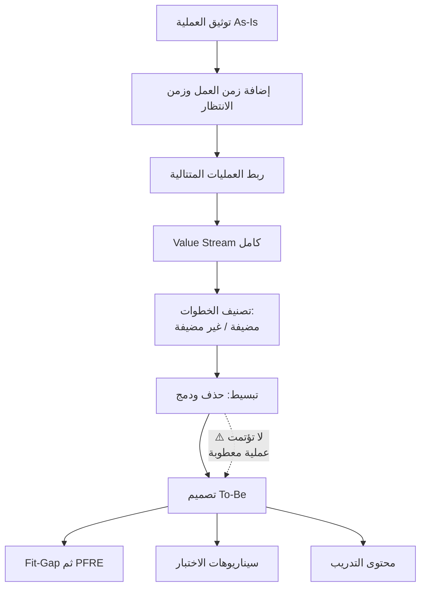

# العملية التشغيلية (Business Process)

> [!info] تعريف مختصر
> **العملية التشغيلية** سلسلة أنشطة مترابطة تحوّل مُدخَلاً إلى مُخرَج داخل المؤسسة. وهي وحدة تنظيمية بطبيعتها: غالباً تقع **داخل قسم واحد** ويملكها مدير ذلك القسم، ونجاحها يُقاس بكفاءتها الداخلية. وهنا يقع الفرق الحاسم عن [[Value Stream|تدفّق القيمة]]: التدفّق **مسار كامل عابر للأقسام ينتهي بقيمة يستلمها العميل**، بينما العملية قد تكتمل بامتياز دون أن يشعر العميل بشيء.

## الشرح العلمي والاحترافي

- **الفرق الجوهري عن تدفّق القيمة**:
  | | `Business Process` | [[Value Stream]] |
  |---|---|---|
  | النطاق | غالباً داخل قسم واحد | **عابر للأقسام** |
  | المالك | مدير القسم | **غالباً بلا مالك** — وهنا المشكلة |
  | ينتهي بـ | مُخرَج داخلي | **قيمة يستلمها العميل** |
  | مقياس النجاح | كفاءة العملية | [[Flow Efficiency\|كفاءة التدفّق]] وزمن الوصول للقيمة |
  | ما يخفيه | لا شيء داخلياً | **الانتظار بين الأقسام** |
  
  **والنتيجة العملية:** يمكن أن تكون كل عمليات المؤسسة ممتازة منفردة، والتدفّق كارثياً — لأن الهدر يقع في **المسافات بين العمليات** لا داخلها. وهذا يفسّر ظاهرة «كل قسم يقول إنه منجز، والعميل ينتظر أسبوعين».

- **مكوّنات توصيف العملية**: المُدخَل · الأنشطة بترتيبها · القواعد وقرارات التفرّع · الأدوار المنفّذة · المُخرَج · نقاط التحقّق والاعتماد · الاستثناءات. والاستثناءات هي أكثر ما يُغفَل، وهي مصدر معظم التخصيصات المتأخّرة في مشاريع الأنظمة.

- **خريطة العمليات (`Process Map`)** ترسم «كيف يسير العمل» بأنشطته وقراراته. وهي مدخل ضروري لكنها **لا تكفي وحدها** في مشاريع التسليم، لأنها لا تُظهر عمودَي الزمن الحاسمين: زمن العمل الفعلي وزمن الانتظار. ولذلك تُستكمل بخريطة تدفّق القيمة التي تضيفهما وتكشف الاختناق.

- **العملية «كما هي» و«كما ينبغي» (`As-Is` / `To-Be`)**: توثيق الحالية شرط لفهم الألم، وتصميم المستقبلية شرط لتحديد النطاق. والخطأ الشائع القفز إلى `To-Be` مباشرة، فيُبنى نظام يعالج مشكلة متخيَّلة.

- **قاعدة حاسمة في مشاريع الأنظمة**: **لا تُؤتمت عملية معطوبة.** أتمتة عملية بسبع خطوات ثلاث منها زائدة تُنتج نظاماً يُسرّع الهدر ويُثبّته في الكود. والترتيب الصحيح: **بسّط العملية أولاً، ثم أتمتها.** واختصار خريطة من سبع خطوات إلى خمس يوفّر زمن تطوير واختبار ونشر وتدريب — وكلّه يُقتطع من مدّة المشروع.

- **العلاقة بالتقدير**: خطوات العملية هي نفسها بنود [[Fit-Gap Analysis|تحليل الملاءمة والفجوة]] ثم بنود [[PFRE]]. ولهذا فإن جودة توصيف العملية تحدّد جودة التقدير مباشرةً: توصيف ناقص ⇒ بنود مفقودة ⇒ تقدير أقلّ من الواقع ⇒ طلبات تغيير لاحقة.

- **إعادة هندسة العمليات (`BPR`)**: مراجعة جذرية للعملية بدل تحسينها تدريجياً. وهي ما يجعل الفرق بين هدف تحسيني («نقلّل زمن الموافقة») وهدف جذري («نلغي الحاجة إلى الموافقة تحت سقف مبلغ معيّن»).

## أين ومتى يُستخدم
- في **مرحلة الاستكشاف** لتوثيق الوضع الحالي وتحديد الألم الفعلي.
- كمدخل مباشر لرسم [[Value Stream Mapping|خريطة تدفّق القيمة]].
- في **تحليل الملاءمة والفجوة**: مقارنة العملية بالقياسي في النظام تحدّد ما يحتاج تهيئة وما يحتاج تخصيصاً.
- في **تصميم الاختبار**: سيناريوهات الاختبار تُشتقّ من العملية بما فيها استثناءاتها.
- في **التدريب**: المستخدم يتعلّم عمليةً لا شاشة — والتدريب المبنيّ على الشاشات لا ينتقل إلى العمل اليومي.
- عند **قياس الأثر بعد الإطلاق**: مقارنة العملية قبل وبعد.

## مثال وسيناريو تطبيقي
> [!example] أربع عمليات ممتازة وتدفّق كارثي
> مؤسسة توزيع، وكل قسم يعرض مؤشّراته الداخلية:
>
> | القسم | العملية | زمن العمل الفعلي | تقييم القسم لنفسه |
> |---|---|---|---|
> | المبيعات | إنشاء عرض السعر واعتماده | 30 دقيقة | ممتاز |
> | المستودع | تجهيز الطلب | ساعتان | ممتاز |
> | المالية | إصدار الفاتورة واعتمادها | 20 دقيقة | ممتاز |
> | المالية | التحصيل والمطابقة | 30 دقيقة | ممتاز |
> | **المجموع** | | **≈ 3.3 ساعة** | **الكلّ ممتاز** |
>
> **والعميل ينتظر ثلاثة أيام.**
>
> **أين ذهب الفارق؟** في المسافات: 4 ساعات انتظار مراجعة، و8 ساعات انتظار اعتماد المدير، و6 ساعات فروق مخزون، و5 ساعات مراجعة يدوية، و4 ساعات اعتماد الفاتورة، ويومان مطابقة يدوية. **الإجمالي 75 ساعة انتظار مقابل 3.3 ساعة عمل — [[Flow Efficiency|كفاءة تدفّق]] 4%.**
>
> **الدرس:** خريطة العمليات وحدها كانت ستُظهر أربع عمليات سليمة وتوصي بتحسينات داخلية طفيفة. وخريطة تدفّق القيمة أظهرت أن **96% من الزمن يقع خارج العمليات كلّها** — وأن مضاعفة سرعة أي قسم تكسب 2% فقط.

## خطوات أو مخطّط
1. حدّد حدود العملية: أين تبدأ وأين تنتهي ومن يملكها.
2. وثّق `As-Is` بالأنشطة والقرارات والأدوار — **مع الاستثناءات**.
3. أضف عمودَي **زمن العمل** و**زمن الانتظار** لكل خطوة.
4. اربط العمليات المتتالية لتكوين [[Value Stream|تدفّق القيمة]] الكامل.
5. صنّف كل خطوة: مضيفة للقيمة أم غير مضيفة.
6. **بسّط قبل أن تؤتمت** — احذف الخطوات غير المضيفة أو ادمجها.
7. صمّم `To-Be` وقس الفارق المتوقّع.
8. حوّل خطوات `To-Be` إلى بنود [[Fit-Gap Analysis]] ثم [[PFRE]].
9. اشتقّ منها سيناريوهات الاختبار ومحتوى التدريب.

## ⚠️ مفاهيم خاطئة شائعة
> [!warning]
> - **الخلط بينها وبين [[Value Stream|تدفّق القيمة]]**: العملية داخل قسم غالباً، والتدفّق مسار كامل ينتهي بقيمة للعميل.
> - **الظنّ بأن تحسين كل عملية يحسّن التدفّق**: أغلب الهدر بين العمليات لا داخلها.
> - **الاكتفاء بخريطة العمليات في مشاريع التسليم**: لا تُظهر الانتظار ولا الاختناق.
> - **توثيق المسار السعيد فقط**: الاستثناءات هي مصدر معظم التخصيصات المتأخّرة.
> - **الخلط بين العملية والإجراء (`Procedure`)**: العملية «ماذا يحدث ولماذا»، والإجراء «كيف يُنفَّذ خطوةً خطوة».
> - **افتراض أن العملية الموثّقة هي المُتَّبعة**: غالباً توجد عملية موازية غير معلنة — وهي التي يجب أن تُرسَم.

## ❌ ممارسات خاطئة في المشاريع
> [!failure]
> - **أتمتة العملية كما هي**: يُثبّت الهدر في الكود ويجعل تغييره لاحقاً مكلفاً. الحلّ: بسّط أولاً ثم أتمت.
> - **توثيق العمليات من المدراء فقط**: يُنتج العملية المثالية لا الفعلية. الحلّ: ارصدها مع المنفّذين وشاهدها تعمل.
> - **القفز إلى `To-Be` بلا `As-Is`**: يُنتج نظاماً يعالج مشكلة متخيَّلة. الحلّ: وثّق الحالي ولو سريعاً.
> - **إغفال الاستثناءات في التوصيف**: تظهر أثناء الاختبار كطلبات تغيير. الحلّ: اسأل صراحةً «ماذا تفعلون حين لا يسير الأمر كالمعتاد؟».
> - **بناء التدريب على الشاشات لا العمليات**: يتعلّم المستخدم النقر ولا يتعلّم عمله. الحلّ: تدريب بسيناريوهات عمليات كاملة.
> - **عدم قياس العملية قبل المشروع**: يجعل إثبات التحسّن مستحيلاً. الحلّ: خطّ أساس زمني لكل عملية حرجة.

## 🔗 مصطلحات ومفاهيم ذات صلة
[[Value Stream]] | [[Value Stream Mapping]] | [[Flow Efficiency]] | [[Fit-Gap Analysis]] | [[PFRE]] | [[Order to Cash]] | [[Procure to Pay]] | [[Bottleneck]] | [[06 - Value Streams]]
