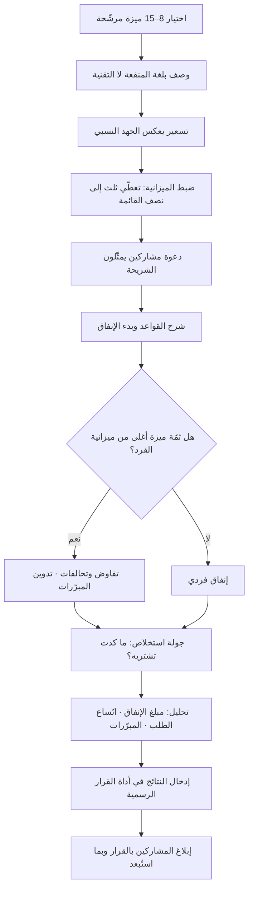

# اشترِ ميزة (Buy-a-Feature)

> [!info] تعريف مختصر
> أسلوب تشاركي لترتيب الأولويات يُعرض فيه على المشاركين — عملاء أو أصحاب مصلحة — **قائمة ميزات لكل منها سعر** مشتقّ من كلفة بنائها التقريبية، ثم تُمنح كل مشارك **ميزانية محدودة عمدًا لا تكفي لشراء كل ما يريد**، ويُطلب منه إنفاقها. القيد المالي هو جوهر الأداة: فهو يحوّل «أريد كل شيء» — وهو موقف مجّاني بلا كلفة — إلى **مقايضة حقيقية لها ثمن**، فتنكشف الأولويات الفعلية بدل الأولويات المعلنة. وتزداد قوّتها حين تُسعَّر بعض الميزات فوق ميزانية الفرد الواحد، فيُضطرّ المشاركون إلى التفاوض والتحالف لشرائها جماعيًّا — وهنا يظهر أثمن مخرجات الجلسة: **الحوار الذي يبرّر الاختيار**، لا جدول الأرقام.

## الشرح العلمي والاحترافي
- **الأصل والنسبة**: الأسلوب أحد أشهر ما يُعرف بـ**ألعاب الابتكار (Innovation Games)**، وهي مجموعة أساليب تيسير جماعي وضعها **لوك هوهمان (Luke Hohmann)** ونشرها في كتابه عن ألعاب الابتكار. الفكرة العامة للمنهج أن الأسئلة المباشرة تُنتج إجابات مجاملة أو مثالية، بينما البنية الشبيهة باللعبة تُنتج سلوكًا أقرب إلى السلوك الحقيقي لأنها تفرض قيودًا وتُخفي حدّة المواجهة الشخصية خلف قواعد لعبة متّفق عليها.
- **الأساس السلوكي**: قياس التفضيل بالسؤال المجرّد («ما مدى أهمّية هذه الميزة؟») يعاني من انعدام الكلفة، فيميل الجميع إلى وضع كل شيء في خانة «مهم جدًّا». إدخال **ميزانية شحيحة** يستدعي آليّة ذهنية مختلفة تمامًا: كلفة الفرصة البديلة. المشارك لا يسأل «هل أريد هذا؟» بل «هل أريد هذا **أكثر من** ذاك بهذا الثمن؟» — وهذا هو السؤال الوحيد الذي يُنتج ترتيبًا صالحًا للتخطيط.
- **التسعير هو الرافعة التصميمية الأهم**: السعر ليس زينة، بل يجب أن يعكس **الكلفة النسبية الحقيقية** للبناء (لا الدقيقة، بل النسبية بمرتبة المقدار). وقد يُبنى على تقدير نسبي ([[Relative Estimation]]) محوَّل إلى وحدات نقدية رمزية. أثر ذلك مزدوج: يمنع اختيار الميزات الضخمة بلا وعي بكلفتها، ويعلّم أصحاب المصلحة — دون محاضرة — أن ما يبدو "تعديلًا بسيطًا" قد يكلّف أضعاف ما يظنّون.
- **الميزانية الشحيحة عمدًا**: القاعدة العملية الشائعة أن يكون مجموع الميزانيات كافيًا لشراء ما بين **ثلث ونصف** قيمة القائمة كاملة. أوسع من ذلك تختفي المقايضة ويشتري الجميع كل شيء تقريبًا؛ وأضيق منها بكثير يُصاب المشاركون بالإحباط ويشترون بعشوائية.
- **آليّة التحالف (Coalition Building)**: حين يتجاوز سعر ميزة ميزانية أي فرد، لا يمكن شراؤها إلا بتجميع أموال عدّة مشاركين. هذا التصميم متعمّد ويولّد أثمن ما في الجلسة: مفاوضات علنية يبرّر فيها كل طرف احتياجه بلغته وسياقه («أحتاج هذه لأن التدقيق السنوي يوقفني ثلاثة أسابيع»). هذه المبرّرات — لا مبالغ الشراء — هي المخرَج البحثي الحقيقي، ولذلك **يجب تدوينها حرفيًّا أثناء الجلسة**.
- **ما تقيسه الأداة وما لا تقيسه**: تقيس **الرغبة النسبية تحت قيد**، ولا تقيس حجم السوق ولا العائد المالي ولا الجدوى التقنية. كما أن ما يُنفق عليه المال ليس بالضرورة ما يُدفع فيه مال حقيقي لاحقًا — فالميزانية رمزية. لذلك تُستعمل كأداة **اكتشاف واستكشاف تفضيلات**، وتُدخَل نتائجها كمُدخَل واحد ضمن أداة قرار أوسع مثل [[Weighted Scoring]] أو [[RICE Prioritization]]، لا كقرار نهائي.
- **موضعها بين طرائق الترتيب**: أغلب الطرائق ([[RICE Prioritization]]، [[ICE Scoring]]، [[WSJF]]) **تحليلية**: خبير يقدّر أرقامًا نيابةً عن المستخدم. أما هذه فـ**استنباطية تشاركية**: تستخرج التفضيل من صاحبه مباشرة تحت قيد اقتصادي. ولهذا تكمّل [[Opportunity Scoring]] الذي يقيس فجوة الرضا كمّيًّا لكنه لا يُظهر استعداد العميل للمقايضة. وتتقاطع مع [[MoSCoW Prioritization]] في أن كليهما يجبر على الفرز، لكن MoSCoW لا يفرض كلفة على تصنيف بند بـ"يجب".
- **متغيّرات وأشكال قريبة**: منها منح ميزانية بعملة رمزية موحّدة، أو استخدام أوراق نقدية ورقية في جلسات حضورية لزيادة الحسّية، أو نسخة "الميزانية السالبة" حيث تُشترى الميزات بالتخلّي عن ميزات قائمة — وهي نافعة تحديدًا لكشف ما يمكن **حذفه** ومعالجة تضخّم النطاق.

## أين ومتى يُستخدم
- **في مجالس العملاء ولقاءات المستخدمين المتقدّمين**: حين تحتاج تفضيلًا جماعيًّا موثوقًا من عملاء فعليين بدل قائمة أمنيات مفتوحة تُجمَع من تذاكر الدعم.
- **في حسم صراع الأولويات بين أصحاب المصلحة الداخليين**: كل إدارة تعتبر طلبها الأهم؛ الميزانية المحدودة تكشف ما تتخلّى عنه كل إدارة فعلًا — ويُقرأ الناتج مع [[Stakeholder Map]] لفهم من تحالف مع من ولماذا.
- **في تشكيل نطاق إصدار كبير أو [[MVP]]**: لاختبار أي مجموعة من الميزات تُشكّل حزمة ذات قيمة متماسكة بميزانية محدودة، قبل تثبيتها في [[Story Mapping]].
- **في المؤتمرات وورش العملاء**: كنشاط تفاعلي قصير (٤٥–٩٠ دقيقة) يُنتج بيانات تفضيل ومبرّرات نوعية في آن واحد.
- **في اكتشاف تفضيلات الشرائح المتباينة**: تشغيل الجلسة نفسها مع مجموعتين مختلفتين يكشف اختلاف الأولويات بينهما بوضوح يصعب بلوغه عبر الاستبيانات.
- **في تعليم أصحاب المصلحة معنى السعة المحدودة**: كثير من التوتّر حول خارطة الطريق ينشأ من غياب إحساس بالكلفة؛ الجلسة تُصلح ذلك تجريبيًّا لا خطابيًّا.

## مثال وسيناريو تطبيقي
> [!example] شركة سعودية تقدّم نظامًا لإدارة العيادات، أمامها ١٢ ميزة مطلوبة وسعة ربع سنوي تكفي ٤ منها تقريبًا. أقامت جلسة مع **٨ عملاء** من مدراء عيادات، مدّتها ٩٠ دقيقة.
> **التصميم**: سُعّرت الميزات بوحدات رمزية تعكس الجهد النسبي (١٠٠ وحدة ≈ أسبوع عمل فريق). مُنح كل مشارك **٤٠٠ وحدة**، فأصبح مجموع الميزانيات ٣٬٢٠٠ وحدة مقابل قائمة قيمتها الإجمالية ٩٬٠٠٠ وحدة — أي أن الميزانية تغطي نحو ٣٥٪ فقط.
>
> | الميزة | السعر | ما أُنفق | عدد المشترين |
> |---|---|---|---|
> | ربط تلقائي بمنصّة التأمين | 1200 | 1200 | 6 |
> | تذكير المرضى عبر الرسائل | 300 | 700 | 5 |
> | تطبيق جوّال للطبيب | 900 | 250 | 2 |
> | تقارير مالية متقدّمة | 600 | 640 | 4 |
> | تخصيص ألوان الواجهة | 100 | 0 | 0 |
> | جدولة المواعيد المتكرّرة | 400 | 410 | 3 |
>
> **ما حدث فعلًا**: ميزة الربط بمنصّة التأمين كانت مسعّرة عند ١٢٠٠ وحدة — أي ثلاثة أضعاف ميزانية أي مشارك منفرد. تشكّل تحالف من ستّة مشاركين اشتروها جماعيًّا، وكان النقاش الذي سبق التحالف هو أهم ١٥ دقيقة في الجلسة: قال أحد المدراء إن رفض مطالبات التأمين يكلّف عيادته تقريبًا **٢٢ ألف ريال شهريًّا** في مطالبات تسقط بالتقادم قبل تصحيحها. لم يكن أحد في فريق المنتج يعرف هذا الرقم من قبل، وقد غيّر تقدير الأثر لهذه الميزة تغييرًا جذريًّا في نموذج التقييم اللاحق.
> **المفاجأة المعاكسة**: «تطبيق جوّال للطبيب» كان البند الأول في كل استبيان سابق ومطلبًا متكرّرًا في الاجتماعات، لكنه حصل على ٢٥٠ وحدة فقط من مشتريَين. حين سُئل المشاركون عن السبب كان الجواب واضحًا: «نريده، لكن ليس بثمن الربط بالتأمين». وهذه بالضبط هي المعلومة التي لا يمكن لأي استبيان بلا كلفة أن ينتجها.
> **ما لم تُهمَل**: ميزة «تخصيص ألوان الواجهة» لم يشترِها أحد، لكن الفريق لم يحذفها فورًا؛ فقد كانت مطلوبة من عميل مؤسّسي كبير غير حاضر في الجلسة لأسباب هوية بصرية تعاقدية. وهذا يوضّح حدود الأداة: **من لم يحضر لم يُنفق**، ونتيجة الجلسة تمثّل الحاضرين فقط.
> استُخدمت المخرجات مُدخَلًا في تقييم موزون رسمي، فبقيت الميزتان الأوليان في القمّة، وتراجع التطبيق الجوّال إلى أفق لاحق في [[Now-Next-Later Roadmap]] مع إبلاغ العملاء صراحةً بأن هذا هو ما اختاروه بأنفسهم — فلم يُثر التأجيل أي اعتراض.

## خطوات أو مخطّط
1. اختر **٨–١٥ ميزة** مرشّحة. أقلّ من ثمانٍ يجعل الاختيار تافهًا، وأكثر من خمس عشرة يُرهق المشاركين ويشتّت الإنفاق.
2. اكتب لكل ميزة وصفًا من سطرين بلغة **المنفعة للعميل** لا بلغة تقنية، مع مثال ملموس لما تمكّنه.
3. سعّر كل ميزة بما يعكس جهدها النسبي التقريبي، وتأكّد من وجود **٢–٣ ميزات مرتفعة السعر** تتجاوز ميزانية الفرد الواحد لإجبار التحالفات.
4. اضبط الميزانية بحيث يغطي مجموعها ثلث إلى نصف قيمة القائمة كاملةً، واحسب ذلك قبل الجلسة لا ارتجالًا فيها.
5. اختر ٦–١٢ مشاركًا يمثّلون الشريحة المستهدفة فعلًا؛ ووثّق من هم ومن غاب، لأن هذا يحدّ من تعميم النتيجة.
6. اشرح القواعد بوضوح: الميزانية لا تُزاد، ولا تُستردّ، ويُسمح بالتحالف والتفاوض، والشراء الجزئي مسموح أو ممنوع (قرّر مسبقًا وأعلنه).
7. أدر الجلسة كمُيسّر ([[Facilitator]]) لا كبائع: لا تدافع عن ميزة، ولا تُصحّح فهم مشارك إلا إن كان خطأً واقعيًّا صريحًا.
8. **دوّن المبرّرات حرفيًّا** أثناء التفاوض — خصّص شخصًا لهذه المهمّة وحدها، فهي المخرَج الأثمن.
9. بعد انتهاء الإنفاق، أجرِ جولة استخلاص: ما أقرب ميزة كدت تشتريها ولم تفعل؟ وما الذي كنت ستشتريه لو تضاعفت ميزانيتك؟
10. حلّل النتائج بثلاثة أبعاد: إجمالي الإنفاق، وعدد المشترين المتمايزين (اتّساع الطلب)، والمبرّرات النوعية — ثم أدخلها كمُدخَل في أداة القرار الرسمية.

## ⚠️ مفاهيم خاطئة شائعة
> [!warning]
> - **اعتبار نتيجة اللعبة قرارًا ملزمًا**: الجلسة تمثّل الحاضرين فقط، ولا تراعي الجدوى التقنية ولا الاستراتيجية ولا العملاء الغائبين. هي **مُدخَل قوي** لقرار الأولوية لا بديل عنه.
> - **الخلط بين الإنفاق واستعداد الدفع الحقيقي**: العملة رمزية، ولا يصحّ استنتاج تسعير المنتج أو حجم الإيراد من نتائجها. قياس الاستعداد للدفع يحتاج أدوات أخرى.
> - **الظنّ بأن المخرَج هو الجدول**: أثمن ما في الجلسة هي المبرّرات المنطوقة أثناء التفاوض. فريق يخرج بالأرقام دون ملاحظات نوعية أضاع أغلب قيمة الجهد المبذول.
> - **افتراض أن الميزة التي لم يشترِها أحد بلا قيمة**: قد تكون شرطًا تعاقديًّا، أو متطلّبًا تنظيميًّا، أو أساسًا تقنيًّا لميزات أخرى، أو مهمّة لشريحة غير ممثّلة في الغرفة.
> - **الظنّ بأنها تصلح للمتطلّبات الإلزامية**: الامتثال والأمان والالتزامات التعاقدية لا تُعرض للتصويت أصلًا. تُنفَّذ بوصفها بوّابة عبور، ولا تدخل قائمة الشراء إطلاقًا.
> - **اعتبارها بديلًا عن البحث النوعي**: هي تكشف التفضيل بين حلول **مقترحة سلفًا**، ولا تكتشف مشكلات أو فرصًا لم تخطر للفريق — وهذا دور [[User Interview]] و[[Jobs to be Done]] و[[Opportunity Scoring]].

## ❌ ممارسات خاطئة في المشاريع
> [!failure]
> - **الخطأ: منح ميزانية سخيّة تكفي لشراء معظم القائمة.** لماذا يضرّ: تختفي المقايضة تمامًا فتعود اللعبة إلى تصويت مجّاني لا يكشف أولوية حقيقية. الحل: احسب مجموع الميزانيات مقابل قيمة القائمة قبل الجلسة، واستهدف تغطية ٣٠–٥٠٪ فقط.
> - **الخطأ: تسعير الميزات بحسب قيمتها المتوقّعة للعميل بدل كلفة بنائها.** لماذا يضرّ: يشوّه المقايضة ويحرم الجلسة من فائدتها التعليمية عن كلفة التطوير، وقد يوحي بأن السعر تفاوضي. الحل: اشتقّ السعر من تقدير الجهد النسبي، وأعلن ذلك للمشاركين صراحةً في بداية الجلسة.
> - **الخطأ: حضور قيادات عليا تنفق أمام مرؤوسيها أو أمام العملاء.** لماذا يضرّ: يتحوّل الإنفاق إلى مجاملة لصاحب النفوذ فتتلاشى استقلالية الاختيار. الحل: افصل جلسات العملاء عن جلسات الداخل، وإن حضرت القيادة فلتراقب ولا تُنفق.
> - **الخطأ: دفاع فريق المنتج عن ميزته المفضّلة أثناء الجلسة.** لماذا يضرّ: يحوّل الجلسة إلى عرض بيع، ويُفسد البيانات لأن المشاركين يستشعرون الإجابة "المرغوبة". الحل: يقود الجلسة ميسّر محايد، ويكتفي فريق المنتج بالمراقبة والتدوين.
> - **الخطأ: عرض ميزات غامضة أو موصوفة بلغة تقنية.** لماذا يضرّ: يُنفق المشاركون على ما فهموه لا على ما سيُبنى، فتكون النتيجة صحيحة شكلًا وفارغة معنًى. الحل: اختبر أوصاف الميزات على شخصين من خارج الفريق قبل الجلسة وتأكّد من فهمهما المطابق.
> - **الخطأ: عدم إبلاغ المشاركين بما حدث بعد الجلسة.** لماذا يضرّ: يشعر العملاء بأن وقتهم استُخدم في تمرين شكلي، فيرفضون المشاركة لاحقًا وتُفقد قناة بحثية ثمينة. الحل: أرسل خلال أسبوعين ملخّصًا بما اختير وما أُجّل ولماذا، بما في ذلك ما خالف نتيجة الجلسة ومبرّره.
> - **الخطأ: تجاهل تحليل اتّساع الطلب والاكتفاء بإجمالي الإنفاق.** لماذا يضرّ: ميزة اشتراها مشارك واحد بكل ميزانيته قد تتصدّر الجدول رغم أنها حاجة فردية شاذّة. الحل: اقرأ دائمًا **عدد المشترين المتمايزين** إلى جانب المبلغ، وميّز الطلب الواسع من الطلب المركّز.

## 🔗 مصطلحات ومفاهيم ذات صلة
[[MoSCoW Prioritization]] | [[RICE Prioritization]] | [[ICE Scoring]] | [[Weighted Scoring]] | [[Opportunity Scoring]] | [[Kano Model]] | [[WSJF]] | [[Story Mapping]] | [[Now-Next-Later Roadmap]] | [[Stakeholder Map]] | [[Facilitator]] | [[Relative Estimation]] | [[User Interview]]
