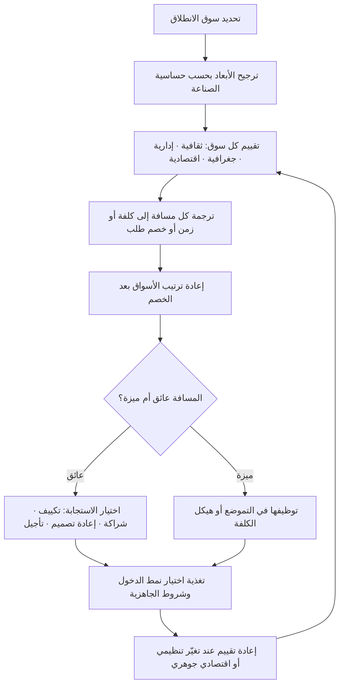

# إطار المسافة بين الأسواق (CAGE Framework)

> [!info] تعريف مختصر
> إطار يقيس **الفجوة بين سوقك الأصلي والسوق المستهدف** على أربعة أبعاد: **الثقافية (Cultural)، والإدارية/المؤسّسية (Administrative)، والجغرافية (Geographic)، والاقتصادية (Economic)**. صاغه الأكاديمي **بانكاج غيماوات (Pankaj Ghemawat)** في أدبيات الاستراتيجية العالمية، ردًّا على فكرة «العالم صار مسطّحًا» وسوقًا واحدًا. فكرته المركزية أن المسافة **لم تختفِ** وأنها تفسّر جزءًا كبيرًا من فشل التوسّع الدولي؛ وأن أهمّ ما يميّزه عن أدوات المسح العامة أنه **علائقي (Relational)**: لا يصف السوق في ذاته، بل يصف بُعده عنك أنت — فالسوق نفسه قد يكون قريبًا جدًّا من شركة إماراتية وبعيدًا جدًّا عن شركة يابانية. وأهمّ استعمال عملي له هو **ترجيح تقديرات الطلب** بخصم المسافة، بدل قبول أرقام الحجم المطلق كما هي.

## الشرح العلمي والاحترافي
- **المسافة الثقافية (Cultural)**: اختلاف اللغة، والقيم والأعراف، والدين، والمعايير الاجتماعية، وتفضيلات التصميم والذوق، ودرجة الثقة بين الغرباء في المعاملات التجارية. أثرها الأقوى يظهر في المنتجات عالية الارتباط باللغة أو الهوية أو العادات الاستهلاكية. ويُقاس أثرها عادةً كخصم على الطلب المتوقّع وكزيادة في كلفة التوطين.
- **المسافة الإدارية/المؤسّسية (Administrative)**: غياب أو وجود روابط مؤسّسية — اتّفاقيات تجارة أو جمارك موحّدة، تشابه الأنظمة القانونية، جودة المؤسّسات وإنفاذ العقود، القيود على الملكية الأجنبية، متطلّبات الترخيص، الفساد أو غيابه، والتاريخ الاستعماري أو اللغوي المشترك. غالبًا ما يكون هذا البعد **الأقوى أثرًا والأكثر إهمالًا**، لأنه يتجلّى في مهل وأذونات وشروط لا في أرقام يسهل رصدها في تقرير سوق.
- **المسافة الجغرافية (Geographic)**: المسافة الفعلية، والحدود المشتركة، ووجود منفذ بحري، والفارق الزمني، والبنية اللوجستية، والمناخ. أثرها كبير في السلع الثقيلة أو القابلة للتلف، وفي الخدمات التي تتطلّب حضورًا ميدانيًّا أو دعمًا متزامنًا؛ وأقلّ (لا معدوم) في المنتجات الرقمية حيث يظهر أثرها في فارق التوقيت ومتطلّبات الدعم لا في الشحن.
- **المسافة الاقتصادية (Economic)**: الفارق في دخل الفرد والقوّة الشرائية، وكلفة العمالة والموارد، وبنية قنوات التوزيع، وتوفّر البنية التحتية المالية والمعلوماتية. اختلاف الدخل يغيّر ما يُعدّ سعرًا معقولًا وما يُعدّ ميزة أساسية مقابل ميزة كمالية، وقد يفرض إعادة تصميم للمنتج نفسه لا للتسعير فقط.
- **الاستعمال الأول: خصم حجم السوق**: القيمة العملية الأبرز للإطار هي أنه يمنع الخطأ الكلاسيكي «هذا السوق أكبر من سوقنا بعشرة أضعاف إذن الفرصة عشرة أضعاف». حين تُرجَّح تقديرات الطلب بعوامل المسافة، ينكمش الحجم القابل للوصول فعليًّا انكماشًا كبيرًا، وقد يتغيّر ترتيب الأسواق كليًّا فيتقدّم سوق أصغر لكنه أقرب.
- **الاستعمال الثاني: تشخيص نوع الاستجابة**: كل بُعد يستدعي علاجًا مختلفًا. المسافة الثقافية تُعالَج بالتكييف (توطين، رسالة، تصميم)؛ والإدارية بالشراكة المحلّية أو التوسّط أو الترخيص؛ والجغرافية بإعادة تصميم اللوجستيات أو تغطية زمنية للدعم؛ والاقتصادية بإعادة التغليف والتسعير أو نسخة مبسّطة من المنتج. المسح الذي لا يفرّق بين الأبعاد ينتج علاجًا واحدًا لأربع مشكلات مختلفة.
- **حساسية المسافة تختلف باختلاف الصناعة**: هذه نقطة جوهرية كثيرًا ما تُغفل. الأبعاد نفسها لا تؤثّر بالدرجة نفسها في كل قطاع: منتج غذائي شديد الحساسية للمسافة الثقافية والجغرافية؛ وخدمة مالية شديدة الحساسية للمسافة الإدارية؛ وسلعة صناعية ثقيلة شديدة الحساسية للمسافة الجغرافية؛ وبرمجيات مؤسّسية حساسية مسافتها الجغرافية منخفضة لكن الإدارية مرتفعة جدًّا. لذلك لا يُقرأ الإطار بأوزان متساوية، بل بأوزان مشتقّة من طبيعة الصناعة.
- **المسافة ليست دائمًا عائقًا**: في بعض الحالات تكون المسافة نفسها مصدر ميزة — الفارق في كلفة العمالة أساس لصناعة الخدمات المشتركة، والفارق الزمني أساس لتغطية دعم على مدار الساعة، واختلاف الذوق فرصة لمنتج مستورد يتموضع بوصفه مختلفًا. القراءة الرشيدة تسأل: أين تكلّفني المسافة؟ وأين تخدمني؟
- **علاقته بالأدوات المجاورة**: [[PESTEL]] يمسح السوق المستهدف في ذاته، وCAGE يقيس بُعده عنك، وأبعاد الثقافة الوطنية ([[Hofstede Cultural Dimensions]]) تفصّل أحد أبعاده الأربعة. الثلاثة تُغذّي ترتيب محفظة الأسواق واختيار النمط في [[Market Entry Modes]].

## أين ومتى يُستخدم
- **عند ترتيب الأسواق المرشّحة للتوسّع**: لتحويل قائمة أسواق مرتّبة بالحجم إلى قائمة مرتّبة بالفرصة القابلة للوصول فعليًّا، وهي المدخل المباشر لاختيار [[Market Entry Modes]].
- **في نمذجة الطلب داخل دراسة الجدوى**: لخصم التقديرات المتفائلة بعوامل مسافة معلنة، بحيث تصبح افتراضات [[Business Case]] قابلة للنقاش والمراجعة بدل أن تكون أرقامًا مجرّدة.
- **في تحديد ميزانية التوطين والامتثال**: لأن حجم المسافة الثقافية يقدّر كلفة التوطين واللغة ([[Translation Memory]])، وحجم المسافة الإدارية يقدّر كلفة الترخيص والامتثال ([[PDPL]] و[[KYC]]).
- **في تصميم خطّة الوصول إلى السوق**: لتحديد ما يجب تكييفه فعلًا وما يمكن توحيده، وهو قرار جوهري داخل [[Go-to-Market]] لأن التكييف الزائد يقتل الهامش والتوحيد الزائد يقتل التبنّي.
- **في تحليل المنافسة**: لفهم لماذا يتفوّق منافس محلّي أضعف تقنيًّا — غالبًا لأن مسافته صفر على أبعاد يدفع فيها الوافد كلفة عالية.
- **في تشخيص تعثّر توسّع قائم**: عند ضعف الأداء في سوق قائم، يساعد الإطار في تحديد البعد الذي ينزف منه الأداء بدل النسبة العامة لـ«صعوبة السوق»، فيوجّه [[Root Cause Analysis]] وجهة محدّدة.

## مثال وسيناريو تطبيقي
> [!example] شركة سعودية تنتج نظام نقاط بيع للمطاعم، لديها 1,900 فرع مطعم عميل داخل المملكة، تدرس التوسّع إلى ثلاثة أسواق: مصر، والإمارات، والمملكة المتّحدة.
> **المقارنة الأولى بالحجم فقط:** يبدو السوق البريطاني الأكبر بفارق ضخم من حيث حجم إنفاق المطاعم على التقنية، ثم مصر بعدد منشآت هائل، ثم الإمارات الأصغر عدديًّا لكن الأعلى في متوسّط الإنفاق للمنشأة. الترتيب الساذج: بريطانيا، مصر، الإمارات.
> **إدخال المسافة:**
> **الإمارات — مسافة قريبة على الأبعاد الأربعة.** ثقافيًّا: اللغة نفسها، وتشابه في أنماط المطاعم ومواسم الذروة، وحساسية عالية للنسخة الإنجليزية بحكم تركيبة العاملين — تكييف محدود. إداريًّا: تشابه في متطلّبات الفوترة الإلكترونية والضريبة مع اختلافات تفصيلية قابلة للتغطية؛ لا قيود ملكية معطِّلة للنشاط. جغرافيًّا: رحلة قصيرة، والتوقيت نفسه تقريبًا، فالدعم الميداني والتدريب ممكنان دون بنية جديدة. اقتصاديًّا: قوّة شرائية أعلى تسمح بسعر أعلى لا أقل. **النتيجة: أعلى فرصة قابلة للوصول رغم أنها ليست الأكبر.**
> **مصر — مسافة ثقافية وجغرافية قريبة، اقتصادية بعيدة.** اللغة والذوق قريبان، والفارق الزمني ساعة، لكن الفجوة الاقتصادية تفرض إعادة تصميم لا إعادة تسعير فقط: نقطة السعر التي يقبلها السوق قد لا تحتمل نموذج الاشتراك نفسه ولا كلفة الأجهزة المصاحبة، إضافةً إلى مخاطرة سعر الصرف على إيراد بعملة محلّية مقابل كلفة تطوير بالريال. إداريًّا: اختلاف في متطلّبات الفوترة والتسجيل الضريبي يستلزم كيانًا محلّيًّا. **النتيجة: سوق ضخم لكن هامشه ومخاطرته يجعلانه موجة ثانية بنموذج مختلف — نسخة أخفّ وسعر مختلف وتحوّط عملة.**
> **المملكة المتّحدة — الأكبر والأبعد.** ثقافيًّا: لغة وتوقّعات واجهة وتجربة مختلفة، ومعايير خدمة مختلفة. إداريًّا: نظام حماية بيانات ومتطلّبات مدفوعات وشهادات أمن مختلفة تمامًا، وهي بالضبط ما يستهلك الشهور والميزانية. جغرافيًّا: فارق توقيت يجعل الدعم المتزامن مستحيلًا دون فريق محلّي. اقتصاديًّا: كلفة عمالة ودعم أعلى بكثير تقلب هيكل الكلفة رأسًا على عقب. ولاحِظ أن **حساسية القطاع** هنا حاسمة: نظام نقاط بيع خدمة تشغيلية حرجة تحتاج دعمًا سريعًا ووجودًا ميدانيًّا، فهو من أشدّ المنتجات حساسية للمسافة الإدارية والجغرافية معًا. **النتيجة: أُجّل مع شرط مكتوب لإعادة النظر.**
> **الترتيب بعد خصم المسافة:** الإمارات أولًا، ثم مصر بنموذج معدَّل، ثم بريطانيا مؤجَّلة — أي عكس الترتيب الأول تمامًا. وهذه بالضبط مساهمة الإطار: لم يضف بيانات جديدة عن حجم الأسواق، بل غيّر طريقة ترجيحها.
> **أثر تشغيلي إضافي:** خُصّصت ميزانية التكييف بحسب البعد لا بالتساوي — 12% من ميزانية الإمارات للتوطين اللغوي والامتثال، مقابل تقدير يتجاوز الثلث لمصر (إعادة تغليف المنتج وتحوّط العملة)، وهو ما جعل مقارنة العائد على الاستثمار بين السوقين مقارنة صادقة لأول مرة.

## خطوات أو مخطّط
1. تحديد نقطة الانطلاق بوضوح: المسافة تُقاس **من سوقك أنت**، فتغيّر مقرّ العمليات يغيّر النتيجة.
2. تحديد أوزان الأبعاد الأربعة بحسب حساسية صناعتك، وكتابة مبرّر كل وزن قبل التقييم.
3. تقييم كل سوق مرشّح على الأبعاد الأربعة بمؤشّرات ملموسة (لغة، اتّفاقيات، ترخيص، فارق توقيت، دخل الفرد، بنية القنوات) لا بانطباع عام.
4. ترجمة كل مسافة إلى **كلفة أو زمن أو خصم على الطلب** — لا تتركها تقديرًا وصفيًّا؛ الرقم هو ما يجعل المقارنة ممكنة.
5. إعادة ترتيب الأسواق بعد الخصم، ومقارنة الترتيب الجديد بترتيب الحجم الخام لكشف حجم التحيّز الأول.
6. تحديد نوع الاستجابة لكل بعد: تكييف، أو شراكة، أو إعادة تصميم، أو تأجيل صريح.
7. البحث عن أوجه تكون فيها المسافة ميزة (كلفة، توقيت، تمايز) وإدراجها في العرض.
8. تغذية النتيجة في اختيار [[Market Entry Modes]] وفي شروط الجاهزية داخل [[Go-to-Market]].
9. إعادة التقييم عند تغيّر جوهري: اتّفاقية تجارية جديدة، تشريع بيانات، تحوّل في سعر الصرف، افتتاح مركز عمليات إقليمي.

## ⚠️ مفاهيم خاطئة شائعة
> [!warning]
> - **«الإطار يصف السوق المستهدف»**: هو يصف **العلاقة** بينك وبينه؛ السوق نفسه يعطي نتيجتين مختلفتين لشركتين من موطنين مختلفين. التصحيح: ابدأ دائمًا بتحديد نقطة الانطلاق، وأعد الحساب إن تغيّر مقرّ عملياتك.
> - **«الأبعاد الأربعة متساوية الوزن»**: حساسية الصناعة تغيّر الترتيب جذريًّا؛ البعد الجغرافي قد يكون حاسمًا لسلعة ثقيلة وهامشًا لبرمجية سحابية. التصحيح: حدّد الأوزان صراحةً قبل التقييم، وبرّرها بطبيعة المنتج.
> - **«المسافة الجغرافية انتهت في المنتجات الرقمية»**: انخفض أثر الشحن لا أثر التوقيت وحضور الدعم والزيارات الميدانية وثقة العميل بوجود محلّي. التصحيح: ترجم البعد الجغرافي إلى متطلّبات دعم وتغطية زمنية بدل إلغائه.
> - **«اللغة المشتركة تعني مسافة ثقافية صفرًا»**: أسواق تتشارك اللغة قد تختلف في العادات الشرائية والتنظيم والمواسم وقنوات التوزيع اختلافًا كبيرًا. التصحيح: افصل مؤشّر اللغة عن بقيّة مؤشّرات البعد الثقافي، ولا تعمّم من أحدها على البقيّة.
> - **«المسافة عائق دائمًا»**: فروق الكلفة والتوقيت والذوق قد تكون أساس الميزة التنافسية نفسها. التصحيح: اسأل عن الوجهين — أين تكلّفني؟ وأين تخدمني؟
> - **«الإطار بديل عن أدوات التحليل الأخرى»**: هو يقيس المسافة فقط، ولا يقول شيئًا عن جاذبية السوق في ذاته ولا عن بنية المنافسة فيه. التصحيح: استعمله مع [[PESTEL]] وتحليل المنافسة لا بديلًا عنهما.
> - **«التقييم يُنجز مرّة»**: المسافة الإدارية بالذات متحرّكة؛ اتّفاقية أو تشريع جديد قد يقرّب سوقًا أو يبعّده خلال أشهر. التصحيح: اربط إعادة التقييم بمحفّزات معلنة لا بمواعيد اعتباطية.

## ❌ ممارسات خاطئة في المشاريع
> [!failure]
> - **الخطأ: ترتيب الأسواق بحجم الطلب المطلق دون خصم المسافة.** لماذا يضرّ: يُختار أكبر سوق وأبعده فتُستنزف الميزانية في تكييف وامتثال قبل أول إيراد. الحل: اجعل خصم المسافة خطوة إلزامية قبل اعتماد ترتيب الأسواق، ووثّق الترتيبين (قبل الخصم وبعده) في [[Decision Log]].
> - **الخطأ: معالجة المسافة الإدارية كإجراء ورقي متأخّر.** لماذا يضرّ: الترخيص وتوطين البيانات ومتطلّبات الفوترة تغيّر المعمارية والجدول الزمني بأشهر، ولا تُعالَج بوثيقة تُوقَّع في النهاية. الحل: افحص المتطلّبات التنظيمية بوّابةً سابقة على اعتماد الميزانية، وأشرك الهندسة فيها مبكرًا.
> - **الخطأ: توزيع ميزانية التكييف بالتساوي على الأسواق.** لماذا يضرّ: تُصرف مبالغ على تكييف غير لازم في سوق قريب، ويُبخَس التكييف في سوق بعيد فيفشل التبنّي. الحل: اشتقّ ميزانية التكييف من ملف المسافة لكل سوق على حدة، وقارن العائد بعد التكييف لا قبله.
> - **الخطأ: افتراض أن قرب اللغة والدين يعني قرب السوق تجاريًّا.** لماذا يضرّ: يُهمَل الفارق الاقتصادي وبنية القنوات، فيُنقل نموذج تسعير لا يحتمله السوق ويُبنى تنبّؤ إيراد بعيد عن الواقع. الحل: قيّم الأبعاد الأربعة مستقلّةً، ولا تدع القرب في بعد يحجب البعد في آخر.
> - **الخطأ: إهمال مخاطرة العملة عند اتّساع المسافة الاقتصادية.** لماذا يضرّ: يتحوّل هامش صحّي إلى خسارة صامتة عند تحرّك سعر الصرف، ويصبح تقرير الربحية مضلّلًا. الحل: سعّر بعملة متحوَّط لها أو أدرج بند مراجعة سعرية، وأدخل أثر العملة صراحةً في [[TCO]].
> - **الخطأ: نسخ عرض القيمة كما هو إلى السوق البعيد.** لماذا يضرّ: تُصاغ الرسالة حول مشكلة ليست هي المشكلة الأولى محلّيًّا، فتضعف الاستجابة رغم جودة المنتج. الحل: أعد اختبار عرض القيمة ميدانيًّا عبر [[Customer and Market Validation]] وأعد صياغته حول المهمّة المحلّية ([[Jobs to be Done]]).
> - **الخطأ: عدم مراجعة المسافة بعد تغيّر تنظيمي كبير.** لماذا يضرّ: تُبقى أسواق في خانة «مؤجَّلة» بعد أن صارت متاحة فعليًّا، أو يُستمرّ في سوق ازدادت كلفة الامتثال فيه. الحل: عيّن محفّزات إعادة تقييم مكتوبة، واجعلها بندًا دوريًّا في [[Steering Committee]].

## 🔗 مصطلحات ومفاهيم ذات صلة
[[Market Entry Modes]] | [[PESTEL]] | [[Hofstede Cultural Dimensions]] | [[Go-to-Market]] | [[Cash on Delivery]] | [[Translation Memory]] | [[Business Case]] | [[TCO]] | [[Customer and Market Validation]] | [[Risk Register]]
