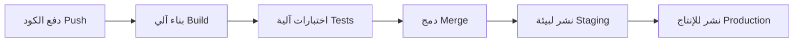

# التكامل المستمر والنشر المستمر (CI and CD)

> [!info] تعريف مختصر
> CI/CD اختصار لـ Continuous Integration (التكامل المستمر) وContinuous Delivery/Deployment (التسليم/النشر المستمر). هي ممارسة هندسية تدمج فيها التغييرات البرمجية إلى الفرع الرئيسي بشكل متكرر مع بناء واختبار آليّين، ثم تُسلَّم أو تُنشَر تلقائيًا إلى بيئات لاحقة حتى الإنتاج.

## الشرح العلمي والاحترافي
- **التكامل المستمر (Continuous Integration - CI)**: كل مطوّر يدمج تغييراته إلى الفرع الرئيسي عدة مرات يوميًا. كل عملية دمج تُشغّل بناءً (Build) آليًا واختبارات آلية (Unit Tests، Integration Tests) فورًا لاكتشاف أي تعارض أو خلل مبكرًا، بدلاً من اكتشافه بعد أسابيع من التطوير المنعزل.
- **التسليم المستمر (Continuous Delivery)**: امتداد لـ CI بحيث يبقى الكود، بعد اجتيازه جميع الاختبارات الآلية، في حالة "جاهز للنشر" في أي لحظة، مع نشر يدوي (بضغطة زر) إلى الإنتاج عند الحاجة.
- **النشر المستمر (Continuous Deployment)**: خطوة أبعد؛ كل تغيير يجتاز الاختبارات يُنشر تلقائيًا إلى الإنتاج دون أي تدخل بشري، مما يقصّر زمن الوصول من الفكرة إلى المستخدم النهائي إلى أقصى حد.
- يُنفَّذ عبر "خط أنابيب" (Pipeline) آلي يتكون من مراحل متتالية: بناء الكود، تشغيل الاختبارات (وحدات، تكامل، أحيانًا اختبار الدخان [[Smoke Testing]])، تحليل جودة الكود، ثم النشر إلى بيئات متدرجة (Staging ثم Production - انظر [[Staging vs Production Environment]]).
- يقلّل CI/CD من مخاطر النشر لأن التغييرات صغيرة ومتكررة بدلاً من إصدارات ضخمة نادرة؛ خلل في تغيير صغير أسهل بكثير في تشخيصه وإصلاحه (انظر [[MTTR]]) من خلل مدفون داخل إصدار ضخم يحوي مئات التغييرات.
- يرتبط ارتباطًا وثيقًا بثقافة DevOps وSRE، حيث تُعد سرعة وتكرار خط الأنابيب أحد أهم مؤشرات نضج الفريق الهندسي (مقاييس مثل Deployment Frequency وLead Time for Changes).

## أين ومتى يُستخدم
- يُستخدم في أي فريق تطوير برمجيات يريد تقليل الوقت بين كتابة الكود ووصوله للمستخدم، بغض النظر عن المنهجية الإدارية (Scrum، Kanban، أو حتى فرق Waterfall الحديثة).
- ضروري في الفرق التي تمارس البرمجة القصوى ([[Extreme Programming]])، حيث يُعد التكامل المستمر أحد ممارساتها الأساسية.
- يُستخدم عند كل طلب سحب (Pull Request) للتحقق الآلي من جودة الكود قبل الدمج، وعند كل دمج ناجح للبناء والنشر التلقائي.
- يُلجأ إليه بشكل خاص في بيئات SaaS والخدمات السحابية التي تحتاج نشر تحديثات متكررة (يوميًا أو حتى عدة مرات في الساعة) دون تعطيل الخدمة.

## مثال وسيناريو تطبيقي
> [!example] فريق تطوير تطبيق توصيل طعام في شركة "طبقنا" كان ينشر إصدارًا جديدًا كل شهرين، وكل إصدار يحوي مئات التغييرات المتراكمة، مما جعل أي خلل بعد النشر صعب التشخيص ويستغرق أيامًا لإصلاحه.
> الفريق بنى خط أنابيب CI/CD: كل طلب سحب يُشغّل تلقائيًا 400 اختبار وحدة (Unit Test) خلال 4 دقائق، وعند الدمج في الفرع الرئيسي، يُبنى الكود وينشر تلقائيًا إلى بيئة الاختبار (Staging)، حيث تُشغَّل اختبارات دخان (Smoke Testing) إضافية. إذا نجحت، يضغط قائد الفريق زرًا واحدًا لنشرها إلى الإنتاج (Continuous Delivery، وليس Deployment كاملاً لأنهم يفضّلون موافقة بشرية أخيرة).
> بعد ثلاثة أشهر من التطبيق، أصبح الفريق ينشر 3-4 مرات أسبوعيًا بدلاً من كل شهرين، وانخفض متوسط زمن الاستعادة (MTTR) من 5 ساعات إلى 25 دقيقة، لأن أي خلل جديد يكون محصورًا في تغيير صغير سهل التتبع.

## خطوات أو مخطّط
1. المطوّر يكتب الكود ويدفعه (Push) إلى فرع مستقل أو مباشرة إلى الفرع الرئيسي.
2. خط الأنابيب يبني الكود آليًا (Build) ويشغّل اختبارات الوحدة (Unit Tests).
3. عند نجاح الاختبارات، يُدمَج التغيير في الفرع الرئيسي (بعد مراجعة الكود إن وُجدت).
4. النشر التلقائي إلى بيئة الاختبار (Staging) مع تشغيل اختبارات تكامل واختبار دخان.
5. عند نجاح كل ما سبق: تسليم مستمر (نشر يدوي بضغطة زر) أو نشر مستمر (نشر تلقائي كامل) إلى الإنتاج.
6. مراقبة النظام بعد النشر (Monitoring) والاستعداد للتراجع السريع (Rollback) عند اكتشاف خلل.

## ⚠️ مفاهيم خاطئة شائعة
> [!warning]
> - الخلط بين Continuous Delivery وContinuous Deployment؛ الأول يبقي الكود "جاهزًا للنشر" مع موافقة بشرية أخيرة، بينما الثاني ينشر تلقائيًا دون أي تدخل بشري.
> - الاعتقاد بأن CI تعني فقط "استخدام أداة أتمتة"؛ الجوهر الحقيقي هو الانضباط في الدمج المتكرر (عدة مرات يوميًا لكل مطوّر)، لا مجرد وجود أداة تشغّل الاختبارات نادرًا.
> - الظن بأن تبنّي CI/CD يُغني تمامًا عن الاختبار اليدوي أو اختبار المستخدم النهائي (UAT)؛ في الواقع لا يزال هناك حاجة لاختبارات استكشافية أو قبول (UAT) في حالات كثيرة، خصوصًا للميزات المعقدة.

## ❌ ممارسات خاطئة في المشاريع
> [!failure]
> - بناء خط أنابيب CI/CD دون تغطية اختبارات كافية، فيوهم الفريق بالأمان بينما الأخطاء تصل إلى الإنتاج دون اكتشاف. التجنب: الاستثمار في تغطية اختبارات جيدة (وحدة وتكامل) قبل الاعتماد الكلي على الأتمتة.
> - ترك عملية النشر تستغرق ساعات بسبب خط أنابيب بطيء أو مليء بخطوات يدوية، مما يقلل تكرار عمليات الدمج والنشر ويعيد إنتاج مشكلة الإصدارات الضخمة. التجنب: تحسين سرعة خط الأنابيب باستمرار (اختبارات متوازية، بيئات مؤقتة سريعة).
> - عدم وجود آلية تراجع سريعة (Rollback) عند فشل نشر في الإنتاج، فيتحول خلل بسيط إلى حادثة كبرى طويلة الأمد. التجنب: تجهيز آلية تراجع آلية أو شبه آلية ضمن خط الأنابيب نفسه.

## 🔗 مصطلحات ومفاهيم ذات صلة
[[Extreme Programming]] | [[Docs as Code]] | [[Staging vs Production Environment]] | [[Smoke Testing]] | [[Regression Testing]] | [[MTTR]] | [[SRE]] | [[Hotfix]] | [[Feature Freeze]]
