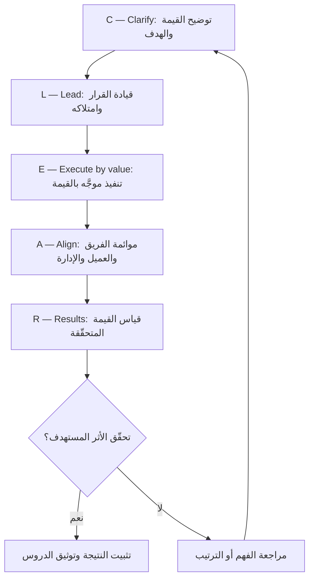

# إطار CLEAR (CLEAR Framework)

> [!info] تعريف مختصر
> إطار `CLEAR` هو إطار عملي من خمس خطوات لقيادة التسليم، يُترجم [[Delivery Layer]] إلى تسلسل قابل للتطبيق: **C**larify (توضيح القيمة والهدف قبل أي تنفيذ) ← **L**ead the decision (قيادة القرار وامتلاكه بدل انتظار العميل) ← **E**xecute by value (التنفيذ موجَّه بالقيمة لا بترتيب الوحدات) ← **A**lign (موائمة الفريق والعميل والإدارة على الفهم نفسه) ← **R**esults (القيمة والنتائج المقاسة). وهو **مُذكِّرة ممارس (Practitioner Mnemonic)** لا معيارًا رسميًّا في أي مرجع معتمد، وقيمته في كونه قائمة تحقّق ذهنية عند كل مرحلة.

## الشرح العلمي والاحترافي
- **C — Clarify (التوضيح)**: قبل كتابة سطر واحد أو فتح أول سباق، يجب أن تكون الإجابة واضحة عن: ما المشكلة؟ ومن المستفيد؟ وما القيمة المستهدفة؟ وبماذا نقيسها؟ التوضيح ليس اجتماعًا تمهيديًّا بل مُخرَجًا مكتوبًا يُثبَّت عادةً في [[Delivery Charter]].
  - *كيف تبدو في الواقع*: صياغة `Problem Statement` برقم، تحويل الطلب من "نريد لوحة تحكّم" إلى "نريد خفض زمن اتخاذ القرار الأسبوعي"، والاتفاق على مصدر قياس واحد موثوق.
  - *ما الذي يفشل بدونها*: يبني الفريق ما طُلب حرفيًّا لا ما يحلّ المشكلة، وتظهر التعديلات الجوهرية متأخرة حين تكون كلفتها أعلى بأضعاف.
- **L — Lead the decision (قيادة القرار)**: كثير من الفرق تنتظر العميل ليقرّر، فتُشلّ لأسابيع ثم تُلام على التأخير. قيادة القرار تعني أن يأتي فريق التسليم بتوصية مسنودة بتحليل وخيارات وكلفة، ويطلب الاعتماد لا الإلهام.
  - *كيف تبدو في الواقع*: بدل رسالة "بانتظار ردّكم بخصوص آلية الموافقات"، تُرسل ثلاثة خيارات مع توصية مبرَّرة ومهلة قرار وأثر التأخير، ويُوثَّق الناتج في [[Decision Log]].
  - *ما الذي يفشل بدونها*: قرارات معلّقة تتحوّل إلى مخاطر، ومسؤولية ضائعة، وثقة متآكلة لأن العميل يرى فريقًا منفّذًا لا شريكًا يقود.
- **E — Execute by value (التنفيذ بالقيمة)**: ترتيب العمل بحسب القيمة المتحقّقة لا بحسب التسلسل الطبيعي للوحدات أو سهولة البناء أو ترتيب فصول وثيقة المتطلبات.
  - *كيف تبدو في الواقع*: تحليل [[Value Stream]] لتحديد أين تتوقّف القيمة، وتقديم الشريحة التي تُنتج أثرًا مبكّرًا حتى لو كانت أصعب تقنيًّا، وتحسين [[Time to Value]] — أي المدة حتى يلمس المستخدم قيمة حقيقية أول مرة.
  - *ما الذي يفشل بدونها*: تُبنى الوحدات الأسهل أولًا فيبدو التقدّم ممتازًا في التقارير، بينما تتأخر القيمة الحقيقية إلى نهاية المشروع حيث تُضغط أو تُحذف عند نفاد الوقت.
- **A — Align (الموائمة)**: ضمان أن الفريق والعميل والإدارة يحملون الفهم نفسه للهدف والحالة والمخاطر في اللحظة نفسها. الموائمة ليست إبلاغًا من طرف واحد بل تحقّقًا من الفهم المشترك — وهي جوهر [[Alignment]].
  - *كيف تبدو في الواقع*: [[Project Health Report]] دوري صادق، صياغة هدف السباق ([[Sprint Goal]]) كـ`Outcome` لا كقائمة مهام، ومراجعة مشتركة تُطرح فيها الأخبار السيئة مبكّرًا لا متأخرًا.
  - *ما الذي يفشل بدونها*: ينفّذ الفريق بإتقان اتجاهًا غير الذي تنتظره الإدارة، ويُكتشف الانحراف في العرض النهائي حين يكون التصحيح مكلفًا.
- **R — Results (النتائج)**: إغلاق الحلقة بقياس القيمة المتحقّقة فعليًّا، لا بإعلان انتهاء التسليم. هنا يتجسّد تمييز [[Outcome vs Output]] عمليًّا.
  - *كيف تبدو في الواقع*: قياس المؤشّر المتّفق عليه بعد فترة تشغيل كافية، مقارنته بخطّ الأساس، وتوثيق ما نجح وما لم ينجح كدرس للمشروع التالي.
  - *ما الذي يفشل بدونها*: يُصنَّف كل مشروع ناجحًا لأنه سُلِّم، فلا تتحسّن المؤسسة أبدًا لأنها لا تعرف ما الذي أحدث فرقًا فعلًا.
- **العلاقة بـ`Time to Value` وهدف السباق**: خطوتا `Execute by value` و`Align` مترابطتان عمليًّا: تقصير [[Time to Value]] يتطلّب ترتيبًا بالقيمة، لكن هذا الترتيب لا يصمد إن لم يُصَغ [[Sprint Goal]] بوصفه أثرًا مقصودًا ("يستطيع العميل إتمام طلب كامل من طرف إلى طرف") بدل قائمة نواتج ("إنهاء الشاشات 4 و5 و6"). صياغة الهدف كـ`Outcome` هي ما يمنح الفريق حرية اختيار الحل مع بقاء البوصلة ثابتة.
- **طبيعته كمُذكِّرة لا كمعيار**: `CLEAR` ليس جزءًا من `PMBOK` ولا من `Scrum Guide` ولا من أي مرجع معتمد، وليس معيارًا قابلًا للتدقيق أو الاعتماد المهني. هو ترتيب ذهني ابتكره ممارسون لتذكّر ما يسقط عادةً تحت الضغط. لذلك يجب ألّا يُقدَّم للعميل كمنهجية معتمدة، وألّا يُستخدم كبديل عن أدوات الحوكمة الفعلية. قيمته الحقيقية أنه **قائمة تحقّق عند كل مرحلة**: قبل البدء (هل وضحنا؟)، وعند الجمود (هل نقود القرار أم ننتظر؟)، وعند الترتيب (هل نرتّب بالقيمة؟)، وعند التقرير (هل الجميع موائم؟)، وعند الإغلاق (هل قسنا النتيجة؟).

## أين ومتى يُستخدم
- في بداية أي مشروع أو مرحلة، كمسار افتتاحي يضمن أن التوضيح سبق التنفيذ.
- عند تعثّر مشروع قائم، لتشخيص أي من الخطوات الخمس غائبة — وغالبًا تكون `Clarify` أو `Results`.
- في المؤسسات التي تعمل بـ[[02 - Scrum]] وتحتاج طبقة قيادة للقيمة دون تغيير طقوسها.
- كدليل تدريب لمديري التسليم الجدد ولقادة الفرق المنتقلين من التنفيذ إلى القيادة.
- كقائمة تحقّق سريعة قبل اجتماعات الحوكمة أو قبل اتخاذ قرار مفصلي في النطاق.

## مثال وسيناريو تطبيقي
> [!example] فريق تسليم يعمل على منصّة طلبات داخلية لعميل صناعي، ومضى شهران دون تقدّم محسوس. طُبِّق `CLEAR` كتشخيص:
> **Clarify**: تبيّن أن الهدف المعلن كان "أتمتة الطلبات"، وهي عبارة لا تُقاس. أُعيدت صياغته إلى: "خفض متوسط زمن اعتماد الطلب من 5 أيام إلى يوم واحد".
> **Lead the decision**: كان الفريق ينتظر العميل منذ ثلاثة أسابيع ليقرّر عدد مستويات الموافقة. أُرسلت ثلاثة خيارات مع توصية بمستويين وتحليل أثر كل خيار على الزمن والكلفة؛ صدر القرار خلال يومين ووُثِّق في [[Decision Log]].
> **Execute by value**: كان المخطّط بناء وحدة إدارة المستخدمين أولًا لأنها "الأساس". أُعيد الترتيب لتقديم مسار طلب واحد كامل من الإنشاء حتى الاعتماد، فلمس المستخدمون قيمة حقيقية في الأسبوع الخامس بدل الأسبوع الثامن عشر ([[Time to Value]]).
> **Align**: صيغ [[Sprint Goal]] كأثر: "يستطيع مشرف الوردية اعتماد طلب كامل دون بريد إلكتروني"، وبدأ [[Project Health Report]] نصف الشهري بعرض المؤشّر لا نسبة الإنجاز.
> **Results**: بعد شهرين من الإطلاق قيس المؤشّر فعليًّا: 1.4 يوم مقابل خمسة أيام سابقًا. لم يتحقّق الهدف كاملًا، لكن القياس كشف أن التأخير المتبقّي سببه مستوى موافقة إداري خارج نطاق النظام — وهي معلومة ما كانت لتظهر لولا خطوة القياس.

## خطوات أو مخطّط
1. **Clarify**: تعريف المشكلة والقيمة والمقياس كتابةً قبل أي التزام تنفيذي.
2. **Lead the decision**: تحويل كل انتظار إلى توصية مسنودة بخيارات ومهلة، وتوثيق القرار.
3. **Execute by value**: ترتيب العمل بحسب الأثر المتوقّع وتقصير [[Time to Value]].
4. **Align**: صياغة الأهداف كـ`Outcomes` والتحقّق الدوري من وحدة الفهم بين الأطراف.
5. **Results**: قياس القيمة المتحقّقة بعد فترة تشغيل كافية ومقارنتها بخطّ الأساس.
6. **التكرار**: تغذية الدروس المستفادة في الدورة التالية أو المرحلة التالية.

## ⚠️ مفاهيم خاطئة شائعة
> [!warning]
> - **اعتباره منهجية معتمدة**: `CLEAR` مُذكِّرة ممارس لا معيارًا في `PMBOK` أو `Scrum Guide`؛ تقديمه للعميل كإطار رسمي يضرّ بالمصداقية.
> - **الخلط بينه وبين `CLEAR Goals`** (المعروف كبديل لـ[[SMART Goals]] في صياغة الأهداف): تشابه الاسم لا يعني تطابق المضمون؛ هذا إطار قيادة تسليم لا نموذج صياغة أهداف.
> - **الظنّ بأنه تسلسل خطّي يُنفَّذ مرة واحدة**: الخطوات الخمس حلقة متكرّرة تُعاد عند كل مرحلة وكل تغيّر جوهري في السياق.
> - **فهم `Lead the decision` على أنه تجاوز للعميل**: المقصود تقديم توصية مسنودة وطلب اعتماد، لا اتخاذ قرار نيابة عنه خارج صلاحيته.
> - **اختزال `Results` في تقرير الإغلاق**: التقرير يصف ما سُلِّم، بينما `Results` تقيس ما تغيّر فعليًّا بعد فترة تشغيل كافية.

## ❌ ممارسات خاطئة في المشاريع
> [!failure]
> - **القفز مباشرة إلى `Execute` قبل `Clarify`**: ينشغل الفريق بالبناء بينما تبقى القيمة غامضة، فتظهر إعادة العمل الجذرية متأخرة. الحل: منع فتح أول سباق قبل اعتماد هدف مقيس في [[Delivery Charter]].
> - **انتظار العميل ليقرّر بدل قيادة القرار**: تتحوّل أسابيع الانتظار إلى تأخير يُحمَّل للفريق لاحقًا. الحل: قاعدة داخلية بأن كل انتظار يتجاوز 48 ساعة يتحوّل إلى توصية مكتوبة بخيارات ومهلة.
> - **ترتيب العمل بحسب الوحدات المعمارية لا بحسب القيمة**: يتأخّر أول أثر ملموس إلى نهاية المشروع حيث يُضغط أو يُحذف. الحل: تقديم شريحة كاملة من طرف إلى طرف مبكّرًا وقياس [[Time to Value]] صراحةً.
> - **صياغة هدف السباق كقائمة مهام**: يفقد الفريق البوصلة عند أول عائق ويكتفي بإنجاز البنود شكليًّا. الحل: صياغة [[Sprint Goal]] كأثر مقصود واحد يُختبر بسؤال "ماذا يستطيع المستخدم أن يفعل بعده؟".
> - **الاكتفاء بتقارير حالة أحادية الاتجاه بدل موائمة حقيقية**: يقرأ كل طرف التقرير بفهمه الخاص، ويظهر التباعد في العرض النهائي. الحل: جلسة موائمة قصيرة تُعرض فيها المخاطر والقرارات المفتوحة ويُطلب فيها التأكيد لا الصمت.
> - **إغلاق المشروع دون قياس أي نتيجة**: تفقد المؤسسة قدرتها على التعلّم وتكرّر الأخطاء نفسها. الحل: تثبيت مقياس واحد على الأقل قبل البدء وقياسه بعد فترة تشغيل محدّدة سلفًا.

## 🔗 مصطلحات ومفاهيم ذات صلة
[[Delivery Layer]] | [[Outcome vs Output]] | [[Alignment]] | [[Value Stream]] | [[SMART Goals]] | [[Decision Log]] | [[Sprint Goal]] | [[Time to Value]]
