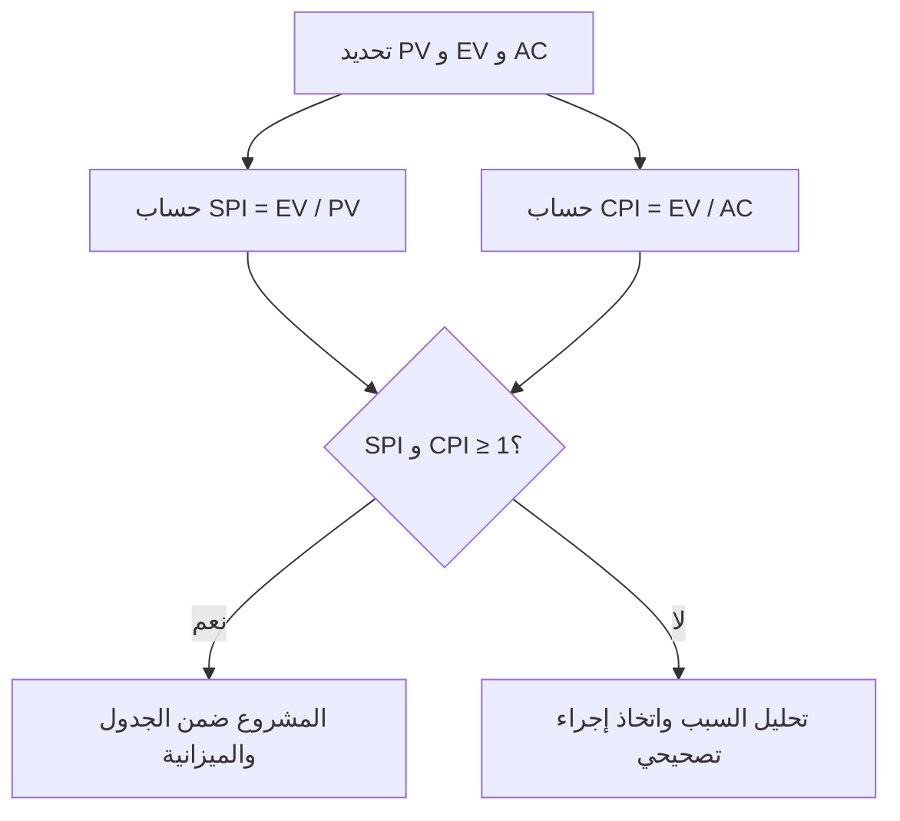

# مؤشّرا أداء التكلفة والجدول (CPI and SPI)

> [!info] تعريف مختصر
> CPI (Cost Performance Index) وSPI (Schedule Performance Index) مؤشران رقميان من أدوات إدارة القيمة المكتسبة ([[EVM]])، يقيسان مدى كفاءة المشروع في التكلفة والجدول الزمني مقارنة بالخطة المعتمدة (خط الأساس، [[Baseline]]).

## الشرح العلمي والاحترافي
- يعتمد المؤشران على ثلاث قيم أساسية في إدارة القيمة المكتسبة: القيمة المخططة (Planned Value - PV)، القيمة المكتسبة (Earned Value - EV)، والتكلفة الفعلية (Actual Cost - AC).
- **مؤشر أداء التكلفة (CPI)** = القيمة المكتسبة ÷ التكلفة الفعلية (EV / AC). يقيس مدى الكفاءة في استخدام الميزانية.
  - CPI = 1: المشروع يصرف بالضبط كما هو مخطط.
  - CPI أكبر من 1: المشروع أكثر كفاءة من الخطة (ينجز قيمة أكبر من كل دولار مصروف).
  - CPI أقل من 1: المشروع يتجاوز الميزانية المخططة.
- **مؤشر أداء الجدول الزمني (SPI)** = القيمة المكتسبة ÷ القيمة المخططة (EV / PV). يقيس مدى التقدّم الزمني الفعلي مقارنة بالمخطط.
  - SPI = 1: المشروع في الموعد المحدد تمامًا.
  - SPI أكبر من 1: المشروع متقدّم عن الجدول الزمني.
  - SPI أقل من 1: المشروع متأخر عن الجدول الزمني.
- يُستخدم كلا المؤشرين معًا لتشخيص حالة المشروع بدقة: فمشروع قد يكون في الموعد المحدد (SPI جيد) لكنه يتجاوز الميزانية (CPI ضعيف)، أو العكس.
- تُستخدم هذه المؤشرات أيضًا للتنبؤ بالتكلفة النهائية المتوقعة للمشروع (Estimate at Completion - EAC) بناءً على الأداء الحالي.

## أين ومتى يُستخدم
- يُستخدمان بكثرة في المشاريع الحكومية والدفاعية والإنشائية الكبرى التي تتبع منهجية إدارة القيمة المكتسبة رسميًا، وغالبًا ضمن منهجية الشلال ([[04 - Waterfall]]).
- يُحسبان دوريًا (أسبوعيًا أو شهريًا) أثناء مرحلة التنفيذ والرقابة على المشروع، ويُعرضان في تقارير الحالة لصاحب المصلحة والإدارة العليا.
- مفيدان بشكل خاص في العقود ذات السعر الثابت أو المدفوعات المرتبطة بمعالم ([[Milestone-based Payment]]) حيث تُستخدم كأداة تدقيق مالي وزمني رسمية.
- أقل شيوعًا في الفرق الرشيقة الصغيرة التي تفضل مؤشرات أبسط مثل مخطط النمو ([[Burnup Chart]]) أو الإنتاجية ([[18 - Velocity]])، لكنها لا تزال تُستخدم في برامج (Programs) كبيرة متعددة الفرق.

## مثال وسيناريو تطبيقي
> [!example] في مشروع إنشاء منصة حكومية إلكترونية بميزانية إجمالية 1,000,000 دولار ومدة سنة، وبعد مرور 6 أشهر: كانت القيمة المخططة (PV) 500,000 دولار (أي يُفترض إنجاز نصف العمل)، لكن القيمة المكتسبة (EV) الفعلية كانت 400,000 دولار فقط (أي أُنجز 40% من العمل)، بينما التكلفة الفعلية (AC) المصروفة بلغت 480,000 دولار. حساب المؤشرين: SPI = 400,000 ÷ 500,000 = 0.8 (تأخر عن الجدول)، وCPI = 400,000 ÷ 480,000 = 0.83 (تجاوز في الميزانية). عرض مدير المشروع هذين الرقمين على اللجنة التوجيهية، موضحًا أن المشروع متأخر بنسبة 20% تقريبًا عن الجدول ويستهلك ميزانية أكثر مما ينجزه من قيمة، وطلب إما موارد إضافية أو تعديل النطاق قبل نهاية الربع القادم.

## خطوات أو مخطّط
1. تحديد القيمة المخططة (PV) لكل فترة زمنية من خط الأساس ([[Baseline]]).
2. قياس القيمة المكتسبة (EV) الفعلية بناءً على العمل المنجز فعليًا.
3. تسجيل التكلفة الفعلية (AC) المصروفة حتى تاريخه.
4. حساب SPI = EV / PV، وCPI = EV / AC.
5. تفسير النتائج: هل المشروع متقدّم/متأخر زمنيًا؟ هل هو ضمن/متجاوز الميزانية؟
6. اتخاذ إجراء تصحيحي بناءً على التشخيص (إعادة توزيع الموارد، تعديل النطاق، أو تصعيد للإدارة).

## ⚠️ مفاهيم خاطئة شائعة
> [!warning]
> - الاعتقاد أن نسبة الإنفاق من الميزانية (مثال: "صرفنا 50%") تعني تقدمًا متوازنًا؛ المؤشر الصحيح هو مقارنة القيمة المكتسبة الفعلية وليس فقط المبلغ المصروف.
> - الخلط بين SPI وCPI؛ SPI يقيس الزمن، وCPI يقيس التكلفة، والمشروع قد يكون جيدًا في أحدهما وضعيفًا في الآخر.
> - الظن بأن SPI أقل من 1 يعني بالضرورة أن المشروع سيتأخر بنفس النسبة عند الانتهاء؛ المؤشر يعكس الأداء التراكمي حتى اللحظة الحالية فقط وقد يتغيّر لاحقًا.

## ❌ ممارسات خاطئة في المشاريع
> [!failure]
> - حساب المؤشرين مرة واحدة فقط في منتصف المشروع دون متابعة دورية، فتُكتشف الانحرافات الكبيرة متأخرًا جدًا. **الحل:** حساب المؤشرين بشكل دوري ثابت (أسبوعي أو شهري) طوال دورة حياة المشروع.
> - قياس "القيمة المكتسبة" بناءً على نسبة الوقت المنقضي بدلًا من العمل المُنجز فعليًا، مما يُعطي أرقامًا مضللة. **الحل:** ربط القيمة المكتسبة بمعايير إنجاز واضحة لكل مهمة (مثل معالم أو معايير الإتمام [[Definition of Done]]).
> - تجاهل التحقيق في سبب انخفاض المؤشرين والاكتفاء بتقرير الرقم دون تحليل السبب الجذري. **الحل:** إجراء تحليل السبب الجذري ([[Root Cause Analysis]]) عند أي انحراف واضح عن القيمة 1.

## 🔗 مصطلحات ومفاهيم ذات صلة
[[EVM]] | [[Baseline]] | [[Performance Measurement Baseline]] | [[Critical Path]] | [[Burnup Chart]] | [[Estimation Variance]] | [[Monte Carlo Simulation]] | [[Business Case]]
