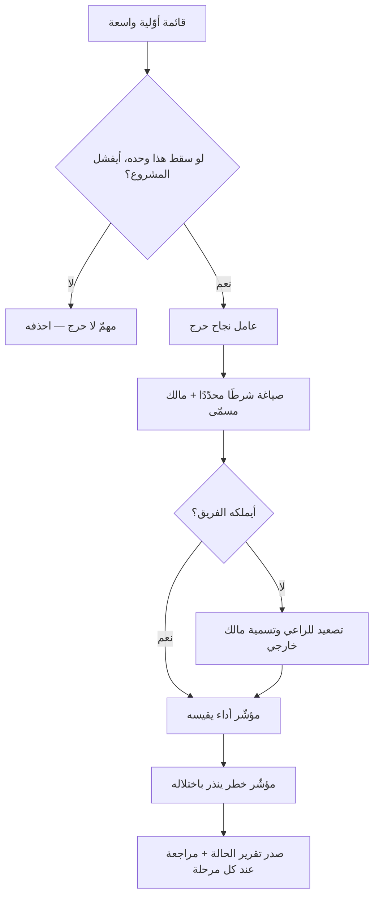

# عوامل النجاح الحرجة (CSF)

> [!info] تعريف مختصر
> **عوامل النجاح الحرجة (Critical Success Factors)** هي **المجالات القليلة التي إن سارت على ما ينبغي تحقّق النجاح، وإن اختلّ أحدها فشل العمل مهما أُتقن ما سواه**. وهي **شروط لا مقاييس**: تصف *ما الذي يجب أن يكون قائمًا*، ويأتي [[KPI|مؤشّر الأداء]] بعدها ليقيس *هل هو قائم فعلًا*. وقد أشاع المفهوم **جون روكارت** من معهد ماساتشوستس للتقنية في مقالته بمجلة *Harvard Business Review* سنة 1979، بناءً على عمل سابق لـ**رونالد دانيال** سنة 1961، وكان غرضه حلّ مشكلة الإدارة مع البيانات: **لا كثرة التقارير هي المطلوبة، بل قِلّةٌ منها تخصّ ما لا يُحتمل فيه الفشل.**

## الشرح العلمي والاحترافي

### 1. الخاصّية التي تُعرَّف بها

- **العامل الحرج علاقته بالنجاح علاقة شرط لا علاقة إسهام.** فما زاد النجاح إن تحسّن ونقص إن ساء **عاملٌ مؤثّر لا حرج**؛ والحرج ما **يُسقط العمل كلّه** إن اختلّ.
- **ومحكّه سؤال واحد:** لو أُتقن كل شيء آخر وسقط هذا وحده، أينجح المشروع؟ **فإن كان الجواب لا، فهو حرج. وإن كان نعم — ولو بصعوبة — فليس منها.**
- ولهذا يكون عددها **قليلًا بطبيعته**: خمسة فأقلّ في الغالب. **وقائمةٌ فيها اثنا عشر «عاملًا حرجًا» دليلٌ على أن التصفية لم تقع.**

### 2. من أين تُستخرج؟

قسّم روكارت مصادرها، وأنفعها في سياق المشاريع أربعة:

1. **طبيعة القطاع**: فما هو حرج في منصّة صحية ليس هو الحرج في متجر إلكتروني.
2. **الاستراتيجية والموقع التنافسي**: فالمنظّمة الداخلة حديثًا على السوق يحرُج عندها ما لا يحرُج عند المستقرّة فيه.
3. **عوامل البيئة** الخارجة عن السيطرة: تنظيمية، أو اقتصادية، أو تقنية.
4. **عوامل زمنية مؤقّتة**: ما هو حرج هذا العام لظرف طارئ ولن يكون كذلك بعده — كاعتماد نظامي مرتقب، أو انتقال بنية تحتية.

**والرابع أكثرها إهمالًا**، لأن العوامل تُكتب مرّة في بداية المشروع ثم تُعامَل ثوابت، بينما بعضها بطبيعته مؤقّت.

### 3. الفرق الذي يقع فيه أكثر الخلط

- **العامل الحرج شرط، والمؤشّر قياسه.** فـ«جاهزية بيانات العميل قبل الترحيل» **عامل حرج**؛ و«نسبة السجلّات المرحَّلة بنجاح في التجربة الجافّة» **مؤشّر** يقيسه؛ و«انخفاض هذه النسبة عن 85%» **[[KRI|مؤشّر خطر]]** ينذر باختلاله.
- وتصحّ العلاقة عكسًا فحسب: **لكل عامل حرج مؤشّر يقيسه، وليس لكل مؤشّر عاملٌ حرج وراءه**. ولهذا يُستعمل استخراج العوامل الحرجة **مصفاةً للوحات المقاييس**: كل مؤشّر لا يخدم عاملًا حرجًا مرشّح للحذف.
- **وأنفع ما فيها أنها تكشف ما لا يملكه الفريق.** فأكثر عوامل نجاح المشاريع خارج قدرة الفريق: التزام الراعي، وتفرّغ خبير الأعمال، وجاهزية بيانات العميل. **وتسميتها صراحةً تنقل المسؤولية إلى من يملكها بدل أن تبقى معلّقة حتى يقع الفشل فيُسأل عنها من لم يكن يملكها.**

### 4. حدودها

- **ليست معيارًا رسميًّا** بل ممارسةً إدارية مستقرّة، ولا صيغة محدّدة لاستخراجها. **وقيمتها في انضباط السؤال لا في قالب الجواب.**
- **وتفسد بأمرين شائعين**: أن تُكتب عامّة حتى تصير شعارات («التواصل الفعّال» · «دعم الإدارة»)، وأن يُكتفى بكتابتها بلا مالك ولا مؤشّر. **فالعامل الحرج بلا مالك ليس التزامًا بل أمنية موثّقة.**

## أين ومتى يُستخدم

- في بدء المشروع، إلى جانب [[Business Case|مبرّر العمل]] و[[Scope Statement|وثيقة النطاق]]، لتحديد الشروط التي يقوم عليها التقدير كلّه.
- في تصفية لوحات المقاييس: أيّ مؤشّر يخدم عاملًا حرجًا؟ وما لا يخدم شيئًا يُحذف.
- في اشتقاق [[KRI|مؤشّرات الخطر]]: فكل عامل حرج يقابله خطرٌ هو اختلاله، وكل خطر يحتاج مؤشّرًا سابقًا ينذر به.
- في التفاوض مع الراعي وأصحاب المصلحة: تُعرض العوامل التي لا يملكها الفريق ليُسمَّى لكلٍّ منها مالكٌ صراحةً.
- في المراجعة اللاحقة ([[Lessons Learned]]): أيّ عامل حرج اختلّ، وهل كان مرصودًا أصلًا؟

## مثال وسيناريو تطبيقي

> [!example] سيناريو ملموس
> مشروع منصّة خدمات لجهة حكومية، حُدّدت له في جلسة التأسيس **أربعة عوامل حرجة** بعد تصفية قائمة أوّلية فيها أحد عشر:
> 1. **تفرّغ خبير الأعمال من الجهة** بمعدّل يومين أسبوعيًّا — لأن قواعد العمل غير موثّقة ولا مصدر لها سواه.
> 2. **جاهزية بيانات المستفيدين** قبل موعد الترحيل.
> 3. **صدور الموافقة الأمنية** على الربط مع المنصّة الوطنية قبل مرحلة التكامل.
> 4. **استقرار متطلّبات الفوترة** بعد اعتمادها، لارتباطها بالتزام نظامي.
> **ولاحظ أن ثلاثة من الأربعة لا يملكها فريق التنفيذ** — وهذه ثمرة التمرين الأولى: أن يظهر ذلك في اليوم الأوّل لا في الشهر السابع.
> فسُمّي لكلٍّ منها مالكٌ من الجهة، ورُبط بمؤشّر واحد ومؤشّر خطر واحد. فصار تقرير الحالة الشهري يبدأ بأربعة أسطر — حالة كل عامل — قبل أي حديث عن المهام.
> وفي الشهر الرابع تعثّرت الموافقة الأمنية. **وقد كان مؤشّرها أصفر منذ ستّة أسابيع**، فأمكن إعادة ترتيب المراحل وتقديم ما لا يعتمد على الربط. **ولو لم يكن العامل مسمّى ومرصودًا، لظهر التعثّر يوم استحقاق التكامل — أي بعد فوات أوان الترتيب.**

## خطوات أو مخطّط

1. **اجمع قائمة أوّلية واسعة** مع الفريق والراعي: ما الذي يجب أن يسير على ما ينبغي؟
2. **صفِّ بالمحكّ**: لو أُتقن كل شيء آخر وسقط هذا وحده، أينجح المشروع؟ **وما لم يُسقط المشروع يُحذف** — ولو كان مهمًّا.
3. **اقصرها على خمسة فأقلّ**، وصُغ كلًّا منها **شرطًا محدّدًا قابلًا للفحص** لا صفةً عامّة.
4. **سمِّ مالكًا لكل عامل**، وميّز صراحةً ما يقع خارج قدرة الفريق.
5. **اربط بكل عامل مؤشّرًا يقيسه ومؤشّر خطر ينذر باختلاله** ([[KRI]]).
6. **اجعلها صدر تقرير الحالة**، فحالة العوامل الأربعة أدلّ على مصير المشروع من قائمة المهام المنجزة.
7. **راجعها عند كل مرحلة فاصلة**، فالعوامل الزمنية تنقضي وتحلّ محلّها أخرى.

## ⚠️ مفاهيم خاطئة شائعة

> [!warning]
> - **الخلط بينها وبين مؤشّرات الأداء**: العامل **شرطٌ يجب أن يكون قائمًا**، والمؤشّر **رقمٌ يقيس قيامه**. وكتابة العامل رقمًا يُفقده وظيفته، لأنه حينئذ يقيس ولا يشترط.
> - **الظنّ أنها قائمة بكل ما هو مهمّ**: أكثر ما في المشروع مهمّ؛ والحرج **ما يُسقطه وحده**. وقائمة فيها اثنا عشر عاملًا لم تُصفَّ بعد.
> - **صياغتها شعارات**: «دعم الإدارة العليا» و«التواصل الفعّال» عبارات لا تُفحص ولا يُسأل عنها أحد. **والصياغة الصحيحة تذكر ما هو، وكم، ومتى، ومن يملكه.**
> - **الظنّ أنها ثابتة طوال المشروع**: منها ما هو زمنيّ ينقضي بانقضاء سببه، ومنها ما يظهر متأخّرًا. **فتُراجَع عند كل مرحلة فاصلة.**
> - **الظنّ أنها مسؤولية الفريق وحده**: أكثرها خارج قدرته، **وهذه فائدتها الكبرى لا عيبها** — أن تُسمّى وتُسنَد إلى مالكيها الحقيقيين قبل أن يقع الفشل.
> - **الخلط بينها وبين [[Kill Criteria|شروط الإيقاف]]**: تلك حدود تُوجب **إيقاف** المبادرة إن بلغتها، وهذه شروط يجب أن **تتحقّق** ليمضي العمل.

## ❌ ممارسات خاطئة في المشاريع

> [!failure]
> - **كتابتها في وثيقة التأسيس ثم عدم العودة إليها**: تصير طقسًا في المستند الأوّل، ويُكتشف اختلال العامل يوم استحقاقه. **التجنّب:** اجعل حالة العوامل بندًا ثابتًا في صدر كل تقرير حالة.
> - **قبول عامل خارج قدرة الفريق بلا مالك خارجي مسمّى**: يبقى معلّقًا حتى يقع الفشل، فيُسأل عنه من لم يكن يملكه. **التجنّب:** لا يُعتمد عامل بلا اسم مالك مكتوب، وليكن ذلك شرطًا في اعتماد الميثاق.
> - **الإكثار حتى تفقد معناها**: قائمة من عشرة تعني ألّا شيء حرج، وتُقرأ ولا تُغيّر أولوية. **التجنّب:** خمسة حدًّا أقصى، وما زاد يُنقل إلى المخاطر أو الافتراضات في [[RAID Log|سجلّ RAID]].
> - **الاكتفاء بها بلا مؤشّرات**: تبقى وصفًا حسنًا لا يُعرف حاله إلا بالسؤال، والسؤال يُجاب عنه بالاطمئنان غالبًا. **التجنّب:** لكل عامل مؤشّر واحد على الأقلّ ومؤشّر خطر واحد.
> - **استعمالها للتبرير بعد الفشل لا للتوجيه قبله**: تُستخرج في المراجعة اللاحقة لبيان أن السبب خارجي. **التجنّب:** تُكتب في اليوم الأوّل وتُرصد، وإلا فليست عوامل نجاح بل أعذارًا مؤجّلة.

## 🔗 مصطلحات ومفاهيم ذات صلة

[[KRI]] | [[KPI]] | [[Business Case]] | [[Kill Criteria]] | [[RAID Log]] | [[Risk Register]] | [[Sponsor]] | [[Readiness Assessment]] | [[Lessons Learned]] | [[23 - Project Program Portfolio]]
