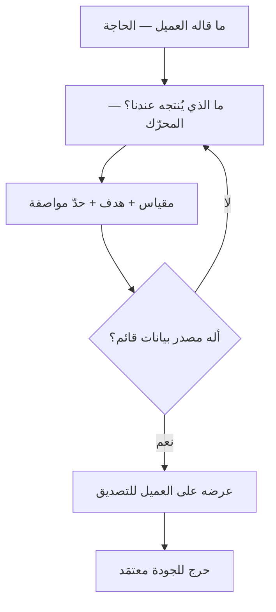

# الحرج للجودة (CTQ)

> [!info] تعريف مختصر
> **الحرج للجودة (Critical to Quality)** هو الخاصّية التي يحكم بها العميل على جودة المنتج أو الخدمة، **مصوغةً مقياسًا له حدّ رقميّ**. ووظيفته وظيفة الجسر: أن ينقل ما قاله العميل بلغته — «الاستجابة بطيئة» — إلى شرطٍ يستطيع الفريق أن يبنيه ويختبره ويحكم على تحقّقه بلا اجتهاد: «يُؤكَّد الطلب خلال ثلاث دقائق في 95% من الحالات». فما دام مطلب العميل صفةً (سريع · سهل · موثوق) فهو **رأي**؛ ومتى صار مقياسًا وهدفًا وحدًّا فهو **مواصفة**. وهذا التحويل هو كلّ ما يعنيه المصطلح.

## الشرح العلمي والاحترافي

### 1. من أين جاء؟ ولماذا في مرحلة «عرِّف» تحديدًا

نشأ المصطلح في أدبيات الجودة الأمريكية — وأصّله جوزيف جوران (Joseph Juran) في **شجرة الحرج للجودة** — ثم صار ركنًا في مرحلة «عرِّف» من [[DMAIC]] في [[Six Sigma|ستّة سيجما]]. وموضعه في أوّل المراحل ليس ترتيبًا اعتباطيًّا: فمشروع التحسين الذي يبدأ بلا حدٍّ رقميّ متّفق عليه **لا يملك تعريفًا للنجاح**، فيقيس ما تيسّر قياسه، ثم يعلن الانتصار على ما قاسه.

### 2. شجرة الحرج للجودة: ثلاث طبقات لا واحدة

الخطأ الشائع أن يُقفز من كلام العميل إلى الرقم مباشرةً، فيُختار رقم لا يقيس ما يشتكي منه أصلًا. والشجرة تمنع ذلك بأن تُدخل طبقة وسطى:

| الطبقة | ما هي | مثالها |
|---|---|---|
| **الحاجة** (Need) | ما قاله العميل بلغته، كما قاله | «الحجز متعب» |
| **المحرّك** (Driver) | ما الذي في الخدمة يُنتج هذا الشعور؟ | طول الإجراء · غموض الخطوة التالية · تكرار إدخال البيانات |
| **الحرج للجودة** (CTQ) | مقياس ذلك المحرّك، وهدفه، وحدّه | «إتمام الحجز في ≤ 4 خطوات، و90% من المستخدمين الجدد يتمّونه دون مساعدة» |

**والطبقة الوسطى هي موضع العمل كلّه.** فالحاجة الواحدة قد تنشأ عن ثلاثة محرّكات، وكلٌّ منها يقود إلى مقياس مختلف وإلى عمل مختلف. فمن أسقطها اختار المحرّك الذي يعرف قياسه، لا الذي يشتكي منه العميل.

### 3. الأركان الثلاثة لكل حرج مكتمل

المطلب الذي ينقصه ركن من هذه الثلاثة لا يُحتجّ به عند الخلاف:

1. **المقياس** — ما الذي يُقاس بالضبط، وبأي وحدة، ومن أين يُؤخذ الرقم؟ فـ«زمن الاستجابة» غير مكتمل ما لم يُقل: أمن نقر المستخدم إلى ظهور أوّل محتوى، أم إلى اكتمال الصفحة؟
2. **الهدف** (Target) — القيمة المطلوبة.
3. **حدّ المواصفة** (Specification Limit) — الحدّ الذي يصير ما بعده **عيبًا** لا تفاوتًا مقبولًا. وهو الركن الذي يُنسى غالبًا، وهو الذي يجعل الحرج قابلًا للاحتجاج: فبدونه يبقى كل انحراف موضع نقاش.

### 4. موضعه من بقيّة نظام القياس

الحرج للجودة يُخلط بثلاثة جيران، وقد جُمعت الأربعة في جدول واحد داخل [[KRI|مؤشّر الخطر الرئيسي]]. وخلاصته: **[[CSF|عامل النجاح الحرج]]** شرطٌ لا رقم، و**[[KPI|مؤشّر الأداء]]** يقيس ما تحقّق، و**مؤشّر الخطر** يقيس ما يُنذر، و**الحرج للجودة** يحدّد **ما يقبله العميل** — أي أنه وحده من بينها **مواصفةٌ يُحاكَم عليها التسليم**، لا مقياسٌ يُتابَع.

وفرقه عن [[Quality Attributes|خصائص الجودة]] فرق منشأ لا فرق طبيعة: خصائص الجودة تُشتقّ من **هندسة النظام** وما يحتمله، والحرج للجودة يُشتقّ من **العميل** وما يحكم به. وحيث التقيا صار الحرج للجودة هدفًا تُعايَر عليه خاصّية الجودة.

### 5. لماذا لا يصلح كل مطلب أن يكون حرجًا للجودة؟

لأن المصطلح فيه كلمة «حرج»، ومعناها أن **إخلاله يُفقد العميل رضاه**، لا أنه مرغوب. فقائمة تضمّ أربعين حرجًا للجودة قائمةُ متطلّبات أُعيد وسمها، وقد أسقطت المعلومة الوحيدة التي كانت تحملها: أيّها لا يُتنازل عنه. والعدد العملي في أكثر المشاريع بين ثلاثة وسبعة.

## أين ومتى يُستخدم

- في مرحلة «عرِّف» من [[DMAIC]]، بوصفه المخرَج الذي بدونه لا تُفتح المرحلة التالية.
- عند ترجمة مخرجات [[Voice of the Customer|صوت العميل]] إلى مُدخل قرار — وهو الموضع الطبيعي للشجرة أعلاه.
- عند صياغة [[SLA|اتّفاقية مستوى الخدمة]] مع مورّد أو عميل، إذ يصير الحرج للجودة بندًا تعاقديًّا.
- عند كتابة [[Definition of Done|تعريف الاكتمال]] لميزة يحكم عليها المستخدم بالإحساس لا بالوظيفة (السرعة · السلاسة · الوضوح).
- في مراجعة [[Functional Specification|المواصفات الوظيفية]]، لفحص كل جملة فيها بالسؤال: **بأي رقم أُثبت أن هذه الجملة تحقّقت؟**

## مثال وسيناريو تطبيقي

> [!example] سيناريو ملموس
> منصّة توصيل، وشكوى متكرّرة في مراجعات المتجر: **«التطبيق بطيء.»**
>
> **بلا شجرة:** قاس الفريق ما يعرف قياسه — زمن تحميل الصفحة الرئيسية — فوجده 1.2 ثانية، فأغلق الشكوى بوصفها انطباعًا لا أساس له.
>
> **بالشجرة:** فُصلت الحاجة عن محرّكاتها، فظهر أن «البطء» ينشأ عن ثلاثة مواضع مختلفة: تحميل الواجهة، وزمن تأكيد الطلب بعد الدفع، ووضوح حالة الطلب أثناء انتظاره. فصيغ لكلٍّ منها حرجٌ مستقلّ:
>
> | المحرّك | الحرج للجودة | الهدف | حدّ المواصفة |
> |---|---|---|---|
> | تحميل الواجهة | زمن ظهور أوّل محتوى | ≤ 1 ثانية | 2 ثانية |
> | تأكيد الطلب | من ضغط «ادفع» إلى رسالة التأكيد | ≤ 3 ثوانٍ في 95% | 8 ثوانٍ |
> | حالة الطلب | مدّة بقاء الحالة بلا تحديث | ≤ 60 ثانية | 180 ثانية |
>
> والقياس الذي تلا ذلك أظهر أن الأوّل سليم كما ظنّ الفريق، وأن الثاني عند المئين 95 يبلغ **19 ثانية**. فالشكوى كانت صحيحة، وكان القياس الأوّل يقيس الموضع الخطأ.

## خطوات أو مخطّط

1. اجمع كلام العميل نصًّا كما قاله، من قنوات متعدّدة لا من قناة واحدة.
2. صنّفه حاجاتٍ متمايزة، ولا تدمج شكويين لمجرّد تشابه لفظهما.
3. استخرج لكل حاجة **محرّكاتها** — واسأل «ما الذي في خدمتنا يُنتج هذا؟» حتى تصل إلى شيء تملك تغييره.
4. حوّل كل محرّك إلى مقياس، وحدّد له هدفًا وحدَّ مواصفة.
5. **تحقّق أن الرقم يُؤخذ فعلًا** من نظام قائم — فالحرج الذي لا مصدر بيانات له أمنية.
6. اعرضه على العميل بلغته: «أهذا ما تعنيه بالسريع؟» — فإن اعترض، فالخلل في الطبقة الوسطى لا في الرقم.

## ⚠️ مفاهيم خاطئة شائعة

> [!warning]
> - **الظنّ أنه مرادف لمؤشّر الأداء.** مؤشّر الأداء يقيس أداءك أنت وتختاره لنفسك؛ والحرج للجودة **شرط قبولٍ يملكه العميل**، وتجاوزه عيبٌ لا تراجُع أداء. والجدول الفارق في [[KRI]].
> - **حسبانه رقمًا يُشتقّ من قدرة النظام الحالية.** فمن اشتقّ الحدّ من متوسّط أدائه اليوم لم يترجم مطلب عميل، بل وثّق حاله وسمّاه مواصفة.
> - **الاكتفاء بالهدف دون حدّ المواصفة.** «نستهدف ثانيتين» جملة نيّة؛ والسؤال الذي يقع الخلاف عليه هو: **وأربع ثوانٍ، أعيبٌ هي أم مقبولة؟**
> - **الخلط بينه وبين [[Quality Attributes|خصائص الجودة]].** انظر البند 4 أعلاه: الفرق في المنشأ — من العميل أم من هندسة النظام — لا في الشكل.

## ❌ ممارسات خاطئة في المشاريع

> [!failure]
> - **تحويل كل بند في وثيقة المتطلّبات إلى «حرج للجودة»** حتى يصير الوسم بلا دلالة، فتضيع الأولوية التي كان المصطلح موجودًا لحملها.
> - **قياس المتوسّط والالتزام به.** فتوزيعات الأزمنة منحرفة لليمين، والعميل يعيش تجربته لا متوسّط تجارب الناس. والالتزام يُبنى على مئين مرتفع كما في [[Percentiles and Median vs Average|المئينات والوسيط مقابل المتوسط]].
> - **صياغة الحرج بلغة الفريق لا بلغة العميل**، فيصير بندًا تقنيًّا لا يستطيع أحد من جانب العميل التصديق عليه ولا الاعتراض.
> - **تجميد الحرج للجودة بعد اعتماده.** فما يعدّه العميل جودةً يتحرّك بتحرّك السوق: الحدّ الذي كان ممتازًا قبل ثلاث سنوات صار اليوم أدنى المقبول، والمراجعة الدورية جزء من الأداة لا استثناء عليها.

## 🔗 مصطلحات ومفاهيم ذات صلة

[[Voice of the Customer]] | [[DMAIC]] | [[Six Sigma]] | [[KRI]] | [[KPI]] | [[CSF]] | [[Quality Attributes]] | [[Definition of Done]] | [[SLA]] | [[SLO]] | [[Functional Specification]] | [[Percentiles and Median vs Average]] | [[Quality Assurance]] | [[Escaped Defect Rate]]
