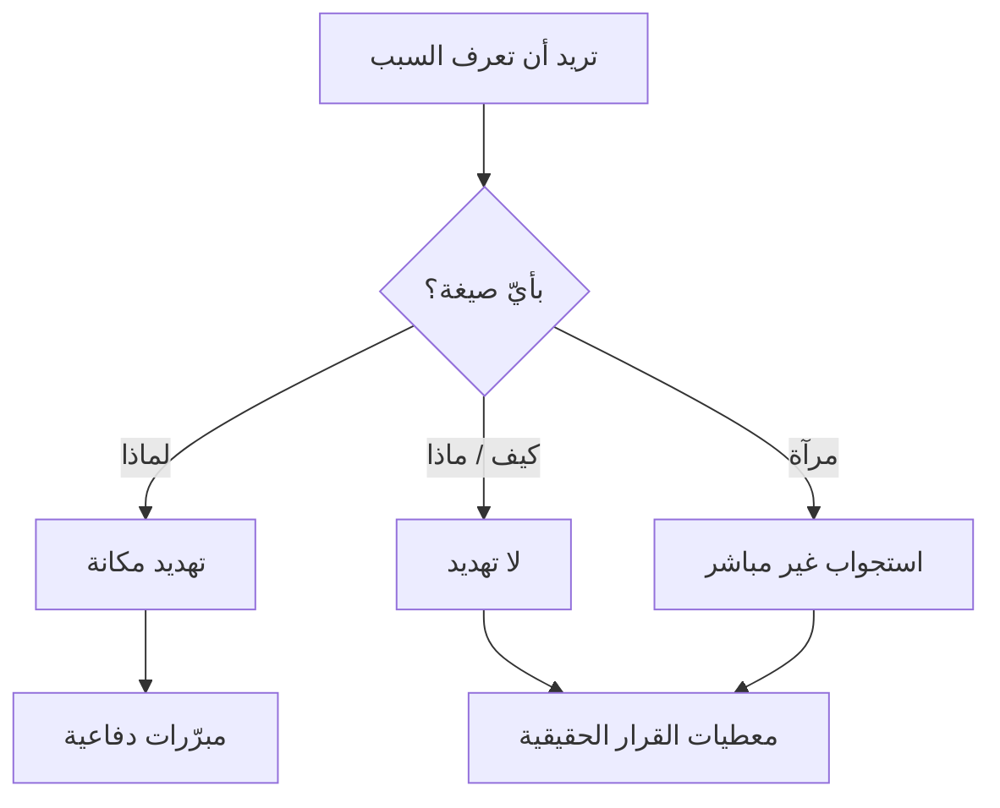

# الأسئلة المعايرة (Calibrated Questions)
> [!info] تعريف مختصر
> الأسئلة المعايرة أسئلة مفتوحة تبدأ بـ**«كيف»** و**«ماذا»** — ولا تبدأ بـ**«لماذا»** أبدًا — تُشغّل تفكير الطرف الآخر بدل دفاعه، فيصل هو إلى الحدّ أو الحلّ بدل أن تُخبره به.

## الشرح العلمي والاحترافي
التقنية لـ**كريس فوس**، وقاعدتها المركزية **حظر «لماذا»**. والسبب ليس فظاظة الكلمة بل **ذاكرتها الاجتماعية**: في معظم اللغات تُستخدَم «لماذا» في سياق المساءلة أكثر من سياق الاستفسار، فتُستقبَل طلبًا للتبرير لا للوصف.

| البُعد | «لماذا فعلت هذا؟» | «ما الذي جعل هذا الخيار الأنسب؟» |
|---|---|---|
| ما يُطلَب | تبرير | وصف عملية القرار |
| ما يفترضه | أنّ في الأمر ما يستحقّ التبرير | لا شيء |
| ما تحصل عليه | مبرّرات مُعدّة سلفًا | **معطيات القرار الحقيقية** |

**وثلاثة أنواع:**

| النوع | الوظيفة | مثال | المزلق |
|---|---|---|---|
| **المُعجِز** | أن يصل **هو** إلى الحدّ | «كيف نُسلّم هذا ولا نقتطع من الملتزم به؟» | **إن تكرّر يُقرأ تهكّمًا** |
| **العصف** | استخراج المخاطر | «ما الذي قد يُعطّلنا في التنفيذ؟» | يُطرَح مبكّرًا فيُقرأ تشاؤمًا |
| **الاستكشافي** | فهم الأثر والدافع | «ماذا يتغيّر إن خرجت الأسبوع القادم؟» | — الأكثر أمانًا |

**وبديل «لماذا» حين تحتاجها فعلًا** هو [[Mirroring|المرآة]]: «ثلاثة أيّام؟» تُؤدّي وظيفة السؤال الاستفهامية بلا حمولته الاتّهامية.

## أين ومتى يُستخدم
- بعد التهدئة مباشرةً، للانتقال من الحالة إلى الحلّ — الخطوة الثالثة في [[Displacement Strategy|الإزاحة]].
- مع طلب مستحيل يُصرّ صاحبه عليه (سؤال مُعجِز).
- قبل إغلاق أيّ التزام، لاستخراج المخاطر (سؤال عصف).
- مع من يتكلّم بالعاطفة — فالسؤال المعايَر يُقيّد الجدال ويُحوّله إلى منطق.

## مثال وسيناريو تطبيقي
> [!example] صاحب مصلحة يطلب ربطًا بشبكة مدفوعات حكومية «خلال ثلاثة أيّام». الردّ الغريزي — «هذا مستحيل، سعتنا ممتلئة ونحتاج تحليلًا» — يُنتج دفاعًا وإصرارًا ويصنع صراعًا من لا شيء. أمّا التسلسل الصحيح: مرآة على **القيد القابل للقياس** — «ثلاثة أيّام؟» ← صمت ← ثم **سؤال مُعجِز**: «كيف يمكننا الوصول إلى ذلك؟» فيبدأ هو في تعداد ما يلزم: اتفاق مع مزوّد الدفع، ورسوم، وواجهة برمجية لا يملكها بعد. **وصل إلى الاستحالة بنفسه** — فلم يُرفَض له طلب، ولم يُهزَم أمام أحد.

## خطوات أو مخطّط
1. احذف «لماذا» من صياغتك واستبدل بها «كيف» أو «ماذا».
2. اجعل الفاعل **«نحن»** لا «أنت»: «ما الذي عطّل**نا**؟» لا «لماذا تأخّرت؟».
3. اطرح **سؤالًا مُعجِزًا واحدًا** في الحوار — وإن لم ينجح فانتقل إلى مفاضلة صريحة لا إلى سؤال مُعجِز ثانٍ.
4. اطرح سؤال العصف **بعد** الاتّفاق على الاتّجاه لا قبله.
5. اصمت بعد كلّ سؤال — السؤال المعايَر بلا صمت استجواب مُهذَّب.

| بدل | قل |
|---|---|
| لماذا تأخّرت؟ | «ما الذي عطّلنا في هذا البند؟» |
| لماذا الآن؟ | «ما الذي يتغيّر إن خرجت هذا الأسبوع بدل القادم؟» |
| لماذا لم تُخبرني؟ | «كيف نجعل هذا يصلني أبكر؟» |
| هذا مستحيل | «كيف يمكننا الوصول إلى ذلك؟» |
| لماذا نفعل هذا؟ | «ماذا يحدث إن لم نفعله؟» |

## ⚠️ مفاهيم خاطئة شائعة
> [!warning]
> - **ليست حيلة لغوية.** الفرق بين «لماذا» و«ما الذي» فرق في **الحالة العصبية التي يُنتجها السؤال** لا في التهذيب.
> - **«لماذا» ليست ممنوعة في التحليل** — [[Root Cause Analysis|الأسباب الخمسة]] أداة ممتازة **بعد** التهدئة وبصيغة نظامية عن العملية، لا عن الأشخاص وأثناء الصراع.
> - **السؤال المُعجِز ليس إفحامًا.** الخيط بينه وبين التهكّم رفيع، وثلاثة عوامل تُحدّد أيّهما يُسمَع: النبرة · صيغة الفاعل («كيف **نصل**» لا «كيف **تتوقّع منّي**») · وعدم التكرار.

## ❌ ممارسات خاطئة في المشاريع
> [!failure]
> - **تكرار السؤال المُعجِز** — مرّتان تُقرأ إحراجًا وثلاث تُقرأ إذلالًا. الحل: واحد فقط، ثم مفاضلة: «الخياران: نُؤجّل بندًا أو نمدّ أسبوعًا — أيّهما تُفضّل؟».
> - **سؤال عصف قبل الاتّفاق على الاتّجاه** — «ما الذي قد يفشل؟» في أوّل الحوار يُقرأ رفضًا مُغلَّفًا.
> - **صياغة السؤال بحيث يُجاب بـ«نعم»** — «هل توافق؟» تضع الطرف الآخر في الزاوية الدفاعية. الحل: «هل تعترض إن…؟» — انظر [[Psychological Reactance]].
> - **طرح السؤال ثم الإجابة عنه بنفسك** بعد ثانيتين من الصمت — فتُلغي الوظيفة كلّها.

## 🔗 مصطلحات ومفاهيم ذات صلة
[[Mirroring]] | [[Labeling]] | [[Displacement Strategy]] | [[Positive Refusal]] | [[Sandwich Method]] | [[Root Cause Analysis]] | [[Psychological Reactance]] | [[Tactical Silence]] | [[Facilitator]]

> [!tip] 💡 إثراء عملي — كورس لعبة العقل
> جدول الاستبدال الكامل، والأنواع الثلاثة، وبروتوكول الإغلاق: [[08 - الإزاحة والأسئلة المعايرة]].
