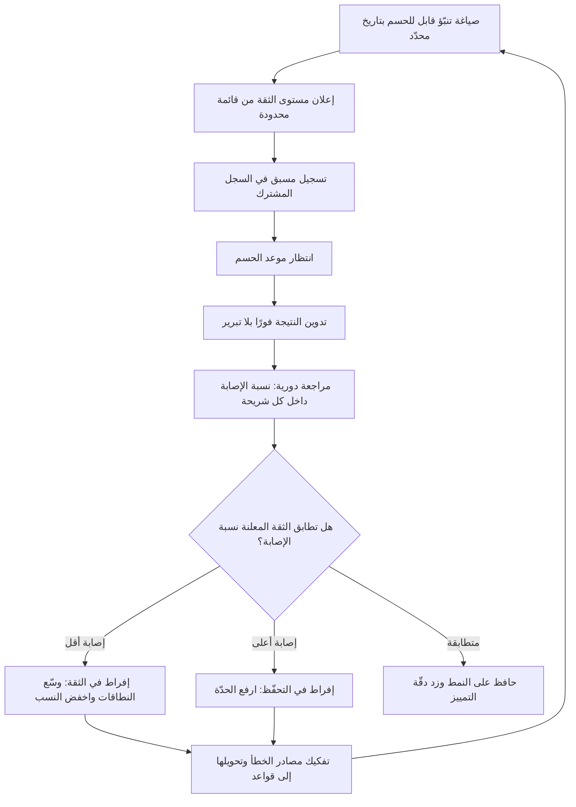

# معايرة الثقة (Calibration)

> [!info] تعريف مختصر
> صفة في **من يتنبّأ** لا في التنبّؤ الواحد: أن تتطابق درجة ثقتك المعلنة مع نسبة إصابتك الفعلية على المدى الطويل. فمن قال «أنا واثق بنسبة 70%» في مئة موقف، ينبغي أن يصيب في نحو سبعين منها؛ فإن أصاب في خمسة وتسعين فهو **مفرط في التواضع**، وإن أصاب في أربعين فهو **مفرط في الثقة** — وهذا الأخير هو النمط السائد بفارق كبير. المعايرة ليست موهبة بل **مهارة قابلة للتدريب والقياس**، وأداتها الأساسية سجلّ تنبّؤات مكتوب مسبقًا وتُراجَع نتائجه دوريًّا. وقيمتها في المشاريع مباشرة: بلا معايرة، تصبح كل الأرقام في سجل المخاطر وخطط التقدير زخرفة.

## الشرح العلمي والاحترافي
- **معنى دقيق ومحدّد**: المعايرة تُقاس على **مجموعة** من التنبّؤات لا على تنبّؤ واحد. لا يمكن الحكم على من قال «احتمال التأخير 80%» بأنه أخطأ إن لم يتأخّر المشروع؛ فالنتيجة الواحدة لا تكذّب احتمالًا. لهذا لا يوجد بديل عن السجل المتراكم: عشرات التنبّؤات المصنَّفة بمستويات ثقة، ثم مقارنة النسبة المعلنة بالنسبة المحقّقة داخل كل شريحة.
- **مقياسان لا واحد: المعايرة والحدّة**: التنبّؤ الجيّد يجمع صفتين. **المعايرة** (Calibration) أن تكون نسبك صادقة؛ و**الحدّة** (Resolution / Sharpness) أن تبتعد عن 50% حين تستطيع. من يقول «50%» عن كل شيء معايَر تمامًا لكنه بلا فائدة إطلاقًا. الهدف: أقصى حدّة ممكنة مع الحفاظ على صدق النسب — وهذا هو التوتّر الذي يجعل المهارة صعبة.
- **كيف تُقاس**: عمليًّا يُبنى **رسم المعايرة**: المحور الأفقي الثقة المعلنة مقسّمة إلى شرائح (50–60%، 60–70%، …)، والمحور الرأسي نسبة الإصابة الفعلية في كل شريحة، والخط المثالي هو القُطر. ويُستخدم في الأدبيات مقياس كمّي شائع هو **درجة برايير (Brier Score)** — متوسّط مربّع الفرق بين الاحتمال المعلن والنتيجة الفعلية (0 أو 1)؛ كلما انخفضت الدرجة كان التنبّؤ أفضل، وهي تعاقب الثقة العالية الخاطئة عقابًا شديدًا.
- **الإفراط في الثقة نمط موثّق ومنهجي**: تُظهر أدبيات علم النفس المعرفي بشكل متكرّر أن الناس يعطون نطاقات أضيق ممّا يستحق ما يعرفونه؛ فحين يُطلب نطاق «واثق بنسبة 90%»، تقع الإجابة الصحيحة خارج النطاق أكثر بكثير من 10% من الحالات. الأخطر أن الخبرة في المجال لا تصحّح هذا تلقائيًّا — بل قد تزيده حين تكون التغذية الراجعة بطيئة أو غائبة، وهو حال أغلب قرارات المشاريع.
- **شرطا التعلّم**: تتحسّن المعايرة حين يتوافر أمران: **تغذية راجعة سريعة وواضحة** (تعرف بعد وقت قصير أنك أصبت أم لا)، و**تسجيل مسبق** يمنع إعادة كتابة الذاكرة. غياب أحدهما يفسّر لماذا يظلّ خبراء كثيرون غير معايَرين رغم عقود الخبرة: لأنهم لا يسجّلون، ولأن نتائج قراراتهم تظهر بعد شهور فتُنسب إلى عوامل أخرى.
- **تقنيات تدريبية عملية**: (١) **اختبار النطاق**: أجب عن أسئلة معلومة الإجابة بنطاق ثقة 90% وقِس كم مرّة وقعت الإجابة خارجه. (٢) **اختبار الرهان المكافئ**: اسأل نفسك — هل أُفضّل الرهان على هذا الحدث، أم على سحب كرة فائزة من صندوق فيه 70 كرة فائزة من 100؟ إن ترددت، فتقديرك ليس 70%. (٣) **البحث المتعمّد عن الدليل المضاد** قبل تثبيت الرقم، كترياق لـ[[Confirmation Bias]]. (٤) **الشرح المسبق للفشل (Pre-mortem)**: افترض أن المبادرة فشلت بعد سنة واكتب الأسباب — يوسّع هذا النطاقات بشكل ملموس.
- **العلاقة بمعدّل الأساس**: المعايرة والمرساة التاريخية توأمان. البدء من [[Base Rate]] يمنح نقطة انطلاق صادقة، والمعايرة تضبط مقدار انحرافك عنها. من يتجاهل التاريخ يصعب أن يكون معايَرًا؛ ومن يعرف التاريخ لكنه يعلن ثقة مبالغة يظلّ خطِرًا.
- **الأثر التنظيمي**: المعايرة صفة مؤسسية أيضًا. حين يعلن الفريق «سنسلّم في مارس بثقة 80%» ويتكرّر التسليم في مايو، تفقد كل تصريحاته معناها لدى الجهات المستفيدة، فيدخل الطرفان في لعبة تضخيم متبادل: الفريق يبالغ في التفاؤل، والعميل يضيف هامشه الخاص. كسر هذه الحلقة يبدأ بقياس المعايرة علنًا واستعمالها للتحسين لا للعقاب — وهو ما يستلزم [[Psychological Safety]] فعلية.

## أين ومتى يُستخدم
- **في التقدير الزمني والالتزامات الخارجية** ([[Original Estimate]], [[Estimation Variance]], [[Planning Poker]]): بتحويل الرقم الواحد إلى نطاق بمستوى ثقة معلن يمكن مراجعته لاحقًا.
- **في سجل المخاطر** ([[Risk Register]], [[Probability and Impact Matrix]]): كل احتمال مكتوب هو تنبّؤ قابل للمراجعة؛ والمعايرة تجعل هذه الأرقام تحمل معنى بدل أن تكون تعبئة نموذج.
- **في قرارات البوّابات** ([[Go or No-Go Decision]], [[Decision Log]]): بتسجيل الثقة المتوقّعة في نجاح القرار قبل تنفيذه ثم مراجعتها عند النتيجة.
- **في التنبّؤ بالتسليم من بيانات التدفّق** ([[Monte Carlo Simulation]], [[Throughput]], [[Cycle Time]]): لمقارنة مخرجات النموذج بمعايرة الفريق البشرية وكشف أيّهما أدقّ.
- **في تقييم مخرجات النماذج الذكية** ([[Evals]], [[Hallucination]], [[Human in the Loop]]): النموذج الذي يعبّر عن ثقة عالية في إجابة خاطئة غير معايَر، وقياس ذلك شرط لتصميم مستوى التدخّل البشري.
- **في التقارير الدورية** ([[Project Health Report]], [[RAG Status]]): بربط اللون المعلن بسجل دقّة سابق، حتى لا يبقى «الأخضر» رأيًا شخصيًّا متفائلًا.

## مثال وسيناريو تطبيقي
> [!example] شركة استشارات تقنية في الدوحة تعاني من فجوة مزمنة بين وعودها للعملاء وتسليمها الفعلي. مدير المكتب التنفيذي لاحظ أن حالة المشاريع في التقرير الشهري تكون «أخضر» حتى الشهر الأخير ثم تقفز إلى «أحمر» مباشرة — وهو نمط تكرّر في 7 مشاريع متتالية.
> بدأ المكتب بسجل تنبّؤات بسيط في جدول واحد. كل مدير مشروع يسجّل مطلع كل شهر خمسة تنبّؤات قابلة للحسم بنعم/لا خلال 30 يومًا، مع نسبة ثقة صريحة من: 60% · 70% · 80% · 90%. أمثلة: «سيُعتمد مستند المتطلّبات قبل 28 من الشهر — ثقة 80%»، «لن نحتاج طلب تغيير لهذا النطاق — ثقة 70%»، «سيُنجز التكامل مع النظام الحكومي هذا الشهر — ثقة 90%».
> بعد 6 أشهر تراكم 214 تنبّؤًا لدى 8 مديرين. النتيجة عند التجميع:
> — ما قيل عنه «90%»: تحقّق في 61% من الحالات.
> — ما قيل عنه «80%»: تحقّق في 55%.
> — ما قيل عنه «70%»: تحقّق في 52%.
> — ما قيل عنه «60%»: تحقّق في 49%.
> القراءة صادمة ومفيدة معًا: الإفراط في الثقة عام، وأشدّه في الشريحة الأعلى، والأخطر أن **قدرة التمييز شبه معدومة** — الفارق بين ما قيل عنه 90% وما قيل عنه 60% لم يتجاوز 12 نقطة فعلية، أي أن مستويات الثقة المعلنة لم تكن تحمل معلومة تقريبًا.
> بتفكيك الأخطاء ظهر نمط سببي واحد يفسّر أغلبها: التنبّؤات المعتمدة على **إجراء لدى طرف خارجي** (اعتماد عميل، موافقة جهة، تسليم مورّد) كانت مصدر 68% من الإخفاقات، بينما التنبّؤات داخلية النطاق كانت معايَرة بشكل مقبول.
> الإجراءات: قاعدة صريحة بألّا يُعلن مستوى ثقة أعلى من 70% لأي بند يعتمد على طرف خارجي ما لم يكن موعده مؤكّدًا كتابيًّا؛ وربط ألوان [[RAG Status]] بمعيار قابل للحسم لا بانطباع؛ ومراجعة السجل في اجتماع ربعي مخصّص للمعايرة لا للمحاسبة. بعد ربعين، ارتفعت إصابة شريحة «90%» إلى 82%، واتّسع الفارق بين الشرائح بشكل ملموس — أي تحسّنت المعايرة والحدّة معًا.

## خطوات أو مخطّط
1. أنشئ سجل تنبّؤات مشتركًا بسيطًا (جدول واحد يكفي): نص التنبّؤ · تاريخ الحسم · مستوى الثقة · النتيجة.
2. اشترط أن يكون كل تنبّؤ **قابلًا للحسم بنعم/لا** وبتاريخ محدّد؛ ما لا يمكن حسمه لا يُسجَّل.
3. قيّد مستويات الثقة بقائمة محدودة (60 · 70 · 80 · 90 · 95%) لتسهيل التجميع الإحصائي.
4. سجّل التنبّؤ **قبل** الحدث دائمًا، ولا يُسمح بتعديله بعد ظهور مؤشّرات جديدة إلا بتسجيل نسخة جديدة مؤرّخة.
5. بعد كل موعد حسم، دوّن النتيجة فورًا بلا نقاش أو تبرير.
6. راجع دوريًّا (شهريًّا أو ربعيًّا): احسب نسبة الإصابة داخل كل شريحة وارسم منحنى المعايرة.
7. فكّك مصادر الخطأ المتكرّرة (اعتماد خارجي؟ نطاق غامض؟ تفاؤل في مرحلة الاختبار؟) وحوّلها إلى قواعد.
8. طبّق التصحيح: وسّع النطاقات حيث ثبت الإفراط في الثقة، واحصر الثقة العالية في ما تدعمه بيانات [[Base Rate]].

## ⚠️ مفاهيم خاطئة شائعة
> [!warning]
> - **الحكم على المعايرة من نتيجة واحدة**: «قال 80% ولم يحدث، إذن تقديره خاطئ» استدلال غير صحيح منطقيًّا. الاحتمال لا يُكذَّب بحادثة مفردة، بل يُقيَّم على مجموعة تنبّؤات متراكمة.
> - **الخلط بين المعايرة والدقّة**: من يقول «50%» دائمًا معايَر تمامًا وعديم النفع. المطلوب الجمع بين صدق النسب والقدرة على التمييز بين الحالات ([[Calibration]] + Resolution).
> - **الظنّ بأن الخبرة تُنتج معايرة تلقائيًّا**: الخبرة تنفع فقط مع تغذية راجعة سريعة وواضحة. في بيئات المشاريع بطيئة الحسم، قد تزيد سنوات الخبرة الثقة دون أن تزيد الإصابة.
> - **اعتبار المعايرة أداة تشاؤم**: التصحيح يعمل في الاتجاهين؛ من يفرط في التحفّظ يخسر فرصًا ويُبطئ فريقه، وسجلّه سيكشف ذلك بالقدر نفسه.
> - **افتراض أن الرقم المكتوب في نظام إدارة المخاطر تنبّؤ مُعاير**: الغالب أنه رقم لملء خانة إلزامية. ما لم يُراجَع لاحقًا ويُقارَن بالواقع، فهو نصّ لا قياس.
> - **الخلط بين معايرة الشخص ومعايرة النموذج**: النموذج الإحصائي قد يكون معايَرًا وصاحب القرار ليس كذلك، والعكس. ينبغي قياس الاثنين بشكل منفصل، خصوصًا حين يُدمج مخرج نموذج مع حكم بشري.

## ❌ ممارسات خاطئة في المشاريع
> [!failure]
> - **استخدام سجل التنبّؤات في تقييم الأداء الفردي**: يتحوّل السجل فورًا إلى تنبّؤات دفاعية محافظة، وتموت المعلومة. الحل: افصل السجل تمامًا عن تقييم الأداء وأعلن ذلك صراحةً، واجعل المراجعة جماعية ومجهولة عند الحاجة.
> - **طلب رقم واحد بدل نطاق**: «متى تسلّم؟ أعطني تاريخًا» يجبر المُقدِّر على إخفاء عدم يقينه. الحل: اطلب دائمًا نطاقًا بمستوى ثقة («ثقة 80% بين 6 و11 أسبوعًا»)، والتزم خارجيًّا بالطرف الأعلى.
> - **تعديل التنبّؤ بأثر رجعي بعد ظهور النتيجة**: يمحو الأثر التعليمي كله ويُنتج شعورًا زائفًا بالكفاءة. الحل: السجل غير قابل للتعديل؛ التحديثات تُضاف كسجلّات جديدة مؤرّخة، ويُحتفظ بالنسخة الأصلية.
> - **تسجيل تنبّؤات غير قابلة للحسم**: «سيتحسّن أداء الفريق» لا يمكن الحكم عليه فيتحوّل السجل إلى نوايا. الحل: اشترط معيار حسم مكتوب وتاريخًا («سينخفض وسيط [[Cycle Time]] دون 5 أيام في تقرير 30 يونيو»).
> - **مطالبة الفريق بثقة عالية كمظهر من مظاهر الالتزام**: الضغط الثقافي على قول «متأكّدون» يدمّر المعايرة من جذورها. الحل: كافئ صحّة النسب لا ارتفاعها، وأدرج «تنبّؤ صحيح بثقة منخفضة» بوصفه أداءً جيّدًا في المراجعة.
> - **إهمال تفكيك مصادر الخطأ**: يُحسب المنحنى ويُعرض في شريحة ثم لا يتغيّر شيء. الحل: اربط كل نمط خطأ متكرّر بقاعدة تشغيلية ملزمة (سقف ثقة للاعتمادات الخارجية، شرط جاهزية، مراجعة إلزامية).
> - **قياس معايرة الأفراد وإهمال معايرة المؤسسة تجاه عملائها**: قد يكون كل فرد معايَرًا بينما التقارير الرسمية متفائلة بسبب فلترة الأخبار السيّئة صعودًا. الحل: قِس معايرة ما يخرج للعميل فعلًا في [[Project Health Report]]، لا التقديرات الداخلية وحدها.

## 🔗 مصطلحات ومفاهيم ذات صلة
[[Base Rate]] | [[Knightian Uncertainty]] | [[Estimation Variance]] | [[Data Informed vs Data Driven]] | [[Reversible vs Irreversible Decisions]] | [[First Principles Thinking]] | [[Monte Carlo Simulation]] | [[Confirmation Bias]] | [[Decision Log]] | [[RAG Status]] | [[Psychological Safety]]
