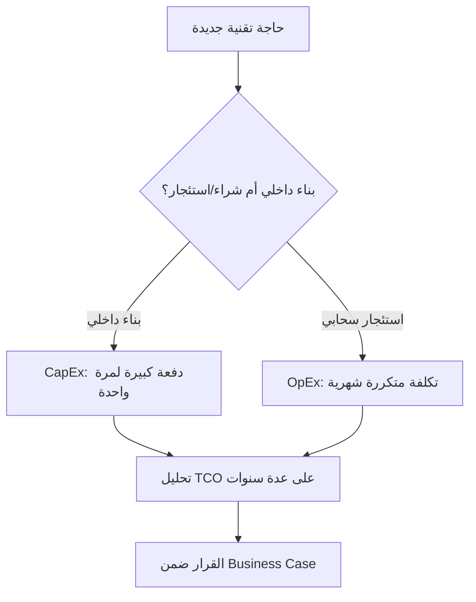

# التكلفة الرأسمالية مقابل التشغيلية (CapEx vs OpEx)

> [!info] تعريف مختصر
> التكلفة الرأسمالية (Capital Expenditure - CapEx) هي إنفاق لمرة واحدة على أصل يُستخدَم لسنوات (مثل بناء نظام جديد)، بينما التكلفة التشغيلية (Operating Expense - OpEx) هي إنفاق متكرر ومستمر لتشغيل العمل اليومي (مثل اشتراك سحابي شهري).

## الشرح العلمي والاحترافي
- الفرق الجوهري محاسبي وإداري في آن واحد: CapEx يُعامَل كاستثمار طويل الأمد يُستهلك قيمته على عدة سنوات (Depreciation)، بينما OpEx يُخصَم بالكامل من ميزانية السنة التي يُصرف فيها.
- في عالم التقنية، بناء نظام برمجي داخلي بفريق موظفين دائمين غالباً يُصنَّف CapEx، بينما الاشتراك في خدمة سحابية جاهزة (SaaS) أو استئجار سيرفرات بحسب الاستخدام يُصنَّف OpEx.
- القرار بين الاثنين ليس تقنياً بحتاً بل مالياً واستراتيجياً؛ فبعض المؤسسات تفضّل CapEx لأنه يُحسَّن كأصل في الميزانية ويقلل الضرائب عبر الاستهلاك التدريجي، وأخرى تفضّل OpEx لمرونته وعدم الحاجة لدفعة كبيرة مقدّماً.
- هذا التصنيف يؤثر مباشرة على قرارات مثل الشراء مقابل البناء (Build vs Buy)، واستخدام السحابة العامة مقابل امتلاك بنية تحتية خاصة، ويظهر بوضوح عند تقييم [[TCO]] للحلول المختلفة.
- سوء فهم هذا التمييز قد يقود لقرار تقني خاطئ ماليّاً، مثل بناء نظام داخلي مكلف (CapEx ضخم) بينما حل SaaS جاهز (OpEx مرن) كان يحقق نفس الهدف بمخاطرة أقل.

## أين ومتى يُستخدم
- يُستخدم عند إعداد [[Business Case]] لأي مشروع تقني، لتحديد كيف سيُموَّل ومن أي بند ميزانية سيُصرف.
- يُلجأ إليه عند المفاضلة بين بناء حل داخلي أو شراء/استئجار حل جاهز (Build vs Buy)، أو بين شراء خوادم فعلية واستئجار سحابة عامة.
- تستخدمه إدارات المالية والمشتريات لتصنيف بنود الميزانية، ويحتاج مديرو المشاريع لفهمه لتبرير طلبات الإنفاق أمام الإدارة العليا.
- يظهر بشكل متكرر في قرارات التقنية الحديثة، حيث يتحوّل الاتجاه العام من CapEx (شراء خوادم وتراخيص دائمة) إلى OpEx (اشتراكات سحابية شهرية) بحثاً عن المرونة.

## مثال وسيناريو تطبيقي
> [!example] سيناريو ملموس في مشروع برمجي حقيقي
> شركة ناشئة تحتاج نظام تحليلات بيانات لعملائها. أمامها خياران: (1) بناء فريق داخلي من 4 مهندسين لتطوير نظام تحليلات خاص بتكلفة 800 ألف ريال لمرة واحدة، وهذا يُصنَّف CapEx، أو (2) الاشتراك في منصة تحليلات سحابية جاهزة بتكلفة 15 ألف ريال شهرياً (180 ألف ريال سنوياً)، وهذا يُصنَّف OpEx.
> مدير المالية يفضّل الخيار الثاني في البداية لأن الشركة ناشئة ولا تريد التزاماً رأسمالياً كبيراً، ولأن OpEx يمنحها مرونة إلغاء الاشتراك إن تغيّرت الحاجة. بعد 3 سنوات، عندما ينمو حجم البيانات ويصبح بناء حل داخلي أوفر على المدى الطويل حسب تحليل [[TCO]]، تعيد الشركة تقييم القرار وتنتقل لبناء نظامها الخاص (CapEx) لأن الحجم صار يبرر الاستثمار.

## خطوات أو مخطّط
1. تحديد الخيارات المتاحة لتحقيق الحاجة (بناء داخلي مقابل شراء/استئجار جاهز).
2. تصنيف تكلفة كل خيار: هل هي دفعة لمرة واحدة (CapEx) أم تكلفة متكررة (OpEx)؟
3. حساب [[TCO]] لكل خيار على مدى عدة سنوات، وليس تكلفة السنة الأولى فقط.
4. مراعاة تأثير كل خيار على التدفق النقدي والمرونة المستقبلية للمؤسسة.
5. اتخاذ القرار ضمن [[Business Case]] وتوثيق السبب المالي وراء الاختيار.

## ⚠️ مفاهيم خاطئة شائعة
> [!warning]
> - الاعتقاد أن OpEx دائماً أرخص من CapEx؛ في الواقع الاشتراكات المتكررة قد تفوق تكلفة البناء الداخلي على مدى سنوات طويلة، لذا يجب مقارنة [[TCO]] لا التكلفة الأولى فقط.
> - الظن أن التصنيف تقني بحت؛ في الحقيقة هو قرار محاسبي ومالي يحدده غالباً قسم المالية بناءً على استراتيجية الميزانية والضرائب.
> - الخلط بين "التكلفة الرأسمالية" و"جودة الحل"؛ فكون شيء ما CapEx لا يعني أنه أفضل تقنياً، بل يعني فقط طريقة تمويله ومحاسبته.

## ❌ ممارسات خاطئة في المشاريع
> [!failure]
> - اختيار حل بناءً على تصنيفه المحاسبي فقط دون النظر لملاءمته التقنية الفعلية، فتُبنى أنظمة غير مناسبة لمجرد توفر ميزانية CapEx. التجنب: اتخاذ القرار التقني أولاً ثم تحديد طريقة التمويل الأنسب.
> - تجاهل التكاليف الخفية طويلة الأمد لخيار OpEx (مثل زيادة الاشتراك مع نمو الاستخدام)، فتُفاجأ الإدارة بفاتورة متضخمة لاحقاً. التجنب: وضع سقف تقديري لنمو الاستخدام ضمن [[Business Case]] عند المقارنة.
> - عدم إشراك قسم المالية مبكراً في قرار CapEx مقابل OpEx، فيُتخذ القرار تقنياً بمعزل عن استراتيجية الميزانية العامة. التجنب: إشراك المالية منذ مرحلة إعداد [[Business Case]].

## 🔗 مصطلحات ومفاهيم ذات صلة
[[TCO]] | [[Business Case]] | [[Cost of Delay]] | [[Vendor Lock-in]] | [[Contingency Reserve]] | [[Reserve Capacity]] | [[BRD]]
