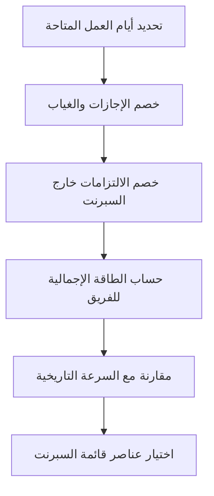

# الطاقة الاستيعابية (Capacity)
> [!info] تعريف مختصر
> الطاقة الاستيعابية (Capacity) هي مقدار العمل الذي يستطيع الفريق إنجازه فعليًا خلال فترة زمنية محدّدة، مثل السبرنت (Sprint)، مع مراعاة الوقت المتاح الحقيقي لكل عضو.

## الشرح العلمي والاحترافي
- الطاقة الاستيعابية تجيب عن سؤال: "كم من الوقت والجهد متاح فعليًا للعمل؟" قبل أن يبدأ الفريق بالتخطيط.
- تُحسب عادة بالساعات أو أيام العمل (Person-Day)، وتأخذ بعين الاعتبار الإجازات، الاجتماعات، الدعم الفني، والمهام غير المرتبطة بالسبرنت.
- تختلف عن السرعة (Velocity) التي تقيس متوسط عدد نقاط القصة (Story Points) المُنجزة في السبرنتات السابقة؛ فالطاقة الاستيعابية مقياس مستقبلي مبني على التوافر الفعلي، بينما السرعة مقياس تاريخي مبني على الأداء الفعلي.
- تحديد الطاقة الاستيعابية بدقة يمنع الفريق من الالتزام بعمل أكثر مما يستطيع إنجازه، وهو ما يحمي من الإرهاق (Burnout) ومن الفشل في تحقيق أهداف السبرنت (Sprint Goal).
- من المهم ترك هامش احتياطي (Reserve Capacity) للأمور غير المتوقعة كالأعطال العاجلة (Hotfix) أو الدعم الطارئ.

## أين ومتى يُستخدم
- في منهجية Scrum: تُحدَّد الطاقة الاستيعابية أثناء تخطيط السبرنت (Sprint Planning) قبل اختيار عناصر قائمة المهام (Backlog).
- في Kanban: تُستخدم لضبط حدود العمل الجاري (WIP Limit) بما يتناسب مع قدرة الفريق الحقيقية.
- عند انضمام أعضاء جدد أو مغادرة أعضاء، تُعاد حساب الطاقة الاستيعابية فورًا لتفادي التخطيط الخاطئ.
- عند وجود إجازات رسمية أو مؤتمرات أو تدريب، يُخصم الوقت المقابل من الطاقة الاستيعابية لتلك الفترة.

## مثال وسيناريو تطبيقي
> [!example] فريق تطوير مكوّن من 5 مبرمجين يعمل بسبرنت مدته أسبوعان (10 أيام عمل). أحد الأعضاء، سارة، ستأخذ 3 أيام إجازة، وأحمد سيخصص يومين للدعم الفني لعميل آخر. بدلًا من افتراض 5 × 10 = 50 يوم-شخص، يحسب سكرم ماستر (Scrum Master) الطاقة الفعلية: (10×3 أعضاء بدوام كامل) + (10-3 لسارة) + (10-2 لأحمد) = 30+7+8 = 45 يوم-شخص. بناءً على هذا الرقم يختار الفريق عددًا واقعيًا من عناصر قائمة السبرنت بدلًا من الالتزام الزائد.

## خطوات أو مخطّط
1. حدّد عدد أيام العمل في الفترة (مثلًا 10 أيام لسبرنت أسبوعين).
2. اطرح أيام الإجازات والغياب المعروفة لكل عضو.
3. اطرح الوقت المخصص لأنشطة خارج السبرنت (دعم، اجتماعات ثابتة، تدريب).
4. اجمع الناتج لكل الأعضاء للحصول على الطاقة الاستيعابية الإجمالية.
5. قارن الطاقة الاستيعابية بالسرعة التاريخية (Velocity) للتحقق من الواقعية.
6. اترك احتياطيًا بسيطًا (Reserve Capacity) لغير المتوقع.

## ⚠️ مفاهيم خاطئة شائعة
> [!warning]
> - الخلط بين الطاقة الاستيعابية والسرعة (Velocity): الأولى تخطيط مستقبلي، والثانية بيانات تاريخية.
> - افتراض أن كل ساعات الدوام هي ساعات إنتاجية صافية، متجاهلين الاجتماعات والانقطاعات (انظر [[100 Percent Utilization Fallacy]]).
> - اعتبار الطاقة الاستيعابية ثابتة لا تتغير من سبرنت لآخر رغم تغيّر الظروف.

## ❌ ممارسات خاطئة في المشاريع
> [!failure]
> - تجاهل الإجازات والالتزامات الجانبية عند حساب الطاقة، مما يؤدي لالتزام زائد وفشل في تحقيق [[Sprint Goal]].
> - تحميل الفريق 100% من طاقته النظرية دون احتياطي، فيؤدي أي طارئ إلى تأخير كامل السبرنت.
> - عدم مراجعة الطاقة الاستيعابية بعد تغييرات في تكوين الفريق (انضمام أو مغادرة أعضاء).

## 🔗 مصطلحات ومفاهيم ذات صلة
[[Reserve Capacity]] | [[100 Percent Utilization Fallacy]] | [[Man-Day and Person-Day]] | [[Sprint Goal]] | [[WIP Limit]] | [[18 - Velocity]] | [[08 - Sprint Planning]] | [[12 - Story Points]]

> [!tip] 💡 إثراء عملي — كورس الإنتاجية
> حساب السعة الصافية حسابًا صادقًا، وقانون المقايضة الصفرية، والتخطيط للعيوب بالمئين 85: [[05 - عناصر التدفّق الأربعة وسعة الفريق]].
