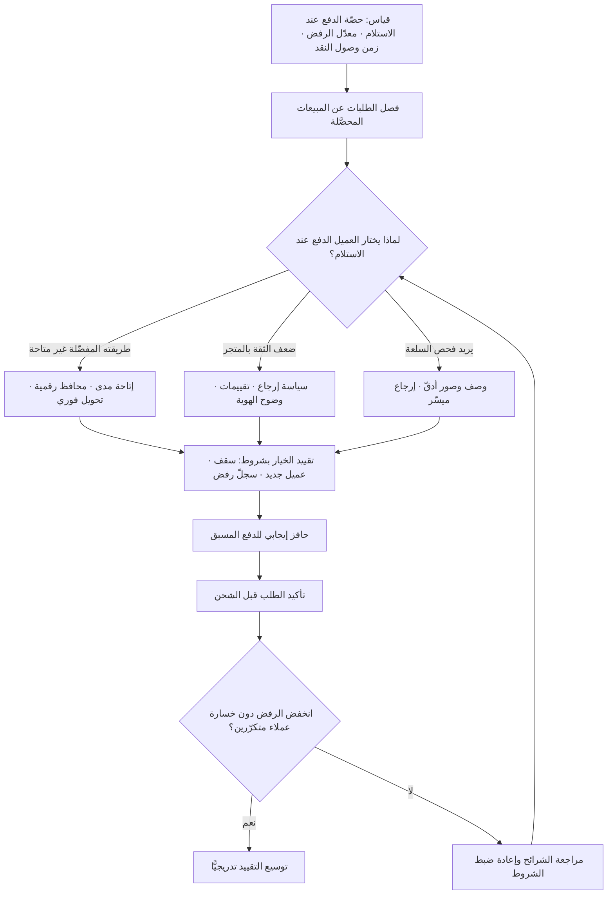

# الدفع عند الاستلام (Cash on Delivery)

> [!info] تعريف مختصر
> طريقة دفع يسدّد فيها المشتري قيمة الطلب لحظة استلامه فعليًّا، لا لحظة إتمام الطلب. جوهرها ليس «تفضيل النقد» كما يُظنّ، بل أنها **آلية ضمان بديلة**: حين لا تتوافر ثقة مؤسّسية كافية — ثقة بالبائع، أو بمنظومة الاسترداد، أو بأمن البيانات البنكية، أو بإنفاذ حقّ المشتري عند النزاع — ينشأ حلّ عملي ينقل المخاطرة من المشتري إلى البائع: لا مال قبل رؤية البضاعة. هي إذن مؤشّر على **فجوة ثقة في البنية المؤسّسية** أكثر منها تفضيلًا ثقافيًّا. ولهذا فإن تراجعها في أسواق عربية عديدة تزامن لا مع تغيّر «طبائع الناس»، بل مع نضوج بنى الدفع الوطنية مثل شبكة **مدى (mada)** في السعودية، وانتشار المحافظ الرقمية والدفع عبر الهاتف، واستقرار سياسات الإرجاع والاسترداد لدى المتاجر الكبرى.

## الشرح العلمي والاحترافي
- **المشكلة الاقتصادية التي تحلّها**: في أي معاملة عن بُعد يوجد تزامن غير متماثل — طرف يسلّم أولًا. حين تكون آليات الثقة قوية (إنفاذ عقود سريع، استرداد مضمون على البطاقة، تقييمات موثوقة، حماية مستهلك فعّالة) يقبل المشتري الدفع أولًا. وحين تضعف هذه الآليات، تصبح التسوية العملية هي **قلب الترتيب**: يسلّم البائع أولًا. لذلك تُقرأ نسبة الدفع عند الاستلام في أي سوق بوصفها مؤشّرًا على نضج بنية الثقة، لا على تخلّف تقني.
- **السياق العربي وتاريخه**: نشأت التجارة الإلكترونية العربية في التسعينيات والألفينيات في بيئة اجتمعت فيها عدّة قيود: انخفاض انتشار البطاقات الائتمانية مقارنةً بأسواق أخرى، وشرائح واسعة تتعامل نقدًا، وضعف الثقة في إعطاء بيانات البطاقة لمتجر مجهول، وتجارب مبكرة سيّئة مع متاجر لم تلتزم بالتسليم أو الوصف، وصعوبة الاسترداد. في تلك البيئة لم يكن الدفع عند الاستلام خيارًا من بين خيارات، بل كان **شرط وجود السوق أصلًا**: من دونه لم يكن معظم المشترين ليجرّبوا الشراء عن بُعد إطلاقًا. وقد بنت شركات لوجستية إقليمية كاملة نماذج تشغيلها حول تحصيل النقد وتوريده للتاجر، فصار جزءًا من البنية التحتية لا مجرّد خيار في صفحة الدفع.
- **الكلفة الحقيقية غالبًا مخفيّة**: لا تظهر كلفة الدفع عند الاستلام في رسوم بوّابة الدفع بل في مواضع أخرى: **رسوم تحصيل** يفرضها مزوّد الشحن، و**رأس مال عامل محتجَز** لأن المال يصل بعد أسابيع من الشحن، و**معدّل رفض الاستلام** حيث تعود البضاعة على حساب التاجر بكلفة شحن مزدوجة، و**كلفة إدارة النقد** وتسوياته ومخاطر الفروقات، و**اختلال قياس التحويل** لأن «الطلب» ليس «البيع». هذه البنود مجتمعة قد تجعل هامش الطلب المدفوع عند الاستلام أقلّ كثيرًا من نظيره المدفوع مسبقًا، حتى مع تطابق سعر البيع.
- **معدّل رفض الاستلام هو المقياس الحاكم**: الطلب المدفوع مسبقًا ملتزَم به سلوكيًّا؛ أما الدفع عند الاستلام فمجّاني على المشتري حتى لحظة التسليم، فيسهل الطلب باندفاع أو تكرار الطلب من عدّة متاجر ثم اختيار أحدها. لذلك يرتفع الرفض بشدّة، وتزداد الطلبات الوهمية أو العابثة. وهذا المقياس تحديدًا هو ما يجب أن يُقاس ويُدار، لا إجمالي الطلبات.
- **أدوات تخفيف المخاطرة**: تُدار المخاطرة عادةً بمزيج من: تأكيد الطلب برسالة أو مكالمة قبل الشحن، والتحقّق من رقم الهاتف عبر رمز، ووضع قوائم داخلية للعناوين والأرقام كثيرة الرفض، ورسوم رمزية على خيار الدفع عند الاستلام، وتقييد الخيار على الطلبات مرتفعة القيمة أو على العملاء الجدد، وتقديم حافز مقابل للدفع المسبق (خصم، شحن مجاني، نقاط).
- **دفعة التحوّل — لماذا تتراجع الآن؟** التراجع الملحوظ في أسواق خليجية وعربية عديدة يعود إلى تضافر عوامل ملموسة: انتشار **بطاقات مدى** المرتبطة بالحسابات الجارية (فهي بطاقة خصم مباشر متاحة لشريحة أوسع بكثير من حاملي البطاقات الائتمانية، وأزالت شرط «امتلاك بطاقة ائتمانية» الذي كان العائق الأول)، وإتاحة الدفع الرقمي عبر الهاتف والمحافظ الإلكترونية، ودخول التحويل الفوري بين الحسابات، وظهور خدمات الشراء الآن والدفع لاحقًا التي أعطت بديلًا للتقسيط دون بطاقة ائتمانية، إضافةً إلى ترسّخ سياسات إرجاع واسترداد واضحة لدى المتاجر الكبرى فقلّت الحاجة إلى الضمان اليدوي. أي أن **البدائل المؤسّسية للثقة نضجت**، فتراجعت الحاجة إلى الحيلة العملية التي كانت تعوّضها.
- **التراجع ليس اختفاءً ولا موحّدًا**: تبقى للدفع عند الاستلام حصّة معتبرة في شرائح محدّدة: الفئات غير المشمولة ماليًّا أو غير الحائزة على حساب بنكي، وبعض المناطق خارج المدن الرئيسة، والفئات العمرية الأكبر، والطلبات مرتفعة القيمة حيث يريد المشتري فحص السلعة، والمتاجر الصغيرة الجديدة التي لا يعرفها المشتري ولا يثق بها. كما تتفاوت النسبة تفاوتًا حادًّا بين دول عربية بحسب نضج البنية المالية فيها — ما يجعل تعميم «السوق العربي يفضّل الدفع عند الاستلام» تعميمًا مضلّلًا يقود إلى قرارات خاطئة.
- **بُعده في قرارات التوسّع**: عند دخول سوق جديد، إتاحة طريقة الدفع المحلّية المفضّلة ليست ميزة تسويقية بل **شرط جاهزية**؛ فمتجر لا يتيح طرق الدفع المحلّية يفقد شريحة كاملة عند آخر خطوة في القمع مهما أنفق على الاستقطاب — وهو أحد أوضح تجلّيات المسافة بين الأسواق في [[CAGE Framework]] وأحد أكثر ما يُغفل في [[Go-to-Market]].

## أين ومتى يُستخدم
- **في تصميم تجربة الدفع للتجارة الإلكترونية**: كخيار موجَّه بشروط (قيمة الطلب، تاريخ العميل، المنطقة) لا كخيار مفتوح للجميع، مع قياس أثره على معدّل إتمام الطلب مقابل معدّل الرفض.
- **عند دخول سوق جديد**: كبند إلزامي في شروط الجاهزية داخل [[Go-to-Market]]، ومدخل مباشر في تقدير المسافة الاقتصادية والإدارية عبر [[CAGE Framework]] والمحور التقني في [[PESTEL]].
- **في نمذجة رأس المال العامل والتدفّق النقدي**: لأن دورة التحصيل تطول بأسابيع، فيدخل أثرها في [[Business Case]] وفي حساب [[TCO]] لعمليات البيع لا في بند الرسوم فحسب.
- **في التعاقد مع شركات الشحن**: تُتفاوَض رسوم التحصيل، ودورية توريد المبالغ، ومسؤولية الفروقات، وحدّ قيمة الطلب المسموح — ضمن ممارسات [[Vendor Management]].
- **في بناء الثقة للمتاجر الجديدة**: كأداة انتقالية تُستعمل عمدًا في المرحلة الأولى لتقليل حاجز التجربة، ثم تُخفَّض تدريجيًّا مع تراكم التقييمات وتحسّن [[Adoption]].
- **في قياس صحّة العمليات**: يُتابَع معدّل رفض الاستلام كمؤشّر ضمن لوحة [[KPI]]، ويُشخَّص ارتفاعه المفاجئ عبر [[Root Cause Analysis]] لأنه غالبًا عرَض لمشكلة أعمق (وصف منتج مضلّل، تأخّر شحن، مصدر تسويقي رديء).

## مثال وسيناريو تطبيقي
> [!example] متجر إلكتروني سعودي متخصّص في مستلزمات المنزل، حجم أعماله 4.2 مليون ريال سنويًّا، كان 68% من طلباته تُدفع عند الاستلام.
> **المشكلة المكتشَفة:** كان الفريق يقيس النجاح بعدد الطلبات، وأظهرت اللوحة نموًّا شهريًّا مطمئنًّا. لكن مراجعة مالية ربعية كشفت فجوة: الطلبات المسجّلة 3,100 في الربع، والمبيعات المحصَّلة فعليًّا 2,290 فقط. أي أن **معدّل رفض الاستلام بلغ 26% على طلبات الدفع عند الاستلام**، مقابل 4% إلغاء على الطلبات المدفوعة مسبقًا. وحين حُسبت الكلفة الكاملة للطلب المرفوض (شحن ذهابًا وإيابًا 34 ريالًا + رسوم تحصيل + إعادة تخزين + سلعة تعود أحيانًا بحالة غير قابلة للبيع)، تبيّن أن الطلبات المرفوضة وحدها التهمت ما يقارب 11% من إجمالي الهامش الربعي.
> **مشكلة ثانية أقلّ وضوحًا:** كان متوسّط زمن وصول النقد من شركة الشحن إلى حساب المتجر 19 يومًا من تاريخ الشحن. ومع نمو الطلبات، تضخّم المبلغ المحتجَز لدى الشحن إلى ما يقارب 340 ألف ريال في أي لحظة — أي أن المتجر كان يموّل نموّه بسيولة محتجَزة، واضطر مرّتين إلى تأجيل أمر شراء من مورّد رغم أن دفاتره تُظهر ربحًا.
> **ما فُعل، على مراحل:**
> ① **إعادة تصميم الخيار لا إلغاؤه:** أُبقي الدفع عند الاستلام متاحًا للطلبات دون 500 ريال، وقُيّد على العملاء الجدد في أول طلب فقط، وأُلغي كليًّا للعناوين التي سبق أن رُفض منها طلبان.
> ② **حافز مقابل لا عقوبة:** أُضيف شحن مجاني للطلبات المدفوعة مسبقًا بدل فرض رسوم على الدفع عند الاستلام — وهو فارق نفسي مهم: المشتري يتحرّك نحو مكسب أسرع مما يهرب من رسم.
> ③ **إتاحة البدائل المحلّية فعليًّا:** كان المتجر يقبل البطاقات الائتمانية فقط، فأُضيف **الدفع بمدى** ومحفظة رقمية عبر الهاتف وخيار الشراء الآن والدفع لاحقًا. تبيّن لاحقًا أن جزءًا معتبرًا ممن اختاروا الدفع عند الاستلام لم يكونوا يرفضون الدفع الرقمي أصلًا، بل **لم يجدوا طريقتهم المفضّلة متاحة** — وهو تشخيص مختلف تمامًا عن «العميل يفضّل النقد».
> ④ **تأكيد الطلب:** رسالة تأكيد آلية خلال ساعة، والطلب لا يُشحن قبل تأكيد فعّال.
> **النتيجة بعد ربعين:** انخفضت حصّة الدفع عند الاستلام من 68% إلى 31%، وانخفض معدّل الرفض على ما تبقّى منها من 26% إلى 12% (بفضل التأكيد والقيود لا بفضل تقليل الخيار وحده)، وانكمش المبلغ المحتجَز لدى الشحن إلى أقلّ من الثلث. والملاحظة الأهمّ: **لم ينخفض إجمالي الطلبات المكتملة** — انخفض فقط عدد الطلبات التي لم تكن ستكتمل أصلًا، فصار الرقم في اللوحة يقترب من الحقيقة.
> **قرار مضادّ للحدس:** رفض الفريق إلغاء الخيار كليًّا رغم إغراء الأرقام، لأن تحليل الشرائح أظهر أن 9% من العملاء المتكرّرين — وهم من أعلى الشرائح في قيمة العمر — يستعملونه حصريًّا، وأن إلغاءه كان سيخسرهم مقابل توفير أقلّ من الخسارة.

## خطوات أو مخطّط
1. قياس الوضع الحقيقي أولًا: حصّة الدفع عند الاستلام، ومعدّل رفض الاستلام لكلٍّ من طريقتَي الدفع، وزمن وصول النقد، وكلفة الطلب المرفوض الكاملة.
2. التمييز بين «الطلب» و«البيع المحصَّل» في كل تقرير — أي مقياس لا يفرّق بينهما مضلّل بنيويًّا.
3. تشخيص السبب الحقيقي لاختيار العميل: أهو غياب طريقته المفضّلة؟ أم ضعف ثقة بالمتجر؟ أم رغبة في فحص السلعة؟ لكلٍّ علاج مختلف تمامًا.
4. إتاحة طرق الدفع المحلّية فعليًّا (خصم مباشر مثل مدى، محافظ رقمية، تحويل فوري، شراء الآن والدفع لاحقًا) قبل أي محاولة لتقييد الدفع عند الاستلام.
5. بناء الثقة صراحةً: سياسة إرجاع واضحة، صور ووصف دقيقان، تقييمات حقيقية، هوية تجارية موثّقة — فهذه هي بدائل الضمان اليدوي.
6. تقييد الخيار بشروط لا إلغاؤه دفعةً واحدة: سقف قيمة، تاريخ عميل، منطقة جغرافية، سجلّ رفض سابق.
7. تقديم حافز إيجابي للدفع المسبق بدل معاقبة الدفع عند الاستلام.
8. إضافة تأكيد الطلب قبل الشحن، وقياس أثره على معدّل الرفض بشكل منفصل.
9. التفاوض مع شركة الشحن على تقصير دورة التوريد ووضوح مسؤولية الفروقات.
10. المراجعة الدورية بالشرائح لا بالإجمالي، ومراقبة أثر أي تقييد على شريحة العملاء المتكرّرين قبل التوسّع فيه.

## ⚠️ مفاهيم خاطئة شائعة
> [!warning]
> - **«الدفع عند الاستلام تفضيل ثقافي للنقد»**: هو في جوهره **بديل عن الثقة المؤسّسية**؛ ولذلك يتراجع كلّما توافرت آليات ثقة أخرى، لا كلّما تغيّرت «طبائع الناس». التصحيح: عالِج الأسباب (توافر طرق الدفع، وضوح الإرجاع، سمعة المتجر) لا العَرَض.
> - **«العميل العربي يرفض الدفع الإلكتروني»**: تعميم يكذّبه انتشار الدفع بمدى والمحافظ الرقمية والتحويل الفوري في السنوات الأخيرة، وتفاوت النسب الحادّ بين دولة وأخرى وبين شريحة وأخرى. التصحيح: قِس سوقك وشريحتك بنفسك، ولا تنقل انطباعًا عن «السوق العربي» ككتلة واحدة.
> - **«إتاحته مجّانية للتاجر»**: كلفته موزّعة على رسوم التحصيل، والشحن المرتجع، ورأس المال المحتجَز، وإدارة النقد — وهي بنود لا تظهر في سطر واحد في قائمة الدخل فتبدو غائبة. التصحيح: احسب كلفة كاملة للطلب بحسب طريقة الدفع، وقارن الهامش الصافي لا سعر البيع.
> - **«حجم الطلبات مقياس نمو صالح»**: مع الدفع عند الاستلام، جزء من الطلبات لن يتحوّل إلى بيع أبدًا، فتُبنى قرارات المخزون والتسويق على رقم متضخّم. التصحيح: اجعل «المبيعات المحصَّلة» هو المقياس المعتمد وفق منطق [[Outcome vs Output]].
> - **«الحل هو إلغاؤه»**: الإلغاء المفاجئ يخسر شرائح حقيقية بعضها عالي القيمة، وقد يخسر أسواقًا كاملة إن كان بديل الدفع غير متاح فيها أصلًا. التصحيح: قلّصه تدريجيًّا بشروط، وبعد إتاحة بدائل حقيقية، وبقياس أثر كل خطوة على الشرائح.
> - **«ارتفاع معدّل الرفض مشكلة عملاء»**: غالبًا هو عَرَض لسبب تشغيلي: تأخّر الشحن، أو وصف منتج مضلّل، أو مصدر إعلاني يجلب نيّة شراء ضعيفة. التصحيح: شخّص الرفض بحسب المصدر والمنتج ومدّة التسليم قبل إلقاء اللوم على السلوك.
> - **«رسوم إضافية على الدفع عند الاستلام أفضل حافز»**: الرسم يُقرأ عقوبةً وقد يُفقدك الطلب كليًّا عند آخر خطوة. التصحيح: جرّب الحافز الإيجابي على الدفع المسبق أولًا وقِس الفرق، فأثره غالبًا أفضل بالكلفة نفسها.
> - **«الأثر يقتصر على قسم المالية»**: هو يغيّر تصميم صفحة الدفع، وسياسة المخزون، وعقد الشحن، ومقاييس التسويق، ونمذجة التدفّق النقدي. التصحيح: عامله كقرار عابر للأقسام له مالك واحد، لا كإعداد في بوّابة الدفع.

## ❌ ممارسات خاطئة في المشاريع
> [!failure]
> - **الخطأ: إطلاق متجر في سوق جديد دون إتاحة طرق الدفع المحلّية.** لماذا يضرّ: يُنفَق على الاستقطاب ثم تُفقد شريحة كاملة عند آخر خطوة في القمع، فيبدو الخطأ تسويقيًّا وهو في الحقيقة جاهزية دفع. الحل: اجعل طرق الدفع المحلّية شرط جاهزية إلزاميًّا في [[Definition of Ready]] للإطلاق، لا بندًا في خارطة طريق لاحقة.
> - **الخطأ: قياس النمو بعدد الطلبات دون فصل المحصَّل.** لماذا يضرّ: يُبنى المخزون والتوظيف وميزانية التسويق على طلب وهمي، ويُكتشف الخلل بعد ربع كامل. الحل: عرّف المقياس المعتمد بأنه البيع المحصَّل، وأظهر معدّل الرفض جنبًا إلى جنب في كل تقرير على لوحة [[KPI]].
> - **الخطأ: تجاهل رأس المال العامل المحتجَز لدى شركة الشحن.** لماذا يضرّ: تنشأ أزمة سيولة في شركة رابحة دفتريًّا، فتتأخّر أوامر التوريد ويتعطّل النمو. الحل: تفاوض على دورة توريد أقصر ضمن [[Vendor Management]]، وأدرج المبلغ المحتجَز صراحةً في نموذج التدفّق النقدي.
> - **الخطأ: إلغاء الخيار فجأة استجابةً لأرقام الكلفة وحدها.** لماذا يضرّ: تُفقد شرائح عالية القيمة ومناطق كاملة، وقد تُخسَر ثقة عملاء متكرّرين بكلفة تفوق التوفير. الحل: قلّص تدريجيًّا بشروط معلنة، واختبر كل خطوة على شريحة محدودة أولًا عبر [[Pilot Launch]].
> - **الخطأ: عدم تأكيد الطلب قبل الشحن.** لماذا يضرّ: تُشحن طلبات عابثة أو مكرّرة أو بعناوين خاطئة، فترتفع كلفة الشحن المزدوج ويُشغل المخزون بلا مقابل. الحل: اجعل التأكيد الآلي شرطًا للشحن، وقِس أثره منفصلًا لتعرف قيمته الحقيقية.
> - **الخطأ: التعامل مع النقد المحصَّل بلا ضوابط تسوية.** لماذا يضرّ: تنشأ فروقات ومخاطر ضياع وصعوبة تدقيق، وتضعف الرقابة المالية. الحل: تسوية يومية آلية بين نظام الطلبات وتقارير شركة الشحن، مع تعريف واضح لمسؤولية الفروقات في العقد وضمن [[Governance]].
> - **الخطأ: تعميم نسبة الدفع عند الاستلام من سوق إلى آخر عند التوسّع.** لماذا يضرّ: تُبنى نماذج التدفّق النقدي والمخزون على نسبة لا تنطبق، فتنحرف الخطّة من أول ربع. الحل: قدّر النسبة لكل سوق على حدة انطلاقًا من نضج بنيته المالية، واستعمل [[CAGE Framework]] لتقدير الفجوة قبل الالتزام.

## 🔗 مصطلحات ومفاهيم ذات صلة
[[Go-to-Market]] | [[Market Entry Modes]] | [[CAGE Framework]] | [[PESTEL]] | [[Hofstede Cultural Dimensions]] | [[Translation Memory]] | [[KYC]] | [[Split Payment]] | [[Milestone-based Payment]] | [[Vendor Management]] | [[Adoption]]
