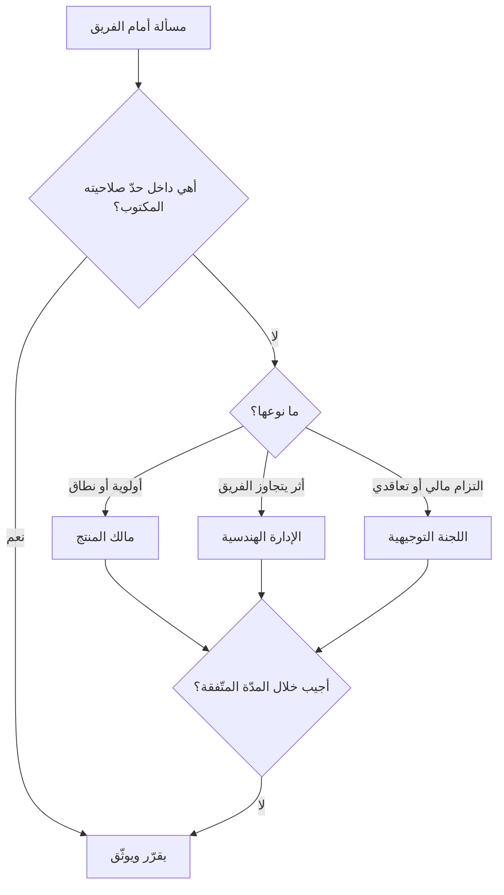

# سلسلة القيادة (Chain of Command)

> [!info] تعريف مختصر
> **سلسلة القيادة** خطّ السلطة المتّصل من أعلى المنظّمة إلى أدناها، يبيّن **من يملك أن يوجّه من، ومن يُحاسب أمام من**. ووظيفتها الأصلية ليست الترتيب الطبقي بل رفع لبسين مكلفين: أن يتلقّى الموظّف أوامر متعارضة من جهتين، وأن يقع خطأ فلا يُعرف عند من كان القرار. **وأكثر ما يُخطأ فيها أن تُقرأ مسارًا للتواصل** — وهي ليست كذلك ولم تكن، حتى عند من صاغها: فقد نصّ **هنري فايول (Henri Fayol)** في 1916 على أن الاتّصال الجانبي المباشر جائز بإذن الرئيسين، وسمّاه **«الجسر» (Gangplank)**.

## الشرح العلمي والاحترافي

### 1. ما الذي تحلّه، وما الذي لا شأن لها به

| تحلّ | لا شأن لها به |
|---|---|
| من يوجّه؟ ومن يُقرّ؟ ومن يُحاسَب؟ | من يتكلّم مع من |
| إلى أين يُرفع ما تعذّر حلّه؟ | كيف تنتقل المعلومة |
| أمام من يقف الموظّف عند تعارض الأوامر | من يملك الخبرة في مسألة |

**وخلط العمودين هو أصل الداء.** فالمنظّمة التي تُمرّر معلوماتها عبر سلسلة القيادة تدفع ثمنين معًا: بطءَ مسارٍ لم يُصمَّم للنقل، وتشوّهَ الرسالة كلّما عبرت عقدة. والقاعدة التي تختصر الباب: **السلطة تصعد وتنزل في السلسلة، والمعلومة تسير في أقصر طريق.**

### 2. جسر فايول: التصحيح جاء مع الأصل

من طرائف هذا المصطلح أن أشهر نقدٍ يُوجَّه إليه اليوم كان **جزءًا من صياغته الأولى**. فقد ضرب فايول مثال موظّفين في فرعين متباعدين يحتاج أحدهما إلى الآخر: إن صعد الطلب إلى أعلى السلسلة ثم نزل في الفرع الآخر، استغرق ما يستغرق وقد يفوت الأمر؛ **فليتّصلا مباشرةً بإذن رئيسيهما، على أن يُخبَر كلٌّ منهما بما جرى.**

فالمرونة إذن ليست خروجًا على المبدأ بل شرطٌ فيه، ولا تعني إلغاء العلم بها: الجسر يُعبَر ويُبلَّغ عنه، ولا يُعبَر سرًّا.

### 3. ماذا فعلت أجايل بسلسلة القيادة؟ لم تُلغِها

يشيع أن الفرق الرشيقة «بلا تسلسل»، وهذا خلط بين شيئين. فالذي تغيّر ليس وجود السلسلة بل **ما الذي يجب أن يمرّ عبرها**:

- **خرج منها القرار التقني اليومي** — كيف يُبنى العمل، وبأي ترتيب، ومن يأخذ أي مهمّة. وهذه للفريق نفسه ([[Self-Organizing Team|الفريق ذاتيّ التنظيم]]).
- **وبقي فيها** ما يتجاوز صلاحية الفريق: الميزانية، والتوظيف، والتعاقد، وتغيير النطاق ذو الأثر المالي، وتعارض الأولويات بين فرق.

**وعلامة الفريق الذي أُعطي الاسم ولم يُعطَ الصلاحية** هي أن ينظر إلى آخر قرار تقنيّ اتّخذه: أنفّذه، أم رفعه؟ فإن كان يرفع القرارات التقنية ويحتفظ بالإدارية، فالسلسلة لم تُضيَّق بل قُلبت.

### 4. المفارقة: التسلّط ينشأ من غياب السلسلة لا من وجودها

يُظنّ أن إضعاف سلسلة القيادة يزيد الاستقلال، والملاحظ في الفرق كثيرًا عكسه: فحيث لا يكون خطّ السلطة مكتوبًا، **يملؤه من يجرؤ** — الأعلى صوتًا، أو الأقرب إلى الإدارة، أو الأقدم بلا صلاحية معلنة. فيصير للفريق رئيسٌ فعليّ بلا مسؤولية معلنة ولا حساب.

والحدّ من هذا لا يكون بإلغاء الخطّ بل بإعلانه: **أن يُكتب ما الذي يقرّره الفريق وحده، وما الذي يُرفع، وإلى من، وفي أي مدّة.** فالسلسلة الواضحة والصلاحية الواسعة يجتمعان، بل يحتاج أحدهما الآخر ([[Empowerment|التمكين]] · [[Micromanagement|الإدارة التفصيلية]]).

### 5. سلسلة القيادة في المشاريع: مسألة الرئيسين

مدير المشروع في المنظّمة المصفوفية يقود أناسًا لا يتبعونه إداريًّا — فرئيسهم الوظيفي غيره. وهذه ليست عيبًا في التصميم بل طبيعته، وثمنُها لبسٌ يجب رفعه **مكتوبًا لا ضمنًا**: من يوزّع العمل اليومي؟ ومن يقيّم الأداء؟ ومن يُرجَع إليه عند تعارض أولوية المشروع مع أولوية القسم؟

والصمت عن هذه الثلاثة يُنتج أشيع نزاعات المشاريع، ويقع ثمنُه على الموظّف الذي يُلام من الطرفين.

## أين ومتى يُستخدم

- في تصميم الهيكل التنظيمي للمشروع وتحديد مسار التصعيد قبل بدء التنفيذ.
- في المنظّمات المصفوفية، لرفع لبس الرئيسين قبل أن يقع النزاع.
- في [[Governance|الحوكمة]] وتشكيل [[Steering Committee|اللجنة التوجيهية]]، إذ هي رأس السلسلة في المشروع.
- عند تفويض الصلاحية: أن يُكتب حدّ ما يقرّره الفريق وما يُرفع، لا أن يُترك للاجتهاد.
- في الحوادث التشغيلية، حيث يكون تعريف القيادة أثناء الحادثة شرطًا لسرعة الاستجابة ([[Runbook]]).

## مثال وسيناريو تطبيقي

> [!example] سيناريو ملموس
> فريق منتج في شركة متوسّطة، أُعلن أنه «فريق مستقلّ ذاتيّ التنظيم».
>
> **وما جرى فعلًا خلال ربع:** رُفعت إلى مدير الهندسة أربعة عشر طلبًا — منها اختيار مكتبة برمجية، وتقسيم وحدة إلى وحدتين، وتغيير أسماء الحقول في قاعدة البيانات. وفي المقابل قرّر الفريق وحده تأجيل ميزة كانت مرتبطة بحملة تسويقية أُنفق عليها.
>
> **فالسلسلة لم تُضيَّق بل انقلبت:** يُرفع ما هو من صميم عمل الفريق، ويُبتّ منفردًا فيما يتجاوز أثرُه الفريق.
>
> **والإصلاح كان ورقة واحدة** عُلّقت في مساحة الفريق:
>
> | يقرّره الفريق وحده | يُرفع — وإلى من |
> |---|---|
> | التصميم التقني · المكتبات · ترتيب العمل داخل السبرنت · تعريف الاكتمال | **مالك المنتج:** تغيير أولوية ميزة معلَنة لجهة أخرى |
> | إصلاح العيوب دون حدّ زمنيّ معيّن | **مدير الهندسة:** ما يتجاوز أثره الفريق (تغيير عقد واجهة برمجية مشتركة) |
> | تجربة أداة جديدة داخل الفريق | **اللجنة التوجيهية:** التزام مالي أو تعاقدي |
>
> ومعها سطر واحد للمدد: **«ما رُفع يُجاب خلال يومي عمل، وإلا مضى الفريق بقراره ووثّقه.»** — وهذا السطر هو ما جعل الورقة تعمل، إذ الرفع بلا مدّة يصير تعليقًا لا تصعيدًا.

## خطوات أو مخطّط

1. ارسم خطّ السلطة الفعليّ لا المعلن: من يوجّه من في الواقع؟
2. اكتب لكل فريق حدّين صريحين: ما يقرّره وحده، وما يُرفع.
3. سمِّ **الجهة** التي يُرفع إليها كلُّ نوع، لا «الإدارة» مطلقةً.
4. حدّد **مدّة الردّ** على ما يُرفع، وما يقع إن انقضت.
5. افصل مسار المعلومة عن مسار السلطة صراحةً، وأعلن أن الاتّصال الجانبي مطلوب لا مُتجاوَز به.
6. راجع الخطّ عند كل تغيير تنظيمي — فالسلسلة المكتوبة التي فارقت الواقع أضرّ من غيابها.

## ⚠️ مفاهيم خاطئة شائعة

> [!warning]
> - **قراءتها مسارًا للتواصل.** فهي خطّ سلطة لا خطّ نقل؛ والاتّصال الجانبي أجازه فايول نفسه بـ«الجسر»، وشرطُه العلم لا الإذن المسبق في كل مرّة.
> - **الظنّ أن أجايل ألغتها.** بل ضيّقت ما يمرّ فيها وأبقت ما يتجاوز صلاحية الفريق. والفريق الذي يرفع قراراته التقنية ويحتفظ بالإدارية قلبها ولم يُلغِها.
> - **حسبانها مرادفة لـ[[Command and Control|القيادة والسيطرة]].** الأولى **بنية** تبيّن من يقرّر ماذا، والثانية **أسلوب إدارة** يقوم على توجيه التفاصيل. فقد تجتمع سلسلة واضحة مع تفويض واسع، وهو الوضع الأمثل.
> - **الظنّ أن غيابها يعني حرّية.** بل يعني غالبًا سلطةً غير معلَنة يمارسها من لا يُحاسَب عليها.
> - **الخلط بينها وبين نطاق الإشراف** (كم شخصًا يتبع مديرًا واحدًا). فالأولى تصف **اتّجاه** السلطة، والثاني **عرضها** — وهما مسألتان مستقلّتان.

## ❌ ممارسات خاطئة في المشاريع

> [!failure]
> - **إعلان الاستقلال بلا كتابة حدوده**، فيقع الفريق بين الشلل والتجاوز، ويُلام في الحالين.
> - **إسناد الموظّف إلى رئيسين بلا فصل لصلاحية كلٍّ منهما** في العمل اليومي والتقييم وحلّ تعارض الأولويات — وهو أشيع نزاعات المنظّمة المصفوفية.
> - **جعل التصعيد بلا مدّة**، فيتحوّل الرفع إلى تعليق دائم يُنسب تعثّره إلى الفريق.
> - **تجاوز الرئيس المباشر بالشكوى إلى من فوقه بلا علمه** بوصفه عادة لا استثناءً، فينشأ خطّان متوازيان: خطٌّ رسميّ مكتوب وخطٌّ فعليّ يعمل.
> - **تمرير التقارير عبر ثلاث عقد قبل بلوغها صاحب القرار**، فيصل الخبر متأخّرًا ومهذّبًا — وهو أصل ظاهرة أن تكون آخر من يعلم بالمشكلة أعلى من يملك حلّها.

## 🔗 مصطلحات ومفاهيم ذات صلة

[[Command and Control]] | [[Self-Organizing Team]] | [[Empowerment]] | [[Micromanagement]] | [[Governance]] | [[Steering Committee]] | [[RACI]] | [[PARIS Matrix]] | [[Conway's Law]] | [[Leadership at Every Level]] | [[Black Box Syndrome]] | [[Servant Leadership]] | [[Runbook]]
