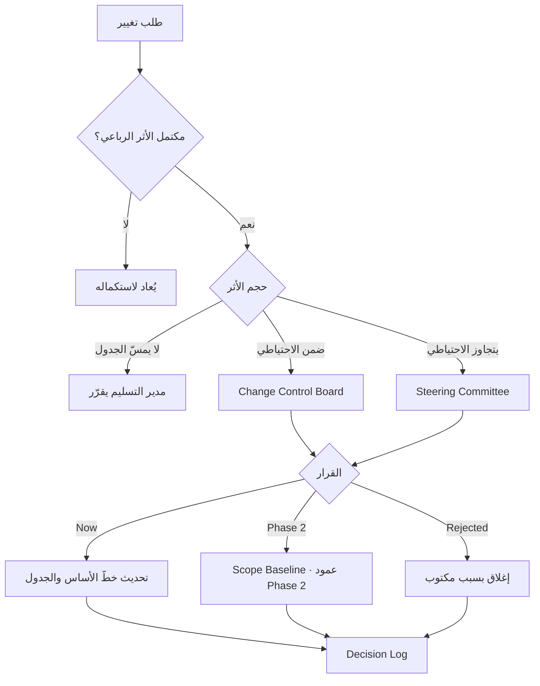

# لجنة مراقبة التغيير (Change Control Board)

> [!info] تعريف مختصر
> **لجنة مراقبة التغيير** هيئة محدّدة الصلاحيات مهمّتها **تقييم واعتماد أو رفض [[Change Request|طلبات التغيير]]** ضمن حدود متّفق عليها. وهي أضيق نطاقاً من [[Steering Committee|لجنة التوجيه]]: الأخيرة هيئة حوكمة عامّة تنظر في المخاطر والميزانية والتصعيدات، أمّا هذه فمتخصّصة في سؤال واحد: **هل يدخل هذا التغيير، ومتى، وبأي أثر معلن؟** ووجودها يحوّل التغيير من مفاوضة شخصية إلى **قرار مؤسسي موثّق**.

## الشرح العلمي والاحترافي

- **لماذا نحتاج هيئة لا شخصاً؟** لأن قرار التغيير يمسّ ثلاثة أطراف بمصالح متعارضة: العميل يريد الميزة، والفريق يحمي الجدول، والمالية تحمي الميزانية. وترك القرار لشخص واحد يجعله عرضة للضغط الشخصي؛ واللجنة تُنتج قراراً **يمكن الاحتجاج به لاحقاً**.

- **التركيبة النموذجية**: راعي المشروع أو من يفوّضه (صاحب القرار) · مدير المشروع/التسليم (يعرض الأثر) · ممثّل العمل (`Business Owner`) · ممثّل تقني (يقدّر الجهد) · ممثّل مالي عند تجاوز حدّ معيّن.

- **حدود الصلاحية (`Authority Thresholds`)** — وهي ما يمنع اللجنة من أن تصير عنق زجاجة:
  | حجم الأثر | من يقرّر؟ |
  |---|---|
  | لا يمسّ الجدول ولا التكلفة | مدير التسليم مباشرةً |
  | أثر محدود (ضمن الاحتياطي) | لجنة مراقبة التغيير |
  | يتجاوز الاحتياطي أو يمسّ تاريخ الإطلاق | **الراعي / [[Steering Committee]]** |
  
  وبدون هذه الحدود تتحوّل اللجنة إلى محطّة انتظار لكل طلب صغير — فينشأ **انتظار جديد** يضرّ بالتدفّق أكثر ممّا يحمي النطاق.

- **مدخلات القرار الأربعة**: لا يُنظَر في طلب دون: **القيمة** المتوقّعة · **الأثر** الزمني والمالي · **أثر الجودة والاختبار** · **أثر الإطلاق**. والطلب الذي يصل بلا هذه الأربعة يُعاد لا يُناقَش.

- **القرارات الثلاثة ومعانيها الدقيقة**:
  | القرار | المعنى |
  |---|---|
  | `Now` | يدخل النطاق الحالي مع تعديل معلن للجدول أو التكلفة |
  | `Deferred / Phase 2` | مقبول ومجدوَل لاحقاً — يدخل عمود `Phase 2` في [[12 - Scope Baseline\|خطّ الأساس]] |
  | `Rejected` | مرفوض بسبب مكتوب — ولا يعود إلا كطلب جديد |

- **`Change Gate` — الصيغة المبسّطة**: في المشاريع المتوسطة قد لا تُشكَّل لجنة رسمية، بل تُعتمد **بوّابة تغيير**: بند ثابت في المراجعة الأسبوعية يُعرض فيه كل طلب جديد بأثره الرباعي ويُبتّ فيه فوراً. وهي أخفّ إدارياً وتحقّق الغرض نفسه.

- **العلاقة بالتجميد (`Scope Freeze` و`Scope Lock`)**: اللجنة لا تُلغي التجميد بل تديره. فكلّما اقترب الإطلاق ضاقت صلاحيتها حتى تصل إلى الصفر عند `Scope Lock` — إذ **ليس الهدف منع التغيير، بل منع التغيير في الوقت الخطأ**.

- **مؤشّر الصحّة المرتبط**: معدّل طلبات التغيير الأسبوعي. تجاوزه حدّاً معيّناً (طلبان أسبوعياً مثلاً) إشارة في [[Early Warning Dashboard|لوحة الإنذار المبكر]] تعني أن **النطاق يتضخّم** — والإجراء تجميد لا مزيد من الاعتماد.

## أين ومتى يُستخدم
- في المشاريع التعاقدية ذات النطاق المحدّد مسبقاً، حيث لكل تغيير أثر مالي.
- في مشاريع الأنظمة المؤسسية بعد اعتماد [[12 - Scope Baseline|خطّ أساس النطاق]].
- عند **تعدّد أصحاب المصلحة**، إذ يمنع القرار المزدوج والمتناقض.
- في البيئات الخاضعة للامتثال، حيث يلزم أثر تدقيقي لكل تغيير.
- عند **ارتفاع معدّل طلبات التغيير** كإجراء علاجي مؤقّت حتى يستقرّ النطاق.

## مثال وسيناريو تطبيقي
> [!example] ثلاثة طلبات — ثلاثة قرارات مختلفة
> | الطلب | الأثر الزمني | الحرجية | القرار |
> |---|---|---|---|
> | لوحة معلومات تنفيذية | + أسبوعان | منخفضة | **`Phase 2`** |
> | برنامج ولاء العملاء | + 3 أسابيع | متوسطة | **`Deferred`** |
> | تطبيق مبيعات جوّال | + 4 أسابيع | منخفضة جداً | **`Rejected`** |
>
> **ما جعل القرارات مقبولة من العميل** لم يكن الرفض المهذّب، بل أن كل طلب عُرض بأثره الرباعي مكتوباً: الوقت، والتكلفة، والضغط على الاختبار، وأثر الإطلاق. فتحوّل النقاش من «لماذا ترفضون؟» إلى «أيّها نضحّي به؟».
>
> **والصيغة المهنية التي استُخدمت:** *«لا نقول لا — نقول: نعم، وهذا أثره على الوقت والتكلفة والإطلاق. فأيّها تختارون؟»*
>
> **الأثر الجانبي:** بعد ثلاثة قرارات معروضة بهذه الطريقة، انخفض معدّل الطلبات من خمسة أسبوعياً إلى واحد — **لأن العميل صار يصفّي طلباته قبل إرسالها**.

## خطوات أو مخطّط
1. شكّل اللجنة أو `Change Gate` مع اعتماد [[12 - Scope Baseline|خطّ الأساس]].
2. اكتب **حدود الصلاحية** صراحةً — من يقرّر ماذا وعند أي حجم أثر.
3. اشترط الأثر الرباعي في كل طلب قبل قبول عرضه.
4. اجتمع بإيقاع ثابت (أسبوعياً) لا عند الطلب — الإيقاع يمنع الانتظار.
5. أصدر القرار الثلاثي ووثّقه مع **سببه**.
6. حدّث خطّ الأساس والجدول فوراً عند `Now`.
7. أدرج ما يُؤجَّل في عمود `Phase 2` بموعد لا بوعد مفتوح.
8. راقب معدّل الطلبات في [[Early Warning Dashboard|لوحة الإنذار]] وجمّد النطاق عند التجاوز.
9. ضيّق الصلاحية تدريجياً مع اقتراب الإطلاق حتى `Scope Lock`.

## ⚠️ مفاهيم خاطئة شائعة
> [!warning]
> - **الخلط بينها و[[Steering Committee|لجنة التوجيه]]**: الأخيرة هيئة حوكمة أوسع (مخاطر، ميزانية، تصعيدات)؛ وهذه متخصّصة في التغيير ضمن حدود.
> - **الظنّ بأن غرضها منع التغيير**: غرضها **التحكّم** فيه — فالتغيير لا يمكن منعه ويمكن تسعيره.
> - **اعتبار `Rejected` و`Deferred` مترادفين**: الأول ينهي الطلب، والثاني يجدوله. والفرق بينهما فرق بين علاقة تنتهي وأخرى تستمرّ.
> - **افتراض أن كل طلب يمرّ باللجنة**: بلا حدود صلاحية تصير اللجنة اختناقاً يضرّ بالتدفّق.
> - **الظنّ بأنها ضرورية في كل مشروع**: في المشاريع الصغيرة يكفي `Change Gate` كبند في المراجعة الأسبوعية.

## ❌ ممارسات خاطئة في المشاريع
> [!failure]
> - **قبول طلبات شفهية خارج اللجنة**: يُبطل النظام كلّه ويعيد النطاق إلى الفوضى. الحلّ: قاعدة معلنة — لا تغيير بلا طلب مكتوب.
> - **عرض الطلب بلا أثر مُقدَّر**: يحوّل الاجتماع إلى نقاش رأي. الحلّ: الأثر الرباعي شرط قبول العرض.
> - **اجتماع عند الطلب لا بإيقاع ثابت**: يُنتج انتظاراً غير متوقّع للفريق والعميل. الحلّ: بند ثابت أسبوعي.
> - **توثيق القرار دون سببه**: يُعيد فتح النقاش بعد شهرين. الحلّ: سطر السبب إلزامي في [[Decision Log]].
> - **إبقاء الصلاحية مفتوحة حتى الإطلاق**: يُدخل تغييرات في أخطر وقت. الحلّ: تضييق تدريجي حتى `Scope Lock`.
> - **تجاهل معدّل الطلبات كمؤشّر**: يُخفي تضخّم النطاق حتى يظهر في الجدول متأخّراً. الحلّ: راقبه أسبوعياً وجمّد عند التجاوز.

## 🔗 مصطلحات ومفاهيم ذات صلة
[[Change Request]] | [[Steering Committee]] | [[Scope Creep]] | [[Decision Log]] | [[Early Warning Dashboard]] | [[Phasing]] | [[12 - Scope Baseline]] | [[13 - Change Request]] | [[16 - Governance Model]]
