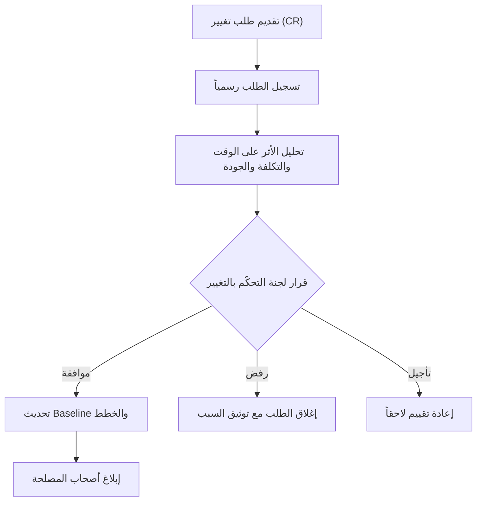

# طلب التغيير (Change Request)

> [!info] تعريف مختصر
> طلب التغيير (Change Request أو CR) هو وثيقة رسمية تطلب تعديلاً على نطاق المشروع، أو الجدول الزمني، أو الميزانية، أو المتطلبات، بعد أن كانت هذه العناصر معتمدة مسبقاً في [[Baseline]]. يُقيَّم أثره قبل الموافقة عليه أو رفضه.

## الشرح العلمي والاحترافي
- طلب التغيير هو الأداة الرسمية التي تمنع [[Scope Creep]]؛ فبدلاً من تنفيذ أي طلب جديد مباشرة، يُمرَّر عبر عملية تقييم منظّمة تُسمى "التحكّم بالتغيير" (Change Control).
- يحتوي الـCR الجيد على: وصف التغيير المطلوب، سبب الحاجة إليه، تحليل الأثر على الوقت والتكلفة والجودة والمخاطر، والبدائل الممكنة إن وُجدت.
- بعد تقديم الطلب، تتم مراجعته من لجنة التحكّم بالتغيير (Change Control Board) أو من مدير المشروع ورعاة المشروع، وتنتهي المراجعة بواحد من ثلاثة قرارات: الموافقة، الرفض، أو التأجيل لمراجعة لاحقة.
- عند الموافقة، يُحدَّث [[Baseline]] رسمياً ليعكس النطاق أو الجدول أو الميزانية الجديدة، ويُبلَّغ جميع أصحاب المصلحة بالتغيير عبر [[Communication Plan]].
- في المنهجيات الرشيقة، يأخذ طلب التغيير شكلاً أخف: بند جديد أو مُعدَّل في [[13 - Backlog]] يُقيَّم أثره على [[Sprint Goal]] الحالي، وقد يُدرَج في سبرنت لاحق دون عملية بيروقراطية ثقيلة، لكن المبدأ نفسه يبقى: لا تغيير بلا تقييم واعٍ لأثره.
- كل طلب تغيير مقبول يُسجَّل في سجل التغييرات، وهو جزء من [[Organizational Process Assets]] التي تُستخدم كمرجع في المشاريع المستقبلية.

## أين ومتى يُستخدم
- يُستخدم طوال مرحلة التنفيذ والمراقبة في أي مشروع، وخاصة في مشاريع الشلال ([[04 - Waterfall]]) حيث النطاق مُثبَّت منذ البداية.
- يُلجأ إليه عندما يطلب العميل ميزة جديدة، أو يتغيّر شرط قانوني أو تنظيمي، أو يُكتشَف خطأ في المتطلبات الأصلية يستدعي تعديلاً.
- في العقود ذات [[SOW]] محدَّد، يُعتبر الـCR الآلية القانونية الوحيدة المقبولة لتعديل بنود العقد دون فتح نزاع.
- يظهر في اجتماعات مراجعة الحالة الأسبوعية كبند دائم: "طلبات التغيير المعلّقة" و"طلبات التغيير المعتمدة هذا الأسبوع".

## مثال وسيناريو تطبيقي
> [!example] سيناريو ملموس
> في مشروع بناء منصة تجارة إلكترونية لشركة "سوق الخليج"، طلب العميل في الشهر الثاني إضافة دعم الدفع بالتقسيط عبر بنك محلي، وهو ما لم يكن ضمن العقد الأصلي.
> قدّم مدير المشروع نموذج CR رقم 07 يوضّح: الحاجة (طلب العميل)، الأثر على الجدول (أسبوعان إضافيان)، الأثر على التكلفة (12,000 ريال إضافية لتكامل بوابة الدفع)، والمخاطر (اعتماد على وثائق API من البنك قد تتأخر).
> راجعت لجنة التحكّم بالتغيير الطلب خلال يومين، ووافقت عليه مع تمديد الموعد النهائي أسبوعين وزيادة الميزانية بالمبلغ المذكور. حُدِّث [[Baseline]] رسمياً، وأُبلِغ الفريق وأصحاب المصلحة جميعاً بالتاريخ الجديد عبر [[Communication Plan]]. لم يشعر أحد لاحقاً بأن المشروع "تأخر" لأن التأخير كان معتمداً وموثّقاً منذ البداية.

## خطوات أو مخطّط
1. تقديم الطلب: يكتب صاحب الطلب (عميل أو فريق) وصفاً واضحاً للتغيير المطلوب وسببه.
2. التسجيل: يُسجَّل الطلب برقم مرجعي في سجل طلبات التغيير فور استلامه.
3. تحليل الأثر: يُقيَّم أثر التغيير على الوقت والتكلفة والجودة والمخاطر.
4. المراجعة والقرار: تجتمع لجنة التحكّم بالتغيير أو مدير المشروع لاتخاذ قرار: موافقة، رفض، أو تأجيل.
5. التحديث: عند الموافقة، يُحدَّث [[Baseline]] والخطط ذات الصلة.
6. الإبلاغ: يُبلَّغ جميع أصحاب المصلحة المتأثرين بالقرار والتفاصيل الجديدة.

## ⚠️ مفاهيم خاطئة شائعة
> [!warning]
> - الاعتقاد أن طلب التغيير يعني بالضرورة رفضاً للعميل أو تعقيداً بيروقراطياً؛ في الواقع هو أداة حماية تضمن حصول الفريق على وقت وميزانية عادلة مقابل عمل إضافي.
> - الظن بأن الموافقة الشفهية السريعة تُغني عن توثيق CR رسمي؛ بدون توثيق يصعب لاحقاً إثبات أن التغيير كان معتمداً، ويتحوّل إلى [[Scope Creep]] خفي.
> - الخلط بين طلب التغيير وتحديث بسيط في تفاصيل تنفيذية لا يمس النطاق أو الميزانية؛ ليس كل تعديل صغير يحتاج CR كامل، لكن كل تعديل يمس الالتزامات المتفَق عليها يحتاجه.

## ❌ ممارسات خاطئة في المشاريع
> [!failure]
> - تنفيذ التغيير فوراً بموافقة شفهية من شخص غير مخوَّل، ثم اكتشاف لاحقاً أن الإدارة العليا لم توافق على الميزانية الإضافية. التجنب: تحديد من يملك صلاحية اعتماد CR منذ بداية المشروع.
> - تراكم عشرات طلبات التغيير دون مراجعتها بسرعة، مما يجمّد قرارات الفريق وينشئ غموضاً حول ما هو معتمد فعلاً. التجنب: تحديد مهلة زمنية قصوى (مثلاً 48 ساعة) للرد على أي CR.
> - قبول كل طلب تغيير دون تقييم حقيقي لأثره خوفاً من إغضاب العميل، مما يُراكم تأخيراً غير محسوب. التجنب: الالتزام بتحليل الأثر الكمي قبل أي موافقة، مهما كانت العلاقة جيدة مع العميل.

## 🔗 مصطلحات ومفاهيم ذات صلة
[[Scope Creep]] | [[Baseline]] | [[Scope Statement]] | [[SOW]] | [[Communication Plan]] | [[Sign-off]] | [[Organizational Process Assets]] | [[13 - Backlog]] | [[Sprint Goal]] | [[04 - Waterfall]] | [[Risk Register]]
