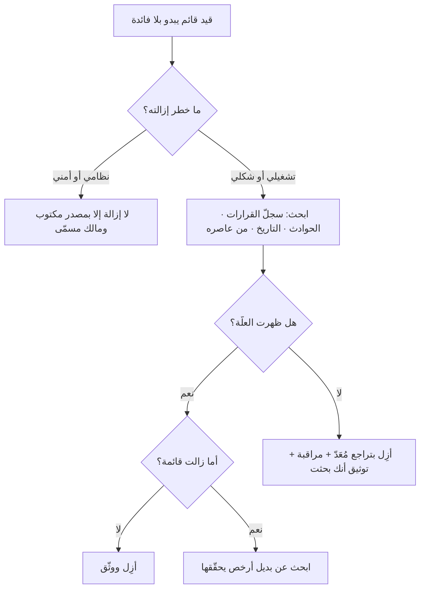

# سياج تشسترتون (Chesterton's Fence)

> [!info] تعريف مختصر
> **سياج تشسترتون** قاعدة في الإصلاح مؤدّاها: **لا تُزِل قيدًا قائمًا حتى تعرف لماذا وُضع.** ومثالها الذي صاغه الكاتب الإنجليزي ج. ك. تشسترتون في كتابه *The Thing* (1929): سياجٌ يعترض طريقًا، فيقول المصلح المتعجّل: «لا أرى له فائدة، فلنزله». فيُجاب: **«إن كنت لا ترى فائدته فلن أدعك تزيله. اذهب وفكّر، فإذا عدتَ وقلت إنك عرفت فائدته، فربّما أذنت لك بإزالته.»** والمقصود ليس تقديس القديم — بل أن **الجهل بالعلّة ليس دليلًا على انتفائها**، وأن حقّ الإلغاء يُكتسب بمعرفة السبب لا بعدم رؤيته.

## الشرح العلمي والاحترافي

### 1. لماذا القاعدة صحيحة لا محافِظة؟

- **لأن القيود القائمة كثيرًا ما تكون ندوبًا لحوادث وقعت.** الخطوة الزائدة في نشر الإصدار، والحقل الإلزامي في النموذج، وشرط الموافقة المزدوجة — كلٌّ منها في الغالب **جوابٌ لسؤالٍ نسيه الناس**. وإزالتها تعيد السؤال بلا الجواب.
- **ولأن غياب العلّة عن الظاهر ليس غيابًا لها.** فالمعرفة التنظيمية تتآكل بمغادرة الأشخاص أسرع ممّا تتآكل الإجراءات؛ فيبقى الإجراء ويرحل من يعرف سببه. **فالقاعدة في جوهرها احترازٌ من نسيان المنظّمة لا من التغيير.**
- **والقاعدة لا تُلزم بالإبقاء.** فمن بحث فوجد أن العلّة زالت — تغيّر النظام، أو انتهت اللائحة، أو حُلّت المشكلة من جذرها — فله أن يزيل، **بل عليه**. ومن بحث فلم يجد شيئًا بعد بحث معتبر، فقد استوفى ما تطلبه القاعدة.

### 2. الميل المعاكس: سياج تشسترتون في غير موضعه

- تُستعمل القاعدة كثيرًا **سلاحًا لتعطيل كل تغيير**: «لعلّ له سببًا» جملةٌ يمكن أن تُقال في كل شيء إلى الأبد، فتشلّ الإصلاح كلّه.
- **والفارق أن القاعدة تطلب بحثًا محدودًا لا يقينًا تامًّا.** فالبحث المعتبر: سؤال من عاصر القرار، ومراجعة سجلّ القرارات وتاريخ التغييرات، وسؤال أثر ثالث محتمل. **فإن استُنفدت هذه ولم يظهر سبب، فالإزالة مشروعة** — والقاعدة قد استُوفيت، ولم تُخالَف.
- **وتكلفة الإبقاء ليست صفرًا.** فكل قيد يُبقى بلا علّة يستهلك وقتًا وانتباهًا ويورّث المنظّمة عادة الخضوع لما لا يُفهم. **فالسؤال ليس «أنبقيه أم نزيله؟» بل «أيّهما أرخص: كلفة البحث، أم كلفة الخطأ إن كان له سبب؟»** — وهذا يختلف باختلاف ما يحرسه السياج.

### 3. معايرة الجهد بالخطر

يُعاير عمق البحث بما قد يقع إن كان للسياج سبب:

| نوع القيد | ما قد يقع إن أُزيل خطأً | الجهد المطلوب قبل الإزالة |
|---|---|---|
| تنسيقيّ أو شكليّ في وثيقة | لا شيء يُذكر | أزِل وراقب |
| خطوة في عملية داخلية | بطء أو ارتباك مؤقّت | اسأل الفريق واقرأ سجلّ القرارات |
| فحص آليّ أو اختبار قديم | عيب يُفلت إلى الإنتاج | ابحث عن الحادثة التي أنشأته |
| شرط أمني أو نظاميّ | مخالفة أو تسريب — ولا رجعة فيهما | لا تُزل إلا بمصدر مكتوب ومالك مسمّى |

**والقاعدة الحاكمة: الحذر يُعاير بما لا يُسترجَع.** فما كانت إزالته قابلة للتراجع جُرّبت وقيست؛ وما كانت إزالته غير قابلة للتراجع — كأي قيد يحرس بيانات أو التزامًا نظاميًّا — لم تُزَل إلا بيقين موثّق.

## أين ومتى يُستخدم

- عند دخول عضو جديد أو قائد جديد إلى فريق قائم، وهو أكثر مواضع الحاجة إليها: فما يبدو للوافد عبثًا هو غالبًا ندبة حادثة.
- عند تنظيف الكود القديم وحذف الفحوص والتحقّقات التي «لا يبدو أن أحدًا يحتاجها».
- في تبسيط الإجراءات الإدارية والنماذج، حيث تُحذف حقول لأن أحدًا لا يعرف من يقرؤها.
- عند إلغاء اجتماع دوري أو تقرير لا يبدو أن له جمهورًا — **فقد يكون له جمهور واحد لا يتكلّم**.
- في مراجعة الأدوات والأنظمة الموروثة قبل استبدالها، لاستخراج ما تحرسه قبل أن يُطفأ.

## مثال وسيناريو تطبيقي

> [!example] سيناريو ملموس
> فريق جديد تسلّم منصّة قائمة، فوجد في مسار النشر **خطوة انتظار مدّتها خمس عشرة دقيقة** بعد رفع الإصدار وقبل تحويل حركة المستخدمين إليه. ولم يجد لها في التوثيق ذكرًا، ولم يعرف أحد من الحاضرين سببها.
> فحُذفت في سبيل تسريع النشر. ومضى شهر بلا شيء.
> ثم وقع في الشهر الثاني انقطاع جزئي: فقد تبيّن أن **ذاكرة التخزين المؤقّت في طبقة وسيطة تحتاج نحو عشر دقائق لتتزامن**، وأن التحويل قبل ذلك يجعل جزءًا من المستخدمين يقرأ بيانات قديمة. وكانت الخمس عشرة دقيقة **حلًّا بدائيًّا لحادثة وقعت قبل سنتين**، سجّلها من رحل عن الفريق.
> **والقاعدة لم تكن لتمنع الحذف، بل لتغيّر ترتيبه:** أن يُسأل أوّلًا في سجلّ الحوادث وسجلّ القرارات عن أصل الخطوة. ولمّا عُرف السبب، لم يُعَد الانتظار الأعمى، **بل استُبدل به فحصٌ صريح** ينتظر تأكيد التزامن ثم يحوّل — فصار النشر أسرع من الأصل **وأأمن منه**.
> **وهذا هو ثمرة القاعدة الحقيقية: أن معرفة العلّة لا تُبقي السياج غالبًا، بل تُنتج بديلًا أفضل منه.**

## خطوات أو مخطّط

1. **صف القيد بدقّة**: ما هو، ومنذ متى، وما الذي يمنعه فعلًا؟
2. **قدّر الخطر أوّلًا** بالجدول أعلاه، فبه يُعاير الجهد التالي كلّه.
3. **ابحث عن العلّة في أربعة مواضع**: سجلّ القرارات، وسجلّ الحوادث، وتاريخ التغييرات في المستودع، ومن عاصر القرار ولو غادر.
4. **اسأل عن مستفيد غير ظاهر**: هل يعتمد عليه فريق آخر، أو تقرير، أو التزام تعاقدي؟
5. **إن ظهرت العلّة**: هل ما زالت قائمة؟ فإن زالت فأزِل، وإن بقيت **فابحث عن بديل يحقّقها بكلفة أقلّ** — وهذه أنفع ثمرة للقاعدة.
6. **إن لم تظهر بعد بحث معتبر**: أزِل **بتراجع مُعَدّ مسبقًا** وراقب مدّة كافية، ووثّق أنك بحثت ولم تجد. **فالتوثيق هنا يمنع أن يتكرّر البحث نفسه بعد سنتين.**
7. **وثّق كل قيد جديد بعلّته وقت وضعه** — فأصل المشكلة كلّها سياجٌ وُضع بلا لافتة.

## ⚠️ مفاهيم خاطئة شائعة

> [!warning]
> - **الظنّ أنها دعوة إلى الإبقاء على كل قديم**: القاعدة تشترط **المعرفة** قبل الإزالة، ولا تمنعها. ومن عرف العلّة فوجدها زائلة فعليه أن يزيل — والقاعدة معه لا عليه.
> - **استعمالها لتعطيل كل تغيير**: «لعلّ له سببًا» جملة قابلة للقول أبدًا، وقولها بلا بحث ليس تطبيقًا للقاعدة بل تحايلًا بها. **والقاعدة تطلب بحثًا محدودًا لا يقينًا تامًّا.**
> - **الظنّ أن كلفة الإبقاء صفر**: كل قيد بلا علّة يستهلك وقتًا وانتباهًا، ويُعلّم الفريق أن يخضع لما لا يفهم — وهذه أغلى كلفه.
> - **معاملة كل السياجات معاملة واحدة**: البحث عن سبب حقل تنسيقيّ في وثيقة هدرٌ للوقت، والبحث عن سبب شرط أمني واجب. **والمعيار: ما لا تُسترجَع نتيجته يُبحث فيه، وما يُسترجَع يُجرَّب.**
> - **الخلط بينها وبين [[Sunk Cost Fallacy|مغالطة التكلفة الغارقة]]**: تلك تحذّر من الاستمرار في شيء **لأنك أنفقت عليه**، وهذه تحذّر من إلغاء شيء **قبل أن تعرف وظيفته**. فتلك عن الماضي المُنفَق، وهذه عن الوظيفة المجهولة.

## ❌ ممارسات خاطئة في المشاريع

> [!failure]
> - **حذف اختبارات أو فحوص آلية لأنها «تُبطئ خطّ البناء»**: كل فحص قديم غالبًا ندبة عيب أفلت مرّة. **التجنّب:** ارجع إلى الالتزام الذي أضافه ورسالته قبل الحذف؛ فتاريخ المستودع أسهل مصادر العلّة وأرخصها.
> - **إلغاء اجتماع أو تقرير دوري لأن لا أحد يتكلّم فيه**: قد يكون له مستفيد واحد صامت — جهة رقابية أو فريق مجاور. **التجنّب:** أعلن نيّة الإلغاء مدّةً قبل تنفيذه، فالصامت يتكلّم حين يوشك أن يفقد.
> - **قيادة جديدة تلغي إجراءات الفريق في أوّل شهر**: أعلى المواضع خطرًا، لأن الوافد أقلّ الناس معرفةً بالعلل وأكثرهم قدرةً على الإلغاء. **التجنّب:** اجعل الشهر الأوّل شهر أسئلة، وأجّل الإلغاء إلى ما بعد فهم أصل ثلاثة قيود على الأقلّ.
> - **إزالة قيد أمني أو نظامي بحجّة أنه لم يُستعمل قطّ**: عدم الاستعمال قد يكون دليل نجاحه لا دليل عدم لزومه. **التجنّب:** لا تُزَل هذه إلا بمصدر مكتوب ومالك مخاطر مسمّى، وانظر [[Least Privilege|أقلّ صلاحية ممكنة]].
> - **وضع قيود جديدة بلا توثيق علّتها**: هو الذي يُنتج سياجات الغد. **التجنّب:** لكل قيد جديد سطرٌ في [[Decision Log|سجلّ القرارات]] يقول: ما الذي يمنعه، وما الحادثة التي أنشأته، ومتى يُعاد النظر فيه.

## 🔗 مصطلحات ومفاهيم ذات صلة

[[Decision Log]] | [[Lessons Learned]] | [[Blameless Postmortem]] | [[Sunk Cost Fallacy]] | [[Reversible vs Irreversible Decisions]] | [[Root Cause Analysis]] | [[Technical Debt]] | [[Tesler's Law]] | [[Least Privilege]] | [[Guard Rails]]
