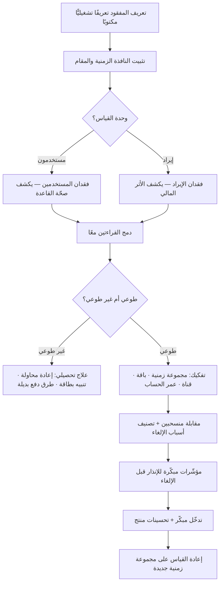

# معدّل الفقدان (Churn)

> [!info] تعريف مختصر
> نسبة ما فُقد من قاعدة المستخدمين أو من الإيراد المتكرّر خلال فترة زمنية محدَّدة، منسوبًا إلى ما كان موجودًا في بداية تلك الفترة. وهو الوجه المقابل لـ[[Retention|الاحتفاظ]]: ما لم يبقَ فقد انصرف. لكن بساطة الصيغة خادعة؛ فالرقم الناتج يتغيّر تغيّرًا هائلًا تبعًا لثلاثة قرارات تعريفية يتّخذها الفريق ونادرًا ما يوثّقها: **ما وحدة القياس** (مستخدم أم ريال)، **ما طول النافذة الزمنية** (شهر أم ربع أم سنة)، و**متى بالضبط يُعتبر المستخدم مفقودًا** (لحظة الإلغاء أم انتهاء الاشتراك أم مضيّ مدّة خمول). ولهذا فإن مقارنة معدّل فقدان بين شركتين — أو حتى بين ربعين في الشركة نفسها بعد تغيير التعريف — بلا فحص هذه القرارات الثلاثة، مقارنة بلا معنى.

## الشرح العلمي والاحترافي
- **أصل المصطلح ومساره**: الكلمة مستعارة من مِخض اللبن (الحركة الدائبة التي لا تُراكم شيئًا)، واستُعملت أوّلًا في قطاعات الاشتراك التقليدية — الاتصالات والتأمين والصحافة الورقية — حيث كان فقدان المشترك حدثًا واضحًا ومسجَّلًا. ثم انتقلت إلى البرمجيات كخدمة (SaaS) وتطبيقات الجوال، وهناك ظهرت المشكلة الجوهرية: في المنتجات المجانية أو غير التعاقدية لا توجد «لحظة إلغاء» صريحة، فصار الفقدان **استنتاجًا تعريفيًّا** لا واقعة مرصودة.
- **فقدان المستخدمين مقابل فقدان الإيراد — تمييز غير قابل للتفاوض**: فقدان المستخدمين (Customer/Logo Churn) يعدّ الرؤوس: كم حسابًا انصرف من أصل كم. وفقدان الإيراد (Revenue Churn) يعدّ الريالات: كم من الإيراد المتكرّر الشهري (MRR) اختفى. والرقمان يفترقان بشدّة حين تكون قاعدة العملاء غير متجانسة القيمة. تصوّر شركة لديها 100 عميل بإيراد شهري 100,000 ريال: انصرف 5 عملاء صغار يدفع كلٌّ منهم 200 ريال → فقدان المستخدمين 5% لكن فقدان الإيراد 1% فقط. وفي الحالة المعكوسة: انصرف عميل مؤسسي واحد يدفع 30,000 ريال → فقدان المستخدمين 1% وفقدان الإيراد 30%. الاكتفاء بأحد الرقمين يخفي دائمًا نصف الحقيقة، والمهني يعرض الاثنين معًا دومًا.
- **الفقدان الصافي والتوسّع (Net Revenue Churn / NRR)**: في نماذج الاشتراك يزيد بعض العملاء الباقين إنفاقهم (ترقية باقة، مقاعد إضافية، استهلاك أعلى). حين يُطرح هذا التوسّع من الإيراد المفقود يمكن أن يصير الناتج **سالبًا** — أي أن الإيراد من القاعدة القائمة ينمو رغم انصراف بعضها. هذه الحالة (Negative Net Churn) من أقوى مؤشّرات المتانة في نماذج B2B، لأنها تعني أن الشركة تنمو حتى لو توقّف اكتساب أي عميل جديد. لكنها أيضًا **أخطر رقم تسويقي**، لأنها قد تُستخدم لإخفاء نزيف حقيقي في عدد العملاء تعوّضه ترقيات حفنة من الحسابات الكبرى — وهو وضع هشّ ومركَّز الخطر.
- **الفقدان الطوعي مقابل غير الطوعي**: جزء معتبر من الفقدان في المنتجات المدفوعة ليس قرارًا من العميل أصلًا، بل فشل تقني في التحصيل: بطاقة منتهية الصلاحية، تجاوز حدّ، رفض بنكي، تغيير رقم. هذا **الفقدان غير الطوعي (Involuntary Churn)** قد يشكّل شريحة كبيرة من الإجمالي، وعلاجه هندسي بحت (إعادة محاولة ذكية للتحصيل، تنبيه قبل انتهاء البطاقة، طرق دفع بديلة كمحافظ محلية أو خصم مباشر) لا منتجي. خلطه بالفقدان الطوعي يوجّه فريق المنتج إلى إصلاح تجربة ليست هي المشكلة أصلًا.
- **خطر تعريف النافذة الزمنية**: الفقدان الشهري والسنوي ليسا قابلين للتحويل بضرب بسيط. فقدان شهري 5% لا يعني 60% سنويًّا بل نحو 46% (لأن كل شهر يُطبَّق على ما تبقّى: `1 − 0.95¹²`). كما أن **تقصير النافذة يخفض الرقم بصريًّا** — الفقدان الأسبوعي يبدو دائمًا «ممتازًا» مقارنة بالسنوي، وهذا مصدر تلاعب شائع في العروض التقديمية. ثم إن اختيار المقام نفسه محلّ خلاف: هل نقسم على عدد بداية الفترة، أم على متوسّط الفترة، أم نستبعد الداخلين الجدد خلالها؟ الاختيارات الثلاثة تعطي أرقامًا مختلفة، وكلها «صحيحة» بحسب تعريفها.
- **مشكلة تعريف لحظة الفقدان في المنتجات غير التعاقدية**: في تطبيق مجاني لا يوجد إلغاء، فيُعرَّف المفقود بمرور مدّة خمول (30 يومًا مثلًا). واختيار هذه المدّة تعسّفي بطبيعته وله أثر مباشر على الرقم، ويجب أن يُشتقّ من **الإيقاع الطبيعي للاستخدام** لا من العُرف: تطبيق يُستعمل يوميًّا (توصيل طعام) تكفيه نافذة أسبوعين، وتطبيق يُستعمل شهريًّا (سداد فواتير) قد تظلمه نافذة أقل من 60 يومًا فتصنّف مستخدمًا طبيعيًّا كمفقود. الخطأ الأشيع هو نسخ نافذة «30 يومًا» من مقال دون فحص إيقاع المنتج.
- **الفقدان مؤشّر متأخّر (Lagging) لا مبكّر**: حين يظهر في اللوحة يكون القرار قد اتُّخذ في نفس العميل قبل أسابيع أو أشهر. لذلك فإن إدارته تتطلّب مؤشّرات مبكّرة تسبقه: تراجع تكرار الاستخدام، هبوط عدد المستخدمين النشطين داخل الحساب المؤسسي، تراجع استخدام الميزة الأساسية، فتح تذاكر دعم متكرّرة، عدم بلوغ «لحظة القيمة» في أول أسبوع. الفريق الناضج يبني نموذج «صحّة الحساب» على هذه الإشارات ويتدخّل قبل شهر من الإلغاء، لا يوم الإلغاء.
- **العلاقة الاقتصادية بعمر العميل**: متوسّط عمر العميل يقارب مقلوب معدّل الفقدان (`1 ÷ معدّل الفقدان`)، فالفقدان الشهري 5% يعني عمرًا متوسّطًا نحو 20 شهرًا. ومنه تُحسب القيمة الحياتية للعميل، ويُقارن بتكلفة اكتسابه. وهذه العلاقة غير خطّية بقسوة: خفض الفقدان من 5% إلى 3% لا يحسّن العمر بـ40% بل يرفعه من 20 شهرًا إلى 33 — أي +67%. هذا التضخيم هو السبب الرياضي وراء قاعدة أن الاستثمار في تقليل الفقدان غالبًا أعلى عائدًا من زيادة الاكتساب بالمقدار نفسه.
- **الفقدان ليس عيبًا مطلقًا يجب تصفيره**: بعض الفقدان صحّي بل مطلوب — عملاء اجتذبهم تسويق غير دقيق ولا يناسبهم المنتج، أو عملاء تكلفة خدمتهم تفوق إيرادهم، أو حالات استخدام موسمية بطبيعتها (منتج لموسم الحج أو للعودة إلى المدارس). محاولة تصفير الفقدان تقود إلى احتجاز المستخدمين بحواجز إلغاء تعسّفية — وهي ممارسة تشتري رقمًا أفضل هذا الربع بثمن سمعة يظهر لاحقًا في قنوات التقييم والتوصية.

## أين ومتى يُستخدم
- **في تقييم [[Product-Market Fit|ملاءمة المنتج للسوق]]**: فقدان مرتفع مستمرّ رغم اكتساب قوي هو أوضح دليل على غياب الملاءمة، لا على ضعف التسويق.
- **في تحليل [[Retention|الاحتفاظ]] بالمجموعات الزمنية**: قراءة الفقدان لكل مجموعة تسجيل على حدة تكشف إن كان الوضع يتحسّن أم أن النمو يخفي تدهورًا.
- **في نمذجة الإيراد والتخطيط المالي**: يدخل الفقدان مباشرة في توقّع الإيراد المتكرّر وفي حساب القيمة الحياتية للعميل مقابل [[TCO|التكلفة الإجمالية]] وكلفة الاكتساب.
- **في تحديد [[North Star Metric|المؤشّر الشمالي]] ومؤشّرات الحماية**: يُستخدم غالبًا كمؤشّر حماية في تجارب [[AB Testing|اختبار A/B]] — فأي تحسّن في التحويل يرفع الفقدان لاحقًا مكسب زائف.
- **في توجيه [[Product Discovery|اكتشاف المنتج]]**: مقابلة المنسحبين تحديدًا من أغنى مصادر [[Pain Point|نقاط الألم]] الحقيقية، لأن ما قالوه بأقدامهم أصدق مما يقوله الراضون بألسنتهم.
- **في تصميم مسار الإلغاء داخل [[User Flow|مسار المستخدم]]**: تصنيف أسباب الإلغاء عند حدوثه يحوّل حدثًا سلبيًّا إلى أدقّ بيانات بحثية يملكها المنتج.
- **في اتفاقيات الخدمة وإدارة الحسابات**: ارتباط الفقدان بجودة الدعم و[[SLA|اتفاقية مستوى الخدمة]] وثيق في منتجات B2B.

## مثال وسيناريو تطبيقي
> [!example] منصّة سعودية للفوترة الإلكترونية بنموذج اشتراك شهري. في بداية الربع: **1,200 منشأة مشتركة**، إيراد متكرّر شهري **480,000 ريال** (متوسّط 400 ريال للمنشأة، لكن التوزيع غير متجانس: 40 حسابًا مؤسسيًّا تدفع 3,000–6,000 ريال شهريًّا وتشكّل وحدها نحو 35% من الإيراد).
> **خلال الشهر انصرفت 66 منشأة** → فقدان مستخدمين شهري = 66 ÷ 1,200 = **5.5%**. عرض فريق النمو الرقم على أنه «ضمن المعتاد»، لكن المدير المالي طلب تفصيل الإيراد: الـ66 منشأة كانت تدفع 15,840 ريالًا شهريًّا → فقدان إيراد إجمالي = 15,840 ÷ 480,000 = **3.3%**. في المقابل رفع 12 عميلًا باقين باقاتهم بمقدار 9,600 ريال → **الفقدان الصافي للإيراد = 1.3%** فقط. ثلاثة أرقام لواقع واحد، وكلٌّ منها يبرّر قرارًا مختلفًا.
> **التفكيك الثاني كشف الأهم**: من الـ66، كانت **23 منشأة (35%) فقدانًا غير طوعي** — فشل تحصيل بسبب بطاقات منتهية أو رفض بنكي، ولم تُلغِ اشتراكها أصلًا. أُنشئ لها مسار استرداد بسيط (تنبيه قبل 7 أيام من انتهاء البطاقة + إعادة محاولة تحصيل بعد 3 و7 و14 يومًا + إتاحة مدى/آبل باي كبديل)، فعاد 16 منها خلال ستة أسابيع دون أي تدخّل منتجي.
> **التفكيك الثالث بحسب العمر**: 41 من المنصرفين طوعًا كانوا في أوّل 60 يومًا من الاشتراك — أي أن المشكلة ليست في المنتج الناضج بل في **التهيئة الأولى**. أظهرت 9 مقابلات مع منسحبين أن الحاجز الحقيقي كان ربط المنصّة بهيئة الزكاة والضريبة والدخل: خطوة تقنية تتطلّب شهادة رقمية، وكان 6 من 9 قد توقّفوا عندها ولم يُصدروا فاتورة واحدة قط.
> **الأثر**: بعد إعادة تصميم خطوة الربط (معالج مبسّط + دعم مباشر عبر واتساب خلال أول 72 ساعة)، هبط فقدان أول 60 يومًا من 3.4% إلى 1.9% شهريًّا خلال ربعين. الأثر التراكمي على متوسّط عمر العميل كان أكبر بكثير من الأثر الظاهري للرقم، لأن العلاقة بين الفقدان والعمر عكسية لا خطّية.

## خطوات أو مخطّط
1. تحديد وحدة القياس صراحةً: فقدان مستخدمين، أم فقدان إيراد، أم الاثنان — واعتماد عرضهما معًا دائمًا.
2. تعريف «المفقود» تعريفًا تشغيليًّا مكتوبًا: إلغاء صريح؟ انتهاء اشتراك بلا تجديد؟ خمول لكم يومًا؟ مع اشتقاق مدّة الخمول من إيقاع الاستخدام الطبيعي للمنتج.
3. تثبيت النافذة الزمنية والمقام (بداية الفترة أم متوسّطها)، وتوثيق القاعدة في [[Single Source of Truth|مصدر الحقيقة الواحد]] لمنع تغييرها الصامت.
4. فصل الفقدان غير الطوعي (فشل التحصيل) عن الطوعي — وقياسهما كخطّين مستقلّين لأن علاجهما مختلف تمامًا.
5. تفكيك الرقم بحسب المجموعة الزمنية للتسجيل، والباقة، والقناة التسويقية، وعمر الحساب.
6. بناء مؤشّرات مبكّرة تسبق الفقدان (تراجع التكرار، هبوط المستخدمين النشطين، عدم بلوغ لحظة القيمة).
7. جمع سبب الإلغاء عند حدوثه بقائمة مغلقة قصيرة + حقل حرّ، ومقابلة عيّنة من المنسحبين شهريًّا.
8. تحويل الأسباب المتكرّرة إلى بنود في قائمة الأعمال، واختبار العلاج عبر تجربة مضبوطة حيث أمكن.
9. إعادة القياس على مجموعة زمنية جديدة — لا على المجموعة نفسها — لأن التحسّن يظهر في الداخلين بعد التغيير.

## ⚠️ مفاهيم خاطئة شائعة
> [!warning]
> - **«الفقدان الشهري × 12 = الفقدان السنوي»**: خطأ حسابي مباشر. الفقدان تراكمي على ما تبقّى، فـ5% شهريًّا تعني نحو 46% سنويًّا لا 60%. **التصحيح**: استخدم `1 − (1 − r)ⁿ`، وأعلن دائمًا النافذة المستعملة بجوار الرقم.
> - **«رقم واحد يكفي لوصف الفقدان»**: فقدان المستخدمين وفقدان الإيراد قد يشيران إلى اتجاهين متعاكسين في الشهر نفسه. **التصحيح**: اعرضهما معًا دائمًا، وأضف الفقدان الصافي بعد التوسّع في نماذج الاشتراك.
> - **«الفقدان الصافي السالب يعني أن كل شيء بخير»**: قد يخفي نزيفًا حادًّا في عدد العملاء تعوّضه ترقيات حفنة حسابات كبرى — وهو تركيز خطر لا صحّة. **التصحيح**: اقرأ الفقدان الصافي بجوار فقدان الأعداد ونسبة تركّز الإيراد في أكبر عشرة عملاء.
> - **«كل فقدان مشكلة يجب علاجها»**: انصراف عملاء غير مناسبين للمنتج تنقية صحّية، وتحسين استهدافهم في التسويق أنفع من محاولة إبقائهم. **التصحيح**: صنّف الفقدان إلى «مؤسف» و«صحّي» قبل بناء أي خطّة علاج.
> - **«الفقدان هو ببساطة 1 ناقص الاحتفاظ»**: صحيح فقط حين يُقاسان بالتعريف والنافذة والمجموعة نفسها؛ وفي الواقع تُحسب المؤشّران غالبًا بقواعد مختلفة داخل الشركة الواحدة، فلا يجمعان إلى 100%. **التصحيح**: وحّد مصدر التعريف قبل أي مقارنة.
> - **«المقارنة بمعدّل الفقدان في السوق تكفي للحكم»**: المعدّلات تختلف اختلافًا جذريًّا بين B2C وB2B، وبين الباقات الصغيرة والمؤسسية، وبحسب طول العقد وطريقة الدفع. **التصحيح**: قارن نفسك بنفسك عبر المجموعات الزمنية، واستخدم مؤشّرات السوق كإطار تقريبي لا كهدف.
> - **«الفقدان مسؤولية فريق الدعم أو النمو»**: أسبابه غالبًا منتجية وتشغيلية عميقة (تعقيد التهيئة، غياب قيمة مبكّرة، أعطال متكرّرة). **التصحيح**: اجعله مؤشّرًا مشتركًا بين المنتج والهندسة والدعم بمالك واحد معلن.

## ❌ ممارسات خاطئة في المشاريع
> [!failure]
> - **الخطأ: تغيير تعريف الفقدان (النافذة أو المقام) دون توثيق** → **لماذا يضرّ**: يهبط الرقم فجأة فيُقرأ كإنجاز، وتُتّخذ قرارات استثمارية على تحسّن لم يحدث، وتنهار الثقة بكل اللوحات حين يُكتشف السبب → **الحل**: ثبّت التعريف في مصدر حقيقة واحد، واشترط لأي تعديل إعادة احتساب أثر رجعي للفترات السابقة بالتعريف الجديد لتظلّ السلسلة قابلة للمقارنة.
> - **الخطأ: خلط الفقدان غير الطوعي بالطوعي في رقم واحد** → **لماذا يضرّ**: يوجّه فريق المنتج إلى إعادة تصميم تجربة سليمة، بينما المشكلة الحقيقية بوّابة دفع تفشل بصمت، فتُهدر ربعًا كاملًا في العلاج الخاطئ → **الحل**: افصل الخطّين من اليوم الأول، وأسند غير الطوعي لفريق المدفوعات بمؤشّر ومالك مستقلّين.
> - **الخطأ: قياس الفقدان على المستوى الكلّي فقط دون مجموعات زمنية** → **لماذا يضرّ**: النمو السريع في المسجّلين الجدد يخفض الرقم الكلّي رياضيًّا ويخفي تدهورًا حقيقيًّا في المجموعات الحديثة، فيبدو الوضع مستقرًّا حتى يتوقّف النمو فينكشف كل شيء دفعة واحدة → **الحل**: اقرأ الفقدان دائمًا على مستوى مجموعة التسجيل الزمنية، وقارن كل مجموعة بسابقتها في العمر نفسه.
> - **الخطأ: تصعيب مسار الإلغاء لتخفيض الرقم** → **لماذا يضرّ**: يشتري تأجيلًا لا احتفاظًا، ويحوّل المنسحب الصامت إلى منتقد علني في المتاجر ووسائل التواصل، وقد يخالف أنظمة حماية المستهلك → **الحل**: اجعل الإلغاء سهلًا وواضحًا، واستثمر في لحظة الإلغاء لجمع السبب وعرض بديل حقيقي (تجميد مؤقّت، باقة أصغر) بدل وضع الحواجز.
> - **الخطأ: عدم مقابلة المنسحبين إطلاقًا** → **لماذا يضرّ**: يفقد الفريق أصدق مصدر معرفي لديه ويبني خارطة طريقه على آراء الراضين فقط، فتتحسّن تجربة من بقي ولا يُعالَج سبب من انصرف → **الحل**: اجعل مقابلة 5–10 منسحبين شهريًّا التزامًا ثابتًا في دورة البحث، مع سؤال عن الوقائع لا عن الآراء.
> - **الخطأ: مطاردة الفقدان بالخصومات والعروض عند كل تهديد بالإلغاء** → **لماذا يضرّ**: يعلّم السوق أن التهديد بالإلغاء وسيلة تفاوض، فيتآكل متوسّط الإيراد ويعود العميل نفسه للتهديد كل تجديد، وتبقى المشكلة الأصلية بلا علاج → **الحل**: استخدم الخصم استثناءً محدود الصلاحية، واربط كل حالة بسبب مصنَّف يُغذّي قائمة الأعمال.
> - **الخطأ: الاكتفاء بالرقم الشهري دون مؤشّرات مبكّرة** → **لماذا يضرّ**: الفقدان مؤشّر متأخّر، فحين يظهر يكون التدخّل قد فات، والفريق يعمل دائمًا بأثر رجعي → **الحل**: ابنِ درجة صحّة للحساب من إشارات الاستخدام، وأطلق تنبيهًا وتدخّلًا بشريًّا عند هبوطها لا عند الإلغاء.
> - **الخطأ: مكافأة الفرق على خفض الفقدان وحده** → **لماذا يضرّ**: يخلق حافزًا لاستبعاد الشرائح الصعبة أو منخفضة القيمة من الاكتساب أصلًا، فيتحسّن المؤشّر وينكمش النمو → **الحل**: اربط الهدف بمزيج من الفقدان والنمو الصافي للإيراد معًا، لا بأحدهما منفردًا.

## 🔗 مصطلحات ومفاهيم ذات صلة
[[Retention]] | [[Product-Market Fit]] | [[AB Testing]] | [[User Flow]] | [[Product Analytics]] | [[North Star Metric]] | [[Pain Point]] | [[Adoption]] | [[NPS]] | [[Time to Value]] | [[TCO]] | [[Single Source of Truth]] | [[Jobs to be Done]]
