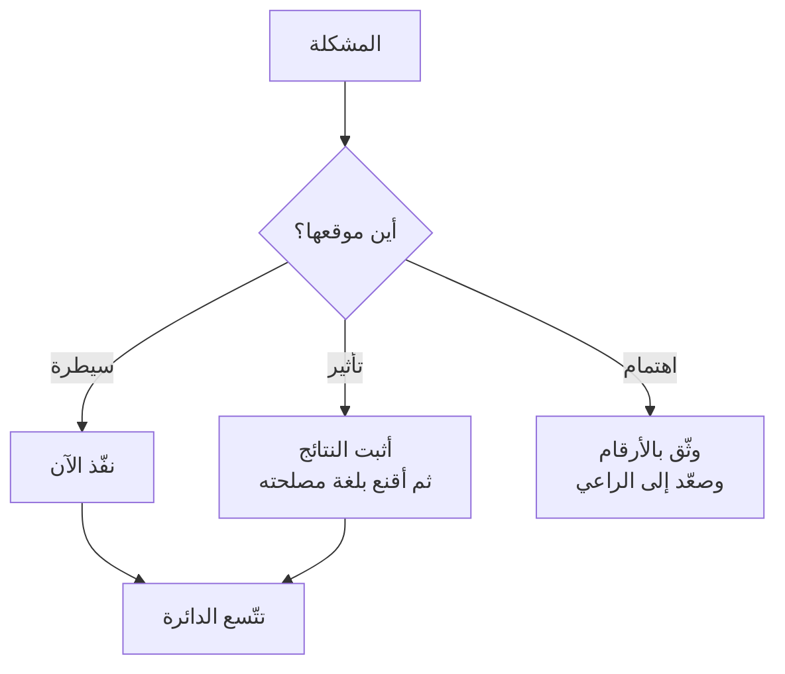

# دائرة السيطرة (Circle of Control)

> [!info] تعريف مختصر
> أداة تصنيف تفصل بين ما **تسيطر عليه** فعلًا، وما **تؤثّر فيه** دون سيطرة، وما **يقلقك ولا تملك تجاهه شيئًا**. أصلها من *العادات السبع للناس الأكثر فعالية* لستيفن كوفي (1989، بمسمّى دائرة التأثير مقابل دائرة الاهتمام). وقيمتها العملية في إدارة التغيير أنّها تُجيب عن سؤال واحد قبل بدء أيّ مبادرة: **هل ما أحاول تغييره داخل دائرتي أم خارجها؟** — لأنّ الجواب يحدّد ما إذا كنتُ أحتاج قرارًا أم رعايةً من أعلى.

## الشرح العلمي والاحترافي
- **الدوائر الثلاث**: **السيطرة** (سلوكي، جودة عملي، طريقتي في التواصل، كيف أُدير استرجاع فريقي) · **التأثير** (سلوك زملائي، قرارات مديري، ممارسات فريق مجاور) · **الاهتمام** (سياسات الشركة، السوق، قرارات مجلس الإدارة).
- **الخطأ التشخيصي الأشيع في التحوّلات** هو محاولة تغيير عنصر من دائرة الاهتمام بأدوات دائرة السيطرة — كأن يحاول سكرم ماستر أن يجعل المبيعات وما قبل البيع يعملون بطريقة رشيقة بجهده وحده. النتيجة إنهاك ثم اتّهام بالفشل، والسبب بنيوي لا شخصي.
- **صورة الخمسة المقيّدين**: كلّ إدارة شخص مقيَّد إلى الآخرين. فكّ **قيدك أنت** لا يجعلك تجري: أنت إنسان واحد ولن تجرّ البقيّة. ومن هنا القاعدة الميدانية: **التغيير في جذور الثقافة يبدأ من الأعلى؛ والتغيير داخل دائرة السيطرة يبدأ الآن وبلا استئذان.**
- **الدائرة تتّسع بالفعل لا بالطلب.** كوفي يجادل بأنّ التركيز على دائرة السيطرة يوسّعها تدريجيًّا، لأنّ النتائج المثبتة تُكسب المصداقية التي تحوّل عناصر من دائرة التأثير إلى دائرة سيطرة. وهذا هو التفسير النظري لنصيحة **«افعل المطلوب منك واصبر»** في البيئات التي لا تملك فيها سلطة.
- **حدّها الأخلاقي**: القبول بما هو خارج الدائرة ليس قبولًا بالخطأ. فالمطلوب **المحرَّم أو الضارّ** يخرج من حساب الدوائر إلى حساب المبدأ.
- **علاقتها بالاحتراق الوظيفي**: كثير من [[Burnout|الاحتراق]] في أدوار التحوّل مصدره استنزاف طاقة على دائرة الاهتمام — جهد كبير بلا أثر ممكن.

## أين ومتى يُستخدم
- **قبل إطلاق أيّ مبادرة تحوّل**: تصنيف ما تحاول تغييره.
- عند **الشعور بالعجز في بيئة سامّة**: فصل ما يمكن فعله عمّا لا يمكن.
- في **جلسات [[Retrospective|الاسترجاع]]**: تصنيف المشكلات المطروحة قبل صياغة الإجراءات — فالمشكلات خارج الدائرة تحتاج **تصعيدًا** لا إجراءً داخليًّا.
- في **التدريب المهني (Coaching)**: أداة أساسية لنقل الشخص من الشكوى إلى الفعل.

## مثال وسيناريو تطبيقي
> [!example] فريق رشيق داخل مؤسسة غير رشيقة.
> **الوضع:** فريق تطوير أتقن سكرم، وما زال يفشل في المواعيد لأنّ المتطلّبات تصله من المبيعات قبل الموعد بأيّام.
> **التصنيف:** طريقة التنقيح والتقدير والاسترجاع = **سيطرة**؛ سلوك المبيعات = **تأثير**؛ نموذج التسعير الذي يدفع المبيعات إلى الوعد بمواعيد = **اهتمام**.
> **الخطأ:** ستّة أشهر من محاولة إقناع المبيعات فريقًا لفريق ⇒ إنهاك وصفر تغيير.
> **الصواب:** (١) استمرار العمل داخل دائرة السيطرة وتحسين ما يمكن · (٢) **توثيق الأثر بأرقام** (كم مرّة وصل الطلب متأخّرًا وكم كلّف) · (٣) رفع الأرقام إلى [[Sponsor|راعٍ]] يملك الإدارتين معًا · (٤) نقل المشكلة من «شكوى فريق» إلى «قرار مؤسسي».

## خطوات أو مخطّط
1. **اكتب المشكلة** بجملة واحدة.
2. **صنّفها**: سيطرة · تأثير · اهتمام.
3. إن كانت **سيطرة**: نفّذ الآن، ولا تنتظر إذنًا.
4. إن كانت **تأثيرًا**: اصنع مصداقيةً بالنتائج، ثم أثِر الموضوع بلغة الطرف الآخر ومصلحته.
5. إن كانت **اهتمامًا**: **وثّق الأثر بالأرقام** وصعّده إلى من يملك القرار — وكفّ عن استنزاف طاقتك عليه مباشرةً.
6. **أعد التصنيف دوريًّا**: الدائرة تتحرّك مع تغيّر مصداقيتك وموقعك.

## ⚠️ مفاهيم خاطئة شائعة
> [!warning]
> - **قراءتها دعوةً إلى الاستسلام**: النموذج يوجّه الطاقة، ولا يُسقط المسؤولية عن التصعيد.
> - **الظنّ بأنّ الحدود ثابتة**: الدوائر تتحرّك؛ ما كان خارج تأثيرك العام الماضي قد يدخله بعد نتائج مثبتة.
> - **الخلط بين السيطرة والصلاحية الرسمية**: كثير ممّا تسيطر عليه سلوك لا يحتاج تفويضًا.
> - **استخدامها لتبرير عدم الإبلاغ**: ما هو خارج دائرتك يجب أن يصل إلى من هو داخل دائرته.

## ❌ ممارسات خاطئة في المشاريع
> [!failure]
> - **إطلاق تحوّل مؤسسي من موقع بلا سلطة**: يستهلك الشخص ويُنهي مصداقيته. الحلّ: أمّن الرعاية أوّلًا.
> - **تحويل الاسترجاع إلى شكوى من دائرة الاهتمام**: يقتل الجلسة. الحلّ: افصل بنود التصعيد عن بنود الإجراء.
> - **الصمت عن مشكلة بحجّة أنّها ليست من شأنك**: الحلّ: صعّدها موثَّقةً ثم اترك القرار لصاحبه.

## 🔗 مصطلحات ومفاهيم ذات صلة
[[Sponsor]] | [[Empowerment]] | [[Burnout]] | [[Retrospective]] | [[Leverage Points]] | [[Systems Thinking]] | [[Cognitive Reappraisal]] | [[14.1 التغيير التنظيمي - من أين يبدأ]]
