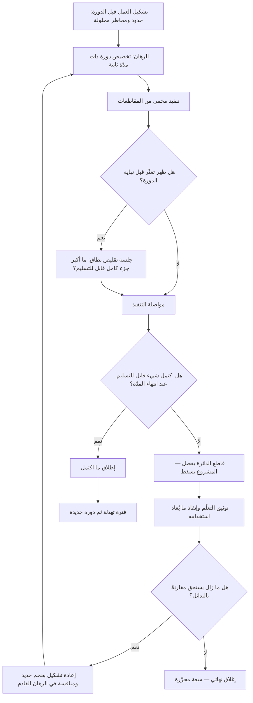

# قاطع الدائرة (Circuit Breaker)

> [!info] تعريف مختصر
> قاعدة صريحة في منهجية [[Shape Up]] تنصّ على أن **الدورة التي لا يكتمل عملها في مدّتها المحدّدة تسقط ولا تُمدَّد تلقائيًّا**؛ يعود الفريق إلى حالته الحرّة، ويجب على المشروع المتعثّر أن يُعاد تشكيله ويُقدَّم من جديد في جدول الرهانات القادم إن أراد وقتًا إضافيًّا. الاسم مستعار من قاطع التيار الكهربائي: بدل أن يحترق السلك كله عند التحميل الزائد، يفصل القاطع الدائرة تلقائيًّا. والغرض هنا مطابق — منع مشروع واحد متعثّر من استنزاف موارد الفريق إلى ما لا نهاية، وحماية بقيّة العمل من أن يحترق معه.

## الشرح العلمي والاحترافي
- **الموضع في المنهجية**: يعمل القاطع مع بقيّة عناصر [[Shape Up]] لا بمعزل عنها — الدورة الثابتة (ستّة أسابيع)، و«الشهيّة» بوصفها وقتًا مخصّصًا سلفًا بدل تقدير ينتج عن النطاق، والتشكيل المسبق للعمل، وجدول الرهانات الذي يُقرَّر فيه ما يُلتزم به في الدورة القادمة. القاطع هو ما يجعل هذه العناصر ذات معنى: بغيره تصبح الدورة الثابتة اقتراحًا، وتصبح الشهيّة تقديرًا أوّليًّا قابلًا للتجاوز.
- **قلب الفكرة: عكس اتّجاه العبء**: في الطريقة المعتادة، الافتراض الأصلي هو أن العمل سيُنجز والتمديد إجراء طبيعي يُطلَب عند الحاجة. مع القاطع ينعكس الافتراض: **السقوط هو الوضع الافتراضي**، والاستمرار هو ما يحتاج إلى قرار جديد ومبرّر جديد ومنافسة مع البدائل. هذا العكس البسيط في اتّجاه العبء هو كل الأثر: التمديد لم يعد يحدث بالقصور الذاتي، بل يحتاج أن يفوز مرّة أخرى.
- **علاجه المباشر لمغالطة التكلفة الغارقة**: التمديد التلقائي هو الشكل المؤسّسي لـ[[Sunk Cost Fallacy]] — يُمنح المشروع أسبوعين إضافيين لأن «أنفقنا ستّة أسابيع»، ثم أسبوعين آخرين للسبب نفسه المتضخّم. القاطع يقطع هذه الحلقة ببنية لا بانضباط شخصي: لا أحد مضطرّ لاتّخاذ قرار الإيقاف المؤلم، لأن الإيقاف يحدث من تلقاء نفسه ما لم يُتّخذ قرار مضادّ.
- **يُحوّل الجدول إلى قيد يضغط على النطاق**: لأن الموعد لا يتحرّك، يصبح المتغيّر الوحيد هو النطاق. هذا يدفع الفريق طوال الدورة إلى سؤال «ما الذي يمكن الاستغناء عنه لنسلّم شيئًا كاملًا؟» بدل «كم نحتاج من الوقت الإضافي؟». وهو المنطق نفسه المعبَّر عنه في [[Iron Triangle]] و[[Timeboxing]]: تثبيت ضلع لتحرير الحوار على الأضلاع الأخرى.
- **ما يفعله بالمشروع الساقط**: السقوط ليس حذفًا للفكرة. المُنتَج المكتسَب من الدورة الفاشلة هو **معرفة**: أين كان التعقيد الحقيقي؟ ما الافتراض الذي انهار؟ هذه المعرفة تُغذّي إعادة تشكيل أدقّ ونطاقًا أضيق. وكثير من المشاريع الساقطة تعود في دورة لاحقة بحجم أصغر بكثير وتنجح — وبعضها لا يعود إطلاقًا، وهذا في ذاته نتيجة صحيحة أنقذت أسابيع.
- **شرط عمله: العمل مُشكَّل والفريق مُحمَّى**: القاطع عادل فقط إذا كان العمل قد جرى تشكيله مسبقًا بحدود واضحة، وإذا كان الفريق قد مُنح دورة كاملة دون مقاطعات. تطبيق قاعدة السقوط على فريق تعرّض للمقاطعة أسبوعين أو تسلّم عملًا غامضًا يحوّل القاطع من أداة انضباط مؤسّسي إلى أداة عقاب — وهذا أشيع صور إساءة استخدامه.
- **الفرق بينه وبين سبرنت لم يكتمل**: في سكرم، البنود غير المكتملة تعود عادةً إلى الـ Backlog وقد تُلتقط في السبرنت التالي، فالاستمرار هو المسار الطبيعي. القاطع أشدّ: العمل غير المكتمل **لا يعود تلقائيًّا** إلى أي قائمة، ويجب أن يُعاد تشكيله والمنافسة به من جديد. الفرق ليس في مدّة الدورة بل في قاعدة ما بعد النهاية.
- **قريب المعنى في الهندسة**: يُستخدم المصطلح نفسه في هندسة البرمجيات لنمط يمنع الاستدعاءات المتكرّرة إلى خدمة متعطّلة بفتح الدائرة مؤقّتًا، وهو من أنماط الصمود القريبة من [[Graceful Degradation]]. المبدأ المشترك واحد: الفصل التلقائي عند تجاوز عتبة، حمايةً للنظام ككل من عطل موضعي.

## أين ومتى يُستخدم
- **في الدورات الثابتة و[[Timeboxing]]**: كقاعدة إنهاء تحوّل الصندوق الزمني من نيّة إلى التزام حقيقي.
- **في حوكمة [[Initiative]] الكبيرة**: بوضع بوابات تسقط عندها المبادرة تلقائيًّا ما لم تُجدَّد بقرار صريح ومعطيات جديدة.
- **في تجارب المنتج والاكتشاف**: عبر [[Cost of Experimentation]] و[[Hypothesis]]، حيث تُمنح التجربة مدّة ثابتة تسقط بعدها بدل التمديد بحثًا عن نتيجة مرضية.
- **في [[Go or No-Go Decision]] ومراجعات [[Steering Committee]]**: بجعل الصيغة الافتراضية للبوابة هي «يتوقّف ما لم يُجدَّد»، لا «يستمرّ ما لم يُوقَف».
- **في ضبط [[Scope Creep]]**: لأن ثبات الموعد يجعل كل إضافة نطاق قرارًا بإخراج شيء آخر، لا بتمديد الزمن.
- **في حماية سعة الفريق و[[WIP Limit]]**: إذ يمنع تراكم أعمال نصف منجَزة تمتدّ عبر عدّة دورات وتستهلك الانتباه دون أن تُسلَّم.

## مثال وسيناريو تطبيقي
> [!example] شركة سعودية للحلول التعليمية تعمل بدورات ثابتة من ستّة أسابيع. في جدول الرهانات لدورة الربيع، فاز مشروع «لوحة تقارير المعلّم» بشهيّة دورة كاملة، وجرى تشكيله في وثيقة من أربع صفحات حدّدت الحدود صراحةً: ثلاثة تقارير محدّدة فقط، بلا تصدير، وبلا تخصيص من المستخدم.
> **الأسبوع الرابع**: اكتشف الفريق أن مصدر البيانات لا يحتمل التجميع المطلوب في الزمن الحقيقي، وأن الحل يحتاج طبقة تجميع مسبق لم تكن في الحسبان. التقدير الجديد: أسبوعان إضافيان على الأقلّ.
> **ما كان سيحدث بلا قاطع**: تُطلَب موافقة على تمديد أسبوعين، ثم يُكتشف في الأسبوع الثامن أن طبقة التجميع تحتاج تعديل مخطّط قاعدة البيانات، فيُطلَب تمديد آخر. التجربة المتكرّرة في الشركة قبل تبنّي القاعدة كانت أن مشروع «الستّة أسابيع» يصل إلى أحد عشر أسبوعًا، وتسقط معه دورة كاملة من العمل الآخر كان مرتبطًا بموعد بدء العام الدراسي.
> **ما حدث فعلًا**: طُبّقت القاعدة. في الأسبوع الخامس عقد الفريق جلسة تقليص نطاق واحدة، وسأل: ما أكبر جزء قابل للتسليم كاملًا خلال ما تبقّى؟ الجواب: تقرير واحد فقط (حضور الطلاب) يُبنى على تجميع ليلي بسيط بدل الزمن الحقيقي. سُلّم هذا في نهاية الأسبوع السادس، وسقط باقي المشروع.
> **ما جرى في التهدئة**: كُتبت مذكّرة من صفحتين توثّق الاكتشاف التقني، وأُعيد تشكيل المشروع بحجم مختلف: بند مستقلّ لطبقة التجميع (شهيّة أسبوعين)، ثم التقريران المتبقّيان في دورة لاحقة.
> **النتيجة بعد دورتين**: التقرير الأول كان يُستخدم فعلًا من 64% من المعلّمين النشطين، بينما أظهرت البيانات أن أحد التقريرين المتبقّيين لا يطلبه سوى عدد ضئيل — فأُسقط نهائيًّا ولم يُبنَ إطلاقًا. أي أن القاطع لم يوفّر أسابيع التمديد فحسب، بل منع بناء ميزة كانت ستُصان إلى الأبد بلا مستخدمين.
> **الشرط الذي جعل ذلك ممكنًا**: أعلنت الإدارة صراحةً أن سقوط الدورة **ليس فشلًا يُحاسَب عليه الفريق**، وأن مؤشّر الأداء هو جودة القرارات لا نسبة الدورات المكتملة. بلا هذا الإعلان كان الفريق سيُخفي التعثّر ويسلّم عملًا هشًّا في موعده.

## خطوات أو مخطّط
1. حدّد مدّة الدورة وثبّتها، واجعلها معروفة للجميع منذ اليوم الأول.
2. شكّل العمل قبل الالتزام: حدود واضحة، وحلول للمخاطر الكبرى، ونطاق قابل للتقليص.
3. أعلن القاعدة صراحةً ومكتوبةً: ما لا يكتمل في الدورة يسقط ولا يُمدَّد.
4. احمِ الفريق من المقاطعات طوال الدورة — القاعدة تفقد عدالتها بدون ذلك.
5. راقب التقدّم بمنطق «كم بقي من مجهول» لا بنسبة المهام المنجَزة.
6. عند ظهور تعثّر مبكّر، اعقد جلسة تقليص نطاق فورًا: ما أكبر جزء كامل قابل للتسليم في المتبقّي؟
7. عند نهاية الدورة: إمّا تسليم شيء كامل، أو سقوط. لا خيار ثالث.
8. وثّق ما تعلّمته الدورة الساقطة في مذكّرة قصيرة، وأنقذ الأجزاء القابلة لإعادة الاستخدام.
9. إن أردت الاستمرار، أعد التشكيل بحجم جديد وقدّمه للمنافسة في جدول الرهانات القادم كأي مقترح آخر.

## ⚠️ مفاهيم خاطئة شائعة
> [!warning]
> - **الظنّ أن القاطع يعني إلغاء الفكرة نهائيًّا**: السقوط يعني انتهاء **هذه الدورة** لا موت الفكرة؛ يمكن أن تعود بعد إعادة تشكيل وبحجم أصغر. التصحيح: افصل بين إنهاء الالتزام الزمني وبين الحكم على قيمة الفكرة.
> - **اعتباره عقوبة للفريق**: القاعدة موجّهة إلى **قرار التخصيص** لا إلى أداء الأفراد، وسقوط دورة غالبًا دليل على تشكيل ناقص أو مخاطرة لم تُفحص قبل الالتزام. التصحيح: اجعل مراجعة السقوط تفتّش في جودة التشكيل والرهان أولًا.
> - **الخلط بينه وبين تمديد قصير «لمرّة واحدة»**: بمجرّد السماح باستثناء واحد يفقد القاطع أثره كله، لأن قوّته تأتي من كونه تلقائيًّا لا تقديريًّا. التصحيح: إن أردت الاستمرار، امنحه دورة جديدة عبر المنافسة العلنية، لا تمديدًا صامتًا للدورة القائمة.
> - **افتراض أنه ينطبق على العمل التشغيلي والحوادث**: العطل في الإنتاج لا يسقط عند انتهاء مدّة، والالتزام التنظيمي كذلك. التصحيح: طبّقه على العمل الاستكشافي والتطويري المُشكَّل، وعالج التشغيلي بمسار مختلف مثل [[Expedite Class]].
> - **الظنّ أنه يصلح بلا تشكيل مسبق ولا حماية للفريق**: تطبيق قاعدة السقوط على عمل غامض ومقاطَع يُنتج فرقًا خائفة تخفي التعثّر حتى اللحظة الأخيرة. التصحيح: طبّق العناصر معًا؛ القاطع بلا تشكيل ظلم بلا فائدة.
> - **الاعتقاد أنه يقلّل الطموح**: العكس أقرب — لأن الموعد ثابت، يجرؤ الفريق على المخاطرة بأفكار أكبر ما دام الحدّ الأقصى للخسارة معروفًا ومحدودًا سلفًا بدورة واحدة.
> - **الخلط بينه وبين النمط الهندسي المسمّى بالاسم نفسه**: نمط قطع الاستدعاءات إلى خدمة متعطّلة مفهوم تقني مختلف السياق رغم اشتراكه في المبدأ. التصحيح: انتبه إلى السياق عند استخدام المصطلح بين فرق الهندسة والمنتج.

## ❌ ممارسات خاطئة في المشاريع
> [!failure]
> - **الخطأ: السماح بتمديد الدورة «هذه المرّة فقط».** لماذا يضرّ: يُلغي أثر القاعدة بالكامل ويعيد الافتراض القديم بأن الاستمرار تلقائي، فتعود المشاريع المفتوحة النهاية. الحل: اجعل الاستمرار يمرّ عبر رهان جديد معلن يتنافس مع كل البدائل، ولا تجعل أحدًا يملك صلاحية التمديد الصامت.
> - **الخطأ: مقاطعة الفريق أثناء الدورة ثم محاسبته على عدم الاكتمال.** لماذا يضرّ: يجعل القاعدة تعسّفية، فيبدأ الفريق في المبالغة الدفاعية بالتقديرات وإخفاء المشكلات. الحل: احجز مسارًا منفصلًا للعمل الطارئ بسعة معلنة، واحسب أي مقاطعة كخصم صريح من الدورة.
> - **الخطأ: الالتزام بعمل لم يُشكَّل ولم تُحلّ مخاطره الكبرى.** لماذا يضرّ: يكتشف الفريق المجهول في منتصف الدورة فيسقط المشروع بلا مخرَج، وتضيع الدورة كاملة. الحل: اشترط قبل الرهان معالجة أكبر مصدر عدم يقين، ولو بنموذج أولي أو [[Proof of Concept]] قصير.
> - **الخطأ: قياس أداء الفرق بنسبة الدورات المكتملة.** لماذا يضرّ: يدفع إلى تسليم عمل هشّ في الموعد أو إخفاء التعثّر، ويحوّل القاطع إلى محفّز للتجميل. الحل: اقرأ السقوط كمعلومة لتحسين التشكيل، وتابع النتائج ([[Outcome vs Output]]) لا معدّل الإكمال.
> - **الخطأ: إسقاط المشروع بلا توثيق ولا إنقاذ.** لماذا يضرّ: تضيع كل المعرفة المكتسَبة، ويُعاد ارتكاب الخطأ نفسه عند إعادة المحاولة. الحل: اجعل مذكّرة تعلّم قصيرة شرطًا لإغلاق أي دورة ساقطة، وحدّد الأجزاء القابلة لإعادة الاستخدام.
> - **الخطأ: ترك التعثّر يُكتشف في الأسبوع الأخير.** لماذا يضرّ: يُلغي فرصة تقليص النطاق وتسليم جزء ذي قيمة، فيتحوّل السقوط إلى خسارة كاملة بدل خسارة جزئية. الحل: راقب المجهول المتبقّي أسبوعيًّا، واجعل جلسة تقليص النطاق إجراءً إلزاميًّا عند أول إشارة تعثّر.
> - **الخطأ: تبنّي القاطع دون تبنّي بقيّة عناصر المنهجية.** لماذا يضرّ: تُقتطع القاعدة الأقسى من سياقها الذي يجعلها عادلة (التشكيل، الشهيّة، جدول الرهانات، التهدئة)، فينتج نظام ضغط بلا حماية. الحل: إن لم تتبنَّ المنهجية كاملة، فاستعر المبدأ في صورة أخفّ — بوابة مراجعة إلزامية تُجدَّد فيها الموافقة صراحةً — بدل نقل القاعدة حرفيًّا.

## 🔗 مصطلحات ومفاهيم ذات صلة
[[Shape Up]] | [[Sunk Cost Fallacy]] | [[Prioritization]] | [[Opportunity Cost]] | [[Initiative]] | [[Eisenhower Matrix]] | [[HiPPO]] | [[Timeboxing]] | [[Go or No-Go Decision]] | [[Iron Triangle]] | [[Scope Creep]] | [[WIP Limit]] | [[Cost of Experimentation]] | [[Graceful Degradation]]
