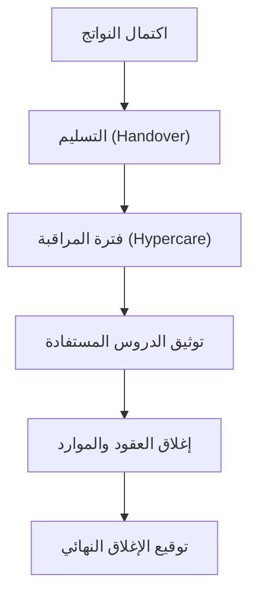

# الإغلاق مقابل التسليم (Closure vs Handover)
> [!info] تعريف مختصر
> الإغلاق (Closure) هو الإجراء الرسمي والإداري الذي يُنهي المشروع من جميع النواحي (العقود، الموارد، التوثيق). أما التسليم (Handover) فهو نقل نواتج المشروع ومسؤولية تشغيلها إلى الجهة المستفيدة أو فريق التشغيل. غالبًا ما يحدث التسليم أولًا، ثم يليه الإغلاق الرسمي.

## الشرح العلمي والاحترافي
- **التسليم (Handover)** يعني تسليم المنتج أو النظام الجاهز (Deliverable) إلى العميل أو فريق العمليات (Operations Team)، مع كل ما يلزم لتشغيله: الوثائق التقنية، بيانات الدخول، أدلة الاستخدام، وتدريب المستخدمين إن لزم.
- **الإغلاق (Closure)** أوسع من ذلك؛ فهو يشمل:
  - إغلاق العقود مع الموردين (Vendor Contracts).
  - تحرير الموارد (Resource Release) وإعادة توزيع أعضاء الفريق.
  - توثيق الدروس المستفادة (Lessons Learned).
  - أرشفة وثائق المشروع في أصول العمليات التنظيمية ([[Organizational Process Assets]]).
  - الحصول على التوقيع النهائي (انظر [[Sign-off]]) من الرعاة (Sponsors) وأصحاب المصلحة.
- الفرق الجوهري: يمكن أن يتم التسليم بنجاح بينما لا يزال المشروع "مفتوحًا" إداريًا (مثلًا بانتظار الدفعة الأخيرة أو تسوية مالية). كما يمكن أن يفشل التسليم (رفض العميل قبول النظام) مما يؤخر الإغلاق.
- الإغلاق دون تسليم سليم يُعرّض المشروع لمخاطر لاحقة: نظام يعمل دون فريق دعم يعرف كيفية صيانته.

## أين ومتى يُستخدم
- في منهجية الشلال (Waterfall) توجد مرحلة رسمية اسمها "الإغلاق" (Closing Process Group) حسب دليل PMBOK، تأتي بعد مرحلة التنفيذ والمراقبة.
- في المشاريع الرشيقة (Agile) لا توجد "مرحلة إغلاق" تقليدية بالضرورة، لكن عند انتهاء عقد أو مشروع لعميل خارجي (Agency/Outsourcing) لا بد من تسليم وإغلاق رسميين.
- يُستخدم مصطلح Handover كثيرًا في مشاريع تطوير البرمجيات عند الانتقال من فريق التطوير إلى فريق العمليات أو الدعم الفني (DevOps / SRE)، وفي مشاريع البنية التحتية عند تسليم نظام جديد للتشغيل.

## مثال وسيناريو تطبيقي
> [!example] شركة "نُظم" طورت نظام حجوزات لمستشفى خاص خلال 6 أشهر. عند اكتمال الاختبار المقبول من المستخدم ([[UAT]])، نظّم فريق المشروع جلسة تسليم (Handover) مع فريق تقنية المعلومات في المستشفى: سلّموه كود المصدر، وثائق البنية (Architecture Docs)، بيانات الدخول للخوادم، وأجروا تدريبًا لمدة يومين لموظفي الاستقبال. بعد أسبوعين من التشغيل المستقر دون أعطال حرجة، انتقل مدير المشروع لإجراءات الإغلاق: أغلق العقد مع مزوّد الاستضافة السحابية، حرّر ثلاثة مطورين للانضمام لمشروع جديد، وثّق 5 دروس مستفادة أهمها "التأخر في تحديد متطلبات التكامل مع نظام التأمين"، وحصل على توقيع رئيس قسم تقنية المعلومات على مستند إغلاق المشروع (Project Closure Report).

## خطوات أو مخطّط
1. التحقق من اكتمال جميع نواتج المشروع (Deliverables) واجتيازها للاختبار.
2. تجهيز حزمة التسليم: وثائق، بيانات وصول، أدلة تشغيل، تدريب.
3. عقد جلسة تسليم رسمية مع الجهة المستلمة والحصول على إقرار الاستلام.
4. فترة مراقبة قصيرة بعد التسليم للتأكد من الاستقرار (Hypercare Period).
5. إغلاق العقود المالية والإدارية مع الموردين والمقاولين.
6. توثيق الدروس المستفادة وأرشفة كل وثائق المشروع.
7. الحصول على التوقيع النهائي (Sign-off) وإعلان إغلاق المشروع رسميًا.

## ⚠️ مفاهيم خاطئة شائعة
> [!warning]
> - الاعتقاد أن التسليم والإغلاق حدث واحد يحصل في نفس اللحظة؛ في الواقع هما مرحلتان منفصلتان قد يفصل بينهما أسابيع أو أشهر.
> - الاعتقاد أن انتهاء البرمجة يعني انتهاء المشروع؛ الإغلاق يشمل جوانب مالية وتعاقدية وتوثيقية لا علاقة لها بالكود مباشرة.
> - الظن بأن التسليم يعني "التخلص" من المسؤولية فورًا؛ عادة تبقى مسؤولية جزئية خلال فترة الضمان أو الدعم الانتقالي.

## ❌ ممارسات خاطئة في المشاريع
> [!failure]
> - تسليم نظام دون تدريب كافٍ لفريق التشغيل، مما يؤدي إلى انهيار الخدمة عند أول عطل بسيط. **الحل:** تضمين خطة تدريب وتوثيق ضمن معايير القبول لأي تسليم.
> - إغلاق المشروع إداريًا وتحرير الفريق قبل التأكد من استقرار النظام في الإنتاج. **الحل:** الالتزام بفترة "Hypercare" لا تقل عن أسبوعين قبل الإغلاق الرسمي.
> - تجاهل توثيق الدروس المستفادة لأن "المشروع انتهى وليس هناك وقت"، فتتكرر نفس الأخطاء في المشاريع القادمة. **الحل:** جعل جلسة الدروس المستفادة خطوة إلزامية غير قابلة للتخطي في قائمة الإغلاق.

## 🔗 مصطلحات ومفاهيم ذات صلة
[[Sign-off]] | [[Organizational Process Assets]] | [[UAT]] | [[Milestone]] | [[SOW]] | [[Vendor Lock-in]] | [[04 - Waterfall]] | [[21 - Stakeholder Communication]]
