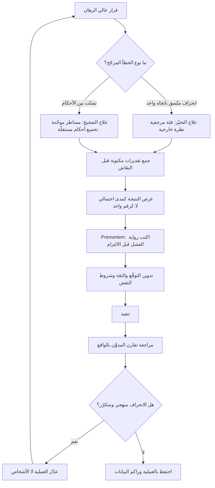

# التحيّز المعرفي (Cognitive Bias)

> [!info] تعريف مختصر
> انحرافٌ منهجي ومتكرّر في الحكم والقرار عن ما يقتضيه المنطق أو الاحتمال أو الدليل المتاح. وكلمة «منهجي» هي جوهر التعريف: التحيّز ليس خطأً عشوائيًّا يتوزّع حول الصواب فيلغي بعضُه بعضًا مع كثرة القرارات، بل **ميلٌ ثابت الاتجاه** يجعل الفريق يخطئ في الجهة نفسها مرّة بعد مرّة — يتفاءل في التقدير دائمًا، ويثبّت على أول رقم دائمًا، ويرى في الماضي حتميةً لم تكن موجودة دائمًا. ولأنه ناتج عن الطريقة التي يختصر بها الدماغ المعالجة (الاستدلالات السريعة أو Heuristics)، فهو لا يُشفى بالذكاء ولا بالنيّة الحسنة ولا بالخبرة وحدها؛ بل يُقاوَم ببناء العملية بحيث لا تعتمد صحّتها على سلامة حكم فردٍ في لحظة.

## الشرح العلمي والاحترافي

- **الأصل البحثي الموثّق**: ينتمي المصطلح بصيغته الحديثة إلى برنامج بحثي عُرف باسم **«الاستدلالات والتحيّزات» (Heuristics and Biases)** أطلقه عالما النفس **دانيال كانمان (Daniel Kahneman)** و**عاموس تفرسكي (Amos Tversky)**. ورقتهما المرجعية في هذا الباب هي *Judgment under Uncertainty: Heuristics and Biases* المنشورة في مجلة **Science سنة 1974**، وفيها عرضا ثلاثة استدلالات رئيسة: **الإتاحة (Availability)**، و**التمثيلية (Representativeness)**، و**التثبيت والتعديل (Anchoring and Adjustment)**. ثم طوّرا سنة **1979** في مجلة *Econometrica* **نظرية الاحتمال (Prospect Theory)** التي فسّرت لماذا يتصرّف الناس تجاه الخسارة تصرّفًا مختلفًا كيفيًّا عن تصرّفهم تجاه الربح المكافئ. نال كانمان **جائزة نوبل التذكارية في العلوم الاقتصادية سنة 2002** عن هذا الأثر؛ ولم ينلها تفرسكي لأنه تُوفّي سنة 1996 والجائزة لا تُمنح بعد الوفاة — وهي تفصيلة تستحقّ الذكر لأن الأدبيات المهنية كثيرًا ما تنسب العمل إلى كانمان وحده بينما هو **إنتاج مشترك** في أغلبه.
- **التحيّز ليس عيبًا في التصميم بل ثمنًا لكفاءته**: الاستدلال السريع اختصارٌ ناجح في أغلب مواقف الحياة اليومية؛ لولاه لتعذّر اتّخاذ أي قرار في زمن معقول. المشكلة تظهر حين يُطبَّق هذا الاختصار في بيئة لا تشبه البيئة التي تكوّن فيها: بيئة احتمالية، بطيئة التغذية الراجعة، مرتفعة الكلفة عند الخطأ — وهذا وصف دقيق لبيئة المشاريع والمنتجات. أي أن مدير المنتج يعمل في المنطقة التي تكون فيها هذه الاختصارات **أضعف ما تكون**.
- **التمييز بين التحيّز والضجيج (Bias vs Noise)**: يميّز الأدب اللاحق (وخصوصًا كتاب كانمان وسيبوني وسنستاين *Noise*, 2021) بين نوعين من الخطأ: **التحيّز** وهو انحراف متّسق في اتجاه واحد، و**الضجيج** وهو تشتّت غير مرغوب في الأحكام التي يُفترض أن تكون متطابقة (مقدّران يقدّران المهمّة نفسها بفارق ثلاثة أضعاف، أو المقدّر نفسه يعطي رقمين مختلفين يوم الأحد ويوم الخميس). الفرق عملي جدًّا: التحيّز يُعالَج بالمعايرة وتصحيح الاتجاه، والضجيج يُعالَج بالتوحيد والتجميع (متوسّط عدة أحكام مستقلّة، ومساطر تقدير موحّدة). وخلط الاثنين يجعل الفريق يطبّق العلاج الخطأ على المرض الخطأ.
- **التحيّز يتضخّم داخل الجماعة لا يخفّ**: الافتراض الشائع أن الفريق يصحّح فرده. الواقع أن كثيرًا من التحيّزات **تُعزَّز اجتماعيًّا**: أول رأي يُنطق في الاجتماع يصير مرساةً للبقيّة، ورأي الأعلى رتبةً يُثبّت النقاش، والرغبة في الانسجام تكبح الاعتراض. ولهذا فإن أهم إجراء مضادّ في الاجتماعات ليس فكريًّا بل **إجرائيًّا**: أن تُجمَع التقديرات والآراء **مكتوبةً ومستقلّةً قبل النقاش**، لا بعده.
- **التحيّز حالة، لا صفة شخص**: الصياغة الصحيحة ليست «فلان متحيّز» بل «هذا القرار اتُّخذ في ظروف تجعل التحيّز مرجّحًا». والظروف المرجّحة معروفة ويمكن رصدها مسبقًا: ضيق الوقت، غموض المعلومة، ارتفاع الرهان الشخصي على نتيجة بعينها، غياب تغذية راجعة سريعة، وجود صاحب قرار واحد. توصيف الحالة بدل توصيف الشخص هو ما يجعل الحديث عن التحيّز ممكنًا داخل الفريق دون أن يتحوّل إلى اتّهام.
- **الأثر التراكمي أخطر من الأثر اللحظي**: خطأ تحيّز واحد في تقدير مهمّة قد يكلّف يومين. لكن التحيّز المنهجي في **مئة تقدير** خلال سنة يُنتج خارطة طريق مبنيّة على وهم كامل. ولهذا يُقاس أثر التحيّز في المشاريع على مستوى **التوزيع** (متوسّط انحراف التقديرات عبر ربع كامل) لا على مستوى الحادثة المفردة.
- **في مشاريع الذكاء الاصطناعي يضاف بُعد جديد**: صار جزء من الحكم البشري ممرّرًا عبر نظام آلي، فتتفاعل التحيّزات البشرية مع تحيّزات النموذج ومع الميل إلى قبول مخرجاته دون فحص ([[Automation Bias]]). والنتيجة أن أخطاء الحكم لم تعد فردية ولا متفرّقة، بل تتوزّع بسرعة وبنمط واحد على آلاف الحالات.

---

## التحيّزات الرئيسة في قرارات المنتج

### ١) تحيّز التثبيت — Anchoring Bias

**التعريف**: حين يواجه الشخص تقديرًا رقميًّا في ظرف غامض، فإن أول رقم يُعرَض عليه يعمل كـ«مرساة» يبدأ منها تعديله، ويكون التعديل **دائمًا أقلّ ممّا ينبغي**. رصد كانمان وتفرسكي هذا الأثر ضمن ورقة 1974، وأظهرا أن المرساة تؤثّر حتى حين يعلم المشاركون أنها عشوائية تمامًا ولا صلة لها بالسؤال.

**مثال منتجيّ**: في اجتماع تقدير، يقول قائد الفريق قبل النقاش: «أتوقّع أن هذه الميزة تأخذ أسبوعين». التقديرات التي تُقال بعده تتراوح بين 10 و18 يومًا. ولو لم يتكلّم أصلًا، لكان مدى التقديرات المستقلّة بين 5 و45 يومًا — وهو المدى الحقيقي للجهل الجماعي بالمهمّة. المرساة لم تحسّن الدقّة، بل **أخفت التشتّت** الذي كان سيكشف أن المهمّة غير مفهومة بعد.

**العلاج العملي**: منع أي رقم من الظهور قبل جمع التقديرات المستقلّة — وهذا بالضبط منطق [[Planning Poker]] الذي يُظهر البطاقات في لحظة واحدة. وعند التفاوض على النطاق أو الميزانية، اكتب مدى تقديرك الداخلي **قبل** سماع رقم الطرف الآخر. وفي مراجعة التقديرات، اجعل نقطة الانطلاق بيانات تاريخية ([[Estimation Variance]]) لا رقم [[Original Estimate]] الأول.

---

### ٢) استدلال الإتاحة — Availability Heuristic

**التعريف**: نُقدّر احتمال الحدث بحسب **سهولة استحضار أمثلة عليه** من الذاكرة، لا بحسب تكراره الفعلي. والاستحضار يتأثّر بالحداثة، وبشدّة الأثر العاطفي، وبالتغطية الإعلامية، وبقرب الحدث منّا شخصيًّا — لا بالإحصاء. هذا أحد الاستدلالات الثلاثة الأصلية في ورقة كانمان وتفرسكي 1974.

**مثال منتجيّ**: بعد عطل إنتاجي مؤلم سببه تكامل مع بوّابة دفع، يصرف الفريق ثلاثة أسابيع على تحصين هذا التكامل تحديدًا، بينما تُظهر بيانات [[Issue Log]] أن 70% من الأعطال في آخر سنة جاءت من مهام مجدولة (Cron Jobs) صامتة لا أحد يتذكّرها لأنها لم تُسبّب ضجّة. الأولوية ذهبت إلى ما هو **حاضر في الذهن** لا إلى ما هو **متكرّر في الواقع**.

**العلاج العملي**: لا تُبنى الأولويات على ما يُذكر في الاجتماع، بل على تصنيف مكتوب للحوادث ([[Root Cause Analysis]]) وعلى معدّلات مقيسة ([[Escaped Defect Rate]]). واسأل دائمًا: «هل هذا التصوّر جاء من بياناتنا أم من آخر شيء أزعجنا؟».

---

### ٣) تحيّز الحداثة — Recency Bias

**التعريف**: إعطاء وزن غير متناسب لأحدث المعلومات أو أحدث الأحداث على حساب السلسلة الزمنية الكاملة. وهو قريب من استدلال الإتاحة لكنه أضيق وأدقّ: المحرّك هنا هو **قرب الحدث زمنيًّا** تحديدًا، لا حيويته في الذاكرة.

**مثال منتجيّ**: فريق أنجز 30 نقطة في كل سبرنت خلال ستة سبرنتات، ثم أنجز 44 نقطة في السبرنت السابع بسبب مهمّة سهلة بشكل استثنائي. في تخطيط السبرنت الثامن يلتزم الفريق بـ42 نقطة استنادًا إلى «آخر أداء»، فيفشل ويخسر مصداقيته أمام [[Steering Committee]]. الرقم الصحيح للتخطيط ليس آخر قيمة بل **توزيع القيم** ([[Percentiles and Median vs Average]]).

**مثال آخر**: تقييم أداء موظّف يتشكّل من انطباع آخر أسبوعين قبل التقييم، لا من أحد عشر شهرًا سبقتهما.

**العلاج العملي**: اعرض دائمًا سلسلة زمنية لا نقطة مفردة؛ لوحات مثل [[Burnup Chart]] و[[Control Chart]] موجودة أساسًا لهذا الغرض — لتجعل الاتجاه مرئيًّا فيصعب اختطاف القرار بآخر نقطة. وفي التقييمات، احتفظ بسجلّ ملاحظات دوري بدل الاعتماد على الذاكرة عند نهاية الدورة.

---

### ٤) انحياز الإدراك المتأخر — Hindsight Bias

**التعريف**: بعد معرفة النتيجة، يعيد الدماغ بناء الاعتقاد السابق ليجعله متوافقًا معها، فيشعر الشخص صادقًا أنه «كان يعرف طوال الوقت». وثّق هذا الأثر تجريبيًّا الباحث **باروخ فيشهوف (Baruch Fischhoff)** في منتصف السبعينيات (1975)، وسُمّي شعبيًّا **أثر «كنت أعرف من البداية» (Knew-it-all-along Effect)**.

**مثال منتجيّ**: بعد فشل إطلاق، يقول نصف الحاضرين في جلسة المراجعة: «كان واضحًا أن السوق غير جاهز». لكن مراجعة [[Decision Log]] تُظهر أن أحدًا لم يكتب ذلك قبل الإطلاق. النتيجة المدمّرة مزدوجة: **يُظلَم صاحب القرار** لأنه يُحاسَب بمعلومة لم تكن متاحة له، و**لا يتعلّم الفريق شيئًا** لأنه يستنتج «كان علينا الانتباه» بدل «كيف نجعل هذه الإشارة مرئية المرّة القادمة؟».

**العلاج العملي**: **تدوين القرار قبل النتيجة** هو الدواء الوحيد الفعّال — ماذا نتوقّع؟ بأي ثقة؟ ما الإشارات التي ستثبت خطأنا؟ ثم تُفتح الوثيقة في المراجعة وتُقارَن بالواقع. هذا يحوّل جلسة المراجعة من سرد انطباعات إلى مقارنة موثّقة. ومن هنا تنبع قيمة [[Decision Log]] الحقيقية: ليس التوثيق للأرشيف، بل **حماية الماضي من إعادة كتابته**.

---

### ٥) مغالطة التخطيط — Planning Fallacy

**التعريف**: الميل المنهجي إلى تقدير المهام بوقت وكلفة **أقلّ** من الواقع، حتى مع علم المقدِّر التامّ بأن مهامّ مشابهة سابقة تجاوزت تقديراتها. صاغ المصطلح **كانمان وتفرسكي سنة 1979** في عملهما على التنبّؤ الحدسي. والمفارقة الجوهرية فيه: الشخص نفسه يقدّر مشاريع **الآخرين** بواقعية أكبر من مشاريعه، لأنه ينظر إليها من الخارج.

**التفسير**: التقدير يُبنى بـ«النظرة الداخلية» (Inside View) — تفكيك المهمّة إلى خطواتها وتخيّل مسارها الطبيعي — وهذا المسار المتخيَّل **لا يحتوي على المفاجآت لأنها بطبيعتها غير متخيَّلة**. المضاد هو «النظرة الخارجية» (Outside View): كم استغرقت فعلًا آخر عشر مهامّ من هذا النوع؟

**مثال منتجيّ**: تقدير هجرة بيانات بـ«ثلاثة أسابيع». المسار المتخيَّل: استخراج، تحويل، تحميل، تحقّق. المسار الواقعي أضاف: انتظار صلاحيات وصول 6 أيام، اكتشاف 4% سجلات تالفة لم تظهر إلا في [[Data Dry Run]]، وإجازة المسؤول الوحيد عن النظام القديم. النتيجة: تسعة أسابيع.

**العلاج العملي**: **التنبّؤ بالفئة المرجعية (Reference Class Forecasting)** — وهو الإجراء الذي اقترحه كانمان وتفرسكي وطوّره لاحقًا في تطبيقات مشاريع البنية التحتية الباحث **بنت فليفبيرغ (Bent Flyvbjerg)**: بدل تقدير هذه المهمّة من الصفر، ابنِ فئة من مهامّ مشابهة سابقة وخذ توزيعها الفعلي. أضف إليه: [[Monte Carlo Simulation]] لعرض مدى احتمالي بدل رقم واحد، و[[Contingency Reserve]] المحسوب من الانحراف التاريخي لا من الحدس، و[[Buffer]] على مستوى المشروع لا على مستوى كل مهمّة (لأن الأفراد يستهلكون احتياطهم الخاص دائمًا)، و**الفحص المسبق (Premortem)** الذي وصفه **غاري كلاين (Gary Klein)**: تخيّلوا أن المشروع فشل بعد سنة، واكتبوا الآن رواية الفشل. صيغة السؤال في الماضي تُطلق التفكير النقدي الذي يكبته سؤال «ما المخاطر؟».

---

### ٦) تحيّز الناجين — Survivorship Bias

**التعريف**: الاستدلال من العيّنة التي «نجت» ووصلت إلى مرمى النظر، مع غياب كامل للعيّنة التي اختفت — فتبدو خصائصُ الناجين أسبابًا للنجاح وهي في الحقيقة خصائص موجودة في الفاشلين أيضًا لكن لا أحد يراها. المثال الكلاسيكي الذي يُروى في هذا الباب هو عمل الإحصائي **أبراهام فالد (Abraham Wald)** ضمن مجموعة البحث الإحصائي في الحرب العالمية الثانية، حين نُوقش تدريع الطائرات بناءً على مواضع الإصابات في الطائرات **العائدة**، فكان جوهر تصحيحه أن الاستدلال يجب أن ينطلق من الطائرات التي **لم تعد** — فالمواضع الخالية من الإصابات في العائدة هي على الأرجح المواضع القاتلة.

**مثال منتجيّ**: فريق يبني استراتيجيته على دراسة عشر شركات ناشئة ناجحة فيستنتج أن «الإطلاق السريع بلا اختبار سوق هو السبب». الشركات التي أطلقت بالسرعة نفسها وماتت لم تُكتب عنها مقالات ولا حضرت المؤتمرات. الاستنتاج مبنيّ على بسط بلا مقام.

**مثال أقرب وأخطر**: تحليل رضا العملاء من استبيان يجيب عنه **العملاء النشطون فقط**. الأكثر إحباطًا غادروا ولم يجيبوا، فيخرج [[NPS]] مرتفعًا بينما معدّل الفقد يرتفع في الاتجاه المعاكس. الرقم ليس كاذبًا، لكنه يقيس رضا من بقي فقط.

**العلاج العملي**: اسأل في كل تحليل: **من الغائب عن هذه البيانات؟** واجعل مقابلة المنسحبين جزءًا ثابتًا من دورة البحث ([[User Interview]])، وارصد في التحليل التنافسي من فشل لا من نجح فقط. وفي بحث السوق ([[Customer and Market Validation]])، افحص إطار العيّنة قبل النتيجة.

---

## أين ومتى يُستخدم

- **في جلسات التقدير والتخطيط**: التثبيت ومغالطة التخطيط يعملان معًا هنا بأقصى قوّة، ويظهر أثرهما في [[Estimation Variance]] وفي تجاوز [[Milestone]] المتكرّر.
- **في ترتيب أولويات الـ Backlog**: أطر مثل [[RICE Prioritization]] و[[WSJF]] ليست محصّنة؛ فمدخلاتها تقديرات بشرية قابلة للتثبيت والتفاؤل. الإطار ينظّم الحساب ولا يطهّر المدخلات.
- **في تفسير بيانات المنتج**: [[Product Analytics]] تُقرأ عبر عدسة متحيّزة إن لم يُحدَّد السؤال قبل النظر إلى الأرقام، فتنزلق القراءة إلى [[Confirmation Bias]].
- **في جلسات المراجعة وتحليل الجذور**: انحياز الإدراك المتأخر هو العدوّ الأول لجلسة [[Root Cause Analysis]] نافعة.
- **في إدارة المخاطر**: [[Risk Register]] الذي يُملأ بالحدس يعكس ما يخافه الفريق لا ما يهدّده فعلًا؛ ومصدر التشويه غالبًا استدلال الإتاحة.
- **في قرارات الاستمرار أو الإيقاف**: [[Go or No-Go Decision]] هي اللحظة التي يجتمع فيها التحيّز مع الرهان الشخصي، وحيث يظهر [[Sunk Cost Fallacy]] بأوضح صوره.
- **في أنظمة الذكاء الاصطناعي داخل المنتج**: حيث يتفاعل الحكم البشري مع مخرجات النموذج ([[Automation Bias]] و[[Human in the Loop]]).

## مثال وسيناريو تطبيقي

> [!example] شركة سعودية تبني منصّة لإدارة عقود الصيانة لعملاء مؤسّسيين. المطلوب: إطلاق وحدة «الفوترة الآلية» قبل نهاية الربع الثالث، ملتزمين أمام عميل حكومي واحد كبير.
>
> **لحظة التثبيت**: في اجتماع التخطيط، افتتح مدير التقنية بجملة: «هذه في تقديري ستّة أسابيع». دُوّنت التقديرات بعده: 5، 6، 7، 6 أسابيع. أحد المهندسين قال لاحقًا في ممرّ المكتب إنه كان يفكّر في «ثلاثة أشهر على الأقل» لكنه لم يرَ معنى لقول رقم شاذّ وحده أمام الإدارة. **التقارب في الأرقام لم يكن اتفاقًا، بل صمتًا مثبَّتًا.**
>
> **لحظة الإتاحة**: عند تعبئة [[Risk Register]]، صُدّرت المخاطر بثلاثة بنود عن أمان بوّابة الدفع — لأن الفريق عاش قبل شهرين حادثة مزعجة هناك. ولم يُسجَّل خطر «اختلاف صيغ العقود القديمة» رغم أن سجلّ الحوادث يُظهره سببًا لأربع حوادث خلال سنة.
>
> **لحظة مغالطة التخطيط**: بُني الجدول على مسار مثالي بلا أي بند لانتظار موافقات العميل الحكومي. الواقع: 11 يوم عمل انتظارًا لصلاحيات الوصول إلى بيئة الاختبار، و9 أيام لدورة [[Sign-off]] على نموذج الفاتورة.
>
> **لحظة تحيّز الناجين**: استند الفريق إلى مشروع سابق مشابه «أُنجز في سبعة أسابيع». عند التحقّق تبيّن أن ذلك المشروع كان لعميل واحد بصيغة عقد موحّدة، وأن مشروعين آخرين مشابهين أُلغيا في منتصف الطريق ولم يدخلا الذاكرة المؤسّسية أصلًا لأنهما لم يصلا إلى الإطلاق.
>
> **النتيجة**: التسليم بعد 15 أسبوعًا بدل 6 — تجاوز يقارب 150%.
>
> **ما فعله الفريق في الدورة التالية** (تغييرات بنيوية لا تذكيرات):
> ① صار جمع التقديرات مكتوبًا ومتزامنًا عبر [[Planning Poker]]، ومُنع ذكر أي رقم قبل كشف البطاقات — بما في ذلك من الإدارة.
> ② بُنيت «فئة مرجعية» من 14 وحدة سُلّمت خلال سنتين، فظهر أن **الوسيط** هو 2.4 ضعف التقدير الأولي، فصار كل جدول يُعرض بمدى: متفائل / وسيط / محافظ، مع [[Contingency Reserve]] محسوب من هذا الانحراف.
> ③ أُضيف إلى قالب التخطيط بند إلزامي اسمه «زمن انتظار الأطراف الخارجية» لا يُقبل تركه فارغًا.
> ④ صارت جلسة **Premortem** إجباريّة قبل كل التزام تعاقدي: ساعة واحدة، الافتراض أن المشروع فشل، وكل مشارك يكتب سببين **قبل** أي نقاش جماعي.
> ⑤ يُكتب في [[Decision Log]] عند كل التزام: التوقّع، ونسبة الثقة، والإشارات التي ستنقض التوقّع — ويُفتح هذا السجلّ حرفيًّا في المراجعة.
>
> **بعد ثلاثة أرباع**: متوسّط تجاوز الجداول انخفض من نحو 150% إلى نحو 22%. ولم يتغيّر أفراد الفريق ولا مستوى خبرتهم؛ تغيّرت **العملية التي تُنتج الرقم**.

## خطوات أو مخطّط

1. **حدّد القرارات عالية الرهان** التي تستحقّ عملية مضادّة للتحيّز؛ لا تُطبَّق هذه الإجراءات على كل قرار وإلا شُلّ العمل.
2. **صنّف نوع الخطأ المتوقّع**: هل المشكلة انحراف متّسق في اتجاه واحد (تحيّز) أم تشتّت بين الأحكام (ضجيج)؟ فلكلٍّ علاجه.
3. **افصل توليد الآراء عن مناقشتها**: تُجمع التقديرات والآراء مكتوبةً ومستقلّةً قبل أي حوار، لتفادي التثبيت والمجاراة.
4. **استبدل بالحدس فئة مرجعية**: ابنِ سلسلة تاريخية للمهامّ المشابهة واعرض توزيعها بدل رقم واحد.
5. **اعرض النتيجة كمدى لا كنقطة**، ووثّق الافتراضات التي يقوم عليها المدى.
6. **أجرِ فحصًا مسبقًا (Premortem)** يكتب فيه كل مشارك أسباب الفشل المتخيَّل قبل النقاش الجماعي.
7. **دوّن القرار قبل النتيجة**: التوقّع، الثقة، وشروط النقض — في [[Decision Log]].
8. **اسأل عن الغائب من البيانات**: من لم يُستبيَن؟ من انسحب؟ أي مشاريع لم تصل إلى الأرشيف لأنها أُلغيت؟
9. **راجع دوريًّا معايرة الفريق**: قارن التوقّعات المدوّنة بالنتائج الفعلية كل ربع، وعدّل معاملات التقدير بناءً على الانحراف المقيس ([[Estimation Variance]]).

## حدود «التنبيه إلى التحيّز» كعلاج

> [!note] لماذا لا تكفي الورشة التوعوية
> الاستجابة الأولى لأي فريق يكتشف موضوع التحيّزات هي ورشة تدريبية وملصق على الجدار. هذه الاستجابة **ضعيفة الأثر بنيويًّا**، لأسباب يمكن تسميتها بدقّة:
> - **بقعة التحيّز العمياء (Bias Blind Spot)**: وصفت الباحثة **إميلي برونين (Emily Pronin)** وزملاؤها ظاهرة يرى فيها الناس أثر التحيّز في أحكام غيرهم أوضح بكثير ممّا يرونه في أحكام أنفسهم. والنتيجة العملية أن التدريب على التحيّزات كثيرًا ما يُنتج **أداة اتّهام جديدة** توجَّه إلى الخصوم في النقاش، لا أداة مراجعة ذاتية.
> - **المعرفة ليست في نقطة الفعل**: التحيّز يقع أثناء الحكم السريع، بينما المعرفة عنه مخزّنة في ذاكرة تقريرية تُستدعى بالتأمّل. أن تعرف تعريف مغالطة التخطيط لا يجعلك تشعر بها وأنت تكتب رقمًا في جدول يوم الأربعاء تحت ضغط.
> - **الأثر يتلاشى بالزمن**: ما لم يُثبَّت السلوك الجديد في نموذج أو قالب أو خطوة إلزامية، تعود الممارسة إلى نقطة البداية خلال أسابيع.
> - **المحفّزات تغلب المعرفة**: كثير من التحيّز المعلن في المؤسّسات ليس خطأً إدراكيًّا صرفًا، بل استجابةً عقلانية لحوافز معوجّة. من يعلم أن التقدير المتحفّظ سيُرفض ويُقصّ من الأعلى، سيقدّم تقديرًا متفائلًا **وهو مدرك تمامًا** أنه متفائل. علاج هذا ليس تدريبًا بل تغيير طريقة استقبال الأرقام.
>
> **لماذا التغيير البنيوي أنجع**: لأنه ينقل عبء الصواب من **يقظة الفرد في اللحظة** إلى **تصميم العملية**. القاعدة التي تمنع ذكر رقم قبل كشف البطاقات تعمل حتى لو نسي الجميع كلمة "Anchoring". والقالب الذي لا يقبل جدولًا بلا بند «انتظار الأطراف الخارجية» يعمل حتى في يوم مزدحم. والسجلّ الذي يُفتح في المراجعة يمنع إعادة كتابة الماضي حتى لو أراد الجميع ذلك بحسن نيّة. التوعية تنفع بوصفها **لغة مشتركة** تجعل الاعتراض ممكنًا بلا إحراج («أظنّنا نثبّت على رقم» أسهل من «أظنّك مخطئًا») — لكنها مقدّمة للتغيير البنيوي لا بديل عنه. ولهذا تُقاس فاعلية أي برنامج مضادّ للتحيّز بـ**عدد الخطوات التي تغيّرت في العملية**، لا بعدد من حضروا الورشة.
> وأخيرًا: التغيير البنيوي نفسه يحتاج [[Psychological Safety]] لينجح؛ فقاعدة «اكتب رأيك قبل النقاش» بلا أمان نفسي تُنتج تقديرات مكتوبة تجامل المتوقَّع من الإدارة.

## ⚠️ مفاهيم خاطئة شائعة
> [!warning]
> - **«التحيّز مرادف للغباء أو سوء النيّة»**: الخطأ الأكثر تدميرًا للنقاش. التحيّزات وُثّقت لدى خبراء ومحترفين في مجالاتهم، وبعضها يقوى مع الخبرة لا يضعف (لأن الخبرة تزيد الثقة أسرع ممّا تزيد الدقّة في البيئات ضعيفة التغذية الراجعة). التصحيح: عامل التحيّز كخاصيّة في ظرف القرار، لا كصفة في شخص.
> - **«الوعي بالتحيّز يكفي لتجنّبه»**: التصحيح: الوعي شرط ضروري وغير كافٍ؛ الأثر المستقرّ يأتي من تغيير خطوات العملية والقوالب والحوافز.
> - **«التحيّزات تلغي بعضها فيتساوى الأمر»**: التصحيح: هذا ينطبق على الخطأ العشوائي لا على الانحراف المنهجي. مغالطة التخطيط تدفع في اتجاه واحد دائمًا، فتتراكم عبر مئة تقدير بدل أن تتوازن.
> - **«البيانات تحلّ المشكلة»**: التصحيح: البيانات مادّة تُقرأ بحكم بشري. اختيار المقياس، وحدود العيّنة، ومَن غاب عنها، ولحظة إيقاف التجربة — كلها قرارات قابلة للتحيّز. البيانات تنقل التحيّز من التقدير إلى التفسير ولا تلغيه.
> - **«كثرة الحاضرين في الاجتماع تصحّح الحكم»**: التصحيح: الجماعة تصحّح الضجيج لا التحيّز، وذلك **بشرط استقلال الأحكام**. اجتماع يبدأ برأي الأعلى رتبةً ينتج تحيّزًا جماعيًّا أشدّ ثقةً وأقلّ دقّة من حكم فرد واحد.
> - **«كل انحراف عن التوقّع سببه تحيّز»**: التصحيح: العالم عشوائي جزئيًّا. نتيجة سيئة قد تنتج عن قرار سليم في ظرف احتمالي؛ والحكم على القرار ينبغي أن يكون بجودة العملية والمعلومة المتاحة وقتها لا بالنتيجة وحدها.
> - **«التحيّزات قائمة طويلة يجب حفظها»**: التصحيح: القيمة العملية ليست في الحفظ بل في التعرّف على **العائلات الأربع** المؤثّرة في العمل: انحراف نقطة الانطلاق (التثبيت)، وانحراف مصدر المعلومة (الإتاحة والحداثة والناجون)، وانحراف حماية المعتقد ([[Confirmation Bias]]) وحماية الاستثمار السابق ([[Sunk Cost Fallacy]])، وانحراف إعادة بناء الماضي (الإدراك المتأخر).

## ❌ ممارسات خاطئة في المشاريع
> [!failure]
> - **بدء اجتماع التقدير برقم من صاحب أعلى صلاحية** → يثبّت جميع التقديرات اللاحقة ويحوّل الاجتماع من تقدير إلى مصادقة، ويُخفي التشتّت الذي كان سيكشف غموض المهمّة → **الحل**: تُجمع التقديرات مكتوبةً ومتزامنةً قبل أي نقاش، ويلتزم القياديّون بالصمت الرقمي حتى الكشف.
> - **بناء الجداول على المسار المثالي بلا فئة مرجعية تاريخية** → مغالطة تخطيط مؤسّسية تتكرّر كل ربع وتُفقد الفريق مصداقيته أمام [[Sponsor]] → **الحل**: احسب النسبة التاريخية بين المقدَّر والفعلي وطبّقها صراحةً، واعرض مدى بدل رقم.
> - **تعبئة سجلّ المخاطر من الذاكرة الحيّة للفريق** → يُنتج سجلًّا يعكس آخر حادثة مؤلمة لا التوزيع الحقيقي للأخطار → **الحل**: اشتقّ المخاطر من تصنيف مكتوب للحوادث السابقة، واجعل مراجعة [[Issue Log]] مدخلًا إلزاميًّا لبناء [[Risk Register]].
> - **جلسة مراجعة بلا وثيقة توقّعات مسبقة** → تتحوّل إلى سرد «كنا نعرف» وتوزيع لوم، ولا تنتج تعلّمًا لأن الماضي أُعيدت كتابته → **الحل**: افتح [[Decision Log]] المكتوب قبل النتيجة وقارنه بالواقع بندًا بندًا.
> - **قياس رضا العملاء من المستخدمين النشطين فقط** → تحيّز ناجين صريح يُنتج مؤشّرات مطمئنة بينما الفقد يرتفع → **الحل**: أدرج المنسحبين في العيّنة كسياسة ثابتة، وافصل النتائج حسب حالة النشاط قبل قراءة أي متوسّط.
> - **الاكتفاء بورشة توعية عن التحيّزات كإجراء تصحيحي** → أثر قصير الأمد يتلاشى، وقد يتحوّل إلى سلاح جدلي بحكم بقعة التحيّز العمياء → **الحل**: اشترط أن يخرج كل نشاط توعوي بتعديل ملموس في قالب أو خطوة أو معيار قبول.
> - **الإبقاء على حوافز تعاقب التقدير الواقعي** → أي إجراء مضادّ للتحيّز يُهزَم أمام الحافز؛ فالفريق سيقدّم الرقم المطلوب لا الرقم الصحيح → **الحل**: افصل «التقدير» عن «الالتزام التفاوضي»، واستقبل التقدير المرتفع بسؤال عن الافتراضات لا بطلب تخفيضه.
> - **معاملة كل قرار بالطقوس الكاملة المضادّة للتحيّز** → إرهاق إجرائي يدفع الفريق إلى الالتفاف على العملية كلها → **الحل**: صنّف القرارات بحسب الرهان وقابلية العكس، وطبّق الإجراء الثقيل على القرارات الكبيرة الصعبة العكس فقط.

## 🔗 مصطلحات ومفاهيم ذات صلة
[[Confirmation Bias]] | [[Automation Bias]] | [[Sunk Cost Fallacy]] | [[Estimation Variance]] | [[Planning Poker]] | [[Monte Carlo Simulation]] | [[Contingency Reserve]] | [[Decision Log]] | [[Risk Register]] | [[Root Cause Analysis]] | [[Percentiles and Median vs Average]] | [[Psychological Safety]] | [[Hypothesis]] | [[Dark Patterns]] | [[Concierge MVP]]

> [!tip] 💡 إثراء عملي — كورس لعبة العقل
> ثلاثة تحيّزات تُوظَّف في التفاوض وحدودها العلمية: [[Anchoring]] · [[Loss Aversion]] · [[Fundamental Attribution Error]].
