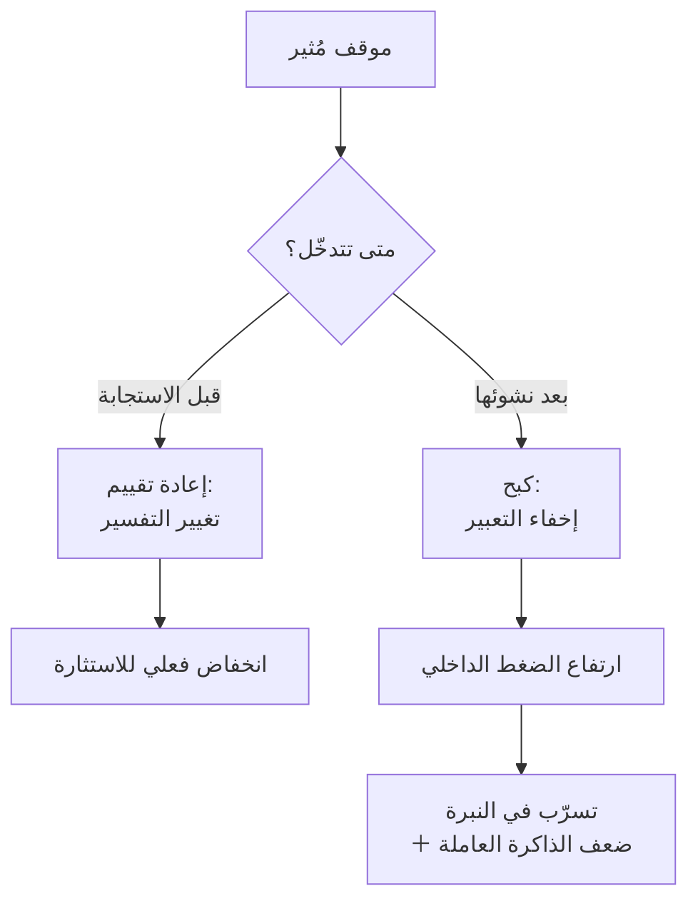

# إعادة التقييم المعرفي (Cognitive Reappraisal)
> [!info] تعريف مختصر
> إعادة التقييم هي تغيير **تفسيرك** للموقف قبل اكتمال الاستجابة الانفعالية، فتنخفض الاستثارة فعليًّا. وتُقابلها **الكبح التعبيري** — أن تشعر وتُخفي — وهو مُكلِف ويرفع الاستثارة بدل أن يخفضها.

## الشرح العلمي والاحترافي
يُميّز **جيمس غروس (James Gross)** في نموذج تنظيم الانفعال (*Process Model of Emotion Regulation*, 1998) بين استراتيجيتين تختلفان في **موضعهما الزمني** من الاستجابة:

| | **إعادة التقييم** | **الكبح التعبيري** |
|---|---|---|
| متى تتدخّل | **قبل** اكتمال الاستجابة | **بعد** نشوئها |
| ما تُغيّره | التفسير | التعبير فقط |
| الكلفة المعرفية | منخفضة | **عالية** — تستهلك الذاكرة العاملة |
| الأثر الفسيولوجي | **يخفض** الاستثارة | يرفعها |
| أثره على الآخر | محايد أو إيجابي | **يُقلّل ألفته بك** — يشعر بشيء غير مُعلَن |

**والتطبيق العملي الأهمّ** أنّ الوقفة الصامتة قبل الردّ ليست في ذاتها إعادة تقييم؛ **وما تفعله بعقلك أثناءها هو ما يُحدّد التصنيف:**

| ما تفعله في الثواني الأربع | التصنيف | الأثر |
|---|---|---|
| تُكرّر «لا تنفجر، لا تنفجر» | كبح | يرتفع الضغط؛ ستنفجر بعد الرابعة |
| تُحضّر ردًّا مُفحمًا | كبح + تحضير هجوم | الصمت واجهة؛ سيُقرأ في وجهك |
| تعدّ أو تُسبّح | إشغال محايد | يمنع الردّ الانعكاسي — الحدّ الأدنى النافع |
| **تسأل: «ما الموقف الذي جعله يقول هذا؟»** | **إعادة تقييم** | **يخفض استثارتك ويُنتج [[Labeling\|التسمية]] جاهزة** |

**والصياغة الأخيرة تُؤدّي وظيفتين معًا** — ولهذا هي أفضل استخدام للصمت التكتيكي.

## أين ومتى يُستخدم
- في الثواني الأربع بعد أن يُهاجمك أحد.
- قبل الدخول إلى اجتماع تتوقّع فيه مواجهة.
- بعد تلقّي بريد أو رسالة استفزازية — قبل أن تكتب حرفًا.
- في تدريب الفريق على التعامل مع تغذية راجعة قاسية من العميل.

## مثال وسيناريو تطبيقي
> [!example] مدير قطاع يقول في اجتماع أمام سبعة أشخاص: «التأخير كلّه بسبب فريقك.» — والدفعة الأولى غضب. **الكبح:** أن تُطبق فمك وتُكرّر لنفسك «لا تردّ» — فيبقى الضغط ويظهر في نبرتك حين تتكلّم، وتفقد جزءًا من ذاكرتك العاملة فتنسى معطًى مهمًّا. **وإعادة التقييم:** أن تسأل نفسك في الثواني نفسها: *ما الموقف الذي جعله يقول هذا أمام الجميع؟* — فيخطر لك أنّه خرج للتوّ من اجتماع مع الإدارة العليا وأنّه يحمي موقعه. **وهذا التفسير وحده يخفض الاستثارة** — لأنّ الجملة لم تعد هجومًا على كفاءتك بل حركة دفاع من رجل مضغوط. وتخرج بردّ هادئ بالمعطيات، **وبتسمية جاهزة** تستخدمها معه لاحقًا على انفراد.

## خطوات أو مخطّط
1. **لاحظ الاستثارة مبكّرًا** — تسارع نفس · حرارة · اندفاع للكلام.
2. **لا تُخفِ الشعور؛ غيّر التفسير.**
3. اطرح سؤال إعادة التقييم: **«ما الموقف الذي جعله يقول هذا؟»**
4. أو أعِد التأطير: **«هذا هجوم على الدور والعملية لا على شخصي.»**
5. ثم تكلّم — وستجد أنّ الجملة خرجت بنبرة مختلفة بلا جهد.

## ⚠️ مفاهيم خاطئة شائعة
> [!warning]
> - **ليست تجاهلًا ولا إنكارًا.** لا تقول «لا يهمّ»؛ تقول «هذا يعني شيئًا آخر ممّا ظننته أوّلًا».
> - **ليست تبريرًا للسلوك السيّئ.** إعادة تأطير هجوم بوصفه ناتجًا عن ضغط لا تعني قبوله؛ تعني أن تُدير اللحظة ثم تُعالج السلوك في موضعه.
> - **«لا أُظهر ما بداخلي» ليست مهارة.** الكبح مُكلِف ويُقلّل ألفة الآخرين بك — انظر [[Emotional Contagion]].
> - **إعادة التأطير أداة حماية لها حدّ**: تصنيف كلّ هجوم «مؤسّسيًّا» يمنعك من رؤية نمط استهداف يستحقّ تصعيدًا. والمعيار: **أيُوجَّه السلوك نفسه إلى من في دورك غيرك، أم إليك وحدك؟**

## ❌ ممارسات خاطئة في المشاريع
> [!failure]
> - **إنفاق الوقفة في تحضير ردّ** — الصمت حينها واجهة لا تنظيم، والنتيجة انفجار مؤجّل بعبارات مُعدّة.
> - **الرد على البريد الاستفزازي فورًا** — أسوأ تركيبة: استثارة عالية + وسيط يُحفَظ ويُعاد توجيهه.
> - **الاعتماد على «ضبط النفس» بوصفه إرادة** — الإرادة مورد ينفد؛ وإعادة التقييم مهارة تُتدرَّب وتُؤتمَت.
> - **التدرّب عليها أوّلًا في المواقف الحادّة** — المهارات الجديدة تحت ضغط عالٍ **تُستبدَل تلقائيًّا بالسلوك القديم**. تدرّب في مواقف منخفضة الرهان أوّلًا.

## 🔗 مصطلحات ومفاهيم ذات صلة
[[Tactical Silence]] | [[Amygdala Hijack]] | [[Emotional Contagion]] | [[Fight Flight Freeze]] | [[Emotional Intelligence]] | [[Labeling]] | [[Task vs Relationship Conflict]] | [[Deliberate Practice]]

> [!tip] 💡 إثراء عملي — كورس لعبة العقل
> جدول «ما تفعله في الثواني الأربع»، وبروتوكول ما قبل الاجتماع الصعب: [[02 - بيولوجيا اللحظة - اللوزة والقشرة الجبهية]].
