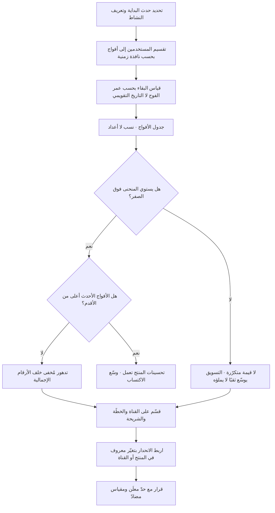

# تحليل الأفواج (Cohort Analysis)

> [!info] تعريف مختصر
> أسلوب تحليلي يقسّم المستخدمين إلى مجموعات (أفواج) تشترك في **حدث بداية واحد ضمن نافذة زمنية واحدة** — عادةً شهر التسجيل أو أسبوع أول شراء — ثم يتتبّع سلوك كل فوج **بحسب عمره منذ ذلك الحدث** لا بحسب التاريخ التقويمي. الفكرة المحورية أن الوقت يُقاس من لحظة انضمام المستخدم لا من لحظة النظر إلى التقرير، فتصير المقارنة عادلة: الشهر الثالث لفوج يناير يُقارَن بالشهر الثالث لفوج مارس. وهذا التحويل البسيط في محور الزمن هو ما يكشف ما تُخفيه الأرقام الإجمالية: **مقياس كلّي مستقرّ أو صاعد يمكن أن يخفي انهيارًا كاملًا في الأفواج الجديدة**، لأن الأفواج القديمة الجيّدة تمتصّه في المتوسّط.

## الشرح العلمي والاحترافي
- **الأصل والمنهج.** الفوج (Cohort) مفهوم أصيل في **الديموغرافيا وعلم الأوبئة**، حيث تُتابَع مجموعة وُلدت أو تعرّضت لعامل ما في فترة واحدة عبر الزمن (Cohort Study)، تمييزًا لها عن الدراسة المقطعية (Cross-sectional) التي تلتقط لحظة واحدة لجميع الأعمار مختلطة. انتقل المنهج إلى تحليلات المنتج والاشتراكات لأن المشكلة واحدة: الخلط بين **أثر العمر** (كم مضى على المستخدم) و**أثر الحقبة** (ما الذي كان يحدث في السوق والمنتج آنذاك) و**أثر الفوج** (بأي جودة دخل هؤلاء تحديدًا). الأرقام الإجمالية تخلط الثلاثة، والتحليل الفوجي يفكّها.
- **لماذا يخفي المتوسّط الكلّي الانهيار — الآلية بدقّة.** المقياس الإجمالي (مثل «نسبة المستخدمين النشطين من إجمالي المسجَّلين») هو متوسّط مرجَّح بأحجام الأفواج. ولأن الأفواج القديمة قد **نجت** من التصفية بالفعل (من بقي سنتين هو أصلًا من الناجين)، فإن سلوكها مستقرّ ومرتفع. فإذا انهار احتفاظ الفوج الجديد إلى النصف، لا يظهر ذلك في الإجمالي إلا بعد أن تكبر حصّة الأفواج الجديدة من القاعدة — أي بعد أشهر. وهذه **مغالطة الناجين (Survivorship)** ممزوجة بأثر التركيب (Mix): تغيّر تركيب القاعدة يحرّك المتوسّط بلا تغيّر في سلوك أي فرد، وهو المدخل نفسه إلى [[Simpson's Paradox]].
- **الحالة الأخطر: النمو الذي يُخفي الموت.** حين ينمو الاكتساب بسرعة، تصير الأفواج الجديدة هي الأكبر عددًا، فيرتفع عدد النشطين إجماليًّا حتى لو كان كل فوج جديد أسوأ من سابقه. الشركة تبدو نامية وهي **تُبدّل مستخدميها** لا تحتفظ بهم (ظاهرة الدلو المثقوب). التحليل الفوجي هو الأداة الوحيدة تقريبًا التي تُظهر هذا مبكّرًا، ولذلك يُعدّ الاختبار الأدقّ لـ[[Product-Market Fit]].
- **أنواع الأفواج الثلاثة.** ① **فوج الاكتساب (Acquisition Cohort)**: يُجمَّع بتاريخ الانضمام، وهو الأشيع. ② **الفوج السلوكي (Behavioral Cohort)**: يُجمَّع بفعل معيّن (من فعّل الميزة س، من أتمّ الإعداد)، وهو الأنسب لاختبار فرضيات المنتج. ③ **فوج الخصائص (Segment Cohort)**: يُجمَّع بقناة أو خطّة أو مدينة. والقراءة الأقوى تجمع بينها: فوج اكتساب مقسّمًا على القناة.
- **قراءة منحنى الاحتفاظ — ثلاث أسئلة لا واحد.** ① **الانحدار الأول**: كم يسقط بين اليوم صفر واليوم الأول؟ وهو مؤشّر على وضوح القيمة الأولى وجودة الإعداد. ② **شكل المنحنى**: هل يهبط ثم **يستوي عند مستوى ثابت (Retention Plateau)**؟ الاستواء فوق الصفر هو العلامة الجوهرية على وجود قيمة متكرّرة حقيقية؛ والمنحنى الذي يواصل الهبوط إلى الصفر يعني أن المنتج لا يُحتفَظ به مهما ضُخّ فيه تسويق. ③ **المقارنة بين الأفواج**: هل ترتفع منحنيات الأفواج الأحدث فوق الأقدم؟ ذلك هو الدليل العملي على أن تحسينات المنتج أثمرت، وهو أصدق من أي مقياس إجمالي.
- **الفرق بينه وبين [[Funnel Analysis]].** القمع يقيس **التقدّم عبر خطوات** في رحلة واحدة قصيرة نسبيًّا (زيارة → تسجيل → دفع)؛ والفوج يقيس **البقاء عبر الزمن** بعد نقطة الدخول. القمع يجيب «أين يسقطون؟» والفوج يجيب «هل بقوا؟ وهل تتحسّن الدفعات الجديدة؟». الاثنان متكاملان: قمع لكل فوج يكشف أي مرحلة تدهورت في الدفعات الأخيرة.
- **شروط منهجية لا تُهمَل.** ① **نافذة كافية**: لا يُقارَن فوج عمره أسبوعان بفوج عمره سنة إلا عند العمر نفسه. ② **حجم كافٍ**: فوج من 30 مستخدمًا يعطي تذبذبًا يُقرأ خطأً كإشارة. ③ **ثبات التعريف**: تغيير تعريف «النشط» في منتصف السلسلة يُفسد كل المقارنة. ④ **الحذر من الفوج غير المكتمل**: الفوج الأخير في الجدول ناقص البيانات دائمًا، وقراءته كأنه مكتمل خطأ متكرّر.
- **يُقرأ بالوسيط والنسب لا بالمتوسّط وحده.** داخل الفوج نفسه تتفاوت الكثافة السلوكية بشدّة، وقلّة من المستخدمين شديدي النشاط ترفع المتوسّط وتُخفي أن الأغلبية خاملة — ولهذا يُقرأ الفوج مع [[Percentiles and Median vs Average]].

## أين ومتى يُستخدم
- **في تقييم [[Product-Market Fit]]**: استواء منحنى الاحتفاظ عند مستوى ثابت هو الاختبار العملي الأشهر، ولا يظهر إلا فوجيًّا.
- **في قياس أثر تحسينات الإعداد (Onboarding) و[[Time to Value]]**: أثر التغيير يظهر في الفوج الذي دخل بعده فقط؛ قياسه على الإجمالي يطمسه تمامًا.
- **في تقييم قنوات التسويق واقتصاد الاكتساب**: الأفواج الآتية من قناة مدفوعة قد تُظهر احتفاظًا نصف القادمة من الإحالة، ما يقلب حسابات جدوى الإنفاق رأسًا على عقب.
- **في كشف انهيار مُخفى خلف [[Vanity Metrics]]**: كل رقم تراكمي صاعد يُختبر بسؤال «كيف يبدو آخر ثلاثة أفواج؟».
- **بعد إطلاق تدريجي أو [[Pilot Launch]] أو تجربة**: مجموعة التجربة ومجموعة الضبط تُقرآن كفوجين متزامنين، وإلا اختلط أثر التغيير بأثر الموسم.
- **في التنبّؤ بالإيراد وقيمة العميل**: منحنيات الأفواج هي مدخلات نموذج القيمة الدائمة؛ استخدام متوسّط كلّي بدلها يُنتج تقديرًا متفائلًا بنيويًّا.
- **في تحليل الأثر المتأخّر لأي مؤشّر متقدّم**: حين يفصل بين الفعل والنتيجة شهور ([[Leading and Lagging Indicators]])، لا سبيل لقراءة النتيجة إلا بمتابعة الفوج حتى نضجه.
- **في المنتجات الداخلية وقياس [[Adoption]]**: كل موجة تدريب أو فريق أُدخل إلى النظام يُعامَل فوجًا مستقلًّا، فتظهر جودة كل موجة على حدة.

## مثال وسيناريو تطبيقي
> [!example] تطبيق سعودي للتعلّم الذاتي بالاشتراك الشهري. لوحة الإدارة تعرض رقمين: «إجمالي المشتركين النشطين: 62,400» و«نسبة النشطين شهريًّا من قاعدة المستخدمين: 27%». الرقمان مستقرّان منذ خمسة أشهر، والانطباع: المنتج ثابت وصحّي.
> أعاد فريق البيانات بناء الجدول فوجيًّا (نسبة النشطين من كل فوج بحسب عمره بالشهور):
> | فوج التسجيل | حجم الفوج | ش0 | ش1 | ش2 | ش3 | ش4 |
> |---|---|---|---|---|---|---|
> | يناير | 9,100 | 100% | 48% | 39% | 35% | 34% |
> | فبراير | 10,400 | 100% | 46% | 38% | 34% | 33% |
> | مارس | 18,700 | 100% | 31% | 19% | 13% | — |
> | أبريل | 24,200 | 100% | 27% | 15% | — | — |
> | مايو | 29,800 | 100% | 24% | — | — | — |
> القراءة الفوجية تقلب الاستنتاج تمامًا. أفواج يناير وفبراير تستوي عند 33–34% بعد الشهر الثالث — وهذا **استواء صحّي** يدلّ على قيمة متكرّرة. أمّا من مارس فصاعدًا فالمنحنى **يواصل الهبوط بلا استواء**: 13% في الشهر الثالث ولا يزال ينزل. أي أن الأفواج الجديدة لا تحتفظ بقيمة أصلًا.
> سبب استقرار الرقم الإجمالي عند 27% رغم ذلك: حجم الأفواج الجديدة يتضاعف شهريًّا، فارتفاع عددها الخام يعوّض في البسط انهيار نسبتها، بينما الأفواج القديمة الناجية تسحب المتوسّط لأعلى. باختصار: **الشركة تشتري مستخدمين جددًا بمعدّل يفوق سرعة تسرّبهم، فيبدو الدلو ممتلئًا وهو مثقوب.**
> عند التقسيم بالقناة اتّضح المصدر: 78% من أفواج مارس–مايو جاءت من حملة تنزيل مدفوعة تَعِد بمحتوى مجاني، بينما أفواج يناير–فبراير جاءت من الإحالة والبحث. وعند تقاطع الفوج مع [[Funnel Analysis]]، ظهر أن نسبة من أنهوا الدرس الأول هبطت من 71% في يناير إلى 29% في مايو.
> القرارات: إيقاف الحملة الأعلى حجمًا والأدنى جودة، وإعادة تصميم الدرس الأول ليُنجَز في أقلّ من 6 دقائق، واعتماد **«نسبة الفوج النشطة في الشهر الثالث»** مقياسًا معتمَدًا بدل النسبة الإجمالية، مع حارس ([[Counter Metric]]) على كلفة الاكتساب. بعد أربعة أشهر: فوج سبتمبر يسجّل 30% في الشهر الثالث — أقلّ من يناير التاريخي لكنه أول فوج يستوي منذ الانهيار.

## خطوات أو مخطّط
1. حدّد **حدث البداية** بدقّة (تسجيل، أول دفع، أول استخدام فعلي)، وثبّت تعريفه في [[Single Source of Truth]].
2. اختر **حجم النافذة** (يومية للمنتجات عالية التكرار، أسبوعية أو شهرية للاشتراكات) بحيث يكون كل فوج كبيرًا بما يكفي إحصائيًّا.
3. عرّف **حدث البقاء** الذي يُعدّ به المستخدم نشطًا — ويجب أن يكون فعلًا ذا قيمة لا مجرّد فتح التطبيق.
4. ابنِ جدول الأفواج: صفوف = أفواج البداية، أعمدة = العمر منذ البداية، خلايا = نسبة الباقين لا أعدادهم.
5. اقرأ ثلاثة أشياء بالترتيب: الانحدار الأول، ووجود استواء أو غيابه، ثم اتّجاه الأفواج الأحدث مقارنة بالأقدم.
6. قسّم الأفواج على أهمّ بُعد مشتبه به (القناة، الخطّة، المدينة، الجهاز) لتحديد مصدر الفرق.
7. اربط كل تغيّر في المنحنى بتغيّر معروف في المنتج أو التسويق بتاريخه، وسجّله في [[Decision Log]].
8. حوّل أفضل مؤشّر فوجي إلى مقياس مُدار مع حدّ قرار مُعلَن ومقياس مضادّ، وراجعه دوريًّا.

## ⚠️ مفاهيم خاطئة شائعة
> [!warning]
> - **«تحليل الأفواج = تقسيم المستخدمين إلى شرائح»**: التقسيم إلى شرائح تجميع بخاصية ثابتة؛ والفوج تجميع بـ**حدث بداية زمني** ثم قياس بالعمر منذ ذلك الحدث. المحور الزمني النسبي هو جوهر الفكرة، وبدونه تكون قد قسّمت لا حلّلت أفواجًا.
> - **«الاحتفاظ الإجمالي يكفي إن كان مستقرًّا»**: الاستقرار الإجمالي أحد أكثر الإشارات خداعًا، لأنه قد ينتج عن تعادل بين نمو حجم الأفواج الجديدة وانهيار جودتها.
> - **«الفوج الأخير في الجدول يعطي أحدث قراءة»**: الفوج الأخير غير مكتمل بحكم الزمن، وأعمدته المتأخّرة فارغة أو ناقصة. قراءته كأنه مكتمل تُنتج تفاؤلًا أو تشاؤمًا زائفًا.
> - **«هبوط المنحنى دليل فشل دائمًا»**: كل منحنى احتفاظ يهبط في البداية؛ ذلك طبيعي. الفشل ليس الهبوط بل **غياب الاستواء**.
> - **«الأفواج للمنتجات الاستهلاكية فقط»**: تنطبق تمامًا على البرمجيات المؤسّسية (أفواج الحسابات)، والتدريب الداخلي (أفواج الموظفين)، بل وعلى تتبّع العيوب (أفواج الإصدارات).
> - **«معدّل الانسحاب الشهري يغني عن جدول الأفواج»**: معدّل الانسحاب رقم واحد مجمّع يُخفي أن الانسحاب مركّز في أول 30 يومًا لدى فوج بعينه؛ والتدخّل يختلف جذريًّا بحسب مكان تركّزه.
> - **«الفوج الصغير يعطي إشارة مبكّرة أفضل»**: الأفواج الصغيرة تتذبذب بشدّة، وقراءة تذبذبها كإشارة أحد أكثر مصادر القرارات الخاطئة شيوعًا.

## ❌ ممارسات خاطئة في المشاريع
> [!failure]
> - **الخطأ: عرض نسبة نشاط إجمالية واحدة في تقرير الإدارة.** لماذا يضرّ: تُخفي انهيار الأفواج الجديدة شهورًا حتى يصير التصحيح مكلفًا. الحل: اجعل «نسبة نشاط الفوج في الشهر الثالث» رقمًا ثابتًا في التقرير إلى جانب أي إجمالي.
> - **الخطأ: قياس أثر تحسين على المستخدمين كافّة بعد إطلاقه.** لماذا يضرّ: يخلط من مرّ بالتجربة القديمة بمن مرّ بالجديدة، فيُخفَّف الأثر حتى يبدو معدومًا ويُلغى تحسين ناجح. الحل: قِس الأثر على الفوج الذي دخل بعد تاريخ الإطلاق فقط، وقارنه بالفوج السابق له عند العمر نفسه.
> - **الخطأ: تغيير تعريف «المستخدم النشط» في منتصف السلسلة.** لماذا يضرّ: يُنتج قفزة أو هبوطًا مصطنعًا يُفسَّر كأثر منتج ويُبنى عليه قرار. الحل: أي تغيير في التعريف يستدعي إعادة احتساب السلسلة التاريخية كاملة وتوثيق التغيير بتاريخه.
> - **الخطأ: تجميع كل القنوات في فوج واحد.** لماذا يضرّ: تُخفي القناة الجيّدة رداءة قناة أخرى، وتستمرّ الميزانية في تمويل أسوأ مصدر. الحل: اقرأ الأفواج مقسّمة على القناة دائمًا، واحسب جدوى الإنفاق على منحنى الفوج لا على كلفة التنزيل.
> - **الخطأ: بناء توقّعات الإيراد على متوسّط قيمة العميل الكلّي.** لماذا يضرّ: المتوسّط محسوب أساسًا على الناجين من الأفواج القديمة، فيُنتج تقديرًا متفائلًا بنيويًّا يُبنى عليه توظيف وإنفاق. الحل: اشتقّ التوقّعات من منحنيات الأفواج الحديثة، واقرأها بالوسيط والشرائح المئوية.
> - **الخطأ: الاحتفال بأول فوج يتحسّن قبل نضجه.** لماذا يضرّ: التحسّن في الشهر الأول قد يكون أثر جِدّة يتلاشى في الشهر الثالث. الحل: اشترط عمرًا أدنى للفوج قبل إعلان النتيجة، واكتب هذا الشرط قبل بدء التجربة.
> - **الخطأ: بناء التحليل الفوجي مرّة واحدة كمشروع تحليلي.** لماذا يضرّ: يتحوّل إلى شريحة عرض تُؤرشَف ولا تدخل الإيقاع التشغيلي. الحل: اجعل جدول الأفواج لوحة حيّة تُراجَع في اجتماع دوري ثابت، مع مالك محدّد لكل انحدار.

## 🔗 مصطلحات ومفاهيم ذات صلة
[[KPI]] | [[North Star Metric]] | [[Outcome vs Output]] | [[Percentiles and Median vs Average]] | [[Funnel Analysis]] | [[Simpson's Paradox]] | [[Vanity Metrics]] | [[Counter Metric]] | [[Leading and Lagging Indicators]] | [[Goodhart's Law]] | [[Product Analytics]] | [[Product-Market Fit]] | [[Time to Value]] | [[Adoption]]
