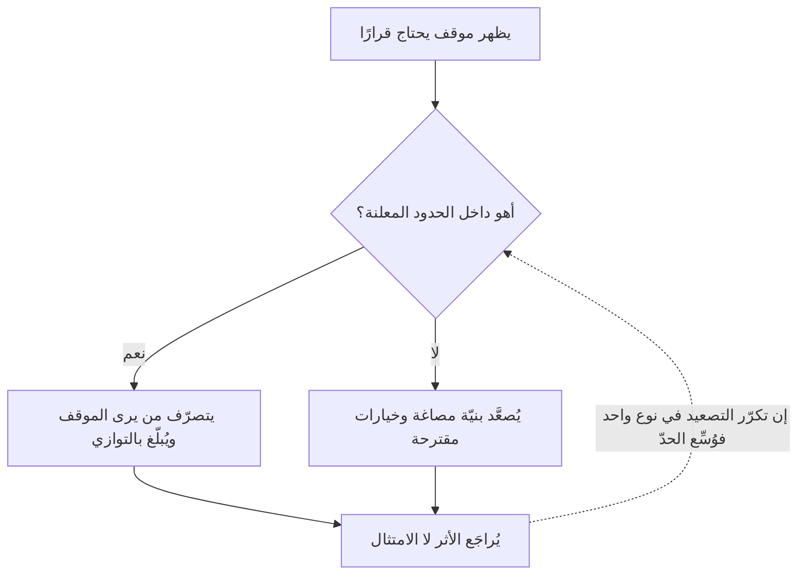

# القيادة والسيطرة (Command and Control)

> [!info] تعريف مختصر
> **القيادة والسيطرة** أسلوب إداريّ أصله عسكريّ، يقوم على أن **يُملي المستوى الأعلى ما يُفعل وكيف يُفعل**، وأن ترتفع المعلومة إليه ليقرّر ثم ينزل القرار أمرًا. ويقابله **القيادة بالمهمّة (Mission Command)** — وأصلها الألماني `Auftragstaktik` — حيث يُبلَّغ المرؤوس **بالغاية وسببها وحدودها**، ويُترك له اختيار الوسيلة. **والفرق بينهما ليس في الحزم ولا في وضوح الأمر**، بل في موضع الحدّ: أيُملَك القرار حيث تُملَك المعلومة، أم حيث تُملَك الرتبة؟

## الشرح العلمي والاحترافي

**لماذا نشأ الأسلوبان في المكان نفسه؟** لأن الجيوش أوّل من اصطدم بالمسألة عمليًّا: القائد الذي لا يرى الميدان يصدر أمرًا يصل متأخّرًا إلى وضعٍ تغيّر. فطوّر الجيش البروسي في القرن التاسع عشر مبدأ **القيادة بالمهمّة**: أن يُبيَّن للضابط **ما المطلوب بلوغه ولماذا**، ثم يُترك له كيف يبلغه بحسب ما يراه أمامه — بل يُتوقَّع منه أن **يخالف** الأمر إذا صارت مخالفته أوفى بالنيّة المعلنة.

**والفكرة نفسها هي التي شرحها [[OODA Loop|جون بويد]] بعد قرن**: أن الطرف الذي يقرّر أقرب إلى الحدث يجدّد صورته أسرع، فيصير خصمه يردّ على واقع مضى.

**وقد صاغها للأعمال ستيفن بونغاي** في *The Art of Action* (2011) بثلاث فجوات تفصل ما نريده عمّا يقع:

1. **فجوة المعرفة**: بين ما نودّ أن نعرفه وما نعرفه فعلًا حين نقرّر.
2. **فجوة المواءمة**: بين ما نريد أن يفعله الناس وما فهموه منّا.
3. **فجوة الأثر**: بين ما فعلوه وما نتج عنه فعلًا.

**والخطأ المتكرّر أن يُعالَج كلٌّ منها بالمزيد من الشيء نفسه:** فتُواجَه فجوة المعرفة بمزيد من التقارير والتفاصيل، وفجوة المواءمة بمزيد من التعليمات، وفجوة الأثر بمزيد من الرقابة. **والعلاج المقترح عكسه:** أن يُبلَّغ **القصد** لا الخطوات، وأن يُترك مدى للتصرّف داخل حدود، وأن يُقاس الأثر لا الامتثال.

**ولا يُقال إن القيادة والسيطرة أسلوب فاسد مطلقًا.** فهي أنسب الأساليب في مواضع بعينها: في الطوارئ حيث تكلفة التردّد أعلى من تكلفة الخطأ، وفي العمل عالي الخطورة الذي لا يحتمل اجتهادًا (السلامة، والطيران، والعمليات المصرفية النظامية)، ومع فريق جديد لم تُبنَ كفاءته بعد. **والخلل أن تصير الحالة الاستثنائية أسلوب الإدارة الدائم** — فحينها تُنتج ما تخشاه: فريقًا لا يبادر، فيُقال إنه يحتاج مزيدًا من التوجيه.

**وأثرها البنيويّ في المشاريع** أنها تُطيل حلقة القرار: فكل مسألة تصعد وتنزل، ويصير **أبطأ حلقة في المنظّمة هي إيقاعها كلّه**. ولهذا تُقاس صحّة التفويض بسؤال عمليّ واحد: **كم يومًا يمرّ بين أن يعرف الفريق المشكلة وأن يملك التصرّف فيها؟**

## أين ومتى يُستخدم

- **يصلح**: في إدارة الحوادث الحرجة، وفي العمليات المنظَّمة نظاميًّا التي لا تحتمل اجتهادًا، وفي الفرق الجديدة تدريبًا مؤقّتًا حتى تنضج، وفي القرارات غير القابلة للتراجع ([[Reversible vs Irreversible Decisions]]).
- **ولا يصلح**: في العمل المعرفيّ المتغيّر، وفي الفرق الموزّعة التي يفصلها الوقت عن مركز القرار، وفي المنافسة السريعة حيث يحسم الإيقاع.
- **والقيادة بالمهمّة تحتاج شرطين لتعمل**: كفاءة يُوثق بها، **ونيّة معلنة بوضوح**. فمن فوّض بلا بيان الغاية لم يفوّض بل تخلّى.

## مثال وسيناريو تطبيقي

> [!example] سيناريو ملموس
> منصّة توصيل اسمها **«وصلة»** تتعطّل خدمة التتبّع فيها ساعتين في يوم ذروة.
>
> **بأسلوب القيادة والسيطرة:** يرفع المهندس المناوب المشكلة إلى مديره، فيرفعها إلى مدير التقنية، فتُعقد مكالمة بعد 40 دقيقة، ويُتّخذ قرار العودة إلى النسخة السابقة بعد 70 دقيقة، ويُنفَّذ في الدقيقة 95. **والتحليل بعدها يكشف أن المناوب عرف الحلّ في الدقيقة الثامنة** — لكنه لم يكن يملك تنفيذه.
>
> **وبالقيادة بالمهمّة:** يكون معلنًا سلفًا أن **الغاية** إبقاء الطلبات جارية، وأن **الحدّ** ما يُنفَّذ دون إذن: العودة إلى نسخة سابقة، وإطفاء ميزة غير جوهرية، وإنفاق لا يتجاوز حدًّا ماليًّا معلومًا. فيتصرّف المناوب في الدقيقة العاشرة ويُبلّغ بالتوازي.
>
> **وموضع الدرس:** لم تكن المسألة في مهارة المهندس ولا في سرعة المدير، بل في **موضع الحدّ**. وحيث يبعد الحدّ عن موضع المعرفة، تُدفَع الكلفة دقائقَ في كل حادث ثم تُنسب إلى «ضعف الجاهزية».

## خطوات أو مخطّط

1. **اكتب النيّة قبل التعليمات**: ما الغاية، ولماذا الآن، وما الذي لا يُساوَم عليه؟
2. **حدّد الحدود صراحةً**: ماذا يملك الفريق أن يقرّره بلا إذن — بالمال والوقت والنطاق ([[Guard Rails]]).
3. **اطلب النتيجة لا الطريقة**، واترك الطريقة لمن يرى الموقف.
4. **اجعل الإبلاغ متوازيًا مع الفعل** لا شرطًا سابقًا له في الحالات المعرَّفة.
5. **راجع الأثر لا الامتثال**: هل تحقّقت النيّة؟ وإن خولف الأمر وتحقّقت، فذلك نجاح للنظام لا خرق له.

## ⚠️ مفاهيم خاطئة شائعة

> [!warning]
> - **أن نقيضها الفوضى.** بل نقيضها **حدود مكتوبة ونيّة واضحة**. والقيادة بالمهمّة أشدّ انضباطًا في صياغة الغاية، وأخفّ في إملاء الوسيلة.
> - **أنها مرادفة لـ[[Micromanagement|الإدارة التفصيلية]].** بينهما فرق: تلك متابعة لصيقة لتفاصيل التنفيذ، وهذه **بنية صلاحيات** قد تكون مشروعة في موضعها. والإدارة التفصيلية عطل في كل موضع تقريبًا.
> - **أنها أسلوب الجيوش.** الجيوش نفسها هي التي طوّرت بديلها قبل قرنين، ولسبب عمليّ محض: أن الأمر يصل متأخّرًا.
> - **أن التفويض قرار شخصيّ من المدير.** هو **تصميم**: حدود مكتوبة، ومعايير قبول، وإبلاغ متّفق عليه. وما لا يُكتب لا يُعتمد عليه عند أوّل خلاف.

## ❌ ممارسات خاطئة في المشاريع

> [!failure]
> - **تفويض المسؤولية بلا الصلاحية**: يُسأل الفريق عن النتيجة ولا يملك ما يغيّرها. **والأثر المقيس** أن يتوقّف الفريق عن الإبلاغ المبكّر، إذ يصير الإبلاغ استدعاءً للّوم لا طلبًا للعون. **التجنّب:** لكل مسؤولية مُسنَدة قرارٌ مقابل مكتوب.
> - **نقض القرار المفوَّض عند أوّل خلاف**: فيتعلّم الفريق أن الحدود زينة، ويعود التصعيد في كل صغيرة. **التجنّب:** إن كان القرار داخل الحدّ فلا يُنقض، وإنما يُراجَع الحدّ نفسه بعدها.
> - **إعلان النيّة بصيغة عامّة لا تُقيّد شيئًا**: «هدفنا رضا العميل» لا يُعين على قرار. **التجنّب:** صياغة تُبيّن ما يُقدَّم على ما — «أبقِ الطلبات جارية ولو تعطّل التتبّع».
> - **إبقاء أسلوب الطوارئ بعد انتهائها**: تُدار الأزمة بالسيطرة — وهو صواب — ثم لا يُعاد الحدّ إلى موضعه، فتصير الاستثناء عادة. **التجنّب:** لكل تضييق للصلاحية تاريخُ انتهاء معلن.

## 🔗 مصطلحات ومفاهيم ذات صلة

[[Theory X and Y]] | [[Scientific Management]] | [[OODA Loop]] | [[Self-Organizing Team]] | [[Empowerment]] | [[Micromanagement]] | [[Guard Rails]] | [[Servant Leadership]] | [[Psychological Safety]] | [[Reversible vs Irreversible Decisions]] | [[Alignment]] | [[Leadership at Every Level]] | [[Chain of Command]]
