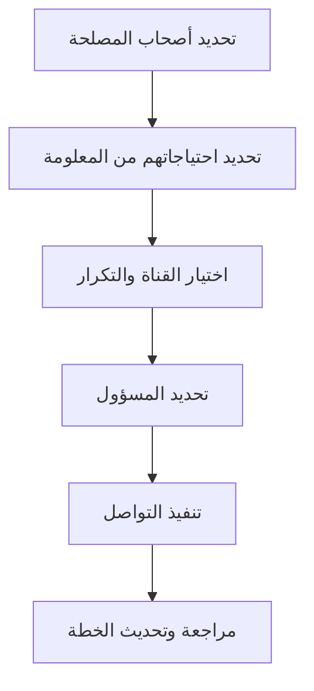

# خطة التواصل (Communication Plan)
> [!info] تعريف مختصر
> خطة التواصل هي وثيقة تحدد من يحتاج أي معلومة، ومتى، وبأي وسيلة، ومن المسؤول عن إيصالها. الهدف ضمان وصول المعلومة الصحيحة للشخص الصحيح في الوقت المناسب دون إغراق الفريق برسائل زائدة.

## الشرح العلمي والاحترافي
- تُبنى خطة التواصل عادة بعد إعداد خريطة أصحاب المصلحة ([[Stakeholder Map]])، لأن كل فئة من أصحاب المصلحة تحتاج مستوى ونوع تواصل مختلف.
- تتضمن الخطة عادة: الجمهور المستهدف (Audience)، نوع الرسالة (تقرير حالة، تنبيه مخاطر، إعلان معلم رئيسي)، القناة (بريد إلكتروني، اجتماع، لوحة معلومات)، التكرار (يومي/أسبوعي/شهري)، والمسؤول عن الإرسال.
- تقلل خطة التواصل من الغموض وسوء الفهم، وتمنع "فجوة المعلومات" بين الإدارة والفريق التنفيذي، وهي أداة أساسية في إدارة توقعات أصحاب المصلحة.
- ترتبط ارتباطًا وثيقًا بمفهوم مصدر الحقيقة الواحد ([[Single Source of Truth]])، إذ يجب أن تشير الخطة إلى أين يمكن لأي طرف الرجوع للمعلومة المحدثة بدلًا من الاعتماد على رسائل متفرقة.
- في الفرق متعددة الوظائف ([[Cross-functional Team]]) أو الموزعة جغرافيًا، تصبح خطة التواصل أكثر أهمية لتفادي العزلة بين الفرق.

## أين ومتى يُستخدم
- تُعد خطة التواصل في مرحلة التخطيط (Planning) في منهجية الشلال، وتُدرج ضمن خطة إدارة المشروع الشاملة.
- في Agile/Scrum، تُستبدل الخطة الرسمية الثقيلة غالبًا بطقوس تواصل خفيفة (الاجتماع اليومي [[07 - Daily Standup]]، مراجعة السبرنت [[09 - Sprint Review]])، لكن لا يزال يُحتاج لخطة تواصل خارجية مع العملاء والإدارة العليا.
- تُستخدم بشكل خاص في المشاريع الكبيرة، متعددة الفرق، أو التي تضم عملاء خارجيين وأصحاب مصلحة على مستويات إدارية مختلفة.

## مثال وسيناريو تطبيقي
> [!example] في مشروع تطوير تطبيق بنكي لدى شركة "أفق"، وضع مدير المشروع خطة تواصل تحدد: تقرير حالة أسبوعي عبر البريد الإلكتروني لمدير المنتج كل يوم خميس، اجتماع مراجعة شهري مع لجنة التوجيه (Steering Committee) في أول اثنين من كل شهر، وتنبيه فوري عبر Slack لأي خطر بمستوى "حرج" في سجل المخاطر ([[Risk Register]]) خلال ساعتين من اكتشافه. بفضل هذه الخطة، عندما تأخر تكامل بوابة الدفع، عرف الجميع القناة الصحيحة للتصعيد، وتم إبلاغ لجنة التوجيه خلال نفس اليوم بدلًا من انتظار الاجتماع الشهري.

## خطوات أو مخطّط
1. تحديد أصحاب المصلحة عبر خريطة أصحاب المصلحة ([[Stakeholder Map]]).
2. تحديد احتياجات كل فئة من المعلومات (ما الذي يهمهم فعلًا؟).
3. اختيار القناة المناسبة لكل فئة (تقرير رسمي، اجتماع، رسالة سريعة).
4. تحديد التكرار والتوقيت المناسبين.
5. تحديد المسؤول عن كل نوع تواصل.
6. توثيق الخطة ومشاركتها مع الفريق وأصحاب المصلحة.
7. مراجعة الخطة وتحديثها دوريًا مع تغيّر المشروع.

## ⚠️ مفاهيم خاطئة شائعة
> [!warning]
> - الاعتقاد أن "التواصل الأكثر" هو الأفضل دائمًا؛ في الواقع الإفراط في الرسائل يؤدي إلى تجاهلها (Information Overload).
> - الظن بأن خطة التواصل مجرد قائمة اجتماعات؛ هي في الحقيقة استراتيجية شاملة تغطي المحتوى والجمهور والقناة معًا.
> - الاعتقاد أن خطة واحدة تناسب جميع أصحاب المصلحة؛ كل فئة تحتاج مستوى تفصيل مختلف (تنفيذي مقابل تقني).

## ❌ ممارسات خاطئة في المشاريع
> [!failure]
> - الاعتماد على قنوات غير رسمية (محادثات جانبية) لنقل قرارات مهمة، مما يفقد الشفافية ([[Radical Transparency]]) ويسبب نزاعات لاحقًا. **الحل:** توثيق كل قرار مهم في القناة الرسمية المتفق عليها.
> - إعداد الخطة في بداية المشروع فقط ثم إهمالها. **الحل:** مراجعة الخطة دوريًا خاصة عند تغيّر فريق العمل أو أصحاب المصلحة.
> - إرسال نفس مستوى التفصيل التقني لجميع الأطراف، مما يُصعّب فهم الإدارة العليا للتقارير. **الحل:** تخصيص المحتوى حسب الجمهور (ملخص تنفيذي مقابل تقرير تقني مفصل).

## 🔗 مصطلحات ومفاهيم ذات صلة
[[Stakeholder Map]] | [[Single Source of Truth]] | [[RAG Status]] | [[Risk Register]] | [[Radical Transparency]] | [[Cross-functional Team]] | [[21 - Stakeholder Communication]] | [[07 - Daily Standup]]
