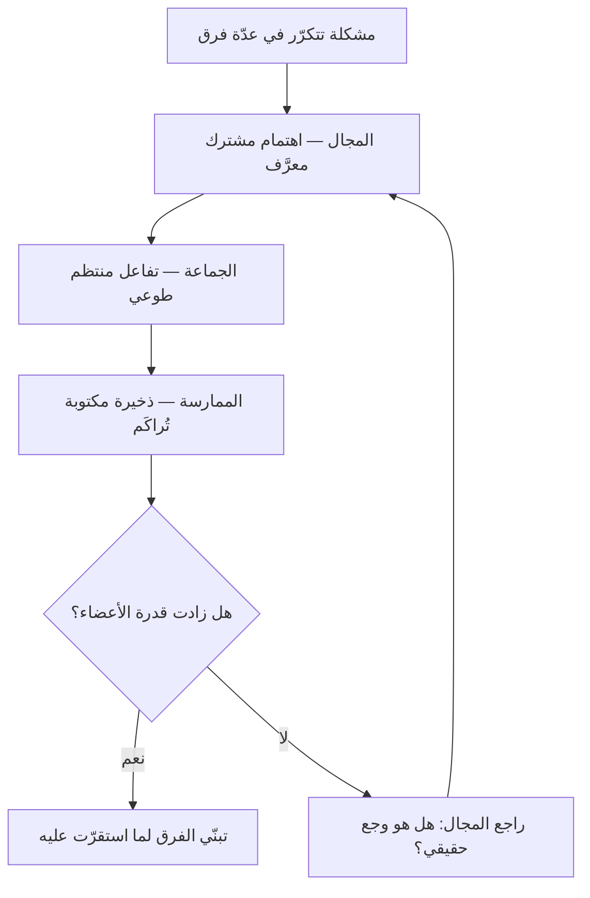

# جماعة الممارسة (Community of Practice)

> [!info] تعريف مختصر
> **جماعة الممارسة (Community of Practice)** جماعةٌ من الناس يجمعهم اهتمام مهنيّ واحد، يتعلّمون معًا بالتفاعل المنتظم فيصير عندهم **ذخيرة مشتركة** من الخبرات والأدوات والحلول. صاغ المصطلح **جان ليف وإتيان فينجر** سنة 1991 في كتاب *Situated Learning*، ثم فصّله فينجر سنة 1998. وهي **ليست فريقًا ولا لجنة ولا قائمة بريدية**: فلا يجمعها تسليمٌ مشترك بل **ممارسة** مشتركة، ولا يُقاس نجاحها بما تنتجه بل بما يستطيعه أعضاؤها بعد أن انتموا إليها.

## الشرح العلمي والاحترافي

**والفارق الذي يميّزها** أن الفريق يجتمع على **عمل**، والجماعة تجتمع على **حرفة**. فالفريق ينحلّ إذا انتهى عمله، وجماعة الممارسة تبقى ما بقيت الحرفة.

**وثلاثة عناصر مجتمعة** هي التي تصنعها، كما حرّرها **فينجر وماكديرموت وسنايدر** سنة 2002. وغياب أيّها يجعلها شيئًا آخر:

1. **المجال (Domain)** — الاهتمام المشترك الذي يعرّف حدودها ويعطي الانتماءَ إليها معنًى. فليست ناديًا اجتماعيًّا، وللعضوية فيها كفاءةٌ ما تُميّز أهلها ممّن سواهم.
2. **الجماعة (Community)** — العلاقات والتفاعل المنتظم. فالذين يشتغلون بالشيء نفسه ولا يتفاعلون ليسوا جماعة ممارسة، ولو كانوا في قائمة واحدة.
3. **الممارسة (Practice)** — الذخيرة المشتركة التي تُبنى بالوقت: قصص، وأدوات، وحلول لمشكلات متكرّرة، وقواعد ضمنية «هكذا نفعل هذا». **وهذا العنصر أكثرها إهمالًا**: فالجماعة التي تلتقي وتتحدّث ولا تراكم شيئًا يُرجع إليه بقيت لقاءً لطيفًا.

**ولماذا تنشأ أصلًا؟** لأن أكثر المعرفة المهنية **ضمنية** لا تُكتب في وثيقة: ليست «ما الخطوات؟» بل «متى تعرف أن هذه الطريقة لا تصلح هنا؟». وهذه لا تُنقل بالتدريب الرسمي، وإنما تنتقل بالمشاركة في العمل — وهي فكرة ليف وفينجر الأصلية: أن التعلّم **مشاركة متدرّجة في جماعة** لا نقل معلومة إلى فرد.

**وموضعها من إدارة المشاريع** أنها العلاج المعتاد لأثر جانبيّ للفرق [[Cross-functional Team|متعدّدة المهارات]]: فحين يُوزَّع المختبرون على ستّة فرق، يكسب كل فريق مختبرًا ويخسر المختبرون بعضهم بعضًا. فتُعاد صلة التخصّص من غير كسر بنية الفرق. ولهذا وُجدت **النقابات (Guilds)** في [[Spotify Model|نموذج سبوتيفاي]]، وصارت جماعات الممارسة عنصرًا معلنًا في [[SAFe]].

> [!info] إضافة مرجعية — «جماعة» لا «مجتمع»
> يشيع المقابلان معًا في العربية، و**«مجتمع الممارسة»** أوسع انتشارًا. واعتُمدت هنا **«جماعة الممارسة»** لأن `Community` في اصطلاح فينجر جماعةٌ محدودة يعرف أعضاؤها بعضهم ويتفاعلون، و«المجتمع» في العربية ينصرف إلى الاجتماع البشري الواسع (`Society`) فيُوسّع المعنى فوق حدّه. و«مجتمع الممارسة» مثبت في `aliases` ليجده الباحث. وهذا اختيار تحريريّ في هذه الموسوعة لا حكمٌ على المقابل الآخر.

## أين ومتى يُستخدم

- **بعد التحوّل إلى فرق متعدّدة المهارات**، لتعويض ما فقده أصحاب التخصّص الواحد من احتكاك ببعضهم.
- **في المنظّمات الموزّعة جغرافيًّا**، حيث ينقطع النقل الضمني الذي كان يقع في الممرّ وعلى مكتب الزميل.
- **لتوحيد الممارسة بلا فرضها**: فالمعيار الذي يخرج من جماعة أهله يُتبنّى، والذي ينزل من فوق يُطبَّق شكلًا.
- **في إدماج الملتحقين الجدد**، فهي أسرع سبيل إلى المعرفة الضمنية التي لا يجدونها في الوثائق.
- **حين تتكرّر المشكلة نفسها في فرق لا يتحدّث بعضها إلى بعض** — وهذه أوضح علامة على الحاجة إليها.

> [!warning] متى لا تُستخدَم؟
> - **بديلًا عن قرار.** الجماعة تُنضج الرأي ولا تملك سلطة تنفيذية؛ فإن أُنيط بها قرارٌ ملزم بلا صلاحية، عُطّل العمل وسُمّي تشاورًا.
> - **في منظّمة صغيرة** يجلس أهل التخصّص فيها في غرفة واحدة: هي قائمة عندهم بالفعل، وإضفاء الرسمية عليها يقتلها.
> - **مخرجًا من مسؤولية التدريب.** فالجماعة تُكمّل التأهيل الرسمي ولا تُغني عنه.

## مثال وسيناريو تطبيقي

> [!example] «شركة مسار» — ستّة فرق، وستّ طرق مختلفة لاختبار الشيء نفسه
> **الوضع:** بعد إعادة التنظيم في فرق متعدّدة المهارات، صار في كل فريق مختبر واحد. وبعد نصف سنة: ستّ مكتبات اختبار مختلفة، وثلاث حالات تسرّبَ فيها العطل نفسه إلى الإنتاج في فرق مختلفة، ومختبرٌ جديد بقي ثلاثة أشهر يبحث عمّا كان عند زميله جاهزًا.
> **ما فُعل:** جماعة ممارسة للاختبار — لقاء كل أسبوعين ساعةً واحدة، بحضور طوعيّ، **ومساحة مكتوبة مشتركة** تُراكَم فيها الحلول.
> **ما فرَّق:** أن اللقاء لم يكن تقرير حالة. جدول أعماله سؤال واحد: **ما المشكلة التي واجهتك هذا الأسبوع ولم تجد لها جوابًا؟** وما استقرّ عليه رأيهم كُتب في المساحة المشتركة.
> **النتيجة بعد أربعة أشهر:** مكتبة موحّدة اختارها المختبرون أنفسهم لا الإدارة، وقائمة أعطال متكرّرة صارت جزءًا من [[Definition of Done|تعريف الاكتمال]] في الفرق الستّة، وزمن تأهيل المختبر الجديد من ثلاثة أشهر إلى ثلاثة أسابيع.
> **وما لم يُفعل:** لم تُمنح الجماعة سلطة إلزام أحد. وهذا بعينه ما جعل الفرق تأخذ عنها.

## خطوات أو مخطّط

1. **ابدأ من وجعٍ متكرّر** لا من هيكل: أيّ سؤال يعود في ثلاثة فرق؟ فهذا مجالها.
2. **اجعل الحضور طوعيًّا.** الإلزام يملأ الغرفة ويُفرغ الجماعة.
3. **عيّن راعيًا يهيّئ لا رئيسًا يوجّه** — من مهمّته الوقت والمكان والمتابعة، لا رسم المحتوى.
4. **راكم ذخيرةً مكتوبة من اللقاء الأوّل**، فبها تصير الجماعة أصلًا لا سلسلة اجتماعات.
5. **افصلها عن سلطة القرار** صراحةً، وبيِّن أين ينتهي رأيها وأين يبدأ قرار الفريق.
6. **راجعها بعد ستّة أشهر بسؤال واحد:** ما الذي يستطيعه أعضاؤها اليوم ولم يكونوا يستطيعونه؟ فإن لم يكن جواب، فهي اجتماع لا جماعة.

## ⚠️ مفاهيم خاطئة شائعة

> [!warning]
> - **الخلط بينها وبين الفريق.** الفريق مسؤول عن تسليم مشترك، والجماعة عن حرفة مشتركة. وأوّل علامة على الخلط أن يُطلب من الجماعة «مخرَج» في نهاية الربع.
> - **حسبانها مركز تميّز (Center of Excellence).** المركز وحدة رسمية ذات سلطة معيارية وميزانية، والجماعة انتماء طوعيّ بلا سلطة. وتحويل الثانية إلى الأوّل يغيّر طبيعتها لا حجمها.
> - **ظنّ أن قناة محادثة تكفي.** القناة تحلّ **التفاعل** ولا تحلّ **الذخيرة**؛ والمعرفة التي تُقال في قناة ولا تُكتب في موضع يُرجع إليه تضيع بمرور الأسبوع.
> - **اشتراط أن تكون داخل قسم واحد.** أنفعها ما عبر الحدود التنظيمية، وهذا هو أصل فائدتها في الفرق متعدّدة المهارات.
> - **قياسها بعدد الحاضرين.** جماعة من سبعة يتعلّمون خيرٌ من قائمة فيها سبعون.

## ❌ ممارسات خاطئة في المشاريع

> [!failure]
> - **فرض الحضور وتسجيله في التقييم** — فتمتلئ القاعة ويصمت الجميع. **الحلّ:** طوعية معلنة، ومحتوى يستحقّ الحضور.
> - **تعيين قائد الجماعة من الإدارة** — فينقلب اللقاء إلى تقرير حالة إلى مدير. **الحلّ:** ييسّر أحد الممارسين، وتبقى الإدارة راعية لا حاضرة دائمًا.
> - **إنشاء عشر جماعات دفعةً واحدة** — فتنافس اجتماعاتُها العملَ وتموت كلّها. **الحلّ:** واحدة على أشدّ وجع، ثم قِس.
> - **ترك اللقاء بلا سؤال يُفتتح به** — فيتحوّل إلى عرض أخبار. **الحلّ:** سؤال ثابت: ما المشكلة التي لم تجد لها جوابًا؟
> - **إهمال الذخيرة المكتوبة** — فيُعاد اكتشاف الحلّ نفسه بعد ستّة أشهر. **الحلّ:** لكل لقاء أثرٌ مكتوب ولو سطرين، ومكان واحد يُرجع إليه.
> - **مطالبتها بعائد ربعيّ مقيس** — فتقيس ما يسهل عدّه وتترك ما وُجدت له. **الحلّ:** قِس **قدرة الأعضاء** وتكرار المشكلة، لا عدد اللقاءات.

## 🔗 مصطلحات ومفاهيم ذات صلة

[[Spotify Model]] | [[SAFe]] | [[Cross-functional Team]] | [[Deliberate Practice]] | [[Lessons Learned]] | [[Knowledge Management]] | [[Psychological Safety]] | [[Team Working Agreement]] | [[Leadership at Every Level]] | [[Definition of Done]] | [[Blameless Postmortem]]
