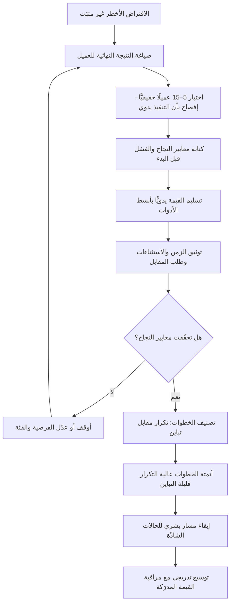

# نموذج الكونسيرج (Concierge MVP)

> [!info] تعريف مختصر
> أسلوب تحقّق يقدّم فيه الفريق **القيمة النهائية للعميل بيده، يدويًّا وواحدًا واحدًا، قبل بناء أي نظام يؤتمتها** — كما يفعل موظّف الكونسيرج في فندق: يستقبل الطلب ويؤدّيه شخصيًّا بلا وسيط تقني. الغرض ليس التوفير في التكلفة أولًا، بل **الحصول على معرفة لا تُنتجها المقابلات ولا الاستبيانات**: هل يدفع الناس فعلًا؟ ما الخطوات التي يستحيل أتمتتها كما تخيّلناها؟ أين تظهر الحالات الشاذّة الحقيقية؟ وفي هذا النموذج **يعلم العميل تمامًا أن الخدمة تُقدَّم بشريًّا** — وهذا ما يميّزه عن نموذج «ساحر أوز» (Wizard of Oz) الذي يظهر فيه للعميل نظام آلي بينما البشر يعملون خلف الستار.

## الشرح العلمي والاحترافي

- **الموقع في منهجية الشركات الناشئة الرشيقة**: ينتمي المصطلح إلى عائلة أساليب التحقّق التي شاعت مع [[Lean Startup]] وحلقة **بناء ← قياس ← تعلّم**، وهي أساليب تشترك في مبدأ واحد: أن **الوحدة التي نُنتجها في مرحلة الاكتشاف هي التعلّم المتحقَّق (Validated Learning) لا الشيفرة**. ومن هنا يصير بناء نظام قبل التحقّق شكلًا من أشكال الهدر لا إنجازًا.
- **الفرق الجوهري عن النموذج الأوّلي**: [[Prototype]] يحاكي **الشكل والتفاعل** ويُختبر به الفهم وقابلية الاستخدام، لكنه لا يسلّم قيمة حقيقية — المستخدم يتصفّح شاشة ثم ينصرف كما جاء. نموذج الكونسيرج يسلّم **النتيجة الفعلية**: التقرير جاهز، الطلب نُفّذ، الوجبة وصلت، الحساب سُوّي. ولهذا فإن الإشارة التي ينتجها أقوى بمراتب: من يقبل الدفع مقابل نتيجة حقيقية سلّمها إنسان، أثبت وجود الطلب؛ ومن أعجبه نموذج أوّلي لم يثبت شيئًا سوى أنه مهذّب.
- **الفرق عن الحد الأدنى الصالح المعتاد**: [[MVP]] بمعناه الشائع منتج مبنيّ فعلًا وإن كان محدود الميزات — أي أن فيه شيفرة وبنية وصيانة. نموذج الكونسيرج قد يخلو من أي شيفرة إطلاقًا: مجموعة واتساب، وجدول بيانات، ونموذج جوجل، وشخص يعمل. لذا يوصف أحيانًا بأنه «الحدّ الأدنى الصالح **قبل** المنتج».
- **يفكّك افتراضين مختلفين في وقت واحد**: افتراض **الرغبة (Desirability)** — هل يريد الناس هذه النتيجة ويدفعون مقابلها؟ وافتراض **الجدوى (Feasibility)** — ما الذي يتطلّبه إنتاج هذه النتيجة فعلًا؟ والافتراض الثاني هو المكسب الأكثر إهمالًا: التنفيذ اليدوي يكشف الخطوات التي لم تكن في المخطّط أصلًا، وهي غالبًا الخطوات التي تفشل فيها الأتمتة لاحقًا.
- **الأتمتة تأتي من الملاحظة لا من التخيّل**: القاعدة العملية أن تُؤتمت الخطوة **بعد** أن تتكرّر يدويًّا مرّات كافية لتستقرّ، وأن يُبدأ بالخطوة الأكثر تكرارًا وأقلّها تباينًا. أما ما يبقى متباينًا من حالة إلى أخرى فهو مرشّح لأن يظلّ بشريًّا وقتًا أطول ([[Human in the Loop]]) — أو أن يكون مؤشّرًا على أن تعريف الخدمة نفسه لم ينضج بعد.
- **علاقته بكلفة التعلّم**: جوهر الأسلوب اقتصادي بحت: أن تشتري المعلومة بأرخص ثمن ممكن ([[Cost of Experimentation]]). دورة كونسيرج مع 15 عميلًا قد تكلّف أسبوعين من وقت شخصين، مقابل ثلاثة أشهر من فريق هندسي لبناء نظام قد يثبت أنه يحلّ مشكلة غير موجودة. والمقارنة الصحيحة ليست «يدوي رخيص مقابل نظام غالٍ»، بل **«كلفة معرفة المشكلة مبكرًا مقابل كلفة اكتشافها بعد الإطلاق»** — وهي تتضاعف مع الوقت وفق منطق [[Cost-of-Change Curve]].
- **ليس أسلوبًا للشركات الناشئة وحدها**: في المؤسّسات الكبيرة يُستعمل نموذج الكونسيرج لتبرير الاستثمار قبل طلب ميزانية — إذ يصير [[Business Case]] مبنيًّا على 20 حالة سُلّمت فعلًا وبيانات كلفة حقيقية، بدل تقديرات مبنيّة على افتراضات. وهو أيضًا مدخل عملي للتعامل مع مقاومة التغيير: الجهة المستفيدة تلمس النتيجة قبل أن يُطلب منها الالتزام بنظام جديد.
- **حدوده الحقيقية**: لا يصلح حيث تكون القيمة نفسها **مشروطة بالفورية أو بالحجم** (نتيجة خلال ثوانٍ، أو خدمة لمليون مستخدم متزامن)؛ فما يُختبر عندها ليس المنتج المقصود. ولا يصلح حيث تمنع القيود التنظيمية اطّلاع بشر على البيانات (سجلات صحّية أو مالية حسّاسة) إلا بترتيبات صريحة للموافقة والصلاحيات ([[GDPR]] و[[PDPL]]). كما أنه **يقيس رضا عن خدمة عالية اللمسة**؛ والانتقال إلى نظام آلي قد يخفض القيمة المدرَكة، وهو فارق يجب توقّعه لا اكتشافه بعد الإطلاق.

## التمييز الدقيق: كونسيرج مقابل ساحر أوز

> [!note] الفرق ليس في التقنية بل في **علم العميل**
> يُخلط بين الأسلوبين كثيرًا لأنهما يشتركان في أن العمل بشريّ خلف الكواليس. لكن الفرق حاسم:
>
> | الوجه | Concierge MVP (كونسيرج) | Wizard of Oz MVP (ساحر أوز) |
> |---|---|---|
> | **علم العميل** | يعلم أن إنسانًا يخدمه؛ العلاقة معلَنة | يظنّ أنه يتعامل مع نظام آلي؛ البشر مخفيّون |
> | **الواجهة** | قد لا توجد أصلًا (رسالة، مكالمة، لقاء) | تبدو منتجًا حقيقيًّا: تطبيق أو موقع أو محادثة |
> | **ما يُختبر أساسًا** | هل القيمة مطلوبة؟ وكيف تُنتج فعلًا؟ | هل التجربة الآلية المتخيَّلة تعمل كما نظنّ؟ سلوك المستخدم أمام «النظام» |
> | **الحجم الممكن** | صغير جدًّا (آحاد إلى عشرات) | أكبر قليلًا، لكنه يظلّ محدودًا بطاقة البشر |
> | **البيانات الناتجة** | فهم عميق نوعي + إثبات استعداد للدفع | بيانات سلوكية أقرب إلى الاستعمال الحقيقي |
> | **الاعتبار الأخلاقي** | لا إشكال؛ لا إيهام | يقوم على إيهام مؤقّت، فيلزم ضبطه |
> | **الخطوة التالية الطبيعية** | أتمتة الخطوات المتكرّرة تدريجيًّا | استبدال «الساحر» بالنظام مع بقاء الواجهة |
>
> **ترتيبهما الطبيعي**: كونسيرج أولًا لفهم القيمة والعملية، ثم ساحر أوز لاختبار التجربة الآلية المتخيَّلة، ثم بناء النظام. القفز إلى ساحر أوز مباشرة يخاطر باختبار واجهة لخدمة لم يُتحقّق من قيمتها بعد.
>
> **ضبط أخلاقي لازم لساحر أوز**: لا يُوعد المستخدم صراحةً بأن العملية آلية إن لم تكن كذلك (الإيهام بالسكوت شيء، والادّعاء الصريح شيء آخر أقرب إلى [[Dark Patterns]])؛ ولا يُعرَّض بشر لبيانات حسّاسة بلا أساس قانوني ولا إفصاح في سياسة الخصوصية؛ ولا تُقدَّم نتائج حسّاسة (طبية أو مالية أو قانونية) بوصفها مخرَج نظام مُدقَّق؛ ويجب أن تكون المرحلة **محدودة زمنيًّا ومعلَنة داخليًّا** لا وضعًا دائمًا. وقد صار هذا البند أهمّ في منتجات الذكاء الاصطناعي تحديدًا، حيث يُسوَّق أحيانًا عمل بشري على أنه نموذج آلي — وهو تجاوز يتحوّل من أسلوب تحقّق إلى ادّعاء مضلّل تجاه العملاء والمستثمرين.

## أين ومتى يُستخدم

- **في مرحلة الاكتشاف المبكّر** ([[Product Discovery]] و[[Continuous Discovery]]): بوصفه الاختبار التالي بعد المقابلات، حين يلزم دليل سلوكي لا تصريح لفظي.
- **لاختبار أخطر الافتراضات في [[Assumption Mapping]]**: تحديدًا الافتراضات عالية المخاطرة وضعيفة الدليل، وهي بالضبط ما لا يجوز بناء نظام عليه.
- **بعد مقابلات مبنيّة على [[The Mom Test]]**: فالمقابلة الجيدة تكشف المشكلة والسلوك السابق، لكنها لا تُثبت استعداد الدفع؛ الكونسيرج يفعل.
- **قبل صرف ميزانية بناء**: لتحويل [[Business Case]] من تقديرات إلى بيانات تسليم فعلية وكلفة وحدة مقيسة.
- **في تحديد نطاق [[MVP]] بدقّة**: إذ تكشف الدورة اليدوية أي الخطوات ضرورية فعلًا وأيها كان تخمينًا، فيُبنى أقلّ نظام يخدم المسار الحقيقي.
- **في اختبار نماذج التسعير**: لأن طلب المبلغ في تعامل شخصي يعطي إشارة أصدق من استبيان عن «كم كنت ستدفع».
- **مع [[Fake Door Test]] كزوج متكامل**: الباب الوهمي يقيس **الاهتمام** بأقلّ كلفة، والكونسيرج يقيس **الرضا والاستعداد للدفع** بعد التسليم. الأول يفتح القمع والثاني يتحقّق من قاعه.
- **في مشاريع الذكاء الاصطناعي خصوصًا**: تنفيذ المهمّة يدويًّا أولًا يُنتج بيانات مرجعية موصوفة تصلح لبناء [[Evals]] لاحقًا، ويكشف الحالات الشاذّة قبل أن تكلّف [[Inference Cost]] ووقت هندسة.

## مثال وسيناريو تطبيقي

> [!example] فريق في الرياض يريد بناء منصّة تُنظّم مشتريات المطاعم الصغيرة من موردي الخضار: مقارنة أسعار، وطلب موحّد، ومتابعة تسليم. التقدير الهندسي الأوّلي: 5 أشهر وفريق من 4 أشخاص.
>
> **بدل البناء، شغّل الفريق دورة كونسيرج 6 أسابيع**: تعاقدوا شفهيًّا مع 12 مطعمًا صغيرًا في حيّين. كل مطعم يرسل احتياجه مساءً في رسالة واتساب بأي صيغة يريدها. شخصان من الفريق — أحدهما مدير المنتج نفسه — يجمعان الطلبات في جدول بيانات، ويتّصلان بأربعة موردين، ويفاوضان، ويؤكّدان التسليم صباحًا، ويرسلان لكل مطعم ملخّصًا بالمبلغ والتوفير. **المطاعم تعلم تمامًا أن العملية بشرية**، بل إن اثنين منها فضّلا ذلك صراحةً في البداية.
>
> **ما تعلّمه الفريق ولم يكن في أي وثيقة**:
> ① **المشكلة ليست مقارنة الأسعار**: 9 من 12 مطعمًا قالوا إن الألم الحقيقي هو **التسليم المتأخّر أو الناقص** لا السعر. التوفير الوسطي كان 6% فقط، بينما «الوصول في الموعد» كان يحدّد جودة يوم العمل كاملًا.
> ② **الطلب يتغيّر بعد إرساله**: 41% من الطلبات عُدّلت بعد الإرسال بساعات (نفد صنف، تغيّر الحجز). النظام المخطّط كان يفترض طلبًا نهائيًّا لا يتغيّر — افتراض كان سيكسر المنتج بالكامل.
> ③ **صيغة الإدخال فوضوية بطبيعتها**: الطلبات وصلت نصًّا وصوتًا وصورًا لورق مكتوب بخطّ اليد. أي واجهة تفرض نموذجًا منظّمًا كانت ستُرفض ضمنًا.
> ④ **الاستعداد للدفع مثبَت**: في الأسبوع الرابع طُلب اشتراك 300 ريال شهريًّا، فوافق 8 من 12 ودفعوا فعلًا. أول إيراد حقيقي قبل كتابة سطر واحد من الشيفرة.
> ⑤ **كلفة الوحدة مقيسة**: 22 دقيقة عمل بشري لكل طلب في المتوسّط — رقم صار أساس دراسة الجدوى ومعيار نجاح الأتمتة بدل التخمين.
>
> **قرار النطاق**: أُلغيت وحدة «مقارنة الأسعار المتقدّمة» التي كانت تستهلك نحو 40% من التقدير الهندسي، وصار [[MVP]] الحقيقي: استقبال طلب بأي صيغة (نصّ أو صوت)، ودعم التعديل بعد الإرسال، وتتبّع تسليم بإشعارات. أُتمتت أولًا خطوتان فقط: تجميع الطلبات وإرسال التأكيدات — لأنهما الأكثر تكرارًا والأقلّ تباينًا. وبقيت المفاوضة مع الموردين بشرية 5 أشهر إضافية عن قصد.
>
> **بعد 3 أشهر من الإطلاق المحدود**: 60 مطعمًا، ووقت العمل البشري لكل طلب نزل من 22 دقيقة إلى 7. ولو بُني النظام الأصلي كما خُطّط له، لكان قد سلّم بعد 5 أشهر منتجًا يفترض طلبًا نهائيًّا غير قابل للتعديل، ويقارن أسعارًا لا تهمّ أحدًا.

## خطوات أو مخطّط

1. **حدّد الافتراض الأخطر** الذي لو كان خاطئًا سقط المشروع كلّه — لا الافتراض الأسهل اختبارًا.
2. **صف النتيجة النهائية** التي يريدها العميل بصيغة مخرَج ملموس، لا بصيغة ميزة.
3. **اختر 5–15 عميلًا حقيقيًّا** يعانون المشكلة الآن، وكن صريحًا معهم أن التنفيذ يدوي في هذه المرحلة.
4. **حدّد مسبقًا معايير النجاح والفشل** رقميًّا: نسبة قبول، استعداد دفع، معدّل تكرار الطلب، حدّ أدنى للرضا — واكتبها في [[Decision Log]] قبل البدء.
5. **سلّم القيمة يدويًّا** بأبسط أدوات ممكنة: رسائل، جدول بيانات، نموذج ويب، مكالمات.
6. **وثّق كل خطوة وكل استثناء أثناء التنفيذ**: الزمن المستغرق، الحالات الشاذّة، الأسئلة المتكرّرة، ما اضطررت إلى ارتجاله.
7. **اطلب المقابل مبكرًا**: الدفع أصدق إشارة على القيمة، وتأجيله إلى ما بعد الأتمتة يؤجّل أهم معلومة.
8. **حلّل الخطوات بحسب التكرار والتباين**: عالي التكرار وقليل التباين = أوّل مرشّح للأتمتة؛ قليل التكرار وعالي التباين = يبقى بشريًّا.
9. **قرّر**: أوقف، أو عدّل الفرضية، أو انتقل إلى أتمتة جزئية (أو إلى ساحر أوز لاختبار الواجهة المتخيَّلة).
10. **أتمت تدريجيًّا مع إبقاء مسار بشري احتياطي** ([[Human in the Loop]]) للحالات الشاذّة، وراقب هل تغيّرت القيمة المدرَكة بعد زوال اللمسة البشرية.

## ⚠️ مفاهيم خاطئة شائعة
> [!warning]
> - **«الكونسيرج وساحر أوز اسمان لشيء واحد»**: التصحيح: الفارق هو علم العميل. في الكونسيرج العلاقة البشرية معلَنة وجزء من التجربة؛ وفي ساحر أوز يظنّ العميل أنه أمام نظام آلي. ويترتّب على الفارق اختلاف فيما يُختبر وفي الضوابط الأخلاقية اللازمة.
> - **«هو مجرّد نموذج أوّلي بشري»**: التصحيح: [[Prototype]] يحاكي ولا يسلّم؛ الكونسيرج **يسلّم قيمة حقيقية** ويولّد التزامًا حقيقيًّا من العميل. الإشارتان مختلفتان في القوّة اختلافًا نوعيًّا.
> - **«لا يصلح لأنه لا يتوسّع»**: التصحيح: عدم التوسّع ليس عيبًا بل تصميم مقصود. غرض المرحلة إنتاج معرفة، وقياس نجاحها بمعيار التوسّع خلط بين مرحلة الاكتشاف ومرحلة التسليم.
> - **«عيّنة صغيرة فلا قيمة إحصائية لنتائجه»**: التصحيح: هو أداة نوعية سببية بالأساس، مصمّمة لكشف **وجود** المشكلة وآلية إنتاج القيمة والحالات الشاذّة — لا لتقدير حجم سوق. الخطأ هو تعميم نسبه الرقمية على السوق كلّه، لا استعماله ذاته.
> - **«مرحلة نمرّ بها ثم ننساها»**: التصحيح: الوثائق التي تنتجها الدورة اليدوية (الاستثناءات، الأزمنة، صيغ المدخلات) هي أدقّ متطلّبات يمكن أن يحصل عليها الفريق، وتُغذّي [[PRD]] و[[Edge Cases]] مباشرة. إهمالها إهدار لأثمن مخرَج.
> - **«إن نجح يدويًّا فسينجح آليًّا»**: التصحيح: جزء من النجاح قد يعود إلى الحكم البشري واللمسة الشخصية نفسها. تحديد ما الذي كان يفعله الإنسان **ولا يمكن للنظام فعله** هو أهمّ سؤال في مرحلة الأتمتة.
> - **«يستعمل لتوفير الكلفة»**: التصحيح: قد يكون أغلى لكل وحدة من نظام آلي. مبرّره أنه يشتري **معلومة** بأرخص ثمن ممكن ([[Cost of Experimentation]])، لا أنه ينتج خدمة أرخص.

## ❌ ممارسات خاطئة في المشاريع
> [!failure]
> - **تشغيل الدورة بلا معايير نجاح وفشل مكتوبة مسبقًا** → تُقرأ النتائج بعد وقوعها بما يوافق رغبة الفريق فيتحوّل الاختبار إلى تبرير ([[Confirmation Bias]]) → **الحل**: اكتب العتبات الرقمية وشروط الإيقاف في [[Decision Log]] قبل أول عميل.
> - **تسليم الخدمة يدويًّا بلا توثيق أثناء التنفيذ** → يضيع أثمن مخرَج في الأسلوب، وهو خريطة الخطوات والاستثناءات وأزمنتها → **الحل**: سجلّ لكل حالة: الزمن، الخطوات، الشذوذ، وما ارتُجل — ويُراجَع أسبوعيًّا.
> - **تأجيل طلب المال إلى ما بعد بناء النظام** → يُبنى المنتج على رضا مجاني لا يثبت شيئًا عن القيمة الاقتصادية → **الحل**: اطلب المقابل داخل الدورة نفسها ولو رمزيًّا أو بتعهّد كتابي مسبق.
> - **خدمة العملاء بمستوى تفصيل يستحيل تكراره ثم اعتباره خط الأساس** → يُنتج توقّعًا لا يستطيع النظام الوفاء به، فينهار الرضا عند الأتمتة → **الحل**: التزم بمستوى خدمة موصوف مسبقًا وقابل للتكرار، وارصد ما ستفقده الأتمتة صراحةً.
> - **الاستمرار في الوضع اليدوي أشهرًا بلا قرار** → يستهلك الفريق في التشغيل ويحوّل المشروع إلى وكالة خدمات دون أن ينتبه أحد → **الحل**: حدّد الدورة بإطار زمني ([[Timeboxing]]) وعدد حالات، وارتبط بقرار صريح عند نهايته: توقّف أو عدّل أو أتمت.
> - **أتمتة كل شيء دفعة واحدة بعد نجاح الدورة** → يعيد المشروع إلى المخاطرة التي هرب منها، ويشمل الحالات الشاذّة النادرة التي كان يمكن تركها بشرية → **الحل**: أتمت بحسب التكرار والتباين، وأبقِ مسارًا بشريًّا للاستثناءات ([[Human in the Loop]]).
> - **تشغيل ساحر أوز على بيانات شخصية حسّاسة بلا أساس قانوني ولا إفصاح** → مخالفة صريحة لأطر مثل [[GDPR]] و[[PDPL]] وخطر تعاقدي حقيقي → **الحل**: عرّف الأساس القانوني وحدود الاطّلاع مسبقًا، وسجّل النشاط في [[ROPA]]، واعمل على بيانات مصغّرة أو مموّهة حيث أمكن.
> - **إعلان أن الخدمة آلية أو مدعومة بالذكاء الاصطناعي بينما البشر ينفّذونها** → يتجاوز الأسلوب إلى ادّعاء مضلّل تجاه العملاء والمستثمرين، ويقترب من منطق [[Dark Patterns]] → **الحل**: لا تصرّح بآلية غير موجودة؛ الصمت المؤقّت عن التفاصيل التشغيلية شيء، والادّعاء الصريح شيء آخر.

## 🔗 مصطلحات ومفاهيم ذات صلة
[[MVP]] | [[Prototype]] | [[Cost of Experimentation]] | [[Lean Startup]] | [[Product Discovery]] | [[Continuous Discovery]] | [[Assumption Mapping]] | [[Fake Door Test]] | [[The Mom Test]] | [[Proof of Concept]] | [[Hypothesis]] | [[Human in the Loop]] | [[Product-Market Fit]] | [[Cost-of-Change Curve]] | [[Cognitive Bias]] | [[Dark Patterns]]
