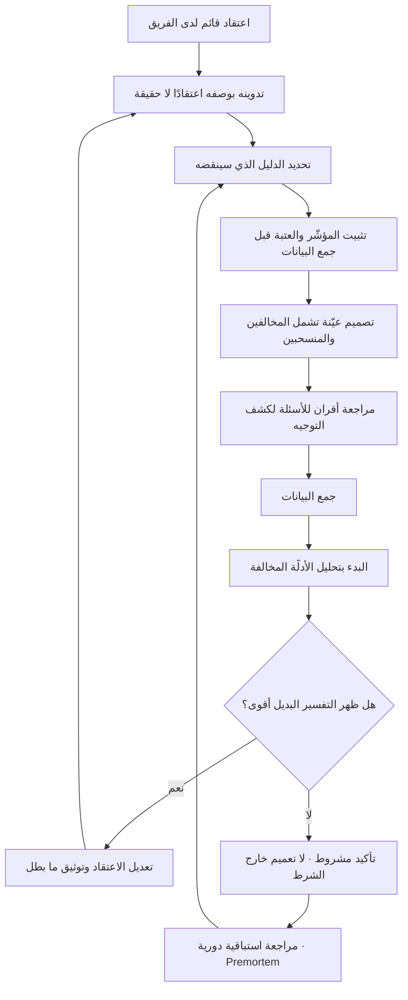

# التحيّز التأكيدي (Confirmation Bias)

> [!info] تعريف مختصر
> ميل منهجي — لا واعٍ في الغالب — إلى البحث عن الأدلّة التي توافق ما نعتقده أصلًا، وإلى تفسير الأدلّة الغامضة لصالحه، وإلى تذكّره أكثر مما نتذكّر ما يناقضه، وإلى إخضاع الأدلّة المخالفة لتدقيق أشدّ بكثير مما نُخضع له الأدلّة الموافقة. يعمل التحيّز في ثلاث مراحل متتالية: **الجمع** (أين نبحث ومن نسأل)، و**التفسير** (كيف نقرأ ما وجدنا)، و**الاستدعاء** (ما نتذكّره لاحقًا). وهو الخصم الأول لأي عملية اكتشاف، لأنه يجعل البحث يبدو منجزًا بينما هو في الحقيقة تمرين في تجميل قرار مُتّخذ سلفًا.

## الشرح العلمي والاحترافي
- **الأصل والمصطلح**: صاغ التسمية الإنجليزية عالم النفس المعرفي **بيتر واسون (Peter Wason)** في ستّينيات القرن العشرين، وارتبطت بتجربته المعروفة بـ«مهمّة اختيار واسون» (Wason Selection Task) وبتجربة اكتشاف قاعدة الأعداد؛ إذ تبيّن أن المشاركين يميلون بشدّة إلى اختبار أمثلة تُوافق القاعدة التي خمّنوها، بدلًا من البحث عن مثال يمكنه نقضها — رغم أن المثال الناقض وحده هو الذي يحسم. وهذه بالضبط بنية الخطأ الذي يقع فيه فريق يختبر فرضيته بحثًا عن تأكيد لا عن نقض.
- **علاقته بالقابلية للإبطال**: المنطق السليم أن نسعى إلى الدليل الذي **ينقض** ما نعتقد، لأن التأكيد الجزئي متاح دائمًا لأي فكرة تقريبًا. من هنا تنبع الأهمية المنهجية لشرط الإبطال المكتوب مسبقًا في [[Hypothesis]]: هو الحيلة العملية التي تُلزم الفريق بالبحث عن النقض قبل أن تتاح له فرصة انتقاء التأكيد.
- **صوره النمطية في العمل**: **انتقاء البيانات** (اختيار الشريحة الزمنية أو الجغرافية التي تُظهر التحسّن)، و**تبديل المؤشّر بعد النتيجة** (إعلان النجاح بمقياس لم يكن معلنًا)، و**التأويل المرن** (تفسير كل نتيجة محايدة لصالح الفرضية)، و**تشديد النقد الانتقائي** (الطعن في منهجية الدراسة المخالفة وقبول الموافقة بلا فحص)، و**السؤال الموجِّه في المقابلات** الذي يصنع دليلًا مصطنعًا من العدم.
- **آلية تضخيمه في المؤسّسات**: التحيّز الفردي مشكلة معرفية؛ أما المؤسّسي فمشكلة حوافز. حين يرتبط تقييم أداء شخص أو استمرار ميزانية إدارة بنجاح مبادرة، يصبح البحث عن الأدلّة المخالفة تصرّفًا مكلفًا شخصيًّا. عندها يتحوّل التحيّز من ميل ذهني إلى **سلوك عقلاني ضمن نظام حوافز معطوب** — وهذا يفسّر لماذا لا تكفي التوعية وحدها لعلاجه، ولماذا يكون العلاج غالبًا هيكليًّا لا أخلاقيًّا.
- **تفاعله مع تحيّزات أخرى**: يشتدّ التحيّز التأكيدي حين يقترن بـ**مغالطة التكلفة الغارقة** (الاستمرار لأن الكثير أُنفق)، وبـ**الالتزام المتصاعد** (زيادة الاستثمار في قرار متعثّر لتبريره)، وبـ**التفكير الجمعي** (Groupthink) الذي يكبح المخالفة داخل فريق متماسك، وبـ**الانحياز بأثر رجعي** («كنّا نعلم ذلك») الذي يفسد الدروس المستفادة بعد الحوادث.
- **لماذا يصعب اكتشافه ذاتيًّا**: الشعور المصاحب للتحيّز التأكيدي هو شعور **الموضوعية** نفسه. الشخص المتحيّز لا يحسّ بأنه يختار الأدلّة، بل يحسّ بأنه يرى الواقع بوضوح. لهذا فإن الاعتماد على «الانتباه الشخصي» علاج ضعيف، والعلاج الفعّال إجرائي: تسجيل مسبق، ومراجعة خارجية، وأدوار موكَّلة للمعارضة.
- **العلاجات المؤسّسية المعروفة**: **التسجيل المسبق** للفرضية والمؤشّر والعتبة قبل رؤية البيانات؛ و**محامي الشيطان المعيَّن** بدور رسمي لا تطوّعي؛ و**التقييم الاستباقي (Premortem)** وهو تمرين يُطلب فيه من الفريق أن يتخيّل أن المشروع فشل بعد سنة ثم يكتب أسباب الفشل — فيصبح إبداء الشك مطلوبًا لا عدائيًّا؛ و**فرق التحدّي المستقلّة (Red Team)**؛ و**مراجعة الأقران لأسئلة البحث** قبل المقابلات؛ و**تخصيص حصّة إلزامية** لمقابلة الرافضين والمنسحبين لا الراضين.
- **حدّ ضروري**: مقاومة التحيّز التأكيدي لا تعني الشلل ولا تعني رفض كل فرضية. الهدف ليس الحياد الكامل — وهو مستحيل — بل بناء إجراءات تجعل **النقض ممكنًا ورخيصًا وغير مكلف اجتماعيًّا** لمن يبلّغ عنه. الفريق الذي لا يستطيع أن يقول «كنّا مخطئين» لا يستطيع أن يتعلّم شيئًا.

## أين ومتى يُستخدم
- **في تصميم أبحاث المستخدم**: بوصفه الخطر الذي تُصمَّم ضدّه أسئلة [[User Interview]] وقواعد [[The Mom Test]]، وأساس منع السؤال الموجِّه ومنع عرض المنتج مبكّرًا.
- **في اختبار الفرضيات**: عند تثبيت العتبة وشرط الإبطال مسبقًا في [[Hypothesis]]، ومنع تعديلهما بعد رؤية البيانات.
- **في تصنيف الافتراضات**: عند تحديد درجة اليقين في [[Assumption Mapping]]، حيث يدفع التحيّز إلى وضع الافتراضات المحبّبة في خانة «مؤكّد» بلا دليل خارجي.
- **في مراجعات الحوادث وتحليل الأسباب**: لمنع القفز إلى السبب المتوقّع في [[Root Cause Analysis]] وإهمال الفرضيات المنافسة، خصوصًا حين يكون السبب المرشّح مريحًا سياسيًّا.
- **في تقارير حالة المشروع**: لتفسير ظاهرة تحوّل حالة المشروع من أخضر إلى أحمر فجأة في [[RAG Status]] و[[Project Health Report]] — إذ نادرًا ما يتدهور المشروع فجأة، بل تتراكم إشارات مخالفة يُصفّيها التحيّز على طول الطريق.
- **في قرارات المضيّ من عدمه**: عند [[Go or No-Go Decision]]، حيث يمتزج التحيّز التأكيدي بالتكلفة الغارقة فيُنتج قرار استمرار لا يسنده دليل.
- **في تقييم الموردين والعروض**: عند [[Vendor Management]]، حيث يُقرأ العرض المفضّل بتساهل ويُدقَّق منافسه بصرامة، فتُصاغ معايير التقييم بعد اختيار الفائز فعليًّا.

## مثال وسيناريو تطبيقي
> [!example] بنك خليجي أطلق مشروعًا لتجديد تطبيقه للأفراد بميزانية 14 مليون ريال، بناءً على قناعة راسخة لدى الإدارة العليا مفادها أن «العملاء يهجروننا بسبب التصميم القديم». استمر المشروع 14 شهرًا، وكانت كل جولة بحث تعود بتأكيد للقناعة.
> ثم راجع فريق تدقيق داخلي مسار القرار، فوجد أربع نقاط تسرّب متتالية شكّلت سلسلة تحيّز مكتملة:
> ① **في الجمع**: أُجريت 22 مقابلة كلها مع مستخدمين نشطين للتطبيق. لم يُقابَل أحد ممن أغلق حسابه أو توقّف عن الاستخدام — أي أن العيّنة استبعدت بنيويًّا كل من يحمل الجواب.
> ② **في الصياغة**: كان أحد أسئلة الاستبيان: «ما مدى موافقتك على أن واجهة التطبيق الحالية تبدو قديمة؟». وافق 78%. لكن السؤال يفترض التقادم ويطلب الموافقة عليه فقط، ولم يُطرح مقابله أي سؤال مفتوح عن سبب التوقّف عن الاستخدام.
> ③ **في التفسير**: أظهرت بيانات مركز الاتصال أن 41% من مكالمات الربع الأخير (نحو 19 ألف مكالمة) تتعلّق بفشل التحقّق عند تسجيل الدخول. صُنّف هذا في التقرير بوصفه «مشكلة تشغيلية خارج النطاق»، وأُحيل إلى فريق آخر دون متابعة.
> ④ **في القياس**: كان المؤشّر المعلن في بداية المشروع هو الاحتفاظ بعد 90 يومًا. وحين اقترب الإطلاق واستقرّ الاحتفاظ عند مستواه، قُدّم للجنة التوجيه مؤشّر بديل: «تقييم المتجر ارتفع من 2.9 إلى 4.1».
> بعد الإطلاق: ارتفع التقييم فعلًا، وبقي الاحتفاظ بعد 90 يومًا في محلّه تقريبًا، بينما ظلّت مكالمات التحقّق على حالها. أعاد الفريق البحث بقواعد مختلفة — 15 مقابلة إلزامية مع مستخدمين متوقّفين، وسؤال مفتوح واحد فقط: «صف لي آخر مرة حاولت فيها استخدام التطبيق وتوقّفت» — فظهر أن 11 منهم توقّفوا بسبب دورة التحقّق بالرسائل النصية عند تغيير الجهاز. كلفة إصلاح ذلك المسار قُدّرت لاحقًا بأقل من 3% من ميزانية المشروع.
> الملاحظة الجوهرية: لم يكذب أحد، ولم يُخفِ أحد بيانات عمدًا. كل خطوة بدت معقولة في حينها، والتحيّز عمل بصمت عبر **من سُئل، وكيف سُئل، وما صُنّف خارج النطاق، وأي مؤشّر اختير في النهاية**.

## خطوات أو مخطّط
1. اكتب اعتقادك صراحة قبل البحث، وسمِّه اعتقادًا لا حقيقة.
2. اكتب معه: ما الدليل الذي — لو ظهر — سيجعلني أتراجع؟ إن لم تجد جوابًا، فاعتقادك ليس قابلًا للاختبار أصلًا.
3. ثبّت المؤشّر الحاكم والعتبة والمدّة في [[Decision Log]] قبل جمع أي بيانات.
4. صمّم الجمع بحيث يشمل من يُرجَّح أن يخالفك: المنسحبون، الرافضون، من اختار منافسًا، من لم يستخدم أبدًا.
5. مرّر أسئلتك على مراجعة أقران لكشف الأسئلة الموجِّهة قبل استخدامها.
6. عيّن دورًا رسميًّا للمعارضة في مراجعة النتائج، ولا تتركه للتطوّع.
7. أجرِ تقييمًا استباقيًّا (Premortem): افترضوا أن المشروع فشل بعد سنة، واكتبوا الأسباب — ثم تحقّقوا من أخطرها الآن.
8. عند التحليل، ابدأ بالأدلّة المخالفة قبل الموافقة، وأعطها الوقت نفسه على الأقل.
9. طبّق تدقيقًا متماثلًا: أخضع الدليل الموافق لنفس درجة الصرامة التي تُخضع لها المخالف.
10. عند تفسير النتيجة، اسأل: ما التفسير البديل الذي يفسّرها بالقدر نفسه؟
11. سجّل ما بطل صراحةً في تقارير الحالة، لا ما تأكّد فقط.
12. افصل حوافز الأفراد عن نتيجة الفرضية، واربطها بجودة تصميم الاختبار وسرعة التعلّم.

## ⚠️ مفاهيم خاطئة شائعة
> [!warning]
> - **«التحيّز التأكيدي كذب أو سوء نيّة»**: خطأ. هو نمط معرفي لا إرادي يعمل لدى الأذكياء والخبراء أيضًا، وقد يشتدّ لدى الخبير تحديدًا لأن قناعاته أرسخ وأدواته في تبريرها أقوى. معالجته كمسألة أخلاقية تدفع الناس للدفاع بدل التصحيح.
> - **«الوعي بالتحيّز يكفي لتجنّبه»**: خطأ. معرفة الظاهرة لا تُبطلها، لأن الشعور المصاحب لها هو شعور الموضوعية ذاته. الحماية تأتي من إجراءات ملزمة — تسجيل مسبق، عيّنة تشمل المخالفين، أدوار معارضة — لا من النيّة الطيّبة.
> - **«البيانات الكمّية محصّنة ضدّه»**: خطأ. التحيّز يعمل في **اختيار** المؤشّر والشريحة والنافذة الزمنية وطريقة التقسيم، وكلها قرارات بشرية تسبق الرقم. لوحة مؤشّرات كاملة يمكن أن تكون منحازة تمامًا دون رقم واحد خاطئ فيها.
> - **«محامي الشيطان التطوّعي يكفي»**: خطأ. من يعترض تطوّعًا يدفع كلفة اجتماعية، فيصمت مع الوقت أو يُصنَّف «سلبيًّا». الدور الفعّال هو المعيَّن رسميًّا بالتناوب، بحيث يكون الاعتراض وظيفة لا موقفًا شخصيًّا.
> - **«مقاومة التحيّز تعني الشك في كل شيء وتعطيل القرار»**: خطأ. الهدف تحسين **جودة الدليل** الذي يُبنى عليه القرار وسرعة اكتشاف الخطأ، لا تأجيل القرار. الشك بلا إجراء حاسم هو صورة أخرى من الشلل.
> - **«إن جاءت نتيجة البحث موافقة لتوقّعنا فذلك دليل على دقّة حدسنا»**: خطأ محتمل. قد يكون كذلك، وقد يكون البحث مصمَّمًا ليعطي هذه النتيجة. الاختبار الحاسم: هل كان بإمكان هذا التصميم أن يُنتج نتيجة مخالفة أصلًا؟ إن لم يكن ممكنًا، فالنتيجة بلا قيمة.

## ❌ ممارسات خاطئة في المشاريع
> [!failure]
> - **مقابلة الراضين وحدهم**: الخطأ أن تُبنى العيّنة من المستخدمين النشطين والعملاء المخلصين. لماذا يضرّ: تُستبعد بنيويًّا الشريحة التي تحمل المعلومة الحاسمة، وتعود كل جولة بحث بتأكيد لا بمعرفة. الحل: حصّة إلزامية لا تقلّ عن ثلث كل جولة للمنسحبين والرافضين ومن لم يستخدم قط.
> - **تغيير مؤشّر النجاح بعد ظهور النتائج**: الخطأ أن يُستبدل المقياس المعلن بمقياس آخر أفضل مظهرًا. لماذا يضرّ: يُلغي القيمة المعرفية للتجربة ويُدخل درسًا زائفًا في ذاكرة المؤسّسة يُستشهد به سنوات. الحل: تثبيت المؤشّر الحاكم في [[Decision Log]] قبل البدء، وتصنيف أي مؤشّر آخر صراحةً «للاستكشاف لا للحسم».
> - **تصنيف الإشارات المزعجة على أنها «خارج النطاق»**: الخطأ أن تُحال بيانات مخالفة إلى فريق آخر بلا متابعة. لماذا يضرّ: هذه غالبًا أثمن إشارة متاحة، وإخراجها من النطاق يحافظ على السردية القائمة ويؤجّل الاصطدام بالواقع إلى ما بعد الإطلاق. الحل: بند ثابت في كل مراجعة اسمه «الإشارات التي تناقض فرضيتنا»، ولا تُغلق المراجعة قبل تناوله.
> - **ربط تقييم الأداء بنجاح المبادرة**: الخطأ أن يُكافأ من نجحت مبادرته ويُلام من أبلغ عن فشل. لماذا يضرّ: يجعل إخفاء الأدلّة المخالفة سلوكًا عقلانيًّا فرديًّا، فلا ينفع أي تدريب على التحيّز. الحل: قِس جودة تصميم الاختبار وسرعة اكتشاف الخطأ، واحمِ المبلّغين بأمان نفسي معلن ([[Psychological Safety]]).
> - **الاستشهاد بحالة نجاح واحدة تعميمًا**: الخطأ أن يُقال «شركة كذا فعلت هذا ونجحت». لماذا يضرّ: انتقاء الحالات الناجحة يتجاهل عشرات الحالات المشابهة التي فشلت ولم يكتب عنها أحد، وهي صورة من التحيّز مضاعفة بانحياز البقاء. الحل: اسأل دائمًا عمّن جرّب الشيء نفسه وفشل، وعن الفروق في السياق والقيود.
> - **قراءة تقرير المورّد المفضّل بتساهل**: الخطأ أن يُدقَّق عرض المنافس ويُقبَل عرض المفضّل. لماذا يضرّ: يُنتج قرار شراء مكلفًا وطويل الأمد على أساس منحاز، وتُصاغ معايير التقييم بعد اختيار الفائز فعليًّا. الحل: معايير تقييم مكتوبة وموزونة قبل استلام العروض، وتقييم أعمى قدر الإمكان لأقسام العروض التقنية.
> - **تدوين خلاصات المقابلات بدل الاقتباسات الحرفية**: الخطأ أن يكتب المدوِّن تفسيره لما سمعه. لماذا يضرّ: يُدرج التحيّز في مرحلة الجمع نفسها فيصبح غير قابل للكشف لاحقًا، إذ لا يبقى أصل يُراجَع. الحل: فصل عمود الاقتباس عن عمود التفسير، ومراجعة جماعية للاقتباسات قبل استخلاص أي نمط.

## 🔗 مصطلحات ومفاهيم ذات صلة
[[Hypothesis]] | [[User Interview]] | [[The Mom Test]] | [[Assumption Mapping]] | [[Problem Statement]] | [[Root Cause Analysis]] | [[Decision Log]] | [[Psychological Safety]] | [[Go or No-Go Decision]] | [[RAG Status]] | [[Radical Transparency]] | [[Continuous Discovery]]
