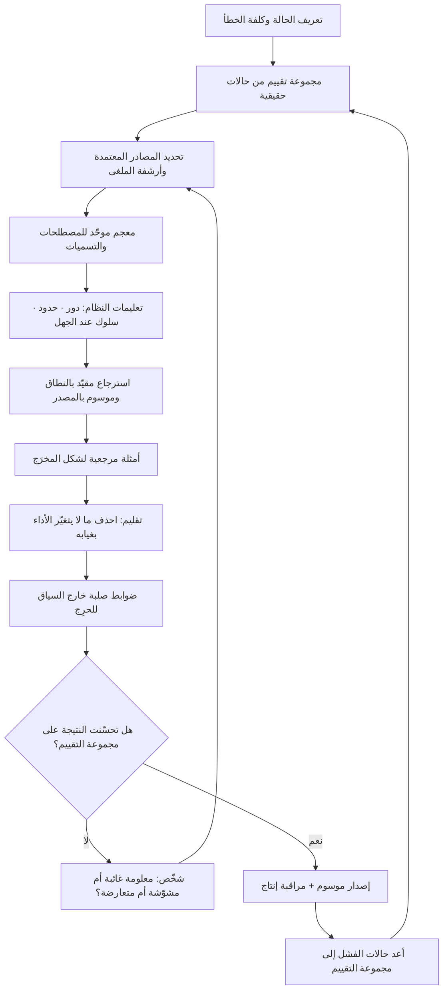

# هندسة السياق (Context Engineering)

> [!info] تعريف مختصر
> ممارسة تصميم **ما يعرفه النموذج قبل أن يُسأل**: أي بناء الطبقة الدائمة من المعلومات — الهوية والدور، وقواعد المؤسّسة، والمصطلحات، والأمثلة المرجعية، والأدوات المتاحة، والذاكرة، والمقتطفات المسترجَعة — التي تُرفق مع كل طلب بشكل منهجي بدل إعادة شرحها في كل مرّة. وجوهرها قرار تحريري صارم لا تكديس: **ما الذي يجب أن يكون حاضرًا في نافذة السياق في هذه اللحظة تحديدًا، وما الذي يجب أن يغيب**؛ إذ إن السياق مورد محدود ومكلف، وزيادته بلا تمييز تُضعف الأداء لا تقوّيه. والفارق عن كتابة الطلب الجيّد أن السياق **أصل مؤسّسي يُبنى ويُصان ويُنسخ عبر الاستخدامات كلها**، بينما الطلب حدث عابر لمرّة واحدة.

## الشرح العلمي والاحترافي
- **نشأة المصطلح**: انتشر التعبير في مجتمع بناء التطبيقات فوق النماذج اللغوية خلال 2024–2025، بوصفه تصحيحًا لمسار مبكّر بالغ في تعليق الآمال على صياغة الطلب وحدها. الملاحظة التي دفعت إلى التسمية: بعد أن نضجت النماذج، صار أغلب الفشل في التطبيقات الحقيقية عائدًا إلى **غياب معلومة كان يجب أن تكون حاضرة، أو حضور معلومة كان يجب أن تغيب**، لا إلى ركاكة صياغة السؤال. ومع صعود الوكلاء متعدّدة الخطوات، صار السياق يُبنى ديناميكيًّا أثناء التشغيل لا يُكتب مرّة، فاكتسبت الممارسة صفة الهندسة.
- **الفرق الجوهري عن [[Prompt Engineering]]**: كلاهما يعمل على ما يدخل النموذج، لكن الاختلاف في أربعة محاور. **النطاق**: الطلب يعالج مهمّة واحدة، والسياق يعالج فئة كاملة من المهام. **الدوام**: الطلب يُكتب ويُستهلك، والسياق أصل يُصان له مالك وإصدارات. **المصدر**: الطلب من ذهن المستخدم، والسياق من معرفة المؤسّسة ومن أنظمتها الحيّة. **المسؤولية**: جودة الطلب مسؤولية مستخدم فرد، وجودة السياق مسؤولية تنظيمية تشبه مسؤولية البنية التحتية. وعمليًّا: إن كنت تشرح للنموذج في كل مرّة من أنت وما سياسات شركتك، فأنت تدفع كلفة غياب هندسة السياق. وحين يُهندَس السياق جيّدًا، تصير الطلبات نفسها أقصر وأبسط — وهذا مؤشّر نضج معتبر.
- **مكوّنات السياق السبعة**: يُفكَّك السياق العملي إلى طبقات متمايزة يُقرَّر لكل منها ما تحمله ومتى تُحمَّل: ① **تعليمات النظام** (الدور، النبرة، الحدود، ما لا يجوز فعله)؛ ② **المعرفة المؤسّسية الثابتة** (السياسات، المعجم، القوالب المعتمدة)؛ ③ **المعرفة المسترجَعة ديناميكيًّا** بحسب الطلب عبر [[Retrieval-Augmented Generation]]؛ ④ **الحالة الحيّة** من الأنظمة (بيانات الطلب، حالة المشروع، رصيد العميل)؛ ⑤ **الأدوات المتاحة** وتوصيفاتها وشروط استدعائها، وهي في الأنظمة الحديثة تُوصَّف عبر بروتوكولات مثل [[MCP]]؛ ⑥ **الأمثلة المرجعية** التي تبيّن الشكل المطلوب للمخرَج أفضل من أي وصف؛ ⑦ **الذاكرة** لما جرى سابقًا في الجلسة أو مع هذا المستخدم.
- **قيد النافذة وتدهور الأداء بالإفراط**: نافذة السياق محدودة، وكلّما اتّسعت ارتفعت كلفة الاستدلال وزمن الاستجابة ([[Inference Cost]]). والأهم أن الأداء لا يتحسّن خطّيًّا بالإضافة: فحشو النافذة بمعلومات هامشية يُضعف قدرة النموذج على ترجيح المهم، ويرفع احتمال التقاط تفصيل غير ذي صلة والبناء عليه. ولهذا صار التمرين المركزي في الممارسة هو **الانتقاء والضغط والتلخيص والإسقاط** لا الجمع.
- **تسمّم السياق وتضارب المصادر**: حين يحتوي السياق على معلومتين متعارضتين — سياسة قديمة وأخرى محدَّثة — فالنموذج يرجّح بينهما بلا سلطة مرجعية، وقد يدمجهما في إجابة هجينة لا تصحّ. لذلك تُشترط في السياق ثلاثة أشياء: **تحديد مصدر معتمد واحد** لكل موضوع ([[Single Source of Truth]])، ووسم كل مقتطف بتاريخه ونطاق سريانه، وقاعدة صريحة لما يُقدَّم عند التعارض.
- **السياق يُبنى على معرفة مهيّأة**: لا تنتج هندسة السياق قيمة فوق معرفة غير مهيكلة. المدخل الفعلي هو مخرَج [[Knowledge Management]]: وثائق موضوعها واحد، وعناوين وصفية، ومعجم موحّد يمنع تعدّد التسميات، وبيانات وصفية للمالك والتاريخ. ولذلك فإن أغلب ما يُنسب إلى «ضعف النموذج» في مشاريع المؤسّسات يعود عند الفحص إلى فوضى مصادر.
- **قابلية التقييم والتتبّع**: السياق تغييره يغيّر السلوك في كل الاستخدامات دفعةً واحدة، وهذا يجعله عالي الرافعة وعالي الخطر معًا. ولذلك يُدار كما يُدار الكود: إصدارات، ومراجعة قبل الدمج، ومجموعة اختبارات ثابتة تُشغَّل قبل كل تغيير ([[Evals]])، وقدرة على [[Rollback]] عند التدهور. تعديل سطر في تعليمات النظام دون اختبار انحدار ممارسة تعادل النشر المباشر إلى الإنتاج بلا اختبار.
- **حدود السياق أداة أمان لا تحسين فقط**: كثير من ضوابط السلامة تُنفَّذ في طبقة السياق: ما لا يجوز للنظام أن يعد به نيابةً عن المؤسّسة، ومتى يجب أن يعترف بجهله بدل التخمين، ومتى يجب أن يحوّل إلى إنسان. لكن يجب ألّا يُعتمَد على السياق وحده لضبط ما لا يُحتمَل فيه الخطأ؛ فالسياق توجيه احتمالي، والضوابط الصلبة تُنفَّذ في طبقة النظام ([[Guard Rails]]) وعند نقاط [[Human in the Loop]].

## أين ومتى يُستخدم
- **عند بناء أي مساعد أو وكيل مؤسّسي**: بوصفها المرحلة التي تُحدَّد فيها هوية النظام وحدوده ومصادره قبل كتابة أي منطق تطبيقي.
- **حين تكون الإجابات صحيحة عمومًا وخاطئة مؤسّسيًّا**: وهو العَرَض التشخيصي الأوضح لغياب طبقة سياق، لا لضعف النموذج — والقفز إلى تبديل النموذج هنا هدر شبه مؤكّد.
- **في توحيد المخرجات عبر فريق كامل**: بحيث لا تعتمد جودة النتيجة على مهارة الفرد في الصياغة، وهو ما ينقل المنظومة من اعتماد فردي إلى قدرة مؤسّسية ضمن تصميم [[AI-Native]].
- **في تصميم الأنظمة متعدّدة الوكلاء**: إذ يحتاج كل وكيل إلى سياق محدود بدوره، ويحتاج ما يعبر بين الوكلاء إلى تعريف صريح تمامًا كعقود التسليم في [[Workflow]] — وهي مسألة [[AI Orchestration]].
- **في التوطين والتعدّد اللغوي**: لضمان التزام المخرجات بالمصطلح المعتمد والنبرة المحلّية، بالاتّساق مع [[Localization]] و[[Translation Memory]].
- **في ضبط الكلفة وزمن الاستجابة**: إذ إن تقليم السياق إلى ما يلزم فعلًا غالبًا أسرع طريق لخفض كلفة التشغيل دون مساس بالجودة.
- **عند تشديد الامتثال وحماية البيانات**: بتحديد ما يجوز إدخاله إلى السياق أصلًا، وهو قرار يتقاطع مع [[Data Residency]] و[[Controller vs Processor]].

## مثال وسيناريو تطبيقي
> [!example] بنك رقمي في الكويت يشغّل مساعدًا ذكيًّا يجيب موظّفي خدمة العملاء عن أسئلة المنتجات والرسوم. النسخة الأولى: نموذج قوي + طلب واحد مكتوب بعناية + إتاحة الوصول إلى مجلّد المستندات. النتيجة بعد شهر تشغيل تجريبي: دقّة الإجابة على مجموعة اختبار من 200 سؤال حقيقي بلغت 61%، ومعدّل ثقة الموظّفين في المساعد 2.4 من 5. وعند تصنيف الأخطاء الـ78 تبيّن أن أيًّا منها تقريبًا لم يكن خطأ استدلال أو لغة: 29 خطأ سببه الاستشهاد بجدول رسوم ملغى منذ عام لأنه ما يزال في المجلّد؛ و22 خطأ سببه خلط منتج «الحساب المرن» بـ«الحساب المرن للشركات» لأن الاسمين متقاربان ولا معجم يفصلهما؛ و14 حالة أعطى فيها المساعد إجابة رقمية دقيقة الصياغة عن رسم غير موجود أصلًا بدل أن يقول لا أعلم؛ و13 حالة قدّم فيها وعدًا بإعفاء من الرسوم لا يملك أحد صلاحية إعطائه.
> **إعادة البناء بمنهج هندسة السياق**: ① فصل المصادر المعتمدة عن المجلّد العام، وأرشفة كل ما هو ملغى فعليًّا لا مجرّد وسمه. ② بناء معجم منتجات يربط كل تسمية عامية ومختصرة بالمنتج الرسمي، وإدراجه في السياق الثابت. ③ استرجاع محدود بالنطاق: يُقيَّد البحث بفئة المنتج المستنتَجة من السؤال بدل البحث في كل شيء، فانخفض حجم السياق المُرفَق بنحو الثلثين وارتفعت دقّة المطابقة. ④ قاعدة صريحة في تعليمات النظام: كل رقم رسم يجب أن يُستشهَد فيه بوثيقة معتمدة وتاريخ سريان، وعند غياب المصدر تكون الإجابة «غير متوفّر لديّ، حوّل إلى الوحدة المختصّة» — لا اجتهاد. ⑤ حدّ صلب خارج السياق: الوعود المالية والإعفاءات محجوبة على مستوى النظام، لا موصى بتجنّبها في التعليمات فحسب. ⑥ بناء مجموعة تقييم من 200 سؤال حقيقي بإجابات مرجعية، تُشغَّل آليًّا قبل أي تعديل في السياق.
> **النتيجة**: الدقّة 93%، والاستشهاد بمصدر ظاهر في كل إجابة رقمية، وثقة الموظّفين 4.3 من 5، وانخفاض كلفة الاستدلال لكل سؤال بنحو 40% نتيجة تقليم السياق. والنموذج المستخدم لم يتغيّر إطلاقًا.

## خطوات أو مخطّط
1. عرّف الحالة بدقّة: من المستخدم؟ ما فئة الأسئلة؟ ما القرار الذي سيُبنى على الإجابة؟ وما كلفة الخطأ؟
2. اجمع مجموعة تقييم من حالات حقيقية بإجابات مرجعية **قبل** بناء أي سياق، لتكون خط الأساس.
3. حدّد المصادر المعتمدة لكل موضوع، وأرشف ما عداها فعليًّا لا اسميًّا.
4. وحّد المصطلحات في معجم يربط التسميات العامية بالمسمّى الرسمي.
5. اكتب تعليمات النظام: الدور، والحدود، وسلوك عدم اليقين، ومتى يحوّل إلى إنسان.
6. صمّم الاسترجاع: ما الذي يُجلب؟ وكم مقتطفًا؟ ومقيَّدًا بأي نطاق؟ وكيف يُوسَم بالتاريخ والمصدر؟
7. أضف أمثلة مرجعية قليلة ومختارة لشكل المخرَج المطلوب، فهي أبلغ من الوصف.
8. قلّم: احذف كل عنصر لا يتغيّر الأداء بغيابه — واختبر الحذف لا تفترضه.
9. ثبّت الضوابط الصلبة خارج السياق لما لا يُحتمَل فيه الخطأ.
10. أخضِع السياق لإدارة إصدارات ومراجعة، وشغّل مجموعة التقييم قبل كل تغيير مع إمكانية التراجع.
11. راقب في الإنتاج الأسئلة التي فشلت، وأعدها إلى مجموعة التقييم — فتصير المنظومة حلقة تحسّن مستمرّة.

## ⚠️ مفاهيم خاطئة شائعة
> [!warning]
> - **اعتبارها اسمًا جديدًا لكتابة الطلبات**: الطلب حدث فردي عابر، والسياق أصل مؤسّسي له مالك وإصدارات واختبارات. الخلط بينهما يُبقي الجودة معلّقة بمهارة أفراد ويمنع تحوّلها إلى قدرة مؤسّسية.
> - **الظنّ بأن الأكثر أفضل**: حشو النافذة بكل ما قد يفيد يرفع الكلفة وزمن الاستجابة، ويُضعف قدرة النموذج على ترجيح المهم. الجودة في الانتقاء والتقليم، وأقوى تحسين في كثير من الأنظمة كان **حذفًا** لا إضافة.
> - **افتراض أن نافذة أوسع تُغني عن الهندسة**: اتّساع النوافذ يخفّف قيد الحجم ولا يلغي مشكلات التعارض والتقادم وضعف الترجيح. الفوضى الكبيرة تبقى فوضى وإن اتّسع الوعاء الذي يحملها.
> - **الاعتماد على السياق لضبط ما لا يُحتمَل فيه الخطأ**: تعليمات السياق توجيه احتمالي يمكن أن يُخترق أو يُتجاوَز. الصلاحيات المالية والقانونية تُضبط في طبقة النظام وبنقاط قرار بشرية، لا بجملة في التعليمات.
> - **معاملة السياق كملف يُعدَّل بلا رقابة**: تعديل سطر واحد يغيّر سلوك النظام في كل استخداماته دفعةً واحدة. غياب اختبار الانحدار يعني اكتشاف التدهور من شكاوى المستخدمين.
> - **الخلط بين السياق والضبط الدقيق للنموذج (Fine-tuning)**: هندسة السياق تزوّد النموذج بمعرفة وقواعد قابلة للتحديث فورًا، بينما الضبط الدقيق يعدّل سلوك النموذج نفسه بكلفة أعلى وجمود أكبر. المعرفة التي تتغيّر شهريًّا مكانها السياق لا أوزان النموذج.
> - **افتراض صلاحية السياق الواحد لكل المهام**: سياق منتفخ يخدم كل الحالات يخدم كلًّا منها بشكل رديء. الأصح تصميم سياقات متمايزة بحسب المهمّة، وتحميل ما يلزم عند اللزوم.

## ❌ ممارسات خاطئة في المشاريع
> [!failure]
> - **البدء ببناء السياق قبل وجود مجموعة تقييم**: يُكتب السياق ثم يُحكَم عليه بالانطباع. لماذا يضرّ: يصير كل تعديل مقامرة، ولا يمكن إثبات أن التغيير حسّن أم أضرّ، فتتراكم تعديلات متناقضة. الحل: ابنِ 50 إلى 200 حالة حقيقية بإجابات مرجعية أولًا، واجعلها بوّابة لكل تغيير.
> - **توجيه النظام إلى مجلّد المستندات العام كما هو**: يُفتح الوصول إلى كل ما لدى المؤسّسة توفيرًا للجهد. لماذا يضرّ: المسودّات والنسخ الملغاة تُستشهَد بها بثقة كاملة، فينهار اعتماد المستخدمين من أوّل خطأ ظاهر ولا يعود بسهولة. الحل: اختر مصادر معتمدة صراحةً، وأرشف الملغى، ووسم كل مقتطف بتاريخ سريانه.
> - **إهمال تعريف سلوك عدم اليقين**: لا يُقال للنظام ماذا يفعل حين لا يجد إجابة. لماذا يضرّ: النموذج يملأ الفراغ بصياغة معقولة، فيُنتج معلومة مخترعة يصعب تمييزها لأنها بنفس نبرة الإجابات الصحيحة ([[Hallucination]]). الحل: اجعل «لا أعلم + إلى من يُحال» مخرَجًا مشروعًا ومطلوبًا، واختبره صراحةً ضمن مجموعة التقييم.
> - **ترك السياق بلا مالك**: يعدّله كل من يملك الوصول عند أول شكوى. لماذا يضرّ: تتراكم تعليمات متناقضة وسطور لا أحد يعرف سبب وجودها، فيصير الملف دَينًا تقنيًّا يخاف الجميع لمسه. الحل: مالك واحد، ومراجعة قبل الدمج، وتعليق سبب كل قاعدة وتاريخ إضافتها.
> - **الاكتفاء بتبديل النموذج عند تدهور الجودة**: يُفترض أن نموذجًا أقوى سيحلّ المشكلة. لماذا يضرّ: يُنفق ميزانية ويؤجّل التشخيص، بينما السبب غالبًا معلومة غائبة أو مصدر متعارض — ولا نموذج يعرف ما لم يُعطَ. الحل: صنّف الأخطاء أولًا إلى غياب معلومة، أو تعارض، أو تقادم، أو ضعف استدلال حقيقي؛ ولا تبدّل النموذج إلا للأخير.
> - **حقن بيانات حسّاسة في السياق بلا سياسة**: تُرفَق سجلات عملاء كاملة لضمان اكتمال الصورة. لماذا يضرّ: يوسّع سطح المخاطرة ويصطدم بالتزامات حماية البيانات، وقد يجعل معلومة عميل متاحة في إجابة عن عميل آخر. الحل: حدّد الحد الأدنى من البيانات اللازم، وطبّق التقنيع والتقييد بالصلاحية قبل الإرفاق.
> - **نسخ سياق منشور من مصدر خارجي كما هو**: يُؤخذ قالب جاهز من الإنترنت ويُعتمد. لماذا يضرّ: السياق مشتقّ من معرفة مؤسّسة بعينها ومخاطرها وسياساتها، والنسخ ينقل الشكل ويحذف السبب. الحل: انقل البنية والمنهج، واملأ المحتوى من معرفتك ومصادرك المعتمدة.

## 🔗 مصطلحات ومفاهيم ذات صلة
[[Prompt Engineering]] | [[Knowledge Management]] | [[AI-Native]] | [[Workflow]] | [[Retrieval-Augmented Generation]] | [[MCP]] | [[Evals]] | [[Guard Rails]] | [[Hallucination]] | [[Human in the Loop]] | [[Inference Cost]] | [[Single Source of Truth]] | [[AI Agent]] | [[AI Orchestration]]
