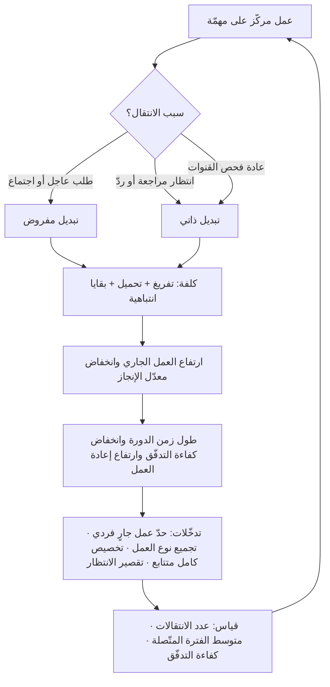

# كلفة تبديل السياق (Context Switching Cost)

> [!info] تعريف مختصر
> الوقت والطاقة الذهنية المهدَران في **استرجاع الحالة الذهنية** عند الانتقال من مهمّة أو أداة أو مشروع إلى آخر — وهي كلفة لا تظهر في أي جدول زمني ولا في أي تقدير، لأنها ليست عملًا يُنجَز بل ضريبة تُدفَع قبل استئناف العمل. المصطلح مستعار من علوم الحاسوب، حيث يصف ما يفعله المعالج حين يوقف عملية ليبدأ أخرى: يحفظ حالة الأولى في الذاكرة، ويحمّل حالة الثانية، وأثناء ذلك لا يُنجز شيئًا مفيدًا. الفارق أن استعادة الحالة عند الإنسان **أبطأ بكثير وغير كاملة**: جزء من السياق يُفقد نهائيًّا ويُعاد بناؤه من الصفر، وكلما زاد عدد الخيوط المفتوحة زادت الكلفة بمعدّل أسرع من زيادة عدد المهام نفسها.

## الشرح العلمي والاحترافي
- **ما الذي يُفقد بالضبط؟** ليس المعلومات المكتوبة — تلك محفوظة في الملفات — بل **الحالة العاملة**: النموذج الذهني للمشكلة، والفرضيات المؤقّتة التي كنت تختبرها، وترتيب الخطوات في رأسك، والتفاصيل التي حمّلتها في الذاكرة العاملة. هذه الحالة لا تُكتب عادةً لأنها تبدو بديهية أثناء العمل، ولهذا يكون استرجاعها بعد المقاطعة إعادة بناء لا استئنافًا.
- **مكوّنات الكلفة الثلاثة**: (١) **زمن التفريغ** — إنهاء ما في يدك أو تركه في وضع قابل للاستئناف. (٢) **زمن التحميل** — استرجاع سياق المهمّة الجديدة (فتح الملفات، قراءة آخر تعليق، تذكّر أين توقّفت). (٣) **البقايا الانتباهية (Attention Residue)** — وهو الأخطر والأقلّ وضوحًا: جزء من انتباهك يبقى معلّقًا في المهمّة السابقة، فتعمل في الجديدة بطاقة ذهنية ناقصة لفترة بعد الانتقال. هذا المفهوم درسته أبحاث في علم النفس التنظيمي، وأشهر من ارتبط اسمها به الباحثة صوفي لروي (Sophie Leroy) التي بحثت أثر الانتقال بين المهام حين تكون السابقة غير مكتملة.
- **لماذا هي غير خطّية؟** المتوقّع بديهيًّا أن كلفة العمل على مشروعين ضعف كلفة واحد. الواقع أسوأ: كل خيط مفتوح يستهلك انتباهًا خلفيًّا حتى وأنت لا تعمل عليه، ويزيد احتمال المقاطعة (لأن لكل مشروع أصحاب مصلحة يسألون)، ويضاعف عدد الانتقالات الممكنة. لهذا السبب تُلاحظ الفرق أن نصف الشخص في مشروعين ينتج أقل بكثير من نصف شخص في مشروع واحد.
- **الحقيقة الرياضية وراء الأمر — قانون ليتل**: [[Little's Law]] يقول إن متوسط زمن الدورة = متوسط العمل الجاري ÷ متوسط الإنجاز. فتح مهام أكثر بالتوازي يرفع العمل الجاري ولا يرفع معدّل الإنجاز — فيطول زمن التسليم لكل شيء. تبديل السياق يجعل الأمر أسوأ لأنه **يخفض** معدّل الإنجاز في المقام أيضًا. وهذا بالضبط ما يعالجه [[WIP Limit]] كأداة أولى.
- **الأثر على كفاءة التدفّق**: [[Flow Efficiency]] = زمن العمل الفعلي ÷ زمن الدورة الكلّي. تبديل السياق يزيد المقام (لأن البنود تنتظر بينما ينشغل صاحبها في مكان آخر) دون أن يزيد البسط، بل ينقصه. لهذا نجد فرقًا مشغولة 100% من الوقت وكفاءة تدفّق لديها أقلّ من 15% — وهي مفارقة تفسّرها هذه الكلفة و[[100 Percent Utilization Fallacy]] معًا.
- **أنواع التبديل متفاوتة الكلفة**: التبديل بين مهمّتين في السياق نفسه (ملفّان في المشروع نفسه) رخيص نسبيًّا. التبديل بين **مشروعين مختلفين** أغلى بكثير لاختلاف النموذج الذهني والأشخاص والمصطلحات. والتبديل بين **نوعين مختلفين من العمل** (عمل عميق ← اجتماع ← ردّ على دعم) هو الأغلى، لأنه يتطلّب تغيير نمط التفكير لا محتواه فقط. وهذا يفسّر لماذا تكون المناوبة التشغيلية و[[Toil]] مدمّرة للعمل التطويري تحديدًا.
- **المقاطعة الذاتية لا تقلّ عن الخارجية**: كثير من التبديل لا يفرضه أحد، بل ينتج عن الانتظار (فتح مهمّة أخرى ريثما تصل مراجعة)، أو عن القلق من خيط مفتوح، أو عن عادة فحص القنوات. ولهذا فالحلّ ليس منع الآخرين من المقاطعة فحسب، بل **تقليل عدد الخيوط المفتوحة أصلًا** وتقصير زمن الانتظار في النظام.
- **الأثر على الجودة لا السرعة فقط**: العمل المستأنَف بحالة ذهنية ناقصة تكثر فيه الأخطاء الصغيرة والافتراضات المنسيّة، فيرتفع [[Rework Percentage]] و[[Escaped Defect Rate]]. أي أن الكلفة تُدفَع مرتين: مرة في الوقت الضائع، ومرة في العيوب التي تعود لاحقًا.
- **الكلفة في عصر الأدوات المتعدّدة والوكلاء**: تبديل السياق لم يعد بين مهام فقط بل بين أدوات وسياقات معرفية — نافذة محرّر، ولوح مهام، وقناة محادثة، وحوار مع وكيل. وأتمتة جزء من العمل قد تُنشئ نمط انتظار جديدًا (تُطلق مهمّة للوكيل ثم تنتقل لغيرها ريثما ينتهي)، وهو نمط يبدو كفاءةً وهو في جوهره ضخّ للعمل الجاري.

## أين ومتى يُستخدم
- **عند تحديد سعة الفريق والتخطيط**: لأن حساب [[Capacity]] بجمع نسب التخصيص (50% + 50%) يتجاهل هذه الكلفة تمامًا، فيُنتج خططًا تُخفق بشكل منهجي ويرتفع [[Estimation Variance]].
- **في ضبط التدفّق على لوح المهام**: كأساس مباشر لتبرير [[WIP Limit]] وقراءة [[WIP Aging]] وتحسين [[Flow Efficiency]] و[[Cycle Time]].
- **عند إسناد الأفراد لأكثر من مشروع**: في نقاشات هيكلة الفرق و[[Cross-functional Team]]، لتفضيل التخصيص الكامل لفترة قصيرة على التجزئة الدائمة.
- **في تصميم إيقاع العمل والاجتماعات**: عند وضع [[Team Working Agreement]] و[[Explicit Policies]] بشأن أوقات التركيز، واستخدام [[Timeboxing]] لتجميع العمل المتشابه.
- **في إدارة العمل العاجل**: عند تعريف [[Expedite Class]] وسياسة المناوبة، لأن كل بند عاجل يكسر سياق شخص ما ويجب أن تُحسب كلفته لا أن تُفترض صفرًا.
- **في تشخيص التأخير غير المفسَّر**: حين يبدو الجميع مشغولين ولا شيء يُسلَّم — وهي العلامة التقليدية على أن الكلفة تلتهم الطاقة ([[Bottleneck]] خفيّ في انتباه الأفراد لا في محطّة).

## مثال وسيناريو تطبيقي
> [!example] شركة استشارات تقنية في جدّة، فريق من 6 مهندسين يخدم ثلاثة عملاء في وقت واحد. الإسناد الرسمي في نظام التخطيط: كل مهندس 40% لعميل «أ»، و40% لعميل «ب»، و20% لعميل «ج». على الورق، الطاقة موزّعة بدقّة والالتزامات مغطّاة.
> الواقع بعد ربعين: تأخّر التسليم في المشاريع الثلاثة، ومتوسط [[Cycle Time]] 14 يومًا لبند حجمه المقدَّر يومان، وشكوى متكرّرة من إرهاق رغم أن أحدًا لا يعمل ساعات إضافية كثيرة.
> قاس المدير الأمر مباشرة لأسبوعين: طلب من كل مهندس تسجيل كل انتقال بين المشاريع مع الوقت. النتيجة: متوسط 11 انتقالًا يوميًّا للفرد، ومتوسط الفترة المتّصلة على مهمّة واحدة 24 دقيقة. وحين قُدّرت فترة الاسترجاع بعد كل انتقال (بشهادة المهندسين أنفسهم) بنحو 10–15 دقيقة قبل استعادة الوتيرة، تبيّن أن ما بين ساعتين وثلاث ساعات يوميًّا للفرد تذهب في الاسترجاع وحده — أي ما يقارب ثلث اليوم، ولا يظهر منه سطر واحد في أي تقرير.
> وكشف القياس أيضًا مصدرًا خفيًّا: 40% من الانتقالات كانت **ذاتية**، سببها الانتظار — يفتح المهندس مهمّة عميل آخر ريثما تصل مراجعة أو ردّ من العميل الأول.
> غيّر الفريق النموذج بأربعة إجراءات: (١) إلغاء التجزئة اليومية واعتماد **تخصيص كامل لأسبوعين** لكل مهندس على عميل واحد بالتناوب. (٢) [[WIP Limit]] بمهمّتين لكل فرد. (٣) نافذتان يوميًّا فقط للردّ على القنوات (10:30 و15:30) موثّقتان في [[Team Working Agreement]]، مع قناة استثناء واحدة للطوارئ الحقيقية. (٤) اتفاق على زمن استجابة أقصى للمراجعة (4 ساعات) لتقليل الانتظار الذي يولّد التبديل الذاتي.
> بعد ربع: متوسط الانتقالات نزل إلى 3 يوميًّا، ومتوسط الفترة المتّصلة ارتفع إلى 96 دقيقة، و[[Cycle Time]] الوسيط انخفض من 14 إلى 5 أيام، وارتفعت [[Flow Efficiency]] من 11% إلى 34%. عدد الساعات المدفوعة للعملاء لم يتغيّر، وعدد الأشخاص لم يتغيّر — تغيّر توزيع الانتباه فقط.

## خطوات أو مخطّط
1. **قِس قبل أن تجادل**: اطلب تسجيل عدد الانتقالات ومتوسط الفترة المتّصلة لأسبوعين. الرقم يقنع الإدارة أكثر من أي حجّة نظرية.
2. **افرز مصادر التبديل**: خارجي مفروض (طلب عاجل، اجتماع) مقابل ذاتي (انتظار، عادة، قلق من خيط مفتوح) — لأن لكل مصدر علاجًا مختلفًا.
3. **قلّل الخيوط المفتوحة أولًا**: طبّق [[WIP Limit]] على مستوى الفرد لا الفريق فقط، فالحدّ الجماعي لا يمنع فردًا من فتح خمس مهام.
4. **وحّد نوع العمل زمنيًّا (Batching)**: جمّع الاجتماعات في نافذة، والمراجعات في نافذة، والعمل العميق في كتل متّصلة لا تقلّ عن 90 دقيقة.
5. **فضّل التخصيص الكامل المتتابع على التجزئة المتوازية**: أسبوعان على مشروع واحد أفضل من نصفين يوميًّين لأسبوعين.
6. **قصّر زمن الانتظار داخل النظام**: زمن مراجعة أقصى متّفق عليه، ومهلة ردّ من العميل — لأن الانتظار الطويل هو المولّد الأول للتبديل الذاتي.
7. **اجعل الاستئناف رخيصًا**: اشترط ترك ملاحظة «أين توقّفت وما الخطوة التالية» قبل مغادرة أي مهمّة؛ هذه العادة وحدها تقصّر زمن التحميل بشكل ملموس.
8. **سعّر العجلة**: عرّف [[Expedite Class]] بحصّة قصوى معلنة، واجعل كل بند عاجل مرئيًّا مع كلفته على المهام المتوقّفة.
9. **راقب المؤشّرات لا الشعور**: [[Flow Efficiency]]، [[WIP Aging]]، ومتوسط الفترة المتّصلة — وراجعها في الاجتماع الدوري.

## ⚠️ مفاهيم خاطئة شائعة
> [!warning]
> - **الظنّ أن الكلفة تساوي مدة المقاطعة نفسها**: مكالمة مدّتها دقيقتان لا تكلّف دقيقتين، لأن إعادة بناء الحالة الذهنية والبقايا الانتباهية تمتدّ بعدها. تقدير الكلفة بمدة الحدث وحده يُنتج تخطيطًا خاطئًا بشكل منهجي.
> - **افتراض أن التوزيع النسبي في أداة التخطيط يعكس الواقع**: «50% هنا و50% هناك» صيغة محاسبية لا صيغة إنتاجية. مجموع النصفين في الواقع أقلّ من واحد صحيح، لا يساويه.
> - **اعتبارها ضعفًا شخصيًّا أو نقص انضباط**: هي خاصية معرفية عامة لا صفة فردية. معالجتها بمطالبة الأفراد بـ«التركيز أكثر» تحمّل الفرد نتيجة قرار تنظيمي (التجزئة والمقاطعة) لا يملكه.
> - **الخلط بينها وبين تعدّد المهام (Multitasking)**: البشر لا ينفّذون مهمّتين ذهنيتين معًا، بل يتناوبون بينهما بسرعة. أي أن «تعدّد المهام» في العمل المعرفي ليس إلا تبديل سياق متكرّرًا — وكلفته هي كلفته.
> - **الظنّ أن الحلّ في أدوات إشعارات أفضل**: جزء كبير من التبديل ذاتيّ المصدر، سببه الانتظار وكثرة الخيوط المفتوحة. أداة أهدأ لا تعالج نظامًا يفرض على الفرد خمسة التزامات متوازية.
> - **اعتبار كل تبديل خسارة**: التبديل المخطَّط بين كتل عمل مختلفة النوع مفيد ويجدّد الطاقة. الضارّ هو التبديل **غير المخطَّط، والمتكرّر، وقبل إتمام وحدة عمل ذات معنى**.
> - **افتراض أن الأفراد سواء في الكلفة**: كلفة التبديل ترتفع مع عمق المهمّة وتعقيدها. مقاطعة عمل استكشافي معقّد أغلى بكثير من مقاطعة عمل روتيني — ولهذا فإن حماية العمل العميق أولوية غير متساوية.

## ❌ ممارسات خاطئة في المشاريع
> [!failure]
> - **إسناد الفرد إلى ثلاثة مشاريع لرفع «الاستغلال»**: الخطأ ملء 100% من وقت كل فرد بالتوزيع النسبي. لماذا يضرّ؟ لأن الاستغلال الكامل يلغي الطاقة الاحتياطية اللازمة لاستيعاب التغيّر، ويضاعف التبديل، فيطول زمن التسليم في المشاريع الثلاثة معًا ([[100 Percent Utilization Fallacy]]). الحل: خفض عدد التخصيصات المتوازية، والقبول بأن مشروعًا سيتأخّر عمدًا بدل تأخّر الثلاثة.
> - **التعامل مع الطلبات العاجلة بلا حصّة ولا كلفة معلنة**: الخطأ السماح لأي طرف بإدخال بند عاجل في أي وقت. لماذا يضرّ؟ لأن كل بند يكسر سياق شخص ويعطّل بنودًا كانت قريبة من الإنجاز، فتزداد كمية العمل شبه المكتمل. الحل: عرّف [[Expedite Class]] بحصّة قصوى (مثلًا بند واحد في وقت واحد)، واعرض ما توقّف بسببه.
> - **جدولة الاجتماعات في منتصف اليوم متفرّقة**: الخطأ اجتماع عند 11 وآخر عند 14. لماذا يضرّ؟ لأنه يقطع اليوم إلى ثلاث كتل قصيرة لا تكفي أيّ منها لعمل عميق، فتضيع الطاقة كلها في تحميل وتفريغ. الحل: تجميع الاجتماعات في نصف يوم أو أيام محدّدة، وحماية كتل تركيز معلنة في التقويم.
> - **قياس الإنتاجية بسرعة الاستجابة على القنوات**: الخطأ اعتبار الردّ الفوري علامة التزام. لماذا يضرّ؟ لأنه يحفّز الأفراد على البقاء في حالة مقاطعة دائمة، ويعاقب من يعمل بعمق. الحل: اتفق على أزمنة استجابة معلنة حسب فئة الطلب ضمن [[Explicit Policies]]، وقِس التسليم لا سرعة الردّ.
> - **مغادرة المهمّة دون ترك أثر للاستئناف**: الخطأ الانتقال المباشر عند المقاطعة. لماذا يضرّ؟ لأن العودة تبدأ من الصفر بعد ساعات أو أيام، وتُفقد الفرضيات التي كانت في الرأس. الحل: عادة إلزامية بسطرين: «أين توقّفت» و«الخطوة التالية» في بطاقة المهمّة.
> - **تجاهل كلفة التبديل عند تقدير المهام**: الخطأ تقدير المهمّة بزمن التنفيذ الصافي فقط. لماذا يضرّ؟ لأن التقديرات تخفق بشكل منتظم، فيُلام الأفراد على قصور في التقدير سببه بنيويّ في النظام ([[Estimation Variance]]). الحل: قدّر بزمن التنفيذ في ظروف الفريق الحقيقية، أو عالج البنية لتقترب من التقدير النظري.
> - **تدوير أفراد الفريق بين المشاريع كل بضعة أيام**: الخطأ التناوب السريع لتغطية كل الجبهات. لماذا يضرّ؟ لأن الفرد لا يبلغ قطّ عمق الإلمام بأي سياق، فتنخفض جودة القرارات ويرتفع الاعتماد على الآخرين ([[Dependency]]). الحل: دورات تخصيص لا تقلّ عن أسبوعين، مع تسليم واضح عند التبديل.

## 🔗 مصطلحات ومفاهيم ذات صلة
[[WIP Limit]] | [[Flow Efficiency]] | [[Little's Law]] | [[Cycle Time]] | [[WIP Aging]] | [[Capacity]] | [[100 Percent Utilization Fallacy]] | [[Expedite Class]] | [[Timeboxing]] | [[Sustainable Pace]] | [[Team Working Agreement]] | [[Explicit Policies]] | [[Estimation Variance]] | [[Rework Percentage]] | [[Toil]] | [[Jevons Paradox]] | [[Deliberate Practice]]
