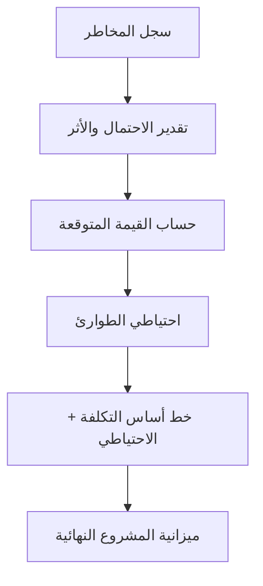

# احتياطي الطوارئ (Contingency Reserve)
> [!info] تعريف مختصر
> احتياطي الطوارئ هو مبلغ مالي أو زمني إضافي يُخصَّص مسبقًا لمواجهة المخاطر المعروفة (Known Risks) المدرجة في سجل المخاطر. يختلف عن احتياطي الإدارة (Management Reserve) الذي يغطي المخاطر غير المعروفة.

## الشرح العلمي والاحترافي
- يُحسب احتياطي الطوارئ عادة بناءً على تحليل كمّي للمخاطر، مثل محاكاة مونت كارلو ([[Monte Carlo Simulation]]) أو القيمة المتوقعة (Expected Monetary Value) لكل خطر مُدرج في سجل المخاطر ([[Risk Register]]).
- يُضاف هذا الاحتياطي إلى خط الأساس للتكلفة (Cost Baseline) ليُشكّلا معًا "ميزانية المشروع" (Project Budget)، وهذا مختلف عن خط أساس قياس الأداء ([[Performance Measurement Baseline]]) الذي يُستخدم لقياس الانحراف الفعلي.
- يمكن أن يكون الاحتياطي زمنيًا أيضًا (Schedule Contingency)، أي أيام إضافية تُضاف للجدول الزمني لاستيعاب تأخيرات متوقعة من مخاطر معروفة.
- الفرق الجوهري بين احتياطي الطوارئ واحتياطي الإدارة:
  - **احتياطي الطوارئ**: لمخاطر معروفة ومحددة (مثل احتمال تأخر مورد خارجي)، يتحكم به مدير المشروع مباشرة.
  - **احتياطي الإدارة (Management Reserve)**: لمخاطر غير معروفة (Unknown Unknowns)، يتطلب موافقة الإدارة العليا لاستخدامه.
- استهلاك الاحتياطي يجب أن يُراقب بانتظام؛ إذا استُنفد الاحتياطي مبكرًا فهذا مؤشر خطر (Red Flag) يستوجب التصعيد.

## أين ومتى يُستخدم
- يُستخدم بكثرة في المنهجيات التقليدية (Waterfall) وإدارة المشاريع المعتمدة على PMBOK، خاصة في المشاريع الإنشائية والهندسية ومشاريع تكنولوجيا المعلومات الكبيرة ذات العقود الثابتة.
- يُحسب أثناء مرحلة التخطيط عند بناء الميزانية، ويُراجَع دوريًا أثناء التنفيذ عبر تقارير إدارة القيمة المكتسبة ([[EVM]]).
- في المشاريع الرشيقة يظهر مفهوم مشابه باسم "سعة احتياطية" (Reserve Capacity) لاستيعاب المهام الطارئة ضمن السبرنت.

## مثال وسيناريو تطبيقي
> [!example] شركة "بنيان" تدير مشروع بناء نظام تخزين سحابي بميزانية أساسية قدرها 500,000 دولار. حدد فريق المخاطر ثلاثة مخاطر معروفة: احتمال 30% لتأخر مزود خدمة استضافة بتكلفة إضافية 20,000 دولار، احتمال 20% لحاجة ترخيص أمني إضافي بتكلفة 15,000 دولار، واحتمال 10% لزيادة أجور مطورين متخصصين بتكلفة 10,000 دولار. بحساب القيمة المتوقعة (0.3×20,000 + 0.2×15,000 + 0.1×10,000 = 10,000 دولار)، خصص مدير المشروع احتياطي طوارئ قدره 10,000 دولار، فأصبحت ميزانية المشروع 510,000 دولار. عندما تأخر فعلًا مزود الاستضافة، استُخدم جزء من هذا الاحتياطي مباشرة دون الحاجة للرجوع إلى الإدارة العليا.

## خطوات أو مخطّط
1. تحديد المخاطر المعروفة في سجل المخاطر ([[Risk Register]]).
2. تقدير احتمالية وأثر كل خطر (انظر [[Probability and Impact Matrix]]).
3. حساب القيمة المتوقعة أو استخدام محاكاة مونت كارلو لكل خطر.
4. جمع القيم لتكوين احتياطي الطوارئ الإجمالي.
5. إضافة الاحتياطي إلى خط أساس التكلفة لتكوين ميزانية المشروع الكاملة.
6. مراقبة استهلاك الاحتياطي دوريًا أثناء التنفيذ وتحديثه عند ظهور مخاطر جديدة.

## ⚠️ مفاهيم خاطئة شائعة
> [!warning]
> - الخلط بين احتياطي الطوارئ واحتياطي الإدارة؛ الأول لمخاطر معروفة ويديره مدير المشروع، والثاني لمخاطر غير معروفة وتديره الإدارة العليا.
> - الاعتقاد أن الاحتياطي "هامش ربح" يمكن التصرف به بحرية؛ هو مخصص فقط لمواجهة مخاطر محددة مسبقًا.
> - تحديد الاحتياطي بنسبة عشوائية (مثل 10% من الميزانية) دون تحليل كمّي فعلي للمخاطر.

## ❌ ممارسات خاطئة في المشاريع
> [!failure]
> - استخدام احتياطي الطوارئ لتغطية توسع في نطاق المشروع (Scope Creep) بدلًا من التعامل معه عبر طلب تغيير رسمي ([[Change Request]]). **الحل:** الفصل الصارم بين إدارة المخاطر وإدارة النطاق.
> - عدم مراقبة استهلاك الاحتياطي حتى نفاده بالكامل دون تنبيه أحد. **الحل:** تضمين نسبة استهلاك الاحتياطي في التقارير الدورية مثل حالة RAG ([[RAG Status]]).
> - تحديد احتياطي مبالغ فيه "للأمان" دون تبرير، مما يُضخّم الميزانية ويقلل تنافسية العرض. **الحل:** الاعتماد على تحليل كمّي مبني على بيانات تاريخية فعلية.

## 🔗 مصطلحات ومفاهيم ذات صلة
[[Risk Register]] | [[Probability and Impact Matrix]] | [[Monte Carlo Simulation]] | [[Performance Measurement Baseline]] | [[EVM]] | [[RAID Log]] | [[Reserve Capacity]] | [[19 - Risk Management]]
